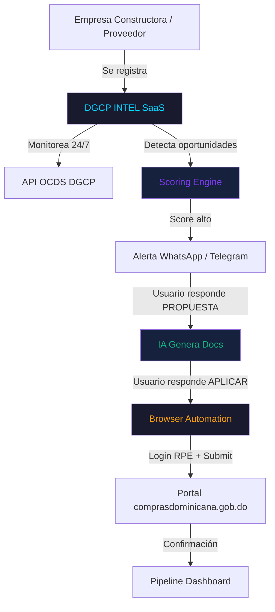
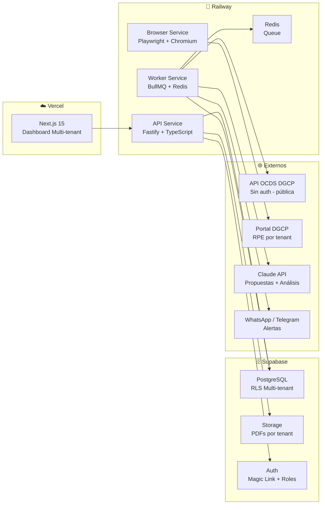

# DGCP INTEL — Plataforma SaaS de Inteligencia de Licitaciones

> Sistema multi-tenant para detección, análisis, propuesta y sumisión automática
> de procesos de contratación pública del Estado dominicano (DGCP / Ley 47-25)

---

## Estado del Proyecto

| Campo | Valor |
|-------|-------|
| **Nombre interno** | DGCP_INTEL |
| **Tipo** | SaaS Multi-tenant |
| **Cliente** | Mercado empresas RD (B2B) |
| **Marco legal** | Ley 47-25 (vigente 24-01-2026) + Decreto 416-23 |
| **Etapa actual** | E01 — Análisis |
| **Inicio** | 2026-03-13 |
| **Repo** | soulcore-dev/dgcp-intel (pendiente crear) |

---

## Diagrama de Posición

---

## Arquitectura de Alto Nivel

---

## Documentos del Proyecto

### E01 — Análisis
- [E01/01_CONTEXTO_LEGAL.md](E01/01_CONTEXTO_LEGAL.md) — Marco legal, Ley 47-25, umbrales
- [E01/02_ECOSISTEMA_DGCP.md](E01/02_ECOSISTEMA_DGCP.md) — APIs, portal, ciclo de vida
- [E01/03_MODELO_NEGOCIO.md](E01/03_MODELO_NEGOCIO.md) — SaaS, pricing, segmentación
- [E01/04_ARQUITECTURA_BASE.md](E01/04_ARQUITECTURA_BASE.md) — Stack técnico, infra
- [E01/05_FLUJOS_PRINCIPALES.md](E01/05_FLUJOS_PRINCIPALES.md) — User flows end-to-end
- [E01/06_SCORING_ENGINE.md](E01/06_SCORING_ENGINE.md) — Algoritmo scoring, componentes
- [E01/07_CHK_01_VERIFICADO.md](E01/07_CHK_01_VERIFICADO.md) — Gate checklist E01

### E02 — Diseño (pendiente)
### E03 — Pre-Código (pendiente)
### E04 — Desarrollo (pendiente)

---

## Stack Definitivo

| Capa | Tecnología |
|------|-----------|
| Frontend | Next.js 15 (App Router) + TypeScript |
| Backend API | Fastify + TypeScript |
| Workers | BullMQ + Redis (Railway) |
| Browser | Playwright + Docker (Railway) |
| Database | Supabase PostgreSQL + RLS |
| Storage | Supabase Storage (buckets por tenant) |
| Auth | Supabase Auth |
| AI | Claude API (claude-sonnet-4-6) |
| Notificaciones | Telegram Bot API + Resend (email) |
| Data source | OCDS API + DGCP API (públicas) |

---

*JANUS — Guardian del Lifecycle | 2026-03-13*
