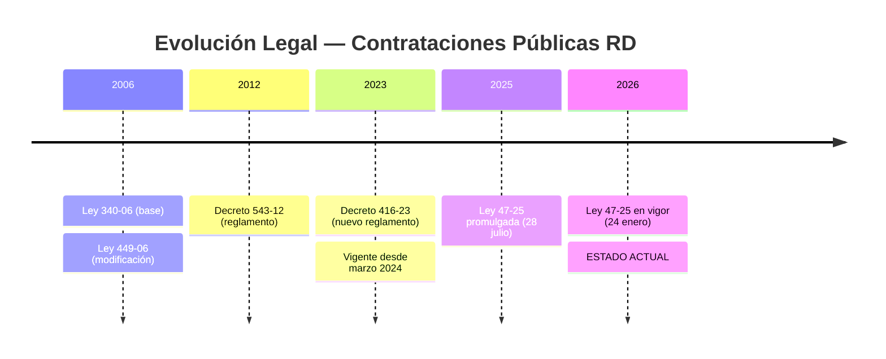
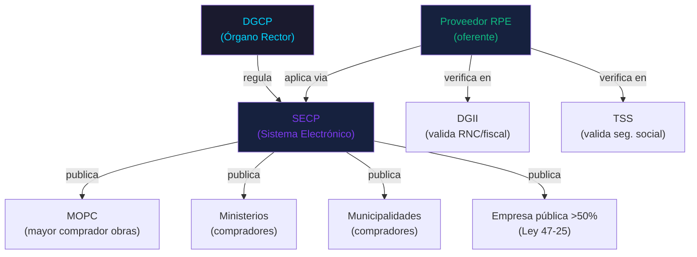
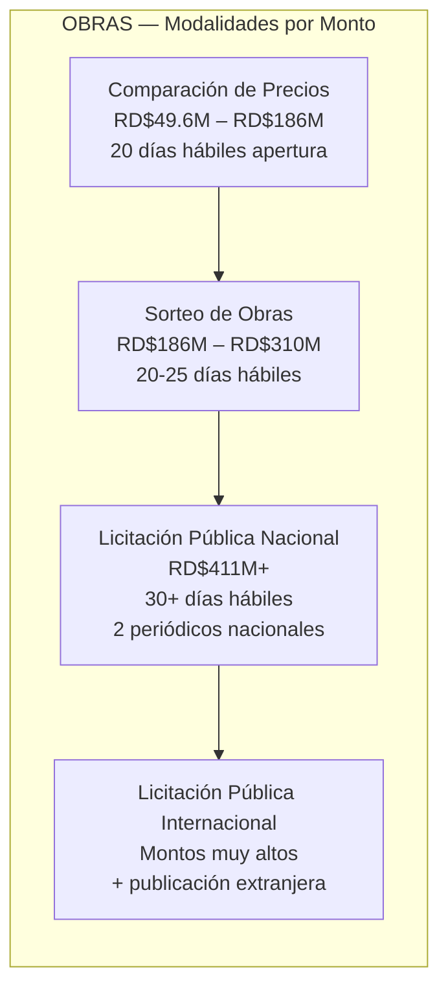
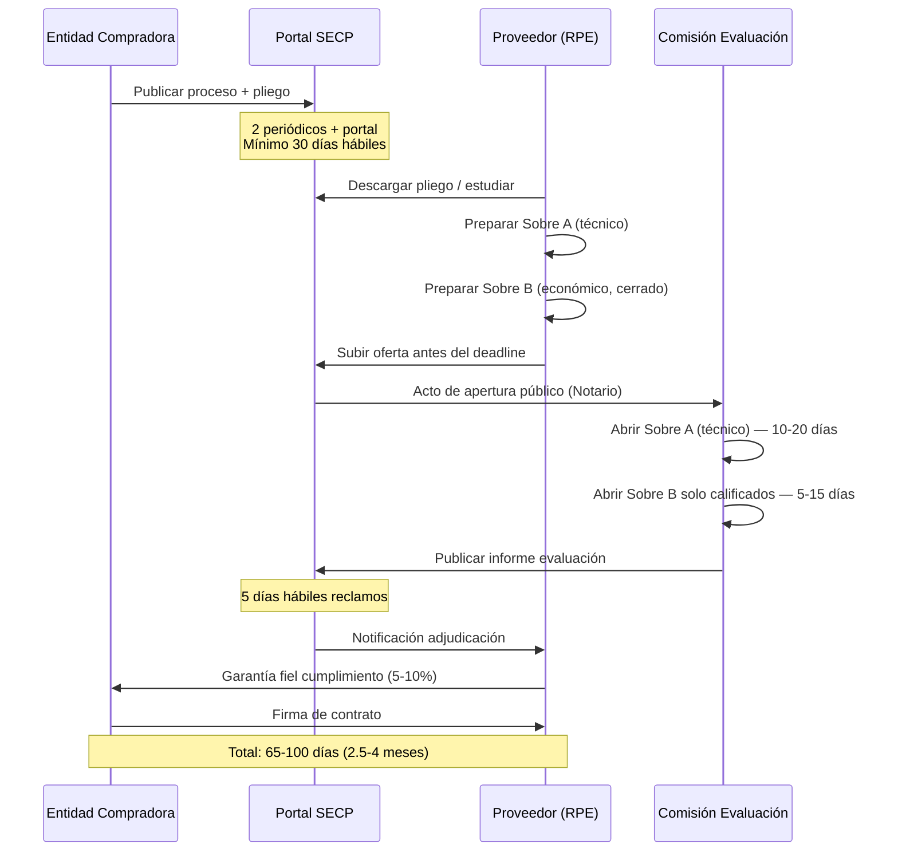

# E01 — Contexto Legal y Regulatorio

> DGCP INTEL | Etapa 1 — Análisis | Investigación: 2026-03-13

---

## 1. Marco Legal Vigente

### Ley 47-25 — La que rige hoy (24-01-2026)
Principal reforma estructural del sistema. Cambios clave:
- Incluye Poder Legislativo, Judicial, empresas públicas >50% Estado
- Presupuesto MIPYMEs: aumenta de 20% → **30%** de compras
- Integra IA y blockchain (en progreso)
- Introduce 8 nuevas modalidades de contratación
- Mantiene DGCP como órgano rector

---

## 2. Entidades del Ecosistema

---

## 3. Modalidades de Contratación para Obras

Umbrales según Resolución PNP-01-2025 (vigente 2025, nuevos en 2026 por Ley 47-25):

### Modalidades nuevas Ley 47-25 (vigentes desde 2026)
| Modalidad | Descripción |
|-----------|-------------|
| Licitación Pública Abreviada | Bienes/servicios comunes — plazos reducidos |
| Acuerdos Marco | Precalificación de proveedores |
| Subasta Inversa Electrónica | Competencia por precio mínimo |
| Sorteo de Obras Menores | Nueva — obras pequeña cuantía |
| Contratación Simplificada | Procedimiento ágil, circunstancias específicas |
| Contratación Directa | Justificada, con umbral definido |
| Asociación para Innovación | Soluciones innovadoras |
| Contratación en Atención a Resultados | Orientada a outcomes |

---

## 4. Ciclo de Vida de una Licitación Pública de Obras

---

## 5. Documentos Requeridos para Participar

### Fase registro RPE (una vez)
- RNC vigente (DGII)
- Certificación fiscal DGII (sin deuda)
- Certificación TSS (si tiene empleados)
- Certificación bancaria firmada y sellada
- Constancia RPE (gratuita, 10 días hábiles)

### Fase participación (por licitación)
| Documento | Tipo | Cuándo |
|-----------|------|--------|
| Constancia RPE vigente | Obligatorio | Siempre |
| Garantía de seriedad de oferta | Obligatorio | 1-3% del monto ofertado |
| Propuesta técnica (Sobre A) | Obligatorio | Siempre |
| Propuesta económica (Sobre B) | Obligatorio | Siempre |
| Carta de presentación | Obligatorio | Siempre |
| Experiencia en obras similares | Variable | Según pliego |
| CV personal técnico responsable | Variable | Según pliego |
| Seguros vigentes | Variable | Según pliego |

### Fase post-adjudicación
- Garantía de fiel cumplimiento (5-10% del monto adjudicado; MIPYMEs: 1%)
- Pólizas de seguros
- Plan de ejecución de obra
- Cronograma de trabajo detallado

---

## 6. Implicaciones para DGCP INTEL

| Hecho legal | Impacto en sistema |
|-------------|-------------------|
| Ley 47-25 activa — 8 nuevas modalidades | Scoring engine debe reconocer todas las modalidades |
| Umbrales se actualizan cada enero | Tabla de umbrales debe ser configurable, no hardcoded |
| Proceso dura 65-100 días | Pipeline tracking de largo plazo por licitación |
| Sobre A y B son separados | Generador de propuestas debe producir ambos documentos |
| Garantías obligatorias | Checklist legal debe alertar de garantías requeridas |
| Ley 47-25 amplía entidades cubiertas | Monitoreo debe incluir empresas públicas + Poder Judicial/Legislativo |
| MIPYMEs tienen 30% cupo garantizado | Segmento prioritario para el SaaS |

---

*Siguiente: [02_ECOSISTEMA_DGCP.md](02_ECOSISTEMA_DGCP.md)*
*JANUS — 2026-03-13*
