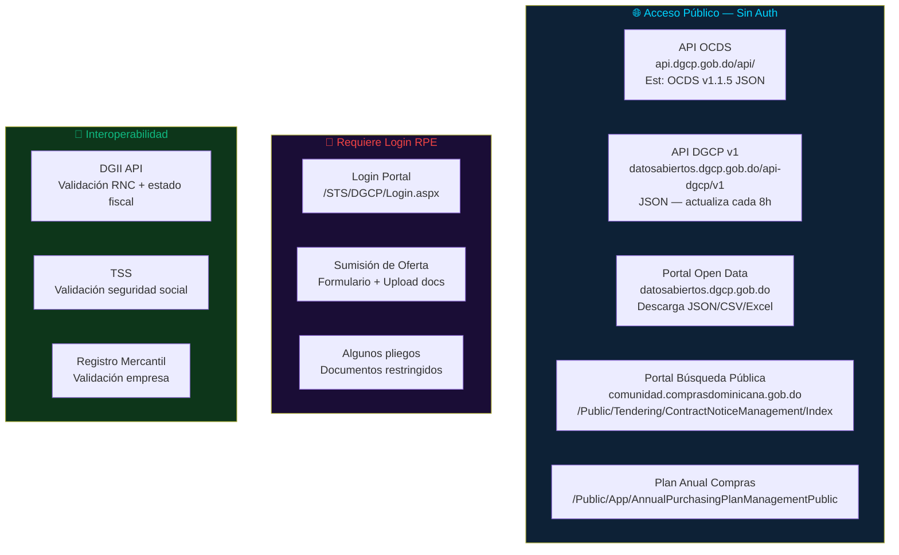
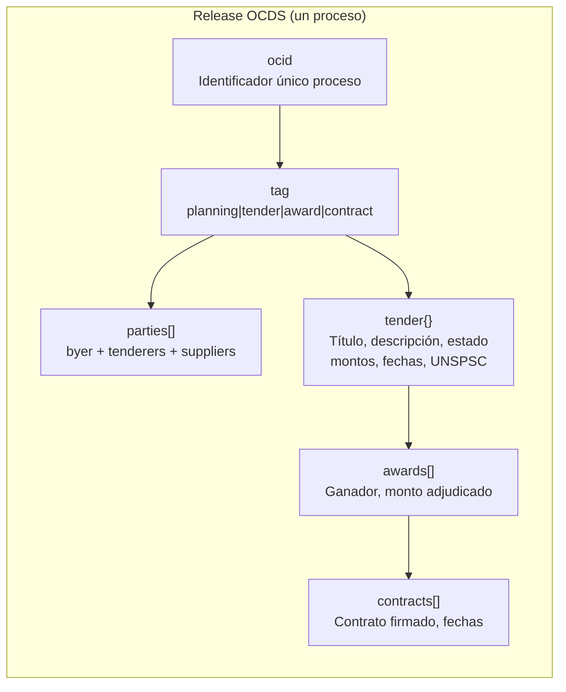
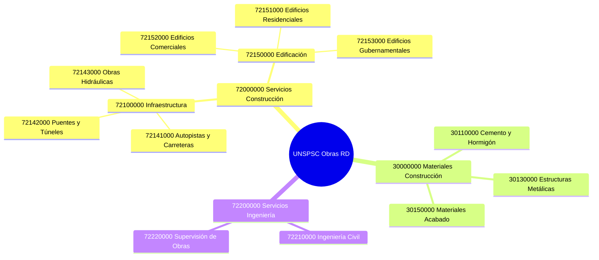
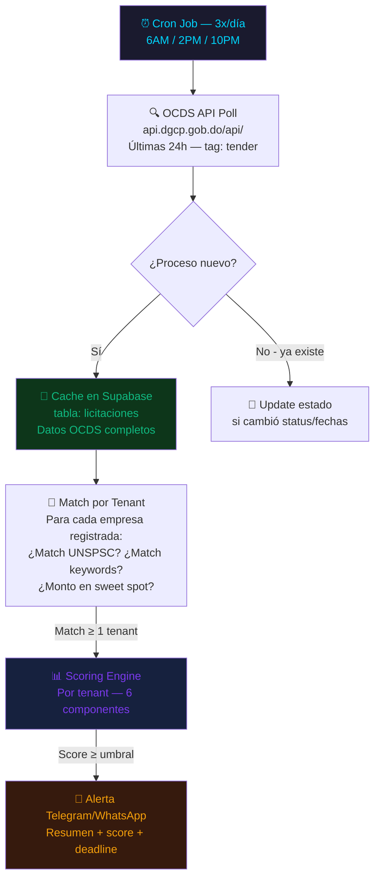
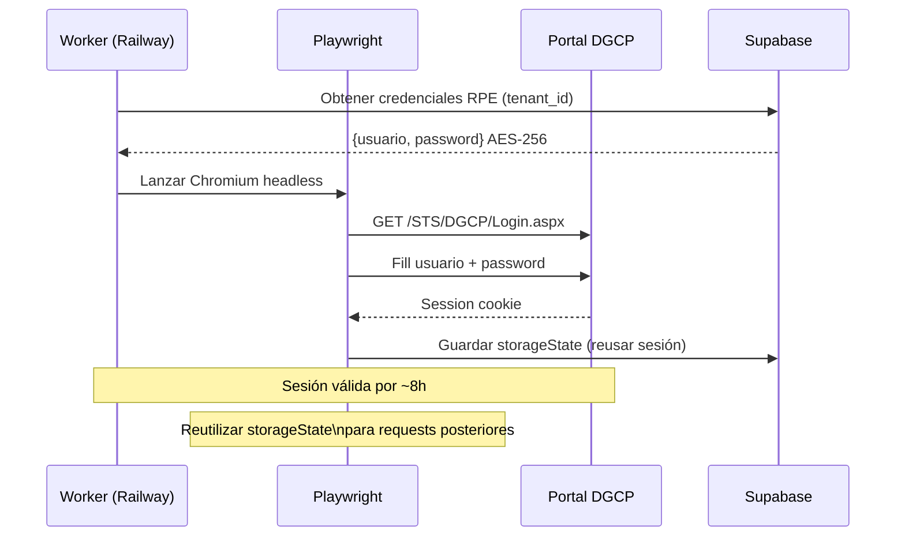

# E01 — Ecosistema Técnico DGCP

> DGCP INTEL | Etapa 1 — Análisis | 2026-03-13

---

## 1. Mapa de Portales y APIs



---

## 2. API OCDS — Estructura de Datos

La fuente principal. Datos estructurados en estándar internacional Open Contracting.



### Campos clave del objeto `tender`
```json
{
  "tender": {
    "id": "DGCP-2026-XXXX",
    "title": "Rehabilitación Carretera...",
    "status": "active | complete | cancelled",
    "procurementMethod": "open | restricted | limited | direct",
    "procurementMethodDetails": "Licitación Pública Nacional",
    "value": { "amount": 28500000, "currency": "DOP" },
    "tenderPeriod": {
      "startDate": "2026-03-01T00:00:00Z",
      "endDate": "2026-04-15T00:00:00Z"
    },
    "itemsClassification": [
      { "scheme": "UNSPSC", "id": "72141000", "description": "Construcción Autopistas" }
    ],
    "documents": [
      { "id": "doc-1", "title": "Pliego de Condiciones", "url": "https://..." }
    ]
  }
}
```

---

## 3. Clasificación UNSPSC para Obras — Códigos Prioritarios



### Los 16 códigos UNSPSC de construcción más frecuentes en DGCP
| Código | Descripción |
|--------|-------------|
| 72141000 | Construcción de autopistas, carreteras y calles |
| 72142000 | Construcción de puentes y túneles |
| 72143000 | Construcción de obras hidráulicas |
| 72151100 | Construcción de edificios residenciales |
| 72151500 | Construcción de edificios comerciales |
| 72151600 | Construcción de instalaciones industriales |
| 72152100 | Construcción de escuelas y hospitales |
| 72152900 | Construcción de instalaciones militares |
| 72153600 | Construcción de edificios gubernamentales |
| 72154200 | Instalación de sistemas eléctricos |
| 72154300 | Instalación de sistemas de plomería |
| 72154700 | Instalación de HVAC |
| 72200000 | Servicios de ingeniería |
| 72210000 | Ingeniería civil |
| 72220000 | Supervisión y control de obras |
| 30110000 | Suministro cemento y hormigón |

---

## 4. URLs Mapeadas del Portal DGCP

| Función | URL |
|---------|-----|
| Búsqueda pública | `/Public/Tendering/ContractNoticeManagement/Index` |
| Detalle proceso | `/Public/Tendering/ContractNoticePhases/View` |
| Login RPE | `/STS/DGCP/Login.aspx` |
| Registro proveedores | `/Public/Users/UserRegister/Index` |
| Plan Anual Compras | `/Public/App/AnnualPurchasingPlanManagementPublic/Index` |
| Búsqueda proveedores | `/Public/Companies/SupplierSearchPublic/Index` |

### Campos de formulario detectados (para Playwright)
| Campo | ID/Name |
|-------|---------|
| Unidad Compradora | `txtAuthorityCompanyCodeText` |
| Categoría UNSPSC | `txtMainCategoryText` |
| Fecha publicación | `dtmbOfficialPublishDate*` |
| País/Región | Country / Region dropdowns |
| Autocomplete entidad | `AuthorityCompanyCodeAutoComplete` |

---

## 5. Estrategia de Datos para el SaaS



### Tablas Supabase para datos DGCP
```
licitaciones          → cache global de procesos OCDS
  ocid (PK)
  title, description
  status              → active | complete | cancelled
  modality            → LPN | CP | SO | etc.
  amount_dop
  tender_start, tender_end
  entity_name, entity_id
  unspsc_codes[]      → array
  documents[]         → URLs pliegos
  raw_ocds            → JSONB completo
  created_at, updated_at

oportunidades_tenant  → procesadas por empresa
  id (PK)
  tenant_id (FK)      → RLS: cada empresa solo ve las suyas
  licitacion_ocid (FK)
  score               → 0-100
  score_breakdown     → JSONB {capacidades, presupuesto, ...}
  estado_pipeline     → DETECTADA|EVALUADA|PREPARACION|APLICADA|GANADA|PERDIDA
  alertado_at
  propuesta_generada  → boolean
  submitted_at
  confirmacion_dgcp
```

---

## 6. Integración con Sistemas Externos

### DGII — Validación RNC
- Consulta: `https://www.dgii.gov.do/app/WebApps/ConsultasWeb/consultas/rnc.aspx`
- Uso: Verificar que empresa cliente tiene RNC activo antes de activar cuenta
- Interoperabilidad: SECP ya valida contra DGII automáticamente

### TSS — Validación Seguridad Social
- Verificar cumplimiento de obligaciones
- Requerido en documentación RPE

### Playwright — Portal DGCP


---

*Anterior: [01_CONTEXTO_LEGAL.md](01_CONTEXTO_LEGAL.md)*
*Siguiente: [03_MODELO_NEGOCIO.md](03_MODELO_NEGOCIO.md)*
*JANUS — 2026-03-13*
