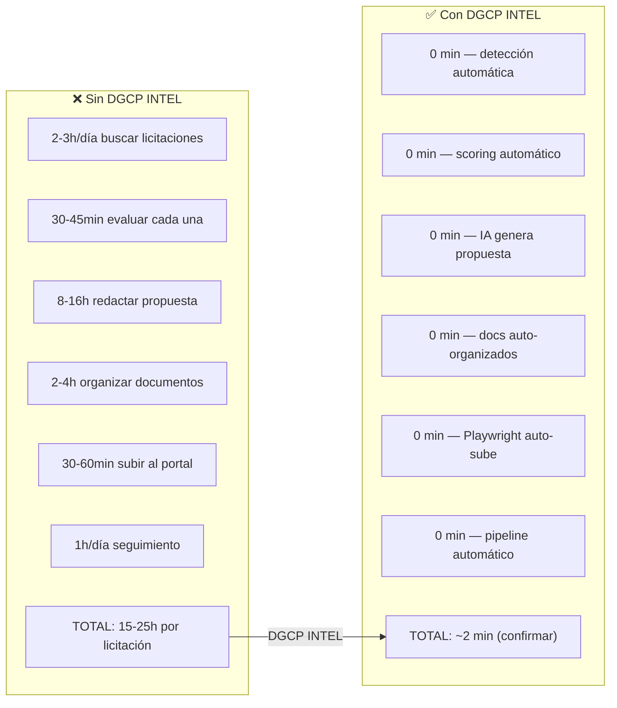
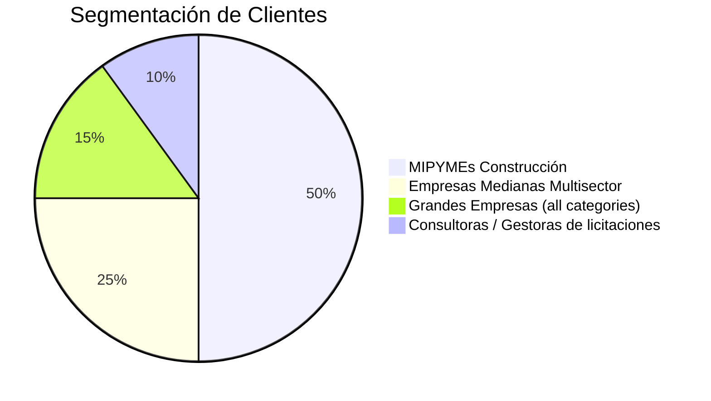
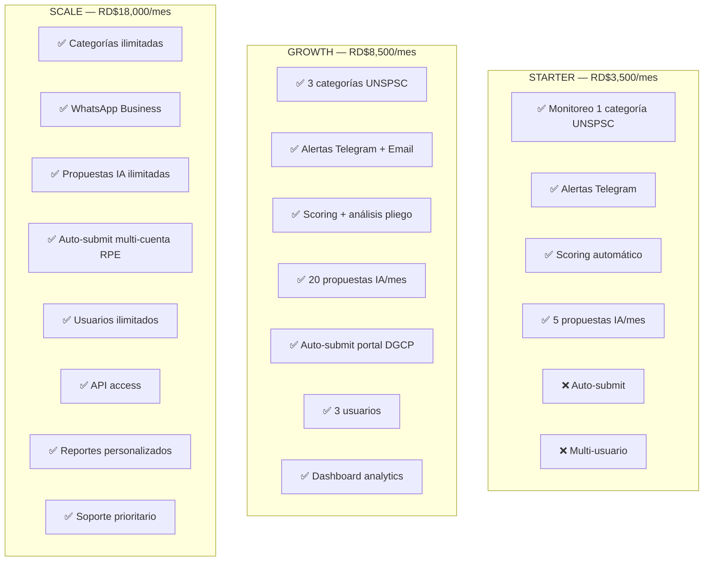
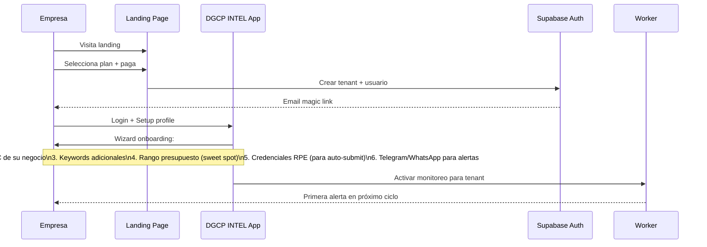
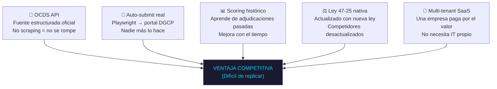

# E01 — Modelo de Negocio SaaS

> DGCP INTEL | Etapa 1 — Análisis | 2026-03-13

---

## 1. Propuesta de Valor

---

## 2. Segmentación de Mercado

### Target primario — MIPYMEs constructoras RD
- **Por qué**: Ley 47-25 garantiza 30% del presupuesto a MIPYMEs
- **Tamaño**: 14,536 empresas participaron en contrataciones 2024
- **Problema agudo**: No tienen equipo dedicado a licitaciones
- **Poder adquisitivo**: Contratos desde RD$50M → pagan SaaS fácilmente

### Segmentos

| Segmento | Tamaño empresa | Plan | Precio/mes |
|----------|---------------|------|-----------|
| STARTER | 1-10 empleados, 1 categoría UNSPSC | Básico | RD$3,500 |
| GROWTH | 10-50 empleados, 3 categorías | Pro | RD$8,500 |
| SCALE | 50+ empleados, ilimitado | Business | RD$18,000 |
| ENTERPRISE | Grupos empresariales | Enterprise | Custom |

---

## 3. Planes y Features

---

## 4. Modelo de Revenue

### Proyección conservadora (Año 1)

| Mes | Tenants | MRR (RD$) | ARR (RD$) |
|-----|---------|-----------|-----------|
| 1-2 | 5 | 42,500 | — |
| 3-4 | 15 | 127,500 | — |
| 5-6 | 30 | 255,000 | — |
| 7-9 | 60 | 510,000 | — |
| 10-12 | 100 | 850,000 | — |
| **Año 1** | **100** | **850,000** | **~RD$5M** |

### ROI del cliente
- Un contrato ganado de RD$50M genera comisión del gestor o margen de 15-22%
- → RD$7.5M a 11M por contrato
- → SaaS se paga solo con **una sola licitación ganada**

---

## 5. Flujo de Onboarding de Empresa

---

## 6. Métricas SaaS Clave

| KPI | Target Mes 6 | Target Año 1 |
|-----|-------------|-------------|
| MRR | RD$255K | RD$850K |
| Tenants activos | 30 | 100 |
| Churn rate | <5%/mes | <3%/mes |
| NPS | >50 | >65 |
| Licitaciones detectadas/tenant/mes | 50+ | 80+ |
| Propuestas generadas/mes (total) | 150+ | 600+ |
| Tasa conversión (detect→apply) | 15% | 20% |
| Tasa adjudicación clientes | 15% | 18% |

---

## 7. Ventaja Competitiva

---

*Anterior: [02_ECOSISTEMA_DGCP.md](02_ECOSISTEMA_DGCP.md)*
*Siguiente: [04_ARQUITECTURA_BASE.md](04_ARQUITECTURA_BASE.md)*
*JANUS — 2026-03-13*
