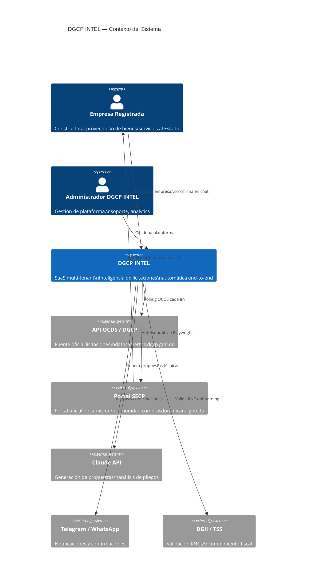
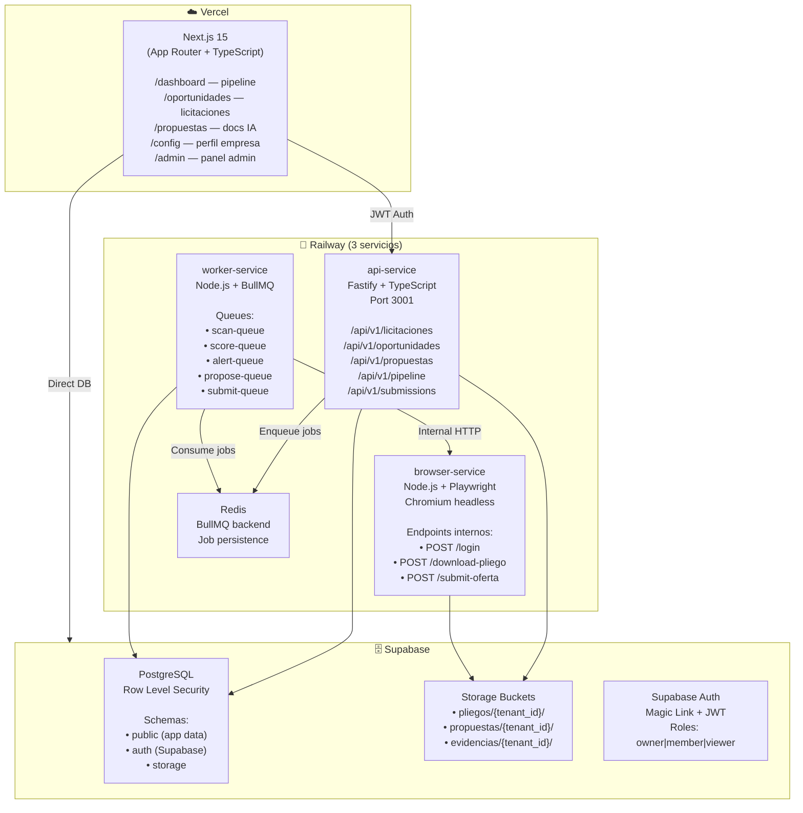
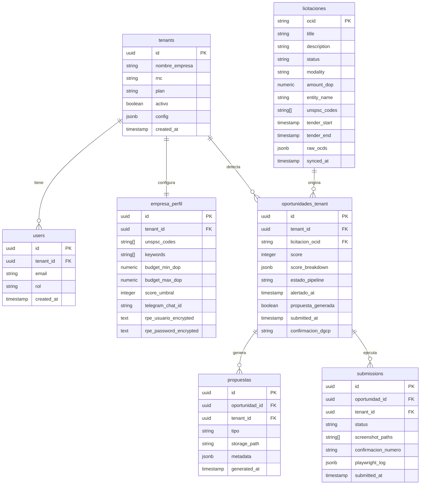
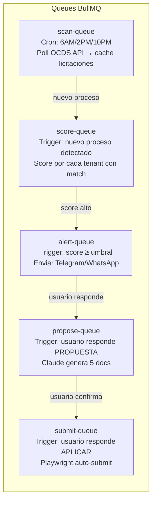

# E01 — Arquitectura Base del Sistema

> DGCP INTEL | Etapa 1 — Análisis | 2026-03-13

---

## 1. Visión de Alto Nivel — C4 Context



---

## 2. Arquitectura de Servicios (C4 Container)



---

## 3. Modelo de Base de Datos



---

## 4. Row Level Security (Multi-tenant)

```sql
-- Cada tenant solo ve SUS datos
-- Aplicado automáticamente en Supabase

-- oportunidades_tenant
CREATE POLICY "tenant_isolation" ON oportunidades_tenant
  USING (tenant_id = auth.jwt() ->> 'tenant_id');

-- propuestas
CREATE POLICY "tenant_isolation" ON propuestas
  USING (tenant_id = auth.jwt() ->> 'tenant_id');

-- submissions
CREATE POLICY "tenant_isolation" ON submissions
  USING (tenant_id = auth.jwt() ->> 'tenant_id');

-- licitaciones → READ ONLY para todos (cache global)
CREATE POLICY "public_read" ON licitaciones
  FOR SELECT USING (true);
```

---

## 5. Cola de Jobs (BullMQ)



### Configuración de jobs
```typescript
// scan-queue — máxima prioridad, tolerante a fallos
scanQueue.add('poll-ocds', {}, {
  repeat: { cron: '0 6,14,22 * * *' },
  attempts: 5,
  backoff: { type: 'exponential', delay: 60000 }
})

// submit-queue — crítico, no perder
submitQueue.add('auto-submit', { tenantId, oportunidadId }, {
  attempts: 3,
  backoff: { type: 'fixed', delay: 30000 },
  priority: 1  // máxima prioridad
})
```

---

## 6. Estructura de Repositorio

```
dgcp-intel/
├── apps/
│   ├── web/                    → Next.js 15 (Vercel)
│   │   ├── app/
│   │   │   ├── (auth)/
│   │   │   ├── dashboard/
│   │   │   ├── oportunidades/
│   │   │   ├── propuestas/
│   │   │   ├── pipeline/
│   │   │   └── config/
│   │   └── components/
│   ├── api/                    → Fastify API (Railway)
│   │   ├── routes/
│   │   ├── middleware/
│   │   └── services/
│   ├── worker/                 → BullMQ Workers (Railway)
│   │   ├── queues/
│   │   ├── processors/
│   │   │   ├── scan.processor.ts
│   │   │   ├── score.processor.ts
│   │   │   ├── alert.processor.ts
│   │   │   ├── propose.processor.ts
│   │   │   └── submit.processor.ts
│   │   └── services/
│   └── browser/                → Playwright Service (Railway)
│       ├── handlers/
│       │   ├── login.handler.ts
│       │   ├── download.handler.ts
│       │   └── submit.handler.ts
│       └── utils/
├── packages/
│   ├── scoring/                → Engine de scoring (shared)
│   ├── ocds-client/            → Cliente API OCDS
│   ├── db/                     → Supabase client + types
│   └── shared/                 → Types compartidos
├── supabase/
│   ├── migrations/             → SQL migrations
│   └── seed/
└── docker/
    └── browser/                → Dockerfile Playwright
```

---

## 7. Variables de Entorno por Servicio

```bash
# Compartidas
SUPABASE_URL=
SUPABASE_SERVICE_ROLE_KEY=
SUPABASE_ANON_KEY=

# API Service
JWT_SECRET=
PORT=3001

# Worker
REDIS_URL=
CLAUDE_API_KEY=
TELEGRAM_BOT_TOKEN=
OCDS_API_BASE=https://api.dgcp.gob.do/api/
DGCP_API_BASE=https://datosabiertos.dgcp.gob.do/api-dgcp/v1/

# Browser Service (interno)
BROWSER_SERVICE_URL=http://browser:3002
BROWSER_SERVICE_KEY=    → secret interno entre services
```

---

*Anterior: [03_MODELO_NEGOCIO.md](03_MODELO_NEGOCIO.md)*
*Siguiente: [05_FLUJOS_PRINCIPALES.md](05_FLUJOS_PRINCIPALES.md)*
*JANUS — 2026-03-13*
