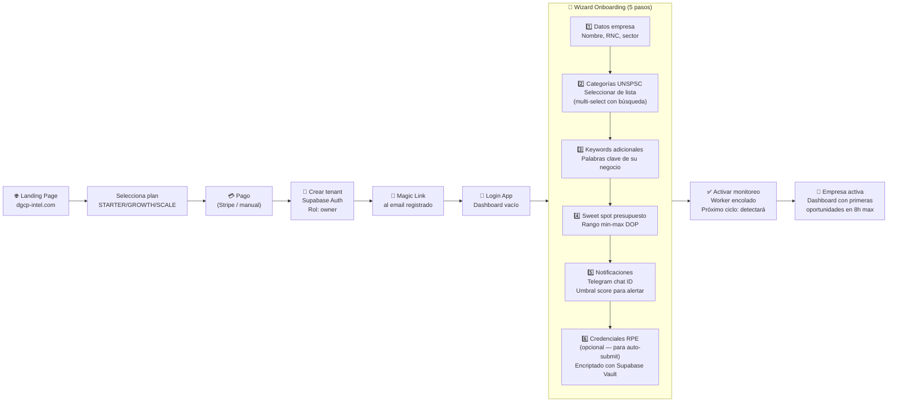
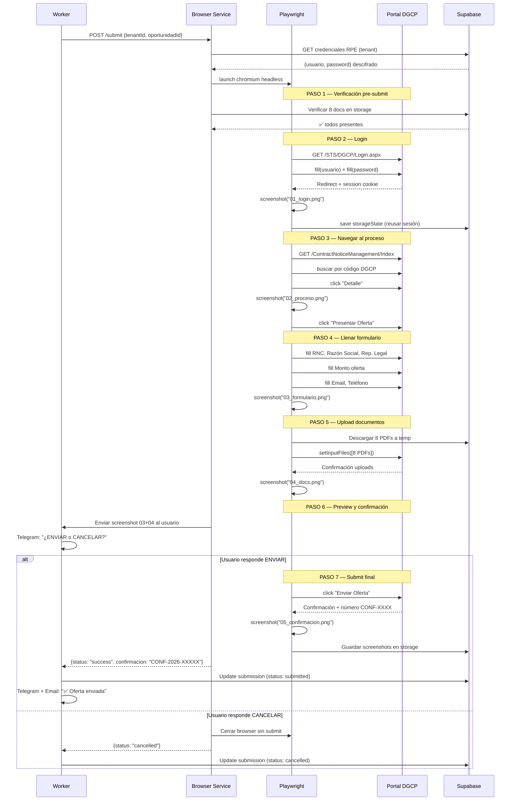
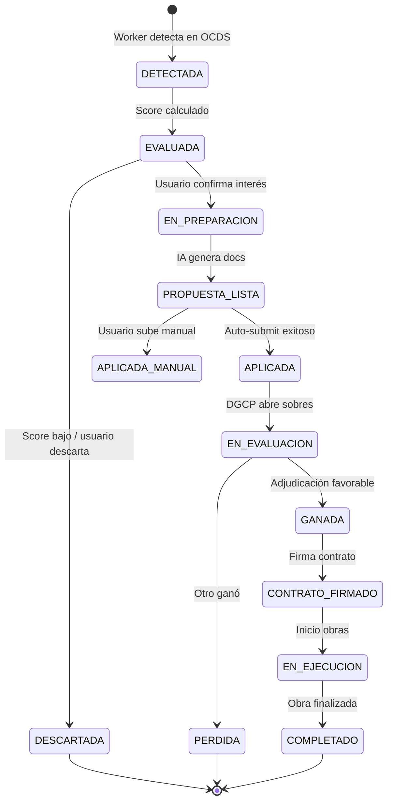
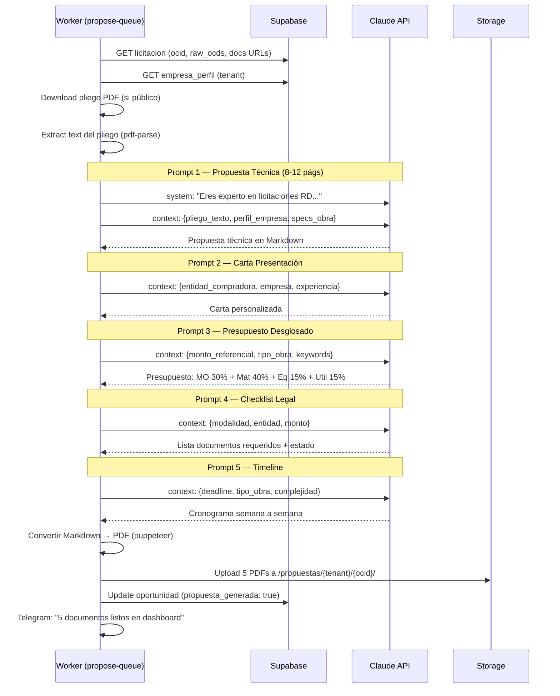

# E01 — Flujos Principales del Sistema

> DGCP INTEL | Etapa 1 — Análisis | 2026-03-13

---

## Flujo 1 — Ciclo Completo: Detección → Sumisión

```mermaid
flowchart TD
    START["⏰ Cron 6AM / 2PM / 10PM"] --> POLL

    POLL["📡 Worker: Poll OCDS API\nGET /api/ocds/tender\n?publishedFrom=lastScan"] --> FILTER

    FILTER{"🆕 ¿Nuevos procesos?"}
    FILTER -->|No| END_SCAN["💤 Fin ciclo — esperar siguiente"]
    FILTER -->|Sí N procesos| CACHE

    CACHE["💾 Cache en Supabase\ntabla: licitaciones\n(upsert por ocid)"] --> MATCH

    MATCH["🏢 Match por tenant\nPara cada empresa:\n• UNSPSC match\n• Keywords match\n• Monto en rango"] --> SCORE_Q

    SCORE_Q["📊 Encolar score-queue\n(un job por tenant con match)"] --> SCORE

    SCORE["🧮 Scoring Engine\n6 componentes → 0-100\nver 06_SCORING_ENGINE.md"] --> CHECK_SCORE

    CHECK_SCORE{"Score ≥ umbral\ndel tenant?"}
    CHECK_SCORE -->|No| SAVE_LOW["💾 Guardar oportunidad\nestado: EVALUADA\nsin alertar"]
    CHECK_SCORE -->|Sí| ALERT

    ALERT["📱 Telegram / WhatsApp\nResumen con score + monto\n+ deadline + entity"] --> WAIT_USER

    WAIT_USER{"Usuario responde"}
    WAIT_USER -->|"DESCARTAR"| DISCARD["💾 Estado: DESCARTADA"]
    WAIT_USER -->|"PROPUESTA"| PROPOSE
    WAIT_USER -->|Timeout 24h| AUTO_SAVE["💾 Estado: PENDIENTE"]

    PROPOSE["🤖 Claude API\nGenera 5 documentos:\n1. Propuesta técnica\n2. Carta presentación\n3. Presupuesto desglosado\n4. Checklist legal\n5. Timeline"] --> SAVE_DOCS

    SAVE_DOCS["💾 Storage Supabase\n/propuestas/{tenant}/{ocid}/\nLinks en dashboard"] --> NOTIFY_DOCS

    NOTIFY_DOCS["📱 Telegram\n'Propuesta lista — revisa dashboard\nResponde APLICAR para auto-submit'"] --> WAIT_APPLY

    WAIT_APPLY{"Usuario responde"}
    WAIT_APPLY -->|"APLICAR"| SUBMIT_Q
    WAIT_APPLY -->|"NO"| MANUAL["📋 Estado: EN PREPARACION\n(usuario gestiona manual)"]

    SUBMIT_Q["🎯 Encolar submit-queue\nPrioridad máxima"] --> PLAYWRIGHT

    PLAYWRIGHT["🎭 Browser Service\nPlaywright Chromium\n8 pasos → ver Flujo 3"] --> PREVIEW

    PREVIEW["📸 Screenshot formulario\nEnviar a Telegram:\n'¿ENVIAR o CANCELAR?'"] --> WAIT_CONFIRM

    WAIT_CONFIRM{"Usuario confirma"}
    WAIT_CONFIRM -->|"CANCELAR"| ABORT["Estado: CANCELADA\nNo se envió oferta"]
    WAIT_CONFIRM -->|"ENVIAR"| FINAL_SUBMIT

    FINAL_SUBMIT["✅ Click 'Enviar Oferta'\nCapturar confirmación DGCP\nScreenshots evidencia"] --> POST_SUBMIT

    POST_SUBMIT["💾 Pipeline: APLICADA\nEvidencias en Storage\nNotificación: email + Telegram"] --> TRACK

    TRACK["🔄 Tracking automático\nMonitorear adjudicación\nAlerta si ganamos"]

    style START fill:#1a1a2e,color:#00d4ff
    style SCORE fill:#16213e,color:#7c3aed
    style PROPOSE fill:#0d361a,color:#10b981
    style PLAYWRIGHT fill:#361a0d,color:#f59e0b
    style FINAL_SUBMIT fill:#0d3616,color:#10b981
```

---

## Flujo 2 — Onboarding de Nueva Empresa

---

## Flujo 3 — Browser Service (Auto-submit detallado)

---

## Flujo 4 — Tracking Post-Sumisión

---

## Flujo 5 — Generación de Propuesta IA

---

*Anterior: [04_ARQUITECTURA_BASE.md](04_ARQUITECTURA_BASE.md)*
*Siguiente: [06_SCORING_ENGINE.md](06_SCORING_ENGINE.md)*
*JANUS — 2026-03-13*
