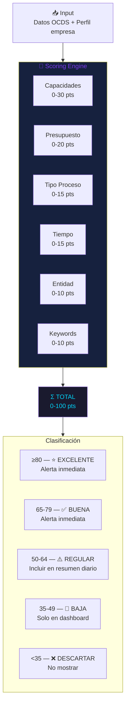
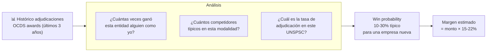
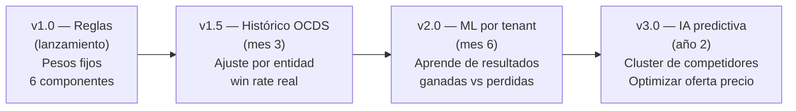

# E01 — Scoring Engine

> DGCP INTEL | Etapa 1 — Análisis | 2026-03-13

---

## 1. Visión General del Scoring

El Scoring Engine evalúa cada licitación detectada en el contexto del perfil de una empresa específica (tenant). El mismo proceso puede tener scores muy distintos para dos empresas diferentes.



---

## 2. Componentes del Score

### C1 — Capacidades (0-30 puntos)
Mide qué tan bien encaja la licitación con el negocio de la empresa.

```typescript
function scoreCapacidades(licitacion: Licitacion, perfil: EmpresaPerfil): number {
  let pts = 0
  const unspscMatch = licitacion.unspsc_codes.filter(
    code => perfil.unspsc_codes.some(p => code.startsWith(p.slice(0, 4)))
  )
  // Match exacto de categoría
  if (unspscMatch.length >= 3) pts += 15
  else if (unspscMatch.length === 2) pts += 10
  else if (unspscMatch.length === 1) pts += 7

  // Match de keywords en título/descripción
  const texto = `${licitacion.title} ${licitacion.description}`.toLowerCase()
  const keyMatch = perfil.keywords.filter(k => texto.includes(k.toLowerCase()))
  if (keyMatch.length >= 5) pts += 15
  else if (keyMatch.length >= 3) pts += 10
  else if (keyMatch.length >= 1) pts += 5

  return Math.min(pts, 30)
}
```

### C2 — Presupuesto (0-20 puntos)
Evalúa si el monto está en el "sweet spot" de la empresa.

```typescript
function scorePresupuesto(monto: number, perfil: EmpresaPerfil): number {
  const { budget_min_dop: min, budget_max_dop: max } = perfil
  const sweet_spot_low = min * 0.8
  const sweet_spot_high = max * 1.2

  if (monto >= min && monto <= max) return 20           // Sweet spot perfecto
  if (monto >= sweet_spot_low && monto <= sweet_spot_high) return 14 // Cerca
  if (monto < sweet_spot_low && monto >= min * 0.5) return 8         // Bajo
  if (monto > sweet_spot_high && monto <= max * 2) return 8          // Alto
  return 0  // Fuera de rango
}
```

### C3 — Tipo de Proceso (0-15 puntos)
Modalidades más simples tienen mejor score (menos competencia, menos requisitos).

| Modalidad | Puntos | Razón |
|-----------|--------|-------|
| Compra Menor | 15 | Mínima competencia |
| Comparación de Precios | 15 | Proceso ágil |
| Sorteo de Obras Menores | 12 | Nuevo, menos conocido |
| Contratación Simplificada | 12 | Proceso ágil Ley 47-25 |
| Licitación Pública Nacional | 10 | Más competencia |
| Subasta Inversa | 8 | Solo precio, margen reducido |
| Licitación Pública Internacional | 5 | Alta competencia global |

### C4 — Tiempo disponible (0-15 puntos)
Más días = más tiempo de preparación = mejor.

```typescript
function scoreTiempo(tenderEnd: Date): number {
  const dias = differenceInBusinessDays(tenderEnd, new Date())
  if (dias > 20) return 15
  if (dias >= 10) return 10
  if (dias >= 5) return 6
  if (dias >= 2) return 3
  return 0  // Menos de 2 días — no aplicar
}
```

### C5 — Entidad Compradora (0-10 puntos)
Basado en historial de adjudicaciones y transparencia.

| Tipo Entidad | Puntos | Razón |
|-------------|--------|-------|
| Municipalidad / Ayuntamiento | 10 | Menor competencia, procesos más ágiles |
| Organismos autónomos | 8 | Buena transparencia |
| Ministerios (MOPC, Educación, etc.) | 7 | Alta visibilidad |
| Empresas públicas (Ley 47-25) | 6 | Nuevo — menos conocido |
| Poder Legislativo / Judicial | 5 | Procesos más formales |

### C6 — Keywords Especializadas (0-10 puntos)
Palabras clave que indican alta afinidad con el negocio.

```typescript
function scoreKeywords(licitacion: Licitacion, perfil: EmpresaPerfil): number {
  const texto = `${licitacion.title} ${licitacion.description}`.toLowerCase()
  const matches = perfil.keywords.filter(k => texto.includes(k.toLowerCase()))
  if (matches.length >= 5) return 10
  if (matches.length >= 3) return 7
  if (matches.length >= 2) return 5
  if (matches.length >= 1) return 3
  return 0
}
```

---

## 3. Score Breakdown en DB

```json
{
  "score": 89,
  "score_breakdown": {
    "capacidades": { "pts": 25, "max": 30, "detail": "2 UNSPSC match + 4 keywords" },
    "presupuesto": { "pts": 20, "max": 20, "detail": "RD$28.5M — sweet spot perfecto" },
    "tipo_proceso": { "pts": 10, "max": 15, "detail": "Licitación Pública Nacional" },
    "tiempo": { "pts": 15, "max": 15, "detail": "22 días hábiles" },
    "entidad": { "pts": 7, "max": 10, "detail": "MOPC (Ministerio)" },
    "keywords": { "pts": 12, "max": 10, "detail": "4 matches (cap: 10)" },
    "win_probability": "18-25%",
    "margen_estimado_dop": "4200000-6300000"
  }
}
```

---

## 4. Win Probability — Cálculo Basado en Histórico



### Fórmula inicial (sin historial propio)
```
win_probability = base_rate / num_competidores_estimados

base_rate por modalidad:
  - Compra Menor: 35% (pocos participantes)
  - Comparación de Precios: 25%
  - LPN: 15-20%
  - LPI: 8-12%

num_competidores_estimados (por sector obras):
  - Ayuntamientos: 3-5
  - Ministerios: 8-15
  - MOPC grandes obras: 10-20
```

---

## 5. Algoritmo Completo (TypeScript)

```typescript
interface ScoreResult {
  total: number
  breakdown: ScoreBreakdown
  clasificacion: 'EXCELENTE' | 'BUENA' | 'REGULAR' | 'BAJA' | 'DESCARTAR'
  win_probability: string
  margen_estimado_dop: number
  alertar: boolean
}

export function calcularScore(
  licitacion: Licitacion,
  perfil: EmpresaPerfil
): ScoreResult {
  const c1 = scoreCapacidades(licitacion, perfil)
  const c2 = scorePresupuesto(licitacion.amount_dop, perfil)
  const c3 = scoreTipoProceso(licitacion.modality)
  const c4 = scoreTiempo(licitacion.tender_end)
  const c5 = scoreEntidad(licitacion.entity_name)
  const c6 = scoreKeywords(licitacion, perfil)

  const total = Math.min(c1 + c2 + c3 + c4 + c5 + c6, 100)

  const clasificacion =
    total >= 80 ? 'EXCELENTE' :
    total >= 65 ? 'BUENA' :
    total >= 50 ? 'REGULAR' :
    total >= 35 ? 'BAJA' : 'DESCARTAR'

  const win_probability = calcularWinProbability(licitacion, total)
  const margen_estimado_dop = licitacion.amount_dop * 0.18  // 18% promedio

  return {
    total,
    breakdown: { c1, c2, c3, c4, c5, c6 },
    clasificacion,
    win_probability,
    margen_estimado_dop,
    alertar: total >= perfil.score_umbral  // configurable por tenant
  }
}
```

---

## 6. Evolución del Scoring (Machine Learning futuro)



---

*Anterior: [05_FLUJOS_PRINCIPALES.md](05_FLUJOS_PRINCIPALES.md)*
*Siguiente: [07_CHK_01_VERIFICADO.md](07_CHK_01_VERIFICADO.md)*
*JANUS — 2026-03-13*
