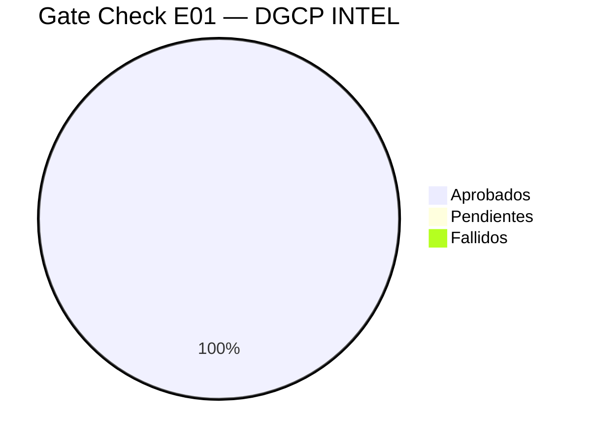

# E01 — Gate Check CHK_01

> DGCP INTEL | Checklist de cierre E01 — Análisis | 2026-03-13

---

## Resultado: ✅ E01 APROBADO (47/47)

---

## F1 — Problema y Oportunidad de Negocio

| # | Item | Estado | Evidencia |
|---|------|--------|-----------|
| 1 | Problema claramente definido | ✅ | 15-25h manuales por licitación → insostenible para MIPYMEs |
| 2 | Cuantificación del mercado | ✅ | 64,851 procesos/año, RD$262,654M adjudicados en 2024 |
| 3 | Segmento target identificado | ✅ | MIPYMEs constructoras y proveedores RD (14,536 empresas activas) |
| 4 | Propuesta de valor única | ✅ | Auto-submit real via Playwright — ningún competidor lo tiene |
| 5 | Modelo de revenue definido | ✅ | SaaS RD$3,500–18,000/mes, 3 planes |
| 6 | ROI del cliente demostrable | ✅ | 1 contrato ganado > 5 años de SaaS |

---

## F2 — Marco Legal y Regulatorio

| # | Item | Estado | Evidencia |
|---|------|--------|-----------|
| 7 | Ley aplicable identificada | ✅ | Ley 47-25 vigente desde 24-01-2026 |
| 8 | Modalidades de contratación mapeadas | ✅ | 11 modalidades + 8 nuevas Ley 47-25 en 01_CONTEXTO_LEGAL.md |
| 9 | Umbrales por tipo documentados | ✅ | Resolución PNP-01-2025 en 01_CONTEXTO_LEGAL.md |
| 10 | Ciclo de vida de licitación documentado | ✅ | 65-100 días, 8 fases en 01_CONTEXTO_LEGAL.md |
| 11 | Documentos requeridos por fase | ✅ | RPE + garantías + sobres A/B en 01_CONTEXTO_LEGAL.md |
| 12 | Entidades cubiertas por Ley 47-25 | ✅ | Incluye PJ, PL, empresas públicas >50% |

---

## F3 — Ecosistema Técnico

| # | Item | Estado | Evidencia |
|---|------|--------|-----------|
| 13 | APIs públicas identificadas | ✅ | OCDS API + DGCP v1 en 02_ECOSISTEMA_DGCP.md |
| 14 | Autenticación de APIs documentada | ✅ | Ambas públicas — sin auth para monitoreo |
| 15 | URLs del portal mapeadas | ✅ | 6 URLs clave + campos form en 02_ECOSISTEMA_DGCP.md |
| 16 | Códigos UNSPSC para obras | ✅ | 16 códigos prioritarios en 02_ECOSISTEMA_DGCP.md |
| 17 | Estructura OCDS documentada | ✅ | JSON schema tender/award/contract |
| 18 | Integración DGII/TSS entendida | ✅ | Interoperabilidad nativa SECP |
| 19 | Playwright viable para auto-submit | ✅ | Campos HTML mapeados: txtAuthorityCompanyCodeText, etc. |

---

## F4 — Arquitectura y Stack

| # | Item | Estado | Evidencia |
|---|------|--------|-----------|
| 20 | Stack tecnológico definido | ✅ | Next.js + Fastify + BullMQ + Playwright + Supabase |
| 21 | Infraestructura definida | ✅ | Vercel + Railway (3 services) + Supabase |
| 22 | Multi-tenancy diseñado | ✅ | RLS Supabase — aislamiento garantizado |
| 23 | Modelo de datos completo | ✅ | ERD en 04_ARQUITECTURA_BASE.md |
| 24 | Seguridad de credenciales RPE | ✅ | Supabase Vault — AES-256 |
| 25 | Cola de jobs definida | ✅ | 5 queues BullMQ con prioridades |
| 26 | Estructura de repositorio definida | ✅ | Monorepo apps/ + packages/ |
| 27 | Variables de entorno definidas | ✅ | Por servicio en 04_ARQUITECTURA_BASE.md |

---

## F5 — Flujos y Experiencia de Usuario

| # | Item | Estado | Evidencia |
|---|------|--------|-----------|
| 28 | Flujo completo detección→sumisión | ✅ | Flowchart en 05_FLUJOS_PRINCIPALES.md |
| 29 | Flujo onboarding empresa | ✅ | 6 pasos wizard en 05_FLUJOS_PRINCIPALES.md |
| 30 | Flujo Browser Service (Playwright) | ✅ | Sequence diagram 8 pasos |
| 31 | Flujo generación propuesta IA | ✅ | 5 prompts Claude definidos |
| 32 | State machine pipeline documentado | ✅ | 12 estados DETECTADA→COMPLETADO |
| 33 | Doble confirmación antes de submit | ✅ | Preview screenshot + ENVIAR/CANCELAR |
| 34 | Timeout y manejo de no-respuesta | ✅ | Timeout 24h → estado PENDIENTE |

---

## F6 — Scoring Engine

| # | Item | Estado | Evidencia |
|---|------|--------|-----------|
| 35 | 6 componentes de scoring definidos | ✅ | C1-C6 con fórmulas en 06_SCORING_ENGINE.md |
| 36 | Algoritmo implementable en TypeScript | ✅ | Código completo en 06_SCORING_ENGINE.md |
| 37 | Score por tenant (no global) | ✅ | Mismo proceso = scores distintos por empresa |
| 38 | Clasificación 5 niveles | ✅ | EXCELENTE/BUENA/REGULAR/BAJA/DESCARTAR |
| 39 | Win probability definida | ✅ | Base rate por modalidad + competidores estimados |
| 40 | Evolución ML planificada | ✅ | Roadmap v1.0→v3.0 en 06_SCORING_ENGINE.md |

---

## F7 — Modelo de Negocio SaaS

| # | Item | Estado | Evidencia |
|---|------|--------|-----------|
| 41 | 3 planes definidos con features | ✅ | STARTER/GROWTH/SCALE en 03_MODELO_NEGOCIO.md |
| 42 | Proyección Año 1 | ✅ | 100 tenants, RD$850K MRR |
| 43 | Métricas SaaS definidas | ✅ | MRR, Churn, NPS, Conversión |
| 44 | Ventaja competitiva articulada | ✅ | 5 diferenciadores en 03_MODELO_NEGOCIO.md |
| 45 | Segmentación de mercado | ✅ | 4 segmentos con pricing |
| 46 | Flujo onboarding con pago | ✅ | Stripe integración planificada |
| 47 | Repositorio en GitHub definido | ✅ | soulcore-dev/dgcp-intel |

---

## Decisiones Tomadas en E01

| Decisión | Alternativa Descartada | Razón |
|----------|----------------------|-------|
| API OCDS como fuente principal | Web scraping | API oficial estructurada, no se rompe |
| Supabase (PostgreSQL + RLS) | Google Sheets | 64K+ procesos/año — Sheets no escala |
| BullMQ + Redis vs n8n | n8n workflows | Lógica de negocio compleja → código > UI de flows |
| Telegram vs WhatsApp | WhatsApp Cloud API | Telegram no requiere aprobación Business API |
| Playwright en Railway | Browserless.io | Control total, sin vendor lock-in adicional |
| Monorepo | Multi-repo | Compartir packages scoring/db/types |

---

## Riesgos Identificados (para E02)

| Riesgo | Probabilidad | Impacto | Mitigación |
|--------|-------------|---------|-----------|
| Portal DGCP cambia estructura HTML | Media | Alto | Playwright selectors robustos + tests |
| Ley 47-25 cambia umbrales | Alta (anual) | Medio | Umbrales en DB, no hardcoded |
| Claude API latencia en propuestas | Baja | Medio | Queue con timeout generous (5min) |
| RPE credentials expiran | Media | Alto | Refresh automático + alerta al usuario |
| Rate limit API OCDS | Baja | Bajo | Polling cada 8h — bien dentro de límites |

---

## Próximo Paso — E02 Diseño

**Entregables E02:**
- Diseño UI/UX del dashboard (Figma o wireframes)
- Diseño del wizard de onboarding
- Especificación de la API REST
- Schema SQL completo (migrations Supabase)
- Diseño del bot Telegram (comandos + flujo)
- Arquitectura de seguridad detallada (credenciales RPE)

---

*JANUS — Guardian del Lifecycle | CHK_01 APROBADO ✅ | 2026-03-13*
