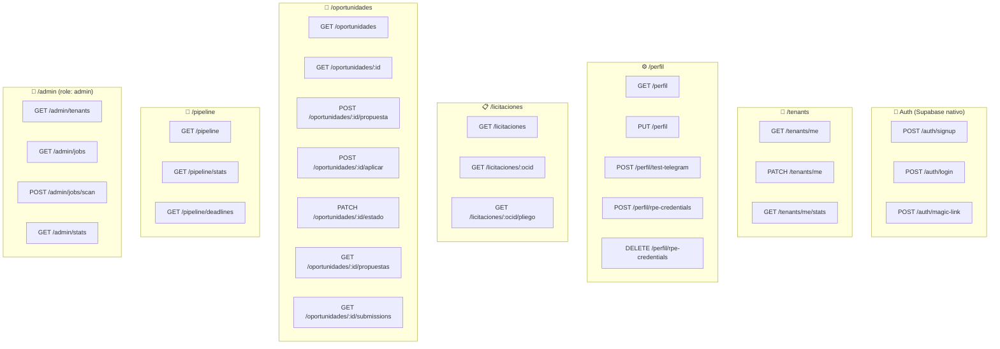
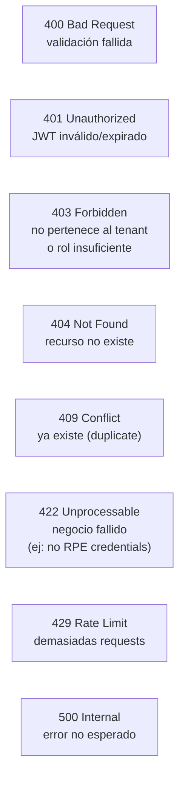

# E02 — API REST Specification

> DGCP INTEL | Etapa 2 — Diseño | 2026-03-13

---

## 1. Convenciones Generales

```
Base URL:     https://api.dgcp-intel.com/api/v1
Auth:         Bearer JWT (Supabase Auth)
Tenant:       Resuelto automáticamente desde JWT → tenant_id
Format:       JSON
Pagination:   ?page=1&limit=20
Errors:       { error: string, code: string, details?: any }
```

### Headers obligatorios
```http
Authorization: Bearer <supabase_jwt>
Content-Type: application/json
```

---

## 2. Mapa de Recursos



---

## 3. Endpoints Detallados

### 3.1 Perfil de Empresa

**GET /perfil**
```json
// Response 200
{
  "id": "uuid",
  "tenant_id": "uuid",
  "nombre_empresa": "Constructora Pérez S.R.L.",
  "rnc": "1-32-XXXXX-X",
  "unspsc_codes": ["72141000", "72151100", "72200000"],
  "keywords": ["rehabilitación", "carretera", "vial", "pavimentación"],
  "budget_min_dop": 5000000,
  "budget_max_dop": 50000000,
  "score_umbral": 65,
  "telegram_chat_id": "123456789",
  "has_rpe_credentials": true,
  "notificaciones": {
    "telegram": true,
    "email": true,
    "score_minimo_alerta": 65
  }
}
```

**PUT /perfil**
```json
// Request body (parcial OK)
{
  "unspsc_codes": ["72141000", "72151100"],
  "keywords": ["carretera", "pavimentación"],
  "budget_min_dop": 5000000,
  "budget_max_dop": 50000000,
  "score_umbral": 70
}
```

**POST /perfil/rpe-credentials**
```json
// Request — credenciales cifradas en tránsito (HTTPS) + vault en reposo
{
  "usuario_rpe": "empresa123",
  "password_rpe": "secreto"
}
// Response 200
{ "message": "Credenciales guardadas y verificadas", "login_exitoso": true }
```

**POST /perfil/test-telegram**
```json
// Request
{ "chat_id": "123456789" }
// Response 200
{ "message": "Mensaje de prueba enviado", "ok": true }
```

---

### 3.2 Licitaciones (caché OCDS global)

**GET /licitaciones**
```
Query params:
  ?status=active               → active | complete | cancelled
  ?modality=LPN                → LPN | CP | SO | etc.
  ?unspsc=72141000             → filtrar por código
  ?keyword=carretera           → búsqueda en título/descripción
  ?amount_min=5000000
  ?amount_max=50000000
  ?entity=MOPC
  ?page=1&limit=20
  ?sort=tender_end&order=asc
```

```json
// Response 200
{
  "data": [
    {
      "ocid": "ocds-b3wdp2-DGCP-2026-0895",
      "title": "Rehabilitación Carretera San Cristóbal - Baní",
      "status": "active",
      "modality": "LPN",
      "amount_dop": 28500000,
      "entity_name": "Ministerio de Obras Públicas",
      "tender_end": "2026-04-15T17:00:00Z",
      "dias_restantes": 22,
      "unspsc_codes": ["72141000"],
      "score_para_mi_empresa": 89,    // calculado en tiempo real para el tenant
      "tiene_propuesta": false,
      "estado_pipeline": null
    }
  ],
  "pagination": { "page": 1, "limit": 20, "total": 143, "pages": 8 }
}
```

**GET /licitaciones/:ocid**
```json
// Response 200 — datos OCDS completos + score calculado
{
  "ocid": "...",
  "title": "...",
  "description": "...",
  "status": "active",
  "modality": "LPN",
  "amount_dop": 28500000,
  "entity_name": "MOPC",
  "tender_start": "2026-03-10T00:00:00Z",
  "tender_end": "2026-04-15T17:00:00Z",
  "unspsc_codes": ["72141000"],
  "documents": [
    { "id": "d1", "title": "Pliego de Condiciones", "url": "https://..." },
    { "id": "d2", "title": "Especificaciones Técnicas", "url": "https://..." }
  ],
  "parties": {
    "buyer": { "name": "MOPC", "id": "mopc-001" }
  },
  "score_breakdown": {
    "total": 89,
    "capacidades": 25,
    "presupuesto": 20,
    "tipo_proceso": 10,
    "tiempo": 15,
    "entidad": 7,
    "keywords": 12,
    "clasificacion": "EXCELENTE",
    "win_probability": "18-25%",
    "margen_estimado_dop": 5130000
  },
  "raw_ocds": { ... }
}
```

---

### 3.3 Oportunidades (por tenant)

**GET /oportunidades**
```
Query params:
  ?estado=DETECTADA|EVALUADA|PREPARACION|APLICADA|GANADA|PERDIDA|COMPLETADO
  ?score_min=65
  ?alertado=true|false
  ?page=1&limit=20
  ?sort=score&order=desc
```

**POST /oportunidades/:id/propuesta**
```json
// Trigger generación IA (encola propose-queue)
// Response 202 Accepted
{
  "message": "Generación de propuesta iniciada",
  "job_id": "job-uuid",
  "eta_seconds": 20
}
```

**POST /oportunidades/:id/aplicar**
```json
// Trigger auto-submit (encola submit-queue)
// Response 202 Accepted
{
  "message": "Auto-submit iniciado. Recibirás preview en Telegram.",
  "job_id": "job-uuid"
}
// Error 400 si no tiene credenciales RPE
{ "error": "RPE credentials required", "code": "NO_RPE_CREDENTIALS" }
// Error 400 si no tiene propuesta
{ "error": "Propuesta must be generated first", "code": "NO_PROPUESTA" }
```

**PATCH /oportunidades/:id/estado**
```json
// Cambio manual de estado
{ "estado": "DESCARTADA", "nota": "Fuera de capacidad técnica" }
```

---

### 3.4 Pipeline

**GET /pipeline**
```json
// Response — agrupado por estado
{
  "DETECTADA": [ { ...oportunidad }, ... ],
  "EVALUADA": [ ... ],
  "EN_PREPARACION": [ ... ],
  "APLICADA": [ ... ],
  "EN_EVALUACION": [ ... ],
  "GANADA": [ ... ],
  "PERDIDA": [ ... ]
}
```

**GET /pipeline/stats**
```json
{
  "mes_actual": {
    "detectadas": 52,
    "evaluadas": 18,
    "aplicadas": 6,
    "ganadas": 1,
    "perdidas": 3
  },
  "acumulado": {
    "revenue_ganado_dop": 28500000,
    "pipeline_activo_dop": 143000000,
    "tasa_adjudicacion": "16.6%"
  },
  "proximos_deadlines": [
    { "ocid": "...", "title": "...", "dias_restantes": 3, "estado": "APLICADA" }
  ]
}
```

**GET /pipeline/deadlines**
```json
// Licitaciones con deadline próximo (≤5 días)
{
  "urgentes": [...],   // ≤2 días
  "proximos": [...]    // 3-5 días
}
```

---

### 3.5 Admin

**POST /admin/jobs/scan**
```json
// Forzar escaneo inmediato (útil para testing)
{ "force": true }
// Response 202
{ "message": "Scan job encolado", "job_id": "..." }
```

**GET /admin/jobs**
```json
// Estado de las queues BullMQ
{
  "scan-queue": { "waiting": 0, "active": 1, "completed": 145, "failed": 2 },
  "score-queue": { "waiting": 3, "active": 0, "completed": 892, "failed": 1 },
  "propose-queue": { "waiting": 1, "active": 1, "completed": 45, "failed": 0 },
  "submit-queue": { "waiting": 0, "active": 0, "completed": 12, "failed": 1 }
}
```

---

## 4. Códigos de Error Estándar



```json
// Formato de error estándar
{
  "error": "Descripción legible para el usuario",
  "code": "SNAKE_CASE_CODE",
  "details": { ... }  // opcional — para debugging
}
```

---

## 5. Websocket — Notificaciones en Tiempo Real

```
ws://api.dgcp-intel.com/ws?token=<jwt>

Eventos que el server emite:
  licitacion.nueva         → nueva detectada con score
  propuesta.lista          → docs generados por IA
  submission.preview       → screenshot antes de submit
  submission.completada    → oferta enviada, # confirmación
  deadline.alerta          → proceso con ≤3 días
  pipeline.update          → cambio de estado
```

```json
// Ejemplo evento
{
  "event": "propuesta.lista",
  "data": {
    "oportunidad_id": "uuid",
    "ocid": "...",
    "title": "Rehabilitación Carretera...",
    "documentos": [
      { "tipo": "propuesta_tecnica", "url": "https://storage.supabase.co/..." },
      { "tipo": "carta_presentacion", "url": "..." },
      { "tipo": "presupuesto", "url": "..." },
      { "tipo": "checklist_legal", "url": "..." },
      { "tipo": "timeline", "url": "..." }
    ]
  }
}
```

---

*Anterior: E01/07_CHK_01_VERIFICADO.md*
*Siguiente: [02_SQL_MIGRATIONS.md](02_SQL_MIGRATIONS.md)*
*JANUS — 2026-03-13*
