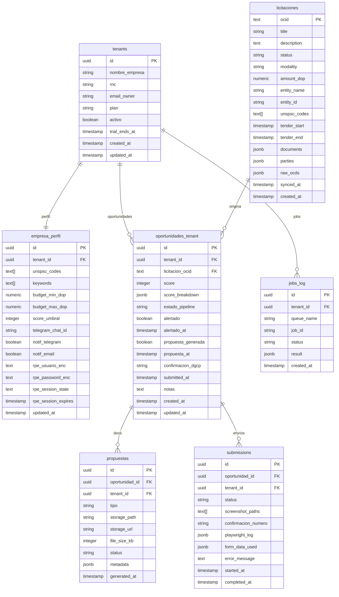

# E02 — SQL Migrations (Supabase)

> DGCP INTEL | Etapa 2 — Diseño | 2026-03-13

---

## 1. Diagrama ER Completo



---

## 2. Migration 001 — Schema base

```sql
-- supabase/migrations/001_initial_schema.sql

-- ============================================================
-- TENANTS
-- ============================================================
CREATE TABLE public.tenants (
  id            UUID PRIMARY KEY DEFAULT gen_random_uuid(),
  nombre_empresa TEXT NOT NULL,
  rnc           TEXT,
  email_owner   TEXT NOT NULL UNIQUE,
  plan          TEXT NOT NULL DEFAULT 'starter'
                  CHECK (plan IN ('starter', 'growth', 'scale', 'enterprise')),
  activo        BOOLEAN NOT NULL DEFAULT true,
  trial_ends_at TIMESTAMPTZ,
  created_at    TIMESTAMPTZ NOT NULL DEFAULT NOW(),
  updated_at    TIMESTAMPTZ NOT NULL DEFAULT NOW()
);

-- ============================================================
-- USERS → mapeo de Supabase Auth users a tenants
-- ============================================================
CREATE TABLE public.user_tenants (
  user_id    UUID NOT NULL REFERENCES auth.users(id) ON DELETE CASCADE,
  tenant_id  UUID NOT NULL REFERENCES public.tenants(id) ON DELETE CASCADE,
  rol        TEXT NOT NULL DEFAULT 'member'
               CHECK (rol IN ('owner', 'admin', 'member', 'viewer')),
  created_at TIMESTAMPTZ NOT NULL DEFAULT NOW(),
  PRIMARY KEY (user_id, tenant_id)
);

-- ============================================================
-- EMPRESA_PERFIL
-- ============================================================
CREATE TABLE public.empresa_perfil (
  id                   UUID PRIMARY KEY DEFAULT gen_random_uuid(),
  tenant_id            UUID NOT NULL UNIQUE REFERENCES public.tenants(id),
  unspsc_codes         TEXT[] NOT NULL DEFAULT '{}',
  keywords             TEXT[] NOT NULL DEFAULT '{}',
  budget_min_dop       NUMERIC NOT NULL DEFAULT 0,
  budget_max_dop       NUMERIC NOT NULL DEFAULT 999999999,
  score_umbral         INTEGER NOT NULL DEFAULT 65
                         CHECK (score_umbral BETWEEN 0 AND 100),
  telegram_chat_id     TEXT,
  notif_telegram       BOOLEAN NOT NULL DEFAULT true,
  notif_email          BOOLEAN NOT NULL DEFAULT true,
  -- RPE credentials (cifradas con pgcrypto / Supabase Vault)
  rpe_usuario_enc      TEXT,
  rpe_password_enc     TEXT,
  rpe_session_state    TEXT,        -- storageState serializado de Playwright
  rpe_session_expires  TIMESTAMPTZ,
  updated_at           TIMESTAMPTZ NOT NULL DEFAULT NOW()
);

-- ============================================================
-- LICITACIONES — caché global OCDS (sin tenant)
-- ============================================================
CREATE TABLE public.licitaciones (
  ocid          TEXT PRIMARY KEY,
  title         TEXT NOT NULL,
  description   TEXT,
  status        TEXT NOT NULL DEFAULT 'active'
                  CHECK (status IN ('planning', 'active', 'complete', 'cancelled', 'unsuccessful')),
  modality      TEXT,         -- LPN, CP, SO, Compra_Menor, etc.
  amount_dop    NUMERIC,
  entity_name   TEXT,
  entity_id     TEXT,
  unspsc_codes  TEXT[] NOT NULL DEFAULT '{}',
  tender_start  TIMESTAMPTZ,
  tender_end    TIMESTAMPTZ,
  documents     JSONB NOT NULL DEFAULT '[]',
  parties       JSONB NOT NULL DEFAULT '{}',
  raw_ocds      JSONB,
  synced_at     TIMESTAMPTZ NOT NULL DEFAULT NOW(),
  created_at    TIMESTAMPTZ NOT NULL DEFAULT NOW()
);

CREATE INDEX idx_licitaciones_status     ON public.licitaciones(status);
CREATE INDEX idx_licitaciones_tender_end ON public.licitaciones(tender_end);
CREATE INDEX idx_licitaciones_modality   ON public.licitaciones(modality);
CREATE INDEX idx_licitaciones_amount     ON public.licitaciones(amount_dop);
-- Full text search en título y descripción
CREATE INDEX idx_licitaciones_fts ON public.licitaciones
  USING gin(to_tsvector('spanish', coalesce(title,'') || ' ' || coalesce(description,'')));

-- ============================================================
-- OPORTUNIDADES_TENANT — por empresa
-- ============================================================
CREATE TABLE public.oportunidades_tenant (
  id               UUID PRIMARY KEY DEFAULT gen_random_uuid(),
  tenant_id        UUID NOT NULL REFERENCES public.tenants(id),
  licitacion_ocid  TEXT NOT NULL REFERENCES public.licitaciones(ocid),
  score            INTEGER NOT NULL DEFAULT 0 CHECK (score BETWEEN 0 AND 100),
  score_breakdown  JSONB NOT NULL DEFAULT '{}',
  estado_pipeline  TEXT NOT NULL DEFAULT 'DETECTADA'
                     CHECK (estado_pipeline IN (
                       'DETECTADA','EVALUADA','EN_PREPARACION',
                       'PROPUESTA_LISTA','APLICADA','APLICADA_MANUAL',
                       'EN_EVALUACION','GANADA','PERDIDA',
                       'DESCARTADA','CONTRATO_FIRMADO','COMPLETADO'
                     )),
  alertado         BOOLEAN NOT NULL DEFAULT false,
  alertado_at      TIMESTAMPTZ,
  propuesta_generada BOOLEAN NOT NULL DEFAULT false,
  propuesta_at     TIMESTAMPTZ,
  confirmacion_dgcp TEXT,
  submitted_at     TIMESTAMPTZ,
  notas            TEXT,
  created_at       TIMESTAMPTZ NOT NULL DEFAULT NOW(),
  updated_at       TIMESTAMPTZ NOT NULL DEFAULT NOW(),
  UNIQUE (tenant_id, licitacion_ocid)
);

CREATE INDEX idx_oport_tenant_estado ON public.oportunidades_tenant(tenant_id, estado_pipeline);
CREATE INDEX idx_oport_tenant_score  ON public.oportunidades_tenant(tenant_id, score DESC);

-- ============================================================
-- PROPUESTAS — docs IA generados
-- ============================================================
CREATE TABLE public.propuestas (
  id              UUID PRIMARY KEY DEFAULT gen_random_uuid(),
  oportunidad_id  UUID NOT NULL REFERENCES public.oportunidades_tenant(id),
  tenant_id       UUID NOT NULL REFERENCES public.tenants(id),
  tipo            TEXT NOT NULL
                    CHECK (tipo IN (
                      'propuesta_tecnica','carta_presentacion',
                      'presupuesto','checklist_legal','timeline'
                    )),
  storage_path    TEXT NOT NULL,   -- path en Supabase Storage
  storage_url     TEXT,            -- URL pública o signed
  file_size_kb    INTEGER,
  status          TEXT NOT NULL DEFAULT 'generating'
                    CHECK (status IN ('generating','ready','error')),
  metadata        JSONB NOT NULL DEFAULT '{}',
  generated_at    TIMESTAMPTZ NOT NULL DEFAULT NOW()
);

-- ============================================================
-- SUBMISSIONS — historial de auto-submit
-- ============================================================
CREATE TABLE public.submissions (
  id               UUID PRIMARY KEY DEFAULT gen_random_uuid(),
  oportunidad_id   UUID NOT NULL REFERENCES public.oportunidades_tenant(id),
  tenant_id        UUID NOT NULL REFERENCES public.tenants(id),
  status           TEXT NOT NULL DEFAULT 'iniciando'
                     CHECK (status IN (
                       'iniciando','login','navegando','formulario',
                       'uploads','preview','confirmando','submitted',
                       'cancelled','error'
                     )),
  screenshot_paths TEXT[] NOT NULL DEFAULT '{}',
  confirmacion_numero TEXT,
  playwright_log   JSONB NOT NULL DEFAULT '[]',
  form_data_used   JSONB,          -- datos llenados (sin password)
  error_message    TEXT,
  started_at       TIMESTAMPTZ NOT NULL DEFAULT NOW(),
  completed_at     TIMESTAMPTZ
);

-- ============================================================
-- JOBS_LOG — auditoría de jobs BullMQ
-- ============================================================
CREATE TABLE public.jobs_log (
  id          UUID PRIMARY KEY DEFAULT gen_random_uuid(),
  tenant_id   UUID REFERENCES public.tenants(id),  -- null = job global (scan)
  queue_name  TEXT NOT NULL,
  job_id      TEXT NOT NULL,
  status      TEXT NOT NULL CHECK (status IN ('completed','failed','stalled')),
  result      JSONB,
  created_at  TIMESTAMPTZ NOT NULL DEFAULT NOW()
);
```

---

## 3. Migration 002 — Row Level Security

```sql
-- supabase/migrations/002_rls_policies.sql

ALTER TABLE public.tenants           ENABLE ROW LEVEL SECURITY;
ALTER TABLE public.user_tenants      ENABLE ROW LEVEL SECURITY;
ALTER TABLE public.empresa_perfil    ENABLE ROW LEVEL SECURITY;
ALTER TABLE public.licitaciones      ENABLE ROW LEVEL SECURITY;
ALTER TABLE public.oportunidades_tenant ENABLE ROW LEVEL SECURITY;
ALTER TABLE public.propuestas        ENABLE ROW LEVEL SECURITY;
ALTER TABLE public.submissions       ENABLE ROW LEVEL SECURITY;
ALTER TABLE public.jobs_log          ENABLE ROW LEVEL SECURITY;

-- Helper: obtener tenant_id del JWT
CREATE OR REPLACE FUNCTION public.get_tenant_id()
RETURNS UUID AS $$
  SELECT (
    SELECT tenant_id FROM public.user_tenants
    WHERE user_id = auth.uid()
    LIMIT 1
  );
$$ LANGUAGE sql STABLE SECURITY DEFINER;

-- Helper: obtener rol del usuario en su tenant
CREATE OR REPLACE FUNCTION public.get_user_rol()
RETURNS TEXT AS $$
  SELECT rol FROM public.user_tenants
  WHERE user_id = auth.uid()
  LIMIT 1;
$$ LANGUAGE sql STABLE SECURITY DEFINER;

-- TENANTS
CREATE POLICY "tenant_owner_read" ON public.tenants
  FOR SELECT USING (id = public.get_tenant_id());
CREATE POLICY "tenant_owner_update" ON public.tenants
  FOR UPDATE USING (id = public.get_tenant_id() AND public.get_user_rol() = 'owner');

-- EMPRESA_PERFIL
CREATE POLICY "perfil_tenant_read" ON public.empresa_perfil
  FOR SELECT USING (tenant_id = public.get_tenant_id());
CREATE POLICY "perfil_tenant_write" ON public.empresa_perfil
  FOR ALL USING (tenant_id = public.get_tenant_id()
    AND public.get_user_rol() IN ('owner', 'admin'));

-- LICITACIONES — lectura para todos los autenticados
CREATE POLICY "licitaciones_read_all" ON public.licitaciones
  FOR SELECT USING (auth.uid() IS NOT NULL);

-- OPORTUNIDADES — solo del propio tenant
CREATE POLICY "oport_tenant_isolation" ON public.oportunidades_tenant
  FOR ALL USING (tenant_id = public.get_tenant_id());

-- PROPUESTAS
CREATE POLICY "propuestas_tenant_isolation" ON public.propuestas
  FOR ALL USING (tenant_id = public.get_tenant_id());

-- SUBMISSIONS
CREATE POLICY "submissions_tenant_isolation" ON public.submissions
  FOR ALL USING (tenant_id = public.get_tenant_id());

-- JOBS_LOG — solo lectura del propio tenant o global
CREATE POLICY "jobs_tenant_read" ON public.jobs_log
  FOR SELECT USING (tenant_id = public.get_tenant_id() OR tenant_id IS NULL);
```

---

## 4. Migration 003 — Funciones Útiles

```sql
-- supabase/migrations/003_functions.sql

-- Búsqueda full-text de licitaciones
CREATE OR REPLACE FUNCTION public.buscar_licitaciones(
  query TEXT,
  p_status TEXT DEFAULT 'active',
  p_limit INTEGER DEFAULT 20,
  p_offset INTEGER DEFAULT 0
)
RETURNS SETOF public.licitaciones AS $$
  SELECT * FROM public.licitaciones
  WHERE status = p_status
    AND (
      query IS NULL OR query = '' OR
      to_tsvector('spanish', coalesce(title,'') || ' ' || coalesce(description,''))
      @@ plainto_tsquery('spanish', query)
    )
  ORDER BY tender_end ASC NULLS LAST
  LIMIT p_limit OFFSET p_offset;
$$ LANGUAGE sql STABLE SECURITY DEFINER;

-- Licitaciones con match para un tenant (para el worker de scoring)
CREATE OR REPLACE FUNCTION public.licitaciones_para_tenant(
  p_tenant_id UUID,
  p_desde TIMESTAMPTZ DEFAULT NOW() - INTERVAL '24 hours'
)
RETURNS TABLE(
  ocid TEXT, title TEXT, amount_dop NUMERIC,
  unspsc_codes TEXT[], tender_end TIMESTAMPTZ
) AS $$
DECLARE
  v_unspsc TEXT[];
  v_keywords TEXT[];
  v_min NUMERIC;
  v_max NUMERIC;
BEGIN
  SELECT ep.unspsc_codes, ep.keywords, ep.budget_min_dop, ep.budget_max_dop
  INTO v_unspsc, v_keywords, v_min, v_max
  FROM public.empresa_perfil ep WHERE ep.tenant_id = p_tenant_id;

  RETURN QUERY
  SELECT l.ocid, l.title, l.amount_dop, l.unspsc_codes, l.tender_end
  FROM public.licitaciones l
  WHERE l.created_at >= p_desde
    AND l.status = 'active'
    AND l.amount_dop BETWEEN v_min * 0.5 AND v_max * 2
    AND (
      l.unspsc_codes && v_unspsc   -- overlap de arrays
      OR EXISTS (
        SELECT 1 FROM unnest(v_keywords) k
        WHERE l.title ILIKE '%' || k || '%'
           OR l.description ILIKE '%' || k || '%'
      )
    )
    AND NOT EXISTS (
      SELECT 1 FROM public.oportunidades_tenant ot
      WHERE ot.tenant_id = p_tenant_id AND ot.licitacion_ocid = l.ocid
    );
END;
$$ LANGUAGE plpgsql STABLE SECURITY DEFINER;

-- Stats del pipeline para un tenant
CREATE OR REPLACE FUNCTION public.pipeline_stats(p_tenant_id UUID)
RETURNS JSONB AS $$
  SELECT jsonb_build_object(
    'total', COUNT(*),
    'detectadas', COUNT(*) FILTER (WHERE estado_pipeline = 'DETECTADA'),
    'aplicadas', COUNT(*) FILTER (WHERE estado_pipeline = 'APLICADA'),
    'ganadas', COUNT(*) FILTER (WHERE estado_pipeline = 'GANADA'),
    'perdidas', COUNT(*) FILTER (WHERE estado_pipeline = 'PERDIDA'),
    'pipeline_dop', COALESCE(SUM(l.amount_dop) FILTER (
      WHERE ot.estado_pipeline NOT IN ('DESCARTADA','PERDIDA','COMPLETADO')
    ), 0),
    'ganado_dop', COALESCE(SUM(l.amount_dop) FILTER (
      WHERE ot.estado_pipeline IN ('GANADA','CONTRATO_FIRMADO','COMPLETADO')
    ), 0)
  )
  FROM public.oportunidades_tenant ot
  JOIN public.licitaciones l ON l.ocid = ot.licitacion_ocid
  WHERE ot.tenant_id = p_tenant_id;
$$ LANGUAGE sql STABLE SECURITY DEFINER;
```

---

## 5. Migration 004 — Triggers y Auditoría

```sql
-- supabase/migrations/004_triggers.sql

-- Auto-update updated_at
CREATE OR REPLACE FUNCTION public.update_updated_at()
RETURNS TRIGGER AS $$
BEGIN
  NEW.updated_at = NOW();
  RETURN NEW;
END;
$$ LANGUAGE plpgsql;

CREATE TRIGGER tenants_updated_at
  BEFORE UPDATE ON public.tenants
  FOR EACH ROW EXECUTE FUNCTION public.update_updated_at();

CREATE TRIGGER empresa_perfil_updated_at
  BEFORE UPDATE ON public.empresa_perfil
  FOR EACH ROW EXECUTE FUNCTION public.update_updated_at();

CREATE TRIGGER oportunidades_updated_at
  BEFORE UPDATE ON public.oportunidades_tenant
  FOR EACH ROW EXECUTE FUNCTION public.update_updated_at();

-- Crear perfil vacío al crear tenant
CREATE OR REPLACE FUNCTION public.crear_perfil_vacio()
RETURNS TRIGGER AS $$
BEGIN
  INSERT INTO public.empresa_perfil (tenant_id)
  VALUES (NEW.id)
  ON CONFLICT DO NOTHING;
  RETURN NEW;
END;
$$ LANGUAGE plpgsql;

CREATE TRIGGER tenant_crear_perfil
  AFTER INSERT ON public.tenants
  FOR EACH ROW EXECUTE FUNCTION public.crear_perfil_vacio();
```

---

## 6. Storage Buckets

```sql
-- supabase/migrations/005_storage.sql

-- Bucket para pliegos descargados
INSERT INTO storage.buckets (id, name, public, file_size_limit, allowed_mime_types)
VALUES ('pliegos', 'pliegos', false, 52428800, ARRAY['application/pdf']);

-- Bucket para propuestas generadas por IA
INSERT INTO storage.buckets (id, name, public, file_size_limit, allowed_mime_types)
VALUES ('propuestas', 'propuestas', false, 52428800, ARRAY['application/pdf']);

-- Bucket para evidencias (screenshots Playwright)
INSERT INTO storage.buckets (id, name, public, file_size_limit, allowed_mime_types)
VALUES ('evidencias', 'evidencias', false, 10485760, ARRAY['image/png','image/jpeg']);

-- Políticas de Storage — acceso solo al propio tenant
-- path: {bucket}/{tenant_id}/{...}
CREATE POLICY "tenant_storage_pliegos" ON storage.objects
  FOR ALL USING (
    bucket_id = 'pliegos'
    AND (storage.foldername(name))[1] = public.get_tenant_id()::text
  );

CREATE POLICY "tenant_storage_propuestas" ON storage.objects
  FOR ALL USING (
    bucket_id = 'propuestas'
    AND (storage.foldername(name))[1] = public.get_tenant_id()::text
  );

CREATE POLICY "tenant_storage_evidencias" ON storage.objects
  FOR ALL USING (
    bucket_id = 'evidencias'
    AND (storage.foldername(name))[1] = public.get_tenant_id()::text
  );
```

---

*Anterior: [01_API_REST_SPEC.md](01_API_REST_SPEC.md)*
*Siguiente: [03_BOT_TELEGRAM.md](03_BOT_TELEGRAM.md)*
*JANUS — 2026-03-13*
