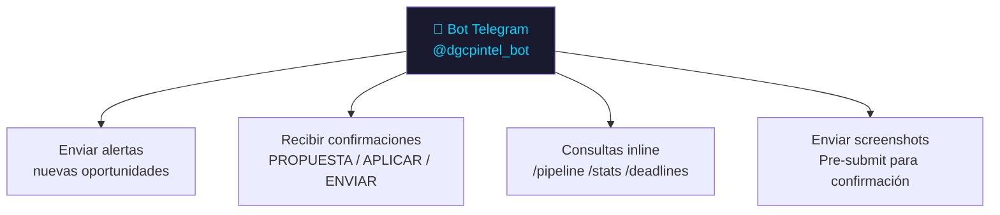
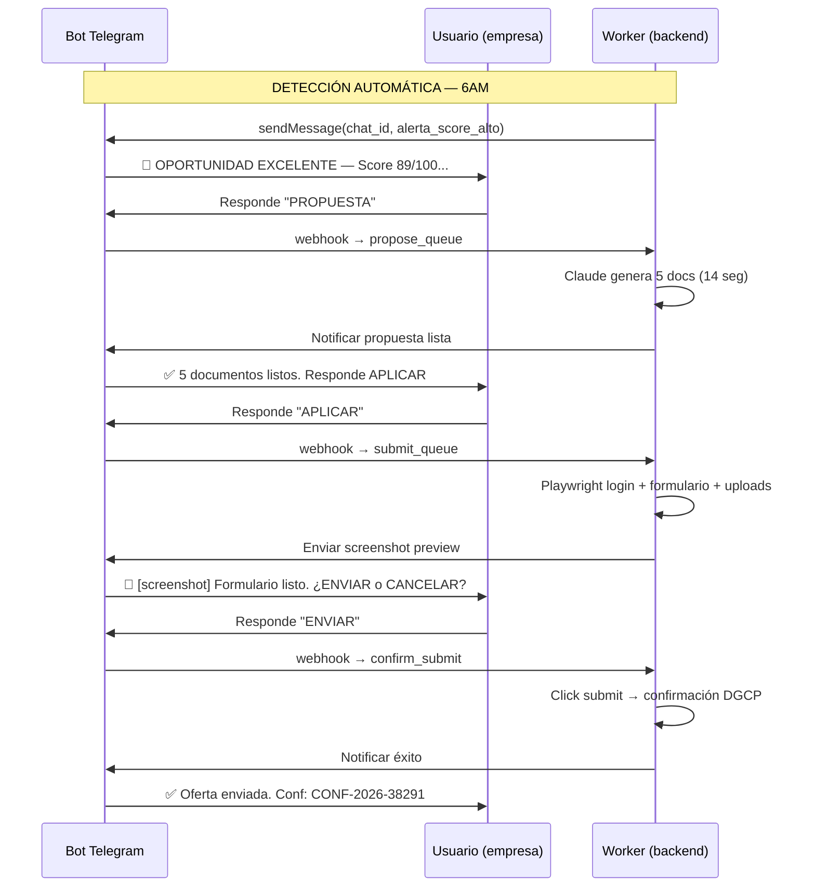
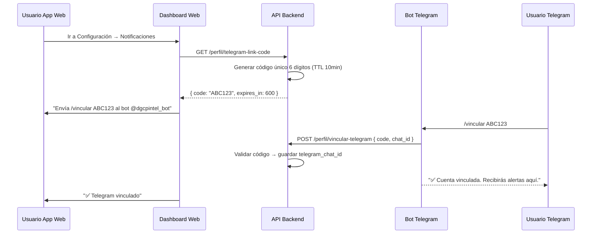
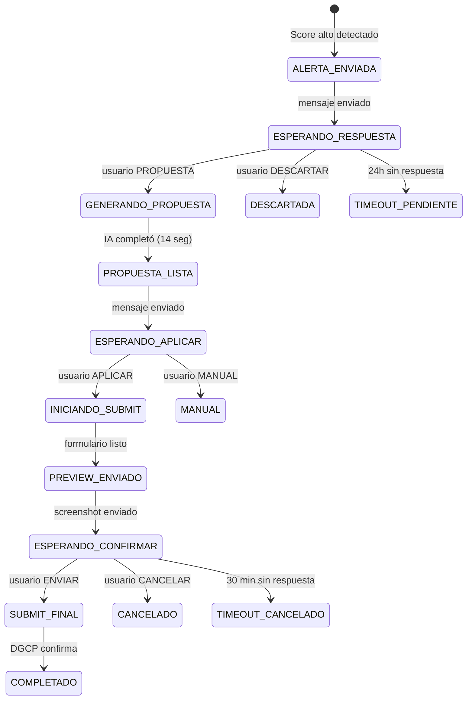

# E02 — Bot Telegram: Diseño Completo

> DGCP INTEL | Etapa 2 — Diseño | 2026-03-13

---

## 1. Rol del Bot en el Sistema



El bot es el **canal principal de interacción del usuario** para acciones críticas. El dashboard web es complementario (analytics, configuración).

---

## 2. Flujo Conversacional Principal



---

## 3. Comandos del Bot

| Comando | Descripción |
|---------|-------------|
| `/start` | Activar bot + vincular cuenta |
| `/pipeline` | Ver pipeline actual con estados |
| `/stats` | Stats del mes: detectadas, aplicadas, ganadas |
| `/deadlines` | Licitaciones con deadline ≤5 días |
| `/oportunidades` | Ver top 5 oportunidades activas |
| `/ayuda` | Lista de comandos |
| `/config` | Link al dashboard para configurar perfil |

---

## 4. Diseño de Mensajes

### 4.1 Alerta de Oportunidad

```
🚨 OPORTUNIDAD EXCELENTE — Score: 89/100

📋 Rehabilitación Carretera San Cristóbal - Baní
🏛️ MOPC — Ministerio de Obras Públicas
💰 RD$28,500,000
📅 Deadline: 22 días (15 abril 2026)
🏷️ UNSPSC: 72141000 — Construcción Carreteras

📊 Desglose:
  Capacidades: 25/30
  Presupuesto: 20/20 ⭐ sweet spot
  Proceso: 10/15
  Tiempo: 15/15 ⭐
  Entidad: 7/10
  Keywords: 12/10

💵 Margen estimado: RD$4.2M – RD$6.3M
🎯 Win probability: 18-25%

[PROPUESTA] [DESCARTAR] [Ver detalle]
```

### 4.2 Propuesta Lista

```
✅ 5 documentos generados (14 segundos)

📄 Propuesta Técnica (8 págs)
✉️ Carta Presentación (MOPC)
💰 Presupuesto Desglosado
☑️ Checklist Legal (8 docs requeridos)
📅 Timeline (120 días)

📁 Disponibles en dashboard → /propuestas

Responde APLICAR para auto-submit al portal DGCP
o MANUAL si prefieres subirlo tú mismo.
```

### 4.3 Preview Pre-Submit

```
📸 [IMAGEN: Screenshot formulario completo]

✅ Verificación pre-submit:
  8/8 documentos en Storage
  Credenciales RPE activas
  Proceso en estado "Presentación de ofertas"
  Deadline: 22 días restantes

📝 Datos a enviar:
  RNC: 1-32-XXXXX-X
  Razón Social: Constructora Pérez S.R.L.
  Representante: Juan Pérez
  Monto oferta: RD$27,800,000
  Documentos: 8 PDFs (4.7MB total)

⚠️ Esta acción es un compromiso legal.
¿Confirmas el envío?

[ENVIAR] [CANCELAR]
```

### 4.4 Confirmación Exitosa

```
✅ OFERTA ENVIADA EXITOSAMENTE

📋 Rehabilitación Carretera San Cristóbal - Baní
🏛️ MOPC
💰 Monto: RD$27,800,000
🔖 Confirmación DGCP: CONF-2026-38291
⏱️ Tiempo total: 1 min 16 seg

📁 Evidencias guardadas en dashboard
📧 Comprobante enviado por email

Pipeline actualizado: APLICADA ✅
Monitoreando adjudicación automáticamente...
```

### 4.5 Alerta de Deadline

```
⚠️ DEADLINE EN 2 DÍAS

📋 Mantenimiento Red Agua Potable SDO
🏛️ Ayuntamiento Santo Domingo Este
💰 RD$8,200,000
📅 Cierre: mañana 5PM

Estado actual: EN_PREPARACION
¿Proceder con auto-submit?

[APLICAR AHORA] [VER DETALLE] [DESCARTAR]
```

### 4.6 Resumen Diario (8PM)

```
📊 RESUMEN DIARIO — 13 Mar 2026

Nuevas oportunidades hoy: 8
  ⭐ Excelentes (≥80): 2
  ✅ Buenas (65-79): 3
  ⚠️ Regulares (50-64): 3

Pipeline activo:
  📋 Detectadas: 12
  ✍️ En preparación: 2
  📤 Aplicadas: 4
  ⏳ En evaluación: 1

💰 Pipeline total: RD$143,000,000

Próximos deadlines:
  • 15 Mar — Carretera Santiago (3 días) ⚠️
  • 18 Mar — Escuela Barahona (6 días)

/oportunidades para ver todas
```

---

## 5. Inline Keyboards (Botones)

```typescript
// Alerta de oportunidad
const alertaKeyboard = {
  inline_keyboard: [[
    { text: '📄 PROPUESTA', callback_data: `propuesta:${oportunidadId}` },
    { text: '❌ DESCARTAR', callback_data: `descartar:${oportunidadId}` }
  ], [
    { text: '🔗 Ver detalle', url: `${APP_URL}/oportunidades/${oportunidadId}` }
  ]]
}

// Preview submit
const previewKeyboard = {
  inline_keyboard: [[
    { text: '✅ ENVIAR OFERTA', callback_data: `submit:confirm:${submissionId}` },
    { text: '🚫 CANCELAR', callback_data: `submit:cancel:${submissionId}` }
  ]]
}

// Post-propuesta
const propuestaKeyboard = {
  inline_keyboard: [[
    { text: '🚀 APLICAR (auto-submit)', callback_data: `aplicar:${oportunidadId}` },
    { text: '📥 MANUAL', callback_data: `manual:${oportunidadId}` }
  ], [
    { text: '📁 Ver documentos', url: `${APP_URL}/propuestas/${oportunidadId}` }
  ]]
}
```

---

## 6. Vinculación Bot ↔ Empresa



---

## 7. Arquitectura del Bot (Worker)

```typescript
// worker/src/telegram/bot.ts

import { Telegraf, Markup } from 'telegraf'

const bot = new Telegraf(process.env.TELEGRAM_BOT_TOKEN!)

// Comandos
bot.command('start', handleStart)
bot.command('pipeline', handlePipeline)
bot.command('stats', handleStats)
bot.command('deadlines', handleDeadlines)
bot.command('vincular', handleVincular)

// Callback queries (botones inline)
bot.action(/^propuesta:(.+)$/, handleSolicitarPropuesta)
bot.action(/^descartar:(.+)$/, handleDescartar)
bot.action(/^aplicar:(.+)$/, handleSolicitarSubmit)
bot.action(/^submit:confirm:(.+)$/, handleConfirmarSubmit)
bot.action(/^submit:cancel:(.+)$/, handleCancelarSubmit)

// Webhook mode (producción)
bot.launch({
  webhook: {
    domain: process.env.WEBHOOK_DOMAIN!,
    port: 3003,
    path: '/telegram-webhook'
  }
})

// Helper — enviar alerta al tenant
export async function enviarAlerta(
  chatId: string,
  oportunidad: OportunidadConScore
): Promise<void> {
  const msg = formatearAlerta(oportunidad)
  await bot.telegram.sendMessage(chatId, msg, {
    parse_mode: 'HTML',
    reply_markup: buildAlertaKeyboard(oportunidad.id)
  })
}

// Helper — enviar screenshot para confirmación
export async function enviarPreviewSubmit(
  chatId: string,
  screenshotPath: string,
  submissionId: string,
  formData: FormData
): Promise<void> {
  await bot.telegram.sendPhoto(chatId, { source: screenshotPath }, {
    caption: formatearPreviewSubmit(formData),
    parse_mode: 'HTML',
    reply_markup: buildPreviewKeyboard(submissionId)
  })
}
```

---

## 8. Estados Esperados de Confirmación



---

*Anterior: [02_SQL_MIGRATIONS.md](02_SQL_MIGRATIONS.md)*
*Siguiente: [04_DASHBOARD_WIREFRAMES.md](04_DASHBOARD_WIREFRAMES.md)*
*JANUS — 2026-03-13*
