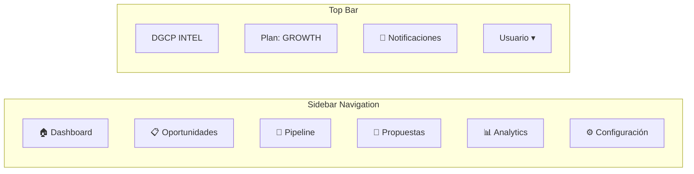
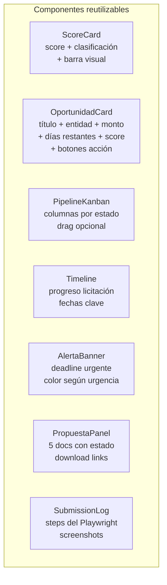

# E02 — Dashboard Wireframes

> DGCP INTEL | Etapa 2 — Diseño | 2026-03-13

---

## 1. Navegación Global



---

## 2. Página — Dashboard Principal

```
┌──────────────────────────────────────────────────────────────────┐
│  DGCP INTEL              Plan: GROWTH    🔔 3    Juan ▾          │
├────────────┬─────────────────────────────────────────────────────┤
│            │                                                      │
│  🏠 Home   │  Buenos días, Constructora Pérez                    │
│  📋 Opor.  │  Última actualización: hoy 2:00 PM                  │
│  🔄 Pipeline│                                                      │
│  📄 Props.  │  ┌──────────┐ ┌──────────┐ ┌──────────┐ ┌────────┐ │
│  📊 Analyt. │  │ Detectad │ │ Pipeline │ │ Aplicadas│ │ Ganadas│ │
│  ⚙️ Config  │  │  52      │ │  RD$143M │ │    6     │ │   1   │ │
│            │  │ este mes │ │ activo   │ │ este mes │ │ 16.6% │ │
│            │  └──────────┘ └──────────┘ └──────────┘ └────────┘ │
│            │                                                      │
│            │  ── Top Oportunidades Hoy ──────────────────────   │
│            │                                                      │
│            │  ⭐ 89  Rehab. Carretera SCB-Baní   RD$28.5M  22d  │
│            │         MOPC                          [PROPUESTA]   │
│            │                                                      │
│            │  ✅ 76  Construcción Escuela Mao      RD$12.1M  18d  │
│            │         Min. Educación                [PROPUESTA]   │
│            │                                                      │
│            │  ✅ 71  Redes Agua Potable SDO        RD$8.2M   14d  │
│            │         AACSD                          [PROPUESTA]   │
│            │                                                      │
│            │  ── Deadlines Urgentes ─────────────────────────   │
│            │                                                      │
│            │  ⚠️ Manto. Planta Eléctrica Santiago   3 días        │
│            │     Estado: PROPUESTA_LISTA    [APLICAR AHORA]     │
│            │                                                      │
│            │  ── Pipeline por Estado ────────────────────────   │
│            │                                                      │
│            │  DETECTADA(12) PREPARACION(2) APLICADA(4) EVAL(1) │
│            │  [████████░░░░░░░░░░░░░░░░░░░░░░░░░░░░] 52 total  │
│            │                                                      │
└────────────┴─────────────────────────────────────────────────────┘
```

---

## 3. Página — Oportunidades

```
┌──────────────────────────────────────────────────────────────────┐
│  📋 Oportunidades                                                │
│                                                                  │
│  [Buscar licitaciones...]  [Filtros ▾]  [Solo activas ✓]        │
│                                                                  │
│  Filtros activos: Score ≥65 | Activas | Obras                   │
│                                                                  │
│  ┌──────────────────────────────────────────────────────────┐   │
│  │ ⭐ 89  Rehabilitación Carretera San Cristóbal - Baní      │   │
│  │       MOPC · RD$28,500,000 · LPN · 22 días               │   │
│  │       UNSPSC: 72141000 — Construcción Carreteras         │   │
│  │       [PROPUESTA] [VER DETALLE] [DESCARTAR]              │   │
│  ├──────────────────────────────────────────────────────────┤   │
│  │ ✅ 76  Construcción Escuela Primaria Mao                  │   │
│  │       Min. Educación · RD$12,100,000 · LPN · 18 días     │   │
│  │       UNSPSC: 72152100 — Edificios Educativos            │   │
│  │       [PROPUESTA] [VER DETALLE] [DESCARTAR]              │   │
│  ├──────────────────────────────────────────────────────────┤   │
│  │ ✅ 71  Redes de Agua Potable Zona Norte SDO              │   │
│  │       AACSD · RD$8,200,000 · CP · 14 días               │   │
│  │       [PROPUESTA] [VER DETALLE] [DESCARTAR]              │   │
│  └──────────────────────────────────────────────────────────┘   │
│                                                                  │
│  Mostrando 1-20 de 52 oportunidades  [< 1 2 3 >]               │
└──────────────────────────────────────────────────────────────────┘
```

### Detalle de Oportunidad (modal / página)

```
┌──────────────────────────────────────────────────────────────────┐
│  ← Volver                              ⭐ Score: 89/100          │
│                                                                  │
│  Rehabilitación Carretera San Cristóbal - Baní                  │
│  ocid: ocds-b3wdp2-DGCP-2026-0895                               │
│                                                                  │
│  ┌──────────────┬────────────────────────────────────────────┐  │
│  │ DESGLOSE     │ 📊 Score Breakdown                         │  │
│  │ Capacidades  │ ████████████████████████░░░░░  25/30       │  │
│  │ Presupuesto  │ ████████████████████████████   20/20 ⭐    │  │
│  │ Tipo proceso │ ████████████████████           10/15       │  │
│  │ Tiempo       │ ████████████████████████████   15/15 ⭐    │  │
│  │ Entidad      │ ████████████████████           7/10        │  │
│  │ Keywords     │ ████████████████████████████   10/10       │  │
│  │              │                                            │  │
│  │ Win prob:    │ 18-25%                                     │  │
│  │ Margen est:  │ RD$4.2M – RD$6.3M                         │  │
│  └──────────────┴────────────────────────────────────────────┘  │
│                                                                  │
│  Entidad: MOPC         Monto: RD$28,500,000                      │
│  Modalidad: LPN        Deadline: 15 abr 2026 (22 días)          │
│  UNSPSC: 72141000      Estado: active                            │
│                                                                  │
│  📄 Documentos:                                                  │
│  • Pliego de Condiciones [Ver] [Descargar]                       │
│  • Especificaciones Técnicas [Ver] [Descargar]                   │
│                                                                  │
│  [GENERAR PROPUESTA IA]  [APLICAR AHORA]  [DESCARTAR]           │
└──────────────────────────────────────────────────────────────────┘
```

---

## 4. Página — Pipeline (Kanban)

```
┌──────────────────────────────────────────────────────────────────┐
│  🔄 Pipeline de Licitaciones                                     │
│                                                                  │
│  [Vista: Kanban ▾]  [Filtrar ▾]  [Este mes ▾]                  │
│                                                                  │
│  ┌──────────┐ ┌──────────┐ ┌──────────┐ ┌──────────┐ ┌───────┐ │
│  │DETECTADA │ │PREPARAC. │ │ APLICADA │ │EN EVALUA.│ │GANADA │ │
│  │    12    │ │    2     │ │    4     │ │    1     │ │   1   │ │
│  │──────────│ │──────────│ │──────────│ │──────────│ │───────│ │
│  │⭐89 Carr.│ │📝 Agua   │ │📤 Esc.  │ │⏳ Mto.  │ │✅ Puent│ │
│  │  SCB-Baní│ │  Potable │ │  Mao    │ │  Eléct. │ │  SDO  │ │
│  │ RD$28.5M │ │  RD$8.2M │ │ RD$12.1M│ │ RD$5.4M │ │RD$14M │ │
│  │  22 días │ │   3 días │ │ Enviada │ │ 40 días │ │ Ganado│ │
│  │──────────│ │──────────│ │──────────│ │         │ │       │ │
│  │✅76 Esc. │ │📝 Hosp. │ │📤 Alcant│ │         │ │       │ │
│  │  Mao    │ │  Azua   │ │  arlo   │ │         │ │       │ │
│  │ ...      │ │ ...      │ │ ...     │ │         │ │       │ │
│  └──────────┘ └──────────┘ └──────────┘ └──────────┘ └───────┘ │
└──────────────────────────────────────────────────────────────────┘
```

---

## 5. Página — Analytics

```
┌──────────────────────────────────────────────────────────────────┐
│  📊 Analytics                    [Este mes ▾] [Exportar ▾]      │
│                                                                  │
│  ┌─────────────────────────────────────────────────────────┐    │
│  │ Detección → Aplicación (conversión)                     │    │
│  │                                                         │    │
│  │ Detectadas  52                                          │    │
│  │ Evaluadas   ████████░░░░░░░░░░  18 (34%)               │    │
│  │ Propuestas  ████░░░░░░░░░░░░░░   8 (15%)               │    │
│  │ Aplicadas   ██░░░░░░░░░░░░░░░░   6 (11%)               │    │
│  │ Ganadas     █░░░░░░░░░░░░░░░░░   1 (16.6% de aplicadas)│    │
│  └─────────────────────────────────────────────────────────┘    │
│                                                                  │
│  ┌──────────────────────┐ ┌──────────────────────────────────┐  │
│  │ Por Entidad          │ │ Por Monto (RD$M)                 │  │
│  │ MOPC         45%     │ │  0-20M  ████████  38%           │  │
│  │ Municipios   28%     │ │ 20-50M  ██████    29%           │  │
│  │ Ministerios  18%     │ │ 50-100M ████      19%           │  │
│  │ Otros         9%     │ │  100M+  ███       14%           │  │
│  └──────────────────────┘ └──────────────────────────────────┘  │
│                                                                  │
│  ┌─────────────────────────────────────────────────────────┐    │
│  │ Tendencia Mensual (últimos 6 meses)                     │    │
│  │                                          *              │    │
│  │                              *          / \             │    │
│  │            *        *       / \        /   \            │    │
│  │     *     / \      / \     /   \      /     \           │    │
│    Oct  Nov   Dic   Ene   Feb   Mar                        │    │
│  │ Det: 20  25    30    38    45    52                     │    │
│  │ Apl:  1   2     3     4     5     6                     │    │
│  └─────────────────────────────────────────────────────────┘    │
└──────────────────────────────────────────────────────────────────┘
```

---

## 6. Página — Configuración (Wizard / Tabs)

```
┌──────────────────────────────────────────────────────────────────┐
│  ⚙️ Configuración de Empresa                                     │
│                                                                  │
│  [Empresa] [Alertas] [Credenciales RPE] [Plan] [Usuarios]       │
│                                                                  │
│  ── Tab: Empresa ─────────────────────────────────────────────  │
│                                                                  │
│  Nombre empresa: [Constructora Pérez S.R.L.          ]          │
│  RNC:            [1-32-XXXXX-X                        ]          │
│                                                                  │
│  Categorías UNSPSC (tu negocio):                                 │
│  [Buscar categorías...]                                          │
│  ✅ 72141000 — Autopistas y Carreteras         [✕]              │
│  ✅ 72151100 — Edificios Residenciales         [✕]              │
│  ✅ 72200000 — Servicios de Ingeniería         [✕]              │
│  [+ Agregar categoría]                                           │
│                                                                  │
│  Keywords adicionales:                                           │
│  [rehabilitación] [carretera] [vial] [pavimentación] [+]        │
│                                                                  │
│  Rango de presupuesto (sweet spot):                              │
│  Min: [RD$ 5,000,000 ]  Max: [RD$ 50,000,000]                  │
│                                                                  │
│  Score mínimo para alertar: [65] (0-100)                         │
│                                                                  │
│  [Guardar cambios]                                               │
│                                                                  │
│  ── Tab: Credenciales RPE ────────────────────────────────────  │
│                                                                  │
│  Las credenciales se almacenan cifradas con AES-256.            │
│  Solo son usadas para auto-submit al portal DGCP.               │
│                                                                  │
│  Usuario RPE: [empresa123              ]                         │
│  Password:    [••••••••               ]                          │
│                                                                  │
│  Estado: ✅ Credenciales guardadas — sesión activa               │
│  Última verificación: hoy 6:00 AM                                │
│                                                                  │
│  [Guardar y verificar]  [Eliminar credenciales]                  │
└──────────────────────────────────────────────────────────────────┘
```

---

## 7. Componentes UI Clave



---

## 8. Sistema de Colores

| Estado | Color | Uso |
|--------|-------|-----|
| EXCELENTE (≥80) | `#10b981` (verde) | Cards, badges |
| BUENA (65-79) | `#00d4ff` (cyan) | Cards, badges |
| REGULAR (50-64) | `#f59e0b` (amber) | Cards, badges |
| BAJA (<50) | `#94a3b8` (gris) | Cards, badges |
| DEADLINE URGENTE | `#ef4444` (rojo) | Alertas ≤2 días |
| DEADLINE PRÓXIMO | `#f59e0b` (amber) | Alertas 3-5 días |
| APLICADA | `#7c3aed` (púrpura) | Pipeline |
| GANADA | `#10b981` (verde brillante) | Pipeline |

---

*Anterior: [03_BOT_TELEGRAM.md](03_BOT_TELEGRAM.md)*
*Siguiente: [05_SEGURIDAD_RPE.md](05_SEGURIDAD_RPE.md)*
*JANUS — 2026-03-13*
