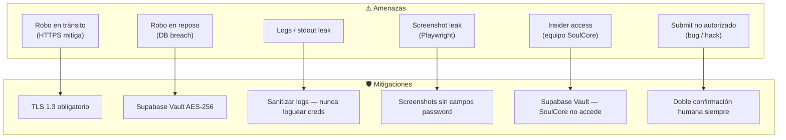
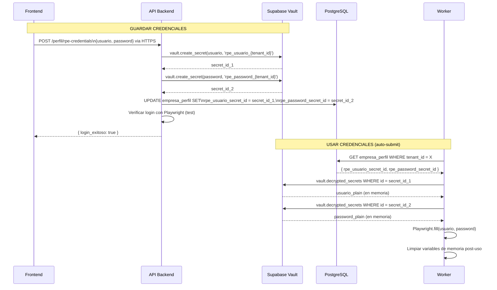
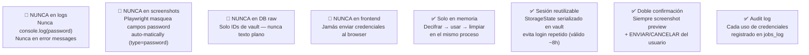

# E02 — Seguridad: Credenciales RPE

> DGCP INTEL | Etapa 2 — Diseño | 2026-03-13

---

## 1. Amenazas y Requerimientos

Las credenciales RPE son las más sensibles del sistema:
- Permiten sumir ofertas legalmente vinculantes de millones de RD$
- Acceso al portal gubernamental oficial
- Compromiso legal de la empresa



---

## 2. Arquitectura de Cifrado con Supabase Vault



---

## 3. Schema de Almacenamiento

```sql
-- Las credenciales NO están en empresa_perfil como texto
-- Están en Supabase Vault (extensión pgsodium)
-- empresa_perfil solo guarda los IDs de referencia

ALTER TABLE public.empresa_perfil
  ADD COLUMN rpe_usuario_secret_id UUID,  -- ref a vault.secrets
  ADD COLUMN rpe_password_secret_id UUID; -- ref a vault.secrets

-- Para obtener credenciales (solo service_role)
-- SELECT decrypted_secret FROM vault.decrypted_secrets WHERE id = $1;

-- Nadie excepto la service_role key puede leer vault.decrypted_secrets
-- La anon key y el JWT del usuario NO tienen acceso al vault
```

---

## 4. Reglas de Oro para Credenciales



---

## 5. Session Management de Playwright

```typescript
// browser/src/handlers/session.handler.ts

interface RPESession {
  tenantId: string
  storageState: PlaywrightStorageState
  expiresAt: Date
}

export async function getOrRefreshSession(tenantId: string): Promise<RPESession> {
  // 1. Verificar si hay sesión válida en DB
  const perfil = await db.empresa_perfil.findUnique({ where: { tenant_id: tenantId } })

  if (perfil.rpe_session_state && perfil.rpe_session_expires > new Date()) {
    return {
      tenantId,
      storageState: JSON.parse(perfil.rpe_session_state),
      expiresAt: perfil.rpe_session_expires
    }
  }

  // 2. No hay sesión válida → hacer login
  const credentials = await getCredentials(tenantId)  // del Vault
  const storageState = await doLogin(credentials)

  // 3. Guardar nueva sesión (serializada) en DB
  await db.empresa_perfil.update({
    where: { tenant_id: tenantId },
    data: {
      rpe_session_state: JSON.stringify(storageState),
      rpe_session_expires: new Date(Date.now() + 8 * 60 * 60 * 1000)  // 8h
    }
  })

  // 4. Limpiar credenciales de memoria
  credentials.usuario = ''
  credentials.password = ''

  return { tenantId, storageState, expiresAt: new Date(Date.now() + 8 * 60 * 60 * 1000) }
}

async function doLogin(creds: { usuario: string; password: string }): Promise<PlaywrightStorageState> {
  const browser = await chromium.launch({ headless: true })
  const context = await browser.newContext()
  const page = await context.newPage()

  await page.goto('https://comunidad.comprasdominicana.gob.do/STS/DGCP/Login.aspx')
  await page.fill('#usuario', creds.usuario)
  await page.fill('#password', creds.password)  // type=password — no en screenshots
  await page.click('#btnLogin')
  await page.waitForURL('**/dashboard**')

  const storageState = await context.storageState()
  await browser.close()
  return storageState
}
```

---

## 6. Otras Medidas de Seguridad del Sistema

### Rate Limiting (API)
```typescript
// Fastify rate limit
app.register(fastifyRateLimit, {
  global: true,
  max: 100,                  // 100 req/min por IP
  timeWindow: '1 minute',
  keyGenerator: (req) => req.user?.tenant_id ?? req.ip
})

// Endpoints críticos — más restrictivos
app.register(fastifyRateLimit, {
  max: 5,
  timeWindow: '1 hour',
  routes: ['/api/v1/*/aplicar', '/api/v1/*/propuesta']
})
```

### JWT y Multi-tenancy
```typescript
// Middleware — extraer tenant_id del JWT de Supabase
export async function tenantMiddleware(req: FastifyRequest, reply: FastifyReply) {
  const user = await supabase.auth.getUser(req.headers.authorization?.split(' ')[1])
  if (!user.data.user) return reply.status(401).send({ error: 'Unauthorized' })

  const userTenant = await db.user_tenants.findFirst({
    where: { user_id: user.data.user.id }
  })
  if (!userTenant) return reply.status(403).send({ error: 'No tenant assigned' })

  req.tenantId = userTenant.tenant_id
  req.userRol = userTenant.rol
}
```

### Plan Enforcement
```typescript
// Verificar límites según plan
export function checkPlanLimits(tenant: Tenant, action: string) {
  const limits = {
    starter: { propuestas_mes: 5, auto_submit: false, categorias: 1 },
    growth:  { propuestas_mes: 20, auto_submit: true, categorias: 3 },
    scale:   { propuestas_mes: 999, auto_submit: true, categorias: 999 }
  }
  const plan = limits[tenant.plan]

  if (action === 'auto_submit' && !plan.auto_submit) {
    throw new PlanLimitError('Auto-submit requiere plan GROWTH o superior')
  }
}
```

---

## 7. Checklist de Seguridad Pre-Submit (Playwright)

```typescript
// Verificaciones obligatorias antes de cualquier submit
export async function verificarPreSubmit(oportunidadId: string, tenantId: string) {
  const checks = {
    documentos_completos: false,
    credenciales_activas: false,
    deadline_vigente: false,
    plan_permite_submit: false,
    no_submit_duplicado: false
  }

  // 1. Verificar 8 documentos en Storage
  const propuestas = await db.propuestas.findMany({ where: { oportunidad_id: oportunidadId } })
  checks.documentos_completos = propuestas.length >= 4 && propuestas.every(p => p.status === 'ready')

  // 2. Verificar credenciales RPE
  const perfil = await db.empresa_perfil.findUnique({ where: { tenant_id: tenantId } })
  checks.credenciales_activas = !!perfil.rpe_usuario_secret_id && !!perfil.rpe_password_secret_id

  // 3. Verificar deadline no vencido
  const oportunidad = await db.oportunidades_tenant.findUnique({ where: { id: oportunidadId }, include: { licitacion: true } })
  checks.deadline_vigente = oportunidad.licitacion.tender_end > new Date()

  // 4. Verificar plan
  const tenant = await db.tenants.findUnique({ where: { id: tenantId } })
  checks.plan_permite_submit = ['growth', 'scale', 'enterprise'].includes(tenant.plan)

  // 5. Sin submit duplicado
  const existingSubmission = await db.submissions.findFirst({
    where: { oportunidad_id: oportunidadId, status: { in: ['submitted', 'confirmando'] } }
  })
  checks.no_submit_duplicado = !existingSubmission

  const allPassed = Object.values(checks).every(Boolean)
  if (!allPassed) throw new PreSubmitError('Verificación pre-submit fallida', checks)

  return checks
}
```

---

*Anterior: [04_DASHBOARD_WIREFRAMES.md](04_DASHBOARD_WIREFRAMES.md)*
*Siguiente: [06_CHK_02_VERIFICADO.md](06_CHK_02_VERIFICADO.md)*
*JANUS — 2026-03-13*
