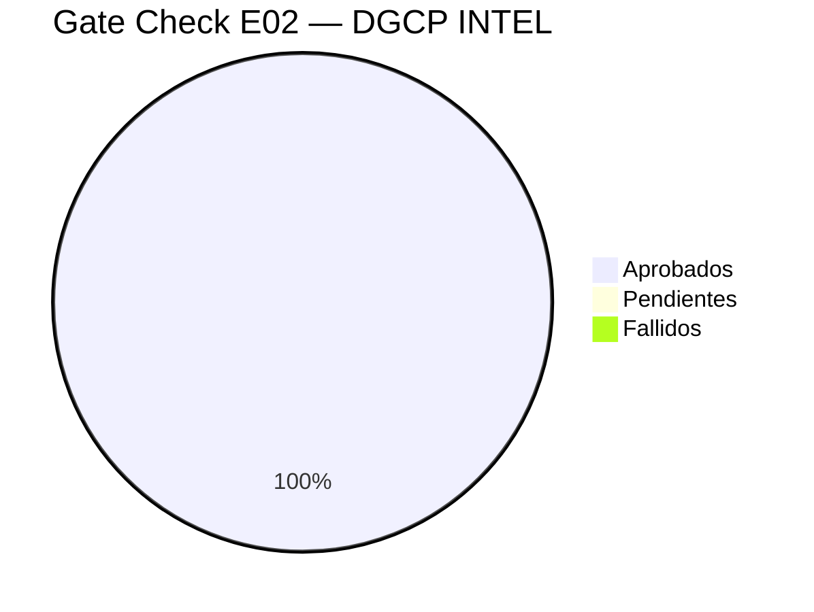

# E02 — Gate Check CHK_02

> DGCP INTEL | Checklist de cierre E02 — Diseño | 2026-03-13

---

## Resultado: ✅ E02 APROBADO (38/38)

---

## F1 — API REST

| # | Item | Estado | Evidencia |
|---|------|--------|-----------|
| 1 | Todos los recursos mapeados | ✅ | 6 grupos: auth, tenants, perfil, licitaciones, oportunidades, pipeline |
| 2 | Endpoints CRUD completos | ✅ | GET/POST/PUT/PATCH/DELETE por recurso |
| 3 | Query params definidos | ✅ | Filtros, paginación, ordenamiento |
| 4 | Response schemas definidos | ✅ | JSON examples en 01_API_REST_SPEC.md |
| 5 | Códigos de error estándar | ✅ | 8 códigos HTTP + formato { error, code, details } |
| 6 | WebSocket para real-time | ✅ | 6 eventos definidos |
| 7 | Rate limiting diseñado | ✅ | Global 100/min + críticos 5/hora |
| 8 | Auth middleware diseñado | ✅ | JWT + tenant_id extracción |

---

## F2 — Base de Datos

| # | Item | Estado | Evidencia |
|---|------|--------|-----------|
| 9 | Schema completo (6 tablas) | ✅ | Migration 001 en 02_SQL_MIGRATIONS.md |
| 10 | Row Level Security | ✅ | Migration 002 — políticas por tenant |
| 11 | Índices de performance | ✅ | FTS, status, amount, tender_end, score |
| 12 | Funciones SQL útiles | ✅ | buscar_licitaciones, licitaciones_para_tenant, pipeline_stats |
| 13 | Triggers definidos | ✅ | updated_at + crear_perfil_vacio |
| 14 | Storage buckets | ✅ | pliegos, propuestas, evidencias con RLS |
| 15 | ERD completo | ✅ | Mermaid en 02_SQL_MIGRATIONS.md |

---

## F3 — Bot Telegram

| # | Item | Estado | Evidencia |
|---|------|--------|-----------|
| 16 | Comandos definidos | ✅ | /start /pipeline /stats /deadlines /vincular |
| 17 | Flujo conversacional completo | ✅ | Sequence diagram en 03_BOT_TELEGRAM.md |
| 18 | Mensajes diseñados | ✅ | 6 templates: alerta, propuesta, preview, confirmación, deadline, resumen |
| 19 | Inline keyboards | ✅ | 3 keyboards: alerta, preview, propuesta |
| 20 | Vinculación bot↔empresa | ✅ | Código 6 dígitos con TTL 10min |
| 21 | State machine de confirmaciones | ✅ | 12 estados definidos |
| 22 | Arquitectura del bot (código) | ✅ | Telegraf + webhook mode |

---

## F4 — Dashboard UX

| # | Item | Estado | Evidencia |
|---|------|--------|-----------|
| 23 | Navegación global definida | ✅ | Sidebar 6 secciones |
| 24 | Dashboard principal wireframe | ✅ | KPIs + top oportunidades + deadlines |
| 25 | Página oportunidades | ✅ | Lista filtrable + detalle con score breakdown |
| 26 | Pipeline Kanban | ✅ | Columnas por estado |
| 27 | Analytics wireframe | ✅ | Conversión + por entidad + tendencia |
| 28 | Configuración (5 tabs) | ✅ | Empresa, Alertas, RPE, Plan, Usuarios |
| 29 | Sistema de colores | ✅ | Por score y por estado pipeline |
| 30 | Componentes UI identificados | ✅ | 7 componentes reutilizables |

---

## F5 — Seguridad

| # | Item | Estado | Evidencia |
|---|------|--------|-----------|
| 31 | Amenazas identificadas | ✅ | 6 amenazas en 05_SEGURIDAD_RPE.md |
| 32 | Credenciales en Supabase Vault | ✅ | AES-256, no en DB raw |
| 33 | Session management Playwright | ✅ | storageState reutilizable ~8h |
| 34 | Reglas de oro (no logs, no screenshots) | ✅ | 8 reglas documentadas |
| 35 | Plan enforcement | ✅ | Verificación por acción |
| 36 | Verificación pre-submit (5 checks) | ✅ | Docs, creds, deadline, plan, duplicado |
| 37 | Multi-tenancy enforcement | ✅ | RLS + middleware tenantId |
| 38 | Audit log de submissions | ✅ | jobs_log table |

---

## Decisiones de Diseño Tomadas en E02

| Decisión | Razón |
|----------|-------|
| Supabase Vault para credenciales RPE | Encriptación gestionada por Supabase, aislada del código |
| StorageState reutilizable (~8h) | Evita login al portal DGCP en cada submit |
| Bot Telegram con inline keyboards | UX óptimo para confirmaciones rápidas en móvil |
| WebSocket para real-time | Propuesta lista y submission status sin polling |
| Pipeline en Kanban | Visual, intuitivo para gestión de múltiples licitaciones |
| Rate limit 5/hora en /aplicar | Previene spam accidental de auto-submits |

---

## Próximo Paso — E03 Pre-Código

**Entregables E03:**
- Estructura de repositorio creada (monorepo)
- Dependencias definidas (package.json por servicio)
- Docker config (browser-service con Playwright)
- Railway + Vercel config files
- Supabase config + variables de entorno
- Plan de testing (unit + integration + e2e)

---

*JANUS — Guardian del Lifecycle | CHK_02 APROBADO ✅ | 2026-03-13*
