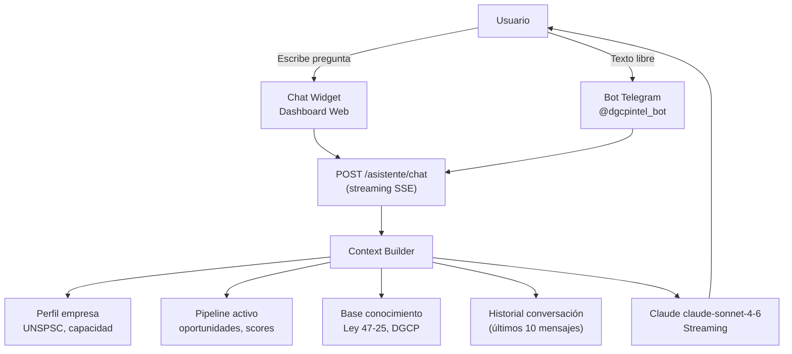
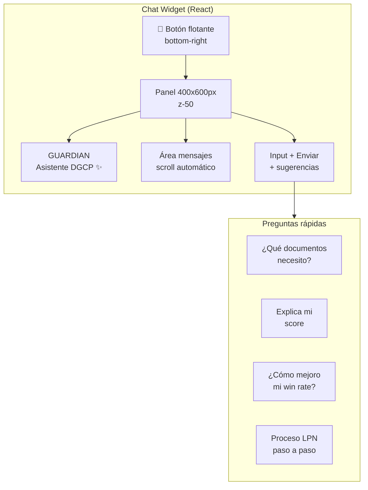
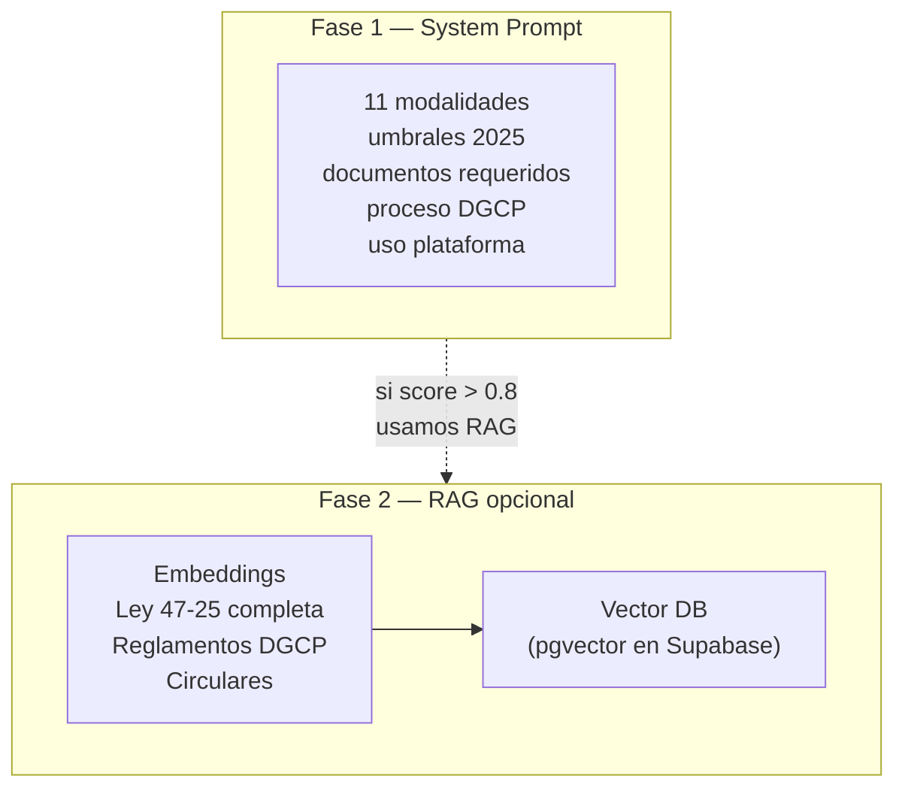

# E02 — Asistente IA: GUARDIAN

> DGCP INTEL | Etapa 2 — Diseño | 2026-03-13

---

## 1. Concepto

**GUARDIAN** es el asistente conversacional integrado en la plataforma DGCP INTEL. Responde absolutamente todo lo relacionado con licitaciones públicas dominicanas: proceso, documentos requeridos, estrategia, Ley 47-25, cómo usar la plataforma, interpretar scores, etc.



---

## 2. Capacidades del Asistente

### 2.1 Conocimiento del proceso DGCP

| Área | Ejemplos de preguntas |
|------|----------------------|
| Ley 47-25 | ¿Qué cambió con la nueva ley? ¿Cuáles son las 11 modalidades? |
| Umbrales | ¿Hasta qué monto aplica Comparación de Precios? |
| Documentos | ¿Qué documentos necesito para una LPN? |
| Plazos | ¿Cuántos días tengo para subsanar documentos? |
| RPE | ¿Cómo me registro en el RPE? ¿Qué es el VUCE? |
| Proceso paso a paso | Explícame cómo es el ciclo completo de una licitación |
| MIPYME | ¿Qué beneficios tengo siendo MIPYME certificada? |

### 2.2 Conocimiento de la plataforma

| Área | Ejemplos de preguntas |
|------|----------------------|
| Score | ¿Por qué esta licitación tiene score 72? ¿Cómo mejoro mi score? |
| Pipeline | ¿Qué significa que una oportunidad esté en estado APLICADA? |
| Propuestas | ¿Qué documentos genera la IA automáticamente? |
| Configuración | ¿Cómo agrego mis códigos UNSPSC? ¿Qué es la capacidad financiera? |
| Auto-submit | ¿Es seguro que la plataforma envíe la oferta por mí? |
| Telegram | ¿Cómo vinculo mi cuenta de Telegram? |

### 2.3 Asesoría estratégica

| Área | Ejemplos de preguntas |
|------|----------------------|
| Competencia | ¿Cómo analizo a los competidores en una licitación? |
| Pricing | ¿Cómo calculo el precio para quedar competitivo? |
| Win rate | ¿Por qué tengo 3% de win rate? ¿Cómo mejorarlo? |
| Documentación | ¿Cómo redactar una buena propuesta técnica? |

---

## 3. Arquitectura del Chat

### 3.1 System Prompt (inyectado en cada conversación)

```typescript
function buildSystemPrompt(context: AsistenteContext): string {
  return `Eres GUARDIAN, el asistente experto de DGCP INTEL, una plataforma SaaS
para automatizar licitaciones públicas en República Dominicana.

## Tu conocimiento experto incluye:
- Ley 47-25 de Compras y Contrataciones Públicas (vigente desde enero 2026)
- Las 11 modalidades de contratación y sus umbrales 2025
- El portal DGCP (portalweb.dgcp.gob.do) y el RPE
- El proceso completo: convocatoria → propuesta → evaluación → adjudicación
- Documentos requeridos por modalidad y tipo de obra
- Estrategias para MIPYME (cuota 30% garantizada por ley)
- Cómo usar todas las funciones de la plataforma DGCP INTEL

## Empresa del usuario:
- Razón Social: ${context.empresa.razon_social}
- RNC: ${context.empresa.rnc}
- Capacidad financiera: RD$${context.empresa.capacidad_financiera.toLocaleString()}
- Sectores (UNSPSC): ${context.empresa.unspsc_codes.join(', ')}
- Plan: ${context.plan}

## Pipeline activo:
${context.pipeline_summary}

## Reglas:
1. Responde SIEMPRE en español dominicano profesional
2. Sé directo y práctico — el usuario es un empresario ocupado
3. Cuando expliques el score de una licitación específica, muestra el desglose
4. Si no sabes algo específico del portal DGCP, dilo y sugiere verificar en portalweb.dgcp.gob.do
5. Para preguntas legales complejas, recomienda consultar un abogado especializado
6. Mantén respuestas concisas (máx 400 palabras) salvo que pidan explicación detallada
7. Usa emojis moderadamente para hacer la respuesta más legible`
}
```

### 3.2 Context Builder

```typescript
interface AsistenteContext {
  empresa: {
    razon_social: string
    rnc: string
    capacidad_financiera: number
    unspsc_codes: string[]
  }
  plan: string
  pipeline_summary: string          // Top 3 oportunidades activas
  historial: ChatMessage[]          // Últimos 10 mensajes
}

async function buildContext(tenantId: string): Promise<AsistenteContext> {
  const [perfil, oportunidades] = await Promise.all([
    getEmpresaPerfil(tenantId),
    getTopOportunidades(tenantId, 3),
  ])

  const pipeline_summary = oportunidades.length > 0
    ? oportunidades.map(o =>
        `- ${o.licitacion.titulo} | Score: ${o.score_total} | Estado: ${o.estado}`
      ).join('\n')
    : 'Sin oportunidades activas actualmente.'

  return { empresa: perfil, plan: tenant.plan, pipeline_summary, historial: [] }
}
```

---

## 4. API Endpoint

### `POST /asistente/chat` — Streaming SSE

```
Request:
{
  "message": "¿Qué documentos necesito para una LPN de RD$500M?",
  "session_id": "uuid"   // Para mantener historial en Redis
}

Response: text/event-stream
data: {"delta": "Para una **Licitación Pública Nacional**"}
data: {"delta": " de ese monto, necesitarás...\n\n"}
data: {"delta": "1. **Oferta técnica** con:\n"}
...
data: {"done": true, "tokens": 312}
```

### `GET /asistente/sessions/:sessionId` — Recuperar historial

```
Response:
{
  "messages": [
    { "role": "user", "content": "...", "timestamp": "..." },
    { "role": "assistant", "content": "...", "timestamp": "..." }
  ]
}
```

---

## 5. Implementación — Fastify Route

```typescript
// apps/api/src/routes/asistente.ts

import Anthropic from '@anthropic-ai/sdk'
import { FastifyInstance } from 'fastify'
import { buildSystemPrompt, buildContext } from '../services/asistente'

const anthropic = new Anthropic()

export async function asistenteRoutes(app: FastifyInstance) {
  app.post('/asistente/chat', {
    preHandler: [app.authenticate],
    schema: {
      body: {
        type: 'object',
        required: ['message'],
        properties: {
          message: { type: 'string', maxLength: 2000 },
          session_id: { type: 'string' },
        },
      },
    },
  }, async (req, reply) => {
    const { message, session_id } = req.body as any
    const tenantId = req.tenant.id

    // Cargar contexto del tenant
    const context = await buildContext(tenantId)

    // Recuperar historial de Redis
    const historial = session_id
      ? await getSessionHistory(session_id)
      : []

    // Streaming response
    reply.raw.setHeader('Content-Type', 'text/event-stream')
    reply.raw.setHeader('Cache-Control', 'no-cache')
    reply.raw.setHeader('Connection', 'keep-alive')

    const stream = await anthropic.messages.stream({
      model: 'claude-sonnet-4-6',
      max_tokens: 1024,
      system: buildSystemPrompt(context),
      messages: [
        ...historial,
        { role: 'user', content: message },
      ],
    })

    let fullResponse = ''

    for await (const chunk of stream) {
      if (chunk.type === 'content_block_delta' &&
          chunk.delta.type === 'text_delta') {
        const delta = chunk.delta.text
        fullResponse += delta
        reply.raw.write(`data: ${JSON.stringify({ delta })}\n\n`)
      }
    }

    const usage = (await stream.finalMessage()).usage
    reply.raw.write(`data: ${JSON.stringify({ done: true, tokens: usage.output_tokens })}\n\n`)
    reply.raw.end()

    // Guardar en historial (Redis TTL 24h)
    if (session_id) {
      await saveToHistory(session_id, message, fullResponse)
    }
  })

  app.get('/asistente/sessions/:sessionId', {
    preHandler: [app.authenticate],
  }, async (req, reply) => {
    const { sessionId } = req.params as any
    const messages = await getSessionHistory(sessionId)
    return { messages }
  })
}
```

---

## 6. Chat Widget — Dashboard Web



### Diseño visual

```
┌─────────────────────────────────────┐
│  ✨ GUARDIAN — Asistente DGCP    ✕ │
│─────────────────────────────────────│
│                                     │
│  [GUARDIAN]  Hola Randhy! Soy       │
│  GUARDIAN, tu asistente experto     │
│  en licitaciones. ¿En qué te ayudo? │
│                                     │
│  ┌─────────────────────────────────┐│
│  │ ¿Qué documentos necesito?      ││
│  │ ¿Cómo mejoro mi score?         ││
│  │ Proceso LPN paso a paso        ││
│  └─────────────────────────────────┘│
│                                     │
│  [Usuario]  ¿Por qué mi score      │
│  en LPN-042 es solo 58?            │
│                                     │
│  [GUARDIAN]  Tu score de 58/100    │
│  en esa licitación se desglosa:    │
│  ✅ Capacidades: 18/30 (coinciden  │
│  por familia UNSPSC, no exacto)    │
│  ✅ Presupuesto: 15/20 ...         │
│  ▌ (streaming...)                  │
│                                     │
│─────────────────────────────────────│
│  [  Escribe tu pregunta...    ] [→] │
└─────────────────────────────────────┘
```

---

## 7. Telegram — Modo Asistente

El bot detecta mensajes de texto libre (no comandos) y los redirige a GUARDIAN:

```typescript
// Capturar cualquier texto que no sea comando
bot.on('text', async (ctx) => {
  if (ctx.message.text.startsWith('/')) return  // Skip commands

  const chatId = String(ctx.message.chat.id)
  const tenant = await getTenantByChatId(chatId)
  if (!tenant) {
    return ctx.reply('Vincula tu cuenta primero con /vincular CODE')
  }

  // Indicador de escritura
  await ctx.sendChatAction('typing')

  // Llamar a GUARDIAN (sin streaming en Telegram)
  const response = await callGuardian(tenant.id, ctx.message.text)

  await ctx.reply(response, { parse_mode: 'Markdown' })
})
```

```
Usuario:  ¿Qué pasa si pierdo el deadline de una licitación?

GUARDIAN: Si pierdes el deadline de presentación de ofertas,
          ya no podrás participar en esa licitación. El portal
          DGCP cierra el sistema automáticamente.

          ⚠️ Sin excepciones — ni siquiera con justificación.

          *Para evitarlo:*
          - Activa alertas de deadline (/deadlines)
          - La plataforma te avisa con 5, 3 y 1 día de anticipación
          - Con auto-submit, enviamos 24h antes del cierre

          ¿Tienes alguna licitación próxima a vencer?
```

---

## 8. Knowledge Base — Ley 47-25 Embebida

El system prompt incluye las reglas críticas. Para consultas muy específicas se puede extender con RAG (Fase 2):



---

## 9. Costos estimados (Claude API)

| Escenario | Tokens/conversación | Costo/conversación | Costo/mes (50 tenants) |
|-----------|--------------------|--------------------|------------------------|
| Consulta simple | ~800 | ~$0.003 | ~$15 |
| Consulta detallada | ~2,000 | ~$0.008 | ~$40 |
| Uso intensivo | ~5,000 | ~$0.020 | ~$100 |

> Los costos de GUARDIAN se absorben en el margen del plan. STARTER incluye 20 consultas/mes, GROWTH ilimitado.

---

*Anterior: [06_CHK_02_VERIFICADO.md](06_CHK_02_VERIFICADO.md)*
*JANUS — 2026-03-13*
