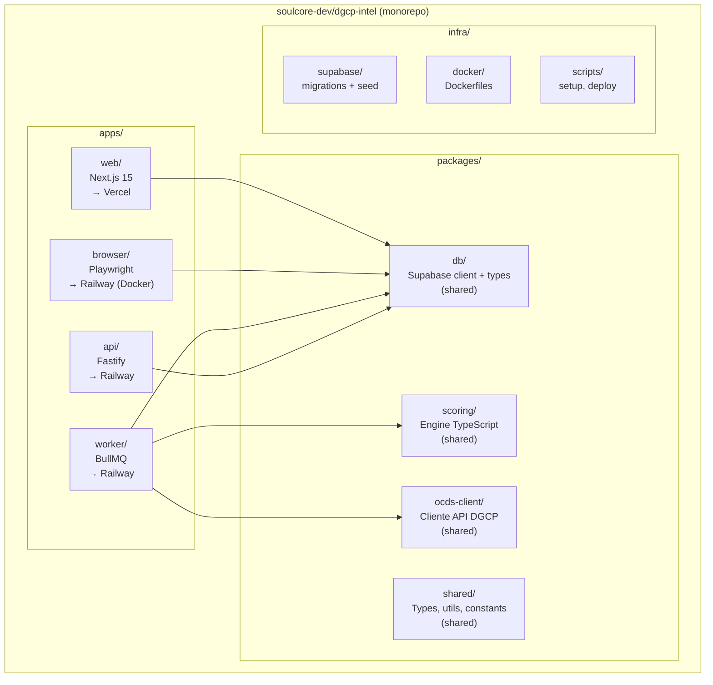
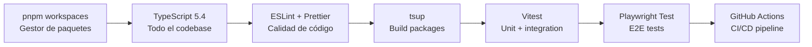

# E03 — Estructura del Repositorio

> DGCP INTEL | Etapa 3 — Pre-Código | 2026-03-13

---

## 1. Monorepo Overview



---

## 2. Árbol de Directorios Completo

```
dgcp-intel/
│
├── apps/
│   │
│   ├── web/                          # Next.js 15 — Vercel
│   │   ├── app/
│   │   │   ├── (auth)/
│   │   │   │   ├── login/page.tsx
│   │   │   │   └── signup/page.tsx
│   │   │   ├── (dashboard)/
│   │   │   │   ├── layout.tsx        # Sidebar + topbar
│   │   │   │   ├── page.tsx          # Dashboard home
│   │   │   │   ├── oportunidades/
│   │   │   │   │   ├── page.tsx      # Lista filtrable
│   │   │   │   │   └── [ocid]/
│   │   │   │   │       └── page.tsx  # Detalle
│   │   │   │   ├── pipeline/
│   │   │   │   │   └── page.tsx      # Kanban
│   │   │   │   ├── propuestas/
│   │   │   │   │   └── page.tsx
│   │   │   │   ├── analytics/
│   │   │   │   │   └── page.tsx
│   │   │   │   └── config/
│   │   │   │       └── page.tsx      # Wizard 5 tabs
│   │   │   ├── api/                  # API routes Next.js (minimal)
│   │   │   │   └── webhooks/
│   │   │   │       └── telegram/route.ts
│   │   │   └── layout.tsx
│   │   ├── components/
│   │   │   ├── ui/                   # shadcn/ui
│   │   │   ├── oportunidad-card.tsx
│   │   │   ├── score-card.tsx
│   │   │   ├── pipeline-kanban.tsx
│   │   │   ├── score-breakdown.tsx
│   │   │   └── deadline-alert.tsx
│   │   ├── lib/
│   │   │   ├── supabase/
│   │   │   │   ├── client.ts         # Browser client
│   │   │   │   └── server.ts         # Server client (RSC)
│   │   │   └── api-client.ts         # Fetch wrapper → API backend
│   │   ├── next.config.ts
│   │   ├── package.json
│   │   └── .env.local.example
│   │
│   ├── api/                          # Fastify API — Railway
│   │   ├── src/
│   │   │   ├── index.ts              # Entry point
│   │   │   ├── routes/
│   │   │   │   ├── perfil.routes.ts
│   │   │   │   ├── licitaciones.routes.ts
│   │   │   │   ├── oportunidades.routes.ts
│   │   │   │   ├── pipeline.routes.ts
│   │   │   │   └── admin.routes.ts
│   │   │   ├── middleware/
│   │   │   │   ├── auth.middleware.ts
│   │   │   │   ├── tenant.middleware.ts
│   │   │   │   └── plan.middleware.ts
│   │   │   ├── services/
│   │   │   │   ├── vault.service.ts  # Supabase Vault
│   │   │   │   └── queue.service.ts  # BullMQ enqueue
│   │   │   └── ws/
│   │   │       └── events.ts         # WebSocket handlers
│   │   ├── package.json
│   │   ├── tsconfig.json
│   │   └── .env.example
│   │
│   ├── worker/                       # BullMQ Workers — Railway
│   │   ├── src/
│   │   │   ├── index.ts              # Entry — registrar todos los workers
│   │   │   ├── queues/
│   │   │   │   └── index.ts          # Definición de queues
│   │   │   ├── processors/
│   │   │   │   ├── scan.processor.ts     # Poll OCDS API
│   │   │   │   ├── score.processor.ts    # Scoring por tenant
│   │   │   │   ├── alert.processor.ts    # Telegram alerts
│   │   │   │   ├── propose.processor.ts  # Claude → docs
│   │   │   │   └── submit.processor.ts   # Playwright trigger
│   │   │   ├── services/
│   │   │   │   ├── telegram.service.ts
│   │   │   │   ├── claude.service.ts
│   │   │   │   └── pdf.service.ts        # Markdown → PDF
│   │   │   └── cron/
│   │   │       └── scheduler.ts          # Cron jobs 6AM/2PM/10PM
│   │   ├── package.json
│   │   ├── tsconfig.json
│   │   └── .env.example
│   │
│   └── browser/                      # Playwright Service — Railway (Docker)
│       ├── src/
│       │   ├── index.ts              # Fastify micro-server
│       │   ├── handlers/
│       │   │   ├── login.handler.ts
│       │   │   ├── download.handler.ts
│       │   │   └── submit.handler.ts
│       │   ├── utils/
│       │   │   ├── session.utils.ts  # storageState management
│       │   │   └── screenshot.utils.ts
│       │   └── types.ts
│       ├── Dockerfile                # mcr.microsoft.com/playwright
│       ├── package.json
│       ├── tsconfig.json
│       └── .env.example
│
├── packages/
│   │
│   ├── scoring/                      # Engine compartido
│   │   ├── src/
│   │   │   ├── index.ts
│   │   │   ├── components/
│   │   │   │   ├── capacidades.ts
│   │   │   │   ├── presupuesto.ts
│   │   │   │   ├── tipo-proceso.ts
│   │   │   │   ├── tiempo.ts
│   │   │   │   ├── entidad.ts
│   │   │   │   └── keywords.ts
│   │   │   └── engine.ts             # calcularScore()
│   │   └── package.json
│   │
│   ├── ocds-client/                  # Cliente API DGCP
│   │   ├── src/
│   │   │   ├── index.ts
│   │   │   ├── ocds.client.ts        # api.dgcp.gob.do/api/
│   │   │   ├── dgcp.client.ts        # datosabiertos.dgcp.gob.do
│   │   │   └── types.ts              # OCDS types
│   │   └── package.json
│   │
│   ├── db/                           # Supabase client + tipos generados
│   │   ├── src/
│   │   │   ├── index.ts
│   │   │   ├── client.ts             # createClient()
│   │   │   └── types.ts              # supabase gen types
│   │   └── package.json
│   │
│   └── shared/                       # Types, constantes
│       ├── src/
│       │   ├── types/
│       │   │   ├── licitacion.types.ts
│       │   │   ├── oportunidad.types.ts
│       │   │   ├── scoring.types.ts
│       │   │   └── tenant.types.ts
│       │   ├── constants/
│       │   │   ├── unspsc.constants.ts
│       │   │   ├── modality.constants.ts
│       │   │   └── pipeline-states.ts
│       │   └── index.ts
│       └── package.json
│
├── supabase/
│   ├── config.toml
│   ├── migrations/
│   │   ├── 001_initial_schema.sql
│   │   ├── 002_rls_policies.sql
│   │   ├── 003_functions.sql
│   │   ├── 004_triggers.sql
│   │   └── 005_storage.sql
│   └── seed/
│       └── seed.sql                  # UNSPSC codes + dev data
│
├── docker/
│   └── browser/
│       └── Dockerfile
│
├── scripts/
│   ├── setup.sh                      # Setup inicial del monorepo
│   └── gen-types.sh                  # supabase gen types
│
├── package.json                      # Root — workspaces
├── pnpm-workspace.yaml
├── tsconfig.base.json
├── .env.example
├── .gitignore
└── README.md
```

---

## 3. Toolchain



---

*Siguiente: [02_PACKAGES_JSON.md](02_PACKAGES_JSON.md)*
*JANUS — 2026-03-13*
