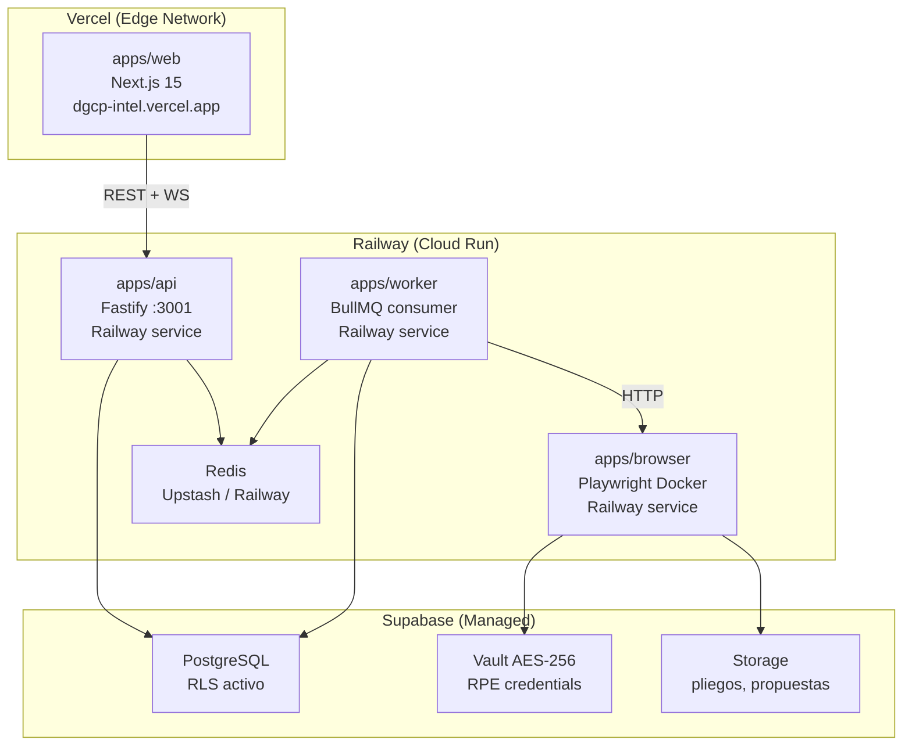
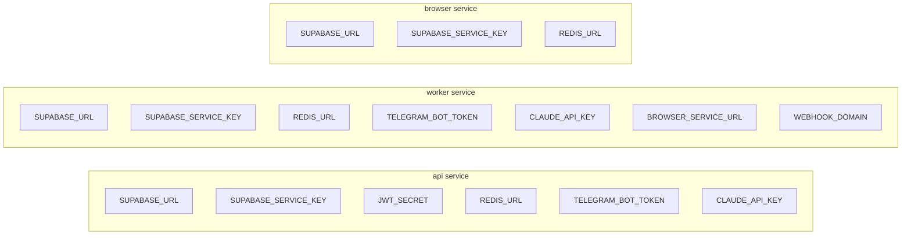

# E03 — Docker + Railway + Vercel Config

> DGCP INTEL | Etapa 3 — Pre-Código | 2026-03-13

---

## 1. Arquitectura de Deployment



---

## 2. Dockerfiles

### apps/api — `Dockerfile`

```dockerfile
FROM node:20-alpine AS base
RUN corepack enable && corepack prepare pnpm@9.4.0 --activate

# Deps stage
FROM base AS deps
WORKDIR /app
COPY pnpm-workspace.yaml package.json pnpm-lock.yaml ./
COPY packages/shared/package.json ./packages/shared/
COPY packages/db/package.json ./packages/db/
COPY packages/scoring/package.json ./packages/scoring/
COPY packages/ocds-client/package.json ./packages/ocds-client/
COPY apps/api/package.json ./apps/api/
RUN pnpm install --frozen-lockfile --filter @dgcp/api...

# Build stage
FROM deps AS builder
COPY packages/ ./packages/
COPY apps/api/ ./apps/api/
RUN pnpm --filter @dgcp/api... build

# Runner stage
FROM node:20-alpine AS runner
WORKDIR /app
ENV NODE_ENV=production
COPY --from=builder /app/apps/api/dist ./dist
COPY --from=builder /app/node_modules ./node_modules
EXPOSE 3001
CMD ["node", "dist/index.js"]
```

### apps/worker — `Dockerfile`

```dockerfile
FROM node:20-alpine AS base
RUN corepack enable && corepack prepare pnpm@9.4.0 --activate

FROM base AS deps
WORKDIR /app
COPY pnpm-workspace.yaml package.json pnpm-lock.yaml ./
COPY packages/*/package.json ./packages/
COPY apps/worker/package.json ./apps/worker/
RUN pnpm install --frozen-lockfile --filter @dgcp/worker...

FROM deps AS builder
COPY packages/ ./packages/
COPY apps/worker/ ./apps/worker/
RUN pnpm --filter @dgcp/worker... build

FROM node:20-alpine AS runner
WORKDIR /app
ENV NODE_ENV=production
COPY --from=builder /app/apps/worker/dist ./dist
COPY --from=builder /app/node_modules ./node_modules
CMD ["node", "dist/index.js"]
```

### apps/browser — `Dockerfile` (Playwright)

```dockerfile
# Base con Playwright y Chromium pre-instalado
FROM mcr.microsoft.com/playwright:v1.45.2-jammy AS base
RUN npm install -g pnpm@9.4.0

FROM base AS deps
WORKDIR /app
COPY pnpm-workspace.yaml package.json pnpm-lock.yaml ./
COPY packages/*/package.json ./packages/
COPY apps/browser/package.json ./apps/browser/
RUN pnpm install --frozen-lockfile --filter @dgcp/browser...

FROM deps AS builder
COPY packages/ ./packages/
COPY apps/browser/ ./apps/browser/
RUN pnpm --filter @dgcp/browser... build

FROM mcr.microsoft.com/playwright:v1.45.2-jammy AS runner
WORKDIR /app
ENV NODE_ENV=production
ENV PLAYWRIGHT_BROWSERS_PATH=/ms-playwright
COPY --from=builder /app/apps/browser/dist ./dist
COPY --from=builder /app/node_modules ./node_modules
EXPOSE 3002
CMD ["node", "dist/index.js"]
```

---

## 3. Railway Config

### `railway.toml` (raíz del monorepo)

```toml
[build]
builder = "DOCKERFILE"

[[services]]
name = "api"
source = "apps/api"
dockerfile = "apps/api/Dockerfile"

  [services.deploy]
  startCommand = "node dist/index.js"
  healthcheckPath = "/health"
  healthcheckTimeout = 30
  numReplicas = 1

  [[services.variables]]
  name = "PORT"
  value = "3001"

[[services]]
name = "worker"
source = "apps/worker"
dockerfile = "apps/worker/Dockerfile"

  [services.deploy]
  startCommand = "node dist/index.js"
  numReplicas = 1

[[services]]
name = "browser"
source = "apps/browser"
dockerfile = "apps/browser/Dockerfile"

  [services.deploy]
  startCommand = "node dist/index.js"
  healthcheckPath = "/health"
  healthcheckTimeout = 60
  numReplicas = 1

  [[services.variables]]
  name = "PORT"
  value = "3002"
```

### Variables Railway por servicio



---

## 4. Vercel Config

### `vercel.json` (apps/web)

```json
{
  "framework": "nextjs",
  "buildCommand": "cd ../.. && pnpm --filter @dgcp/web build",
  "installCommand": "cd ../.. && pnpm install",
  "outputDirectory": ".next",
  "env": {
    "NEXT_PUBLIC_SUPABASE_URL": "@supabase-url",
    "NEXT_PUBLIC_SUPABASE_ANON_KEY": "@supabase-anon-key",
    "NEXT_PUBLIC_API_URL": "@api-url"
  }
}
```

### `.env.example` (apps/web)

```env
# Supabase
NEXT_PUBLIC_SUPABASE_URL=https://xxxx.supabase.co
NEXT_PUBLIC_SUPABASE_ANON_KEY=eyJ...

# API Backend
NEXT_PUBLIC_API_URL=https://api.dgcp-intel.railway.app

# Solo servidor (no NEXT_PUBLIC)
SUPABASE_SERVICE_KEY=eyJ...
```

---

## 5. GitHub Actions CI/CD

### `.github/workflows/ci.yml`

```yaml
name: CI

on:
  push:
    branches: [main, develop]
  pull_request:
    branches: [main]

jobs:
  lint-typecheck:
    runs-on: ubuntu-latest
    steps:
      - uses: actions/checkout@v4
      - uses: pnpm/action-setup@v3
        with:
          version: 9.4.0
      - uses: actions/setup-node@v4
        with:
          node-version: 20
          cache: pnpm
      - run: pnpm install --frozen-lockfile
      - run: pnpm lint
      - run: pnpm typecheck

  test-unit:
    runs-on: ubuntu-latest
    needs: lint-typecheck
    steps:
      - uses: actions/checkout@v4
      - uses: pnpm/action-setup@v3
        with:
          version: 9.4.0
      - uses: actions/setup-node@v4
        with:
          node-version: 20
          cache: pnpm
      - run: pnpm install --frozen-lockfile
      - run: pnpm test

  test-e2e:
    runs-on: ubuntu-latest
    needs: test-unit
    steps:
      - uses: actions/checkout@v4
      - uses: pnpm/action-setup@v3
        with:
          version: 9.4.0
      - uses: actions/setup-node@v4
        with:
          node-version: 20
          cache: pnpm
      - run: pnpm install --frozen-lockfile
      - run: pnpm --filter @dgcp/browser exec playwright install --with-deps chromium
      - run: pnpm --filter @dgcp/browser test
        env:
          SUPABASE_URL: ${{ secrets.SUPABASE_URL }}
          SUPABASE_SERVICE_KEY: ${{ secrets.SUPABASE_SERVICE_KEY }}

  deploy-railway:
    runs-on: ubuntu-latest
    needs: [test-unit]
    if: github.ref == 'refs/heads/main'
    steps:
      - uses: actions/checkout@v4
      - name: Deploy to Railway
        run: npx @railway/cli up --service api --service worker --service browser
        env:
          RAILWAY_TOKEN: ${{ secrets.RAILWAY_TOKEN }}
```

---

## 6. Supabase Local Dev

### `supabase/config.toml`

```toml
[api]
port = 54321
schemas = ["public", "storage", "graphql_public"]
extra_search_path = ["public", "extensions"]
max_rows = 1000

[db]
port = 54322
shadow_port = 54320
major_version = 15

[studio]
port = 54323

[inbucket]
port = 54324

[storage]
file_size_limit = "50MiB"

[auth]
site_url = "http://localhost:3000"
additional_redirect_urls = ["https://dgcp-intel.vercel.app"]
jwt_expiry = 3600

[auth.email]
enable_signup = true
double_confirm_changes = true
enable_confirmations = false
```

### Comandos locales

```bash
# Iniciar Supabase local
supabase start

# Aplicar migraciones
supabase db push

# Generar tipos TypeScript
pnpm db:generate

# Resetear DB local
supabase db reset

# Ver estado
supabase status
```

---

## 7. Costos Estimados (Producción)

| Servicio | Plan | Costo/mes |
|----------|------|-----------|
| Vercel | Pro | $20 |
| Railway (3 services) | Starter → Pro | $20-50 |
| Supabase | Pro | $25 |
| Redis (Upstash) | Pay-per-use | ~$5-15 |
| Claude API (tokens) | Variable | $30-80 |
| **Total** | | **~$100-190/mes** |

> Con 10 tenants en STARTER ($3,500 MRR = ~$700 USD), el margen de infraestructura es >70%.

---

*Anterior: [02_PACKAGES_JSON.md](02_PACKAGES_JSON.md)*
*Siguiente: [04_PLAN_TESTING.md](04_PLAN_TESTING.md)*
*JANUS — 2026-03-13*
