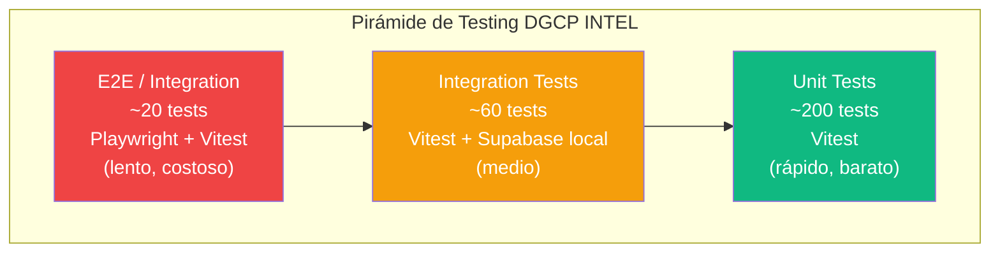
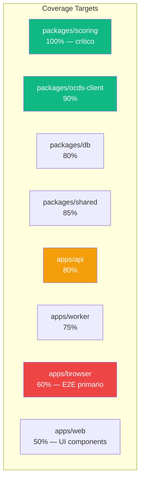

# E03 — Plan de Testing

> DGCP INTEL | Etapa 3 — Pre-Código | 2026-03-13

---

## 1. Pirámide de Testing



---

## 2. Tests Unitarios — `packages/scoring`

El Scoring Engine es el componente más crítico. Coverage objetivo: **100%**.

```typescript
// packages/scoring/src/__tests__/scoring.test.ts

import { describe, it, expect } from 'vitest'
import { calcularScore, ScoreInput } from '../scoring'

describe('Scoring Engine — Componente Capacidades (30pts)', () => {
  it('coincidencia exacta UNSPSC → 30 pts', () => {
    const input: ScoreInput = {
      licitacion: {
        unspsc: ['72141000'],
        montoEstimado: 28_500_000,
        modalidad: 'LPN',
        diasRestantes: 22,
        entidad: { nombre: 'MOPC', confiabilidad: 0.85 },
        keywords: ['rehabilitación', 'carretera'],
      },
      empresa: {
        unspsc: ['72141000', '72142000'],
        capacidadFinanciera: 50_000_000,
        keywords: ['carretera', 'obras', 'pavimentación', 'rehabilitación'],
        entidadesPreferidas: ['MOPC', 'MOPT'],
        historico: { ganadas: 3, aplicadas: 12 },
      },
    }
    const result = calcularScore(input)
    expect(result.componentes.capacidades).toBe(30)
  })

  it('sin coincidencia UNSPSC → 0 pts', () => {
    const input = buildInput({ empresaUnspsc: ['80101500'] }) // IT services
    const result = calcularScore(input)
    expect(result.componentes.capacidades).toBe(0)
    expect(result.total).toBeLessThan(40)
  })
})

describe('Scoring Engine — Componente Presupuesto (20pts)', () => {
  it('sweet spot (0.5-0.8x capacidad) → 20 pts', () => {
    // capacidad: 50M, licitacion: 28.5M → ratio 0.57 → sweet spot
    const result = calcularScore(buildInput({ monto: 28_500_000, capacidad: 50_000_000 }))
    expect(result.componentes.presupuesto).toBe(20)
  })

  it('por encima de capacidad → 0 pts', () => {
    const result = calcularScore(buildInput({ monto: 60_000_000, capacidad: 50_000_000 }))
    expect(result.componentes.presupuesto).toBe(0)
  })

  it('muy pequeño (< 0.1x) → 5 pts', () => {
    const result = calcularScore(buildInput({ monto: 1_000_000, capacidad: 50_000_000 }))
    expect(result.componentes.presupuesto).toBe(5)
  })
})

describe('Scoring Engine — Componente Tiempo (15pts)', () => {
  it('15-30 días → 15 pts (óptimo)', () => {
    const result = calcularScore(buildInput({ diasRestantes: 22 }))
    expect(result.componentes.tiempo).toBe(15)
  })

  it('< 5 días → 0 pts (imposible)', () => {
    const result = calcularScore(buildInput({ diasRestantes: 3 }))
    expect(result.componentes.tiempo).toBe(0)
  })

  it('> 60 días → 8 pts (muy lejano)', () => {
    const result = calcularScore(buildInput({ diasRestantes: 90 }))
    expect(result.componentes.tiempo).toBe(8)
  })
})

describe('Scoring Engine — Score Total', () => {
  it('oportunidad excelente → ≥ 80 pts', () => {
    const result = calcularScore(buildOptimalInput())
    expect(result.total).toBeGreaterThanOrEqual(80)
    expect(result.categoria).toBe('EXCELENTE')
  })

  it('umbral mínimo alerta → ≥ 60 pts', () => {
    // Verificar que se genera alerta con score ≥ 60
    const result = calcularScore(buildGoodInput())
    expect(result.total).toBeGreaterThanOrEqual(60)
    expect(result.generarAlerta).toBe(true)
  })

  it('oportunidad mala → no genera alerta', () => {
    const result = calcularScore(buildBadInput())
    expect(result.total).toBeLessThan(60)
    expect(result.generarAlerta).toBe(false)
  })
})
```

---

## 3. Tests Unitarios — `packages/ocds-client`

```typescript
// packages/ocds-client/src/__tests__/client.test.ts

import { describe, it, expect, beforeAll, afterAll } from 'vitest'
import { setupServer } from 'msw/node'
import { http, HttpResponse } from 'msw'
import { OCDSClient } from '../client'

const server = setupServer(
  http.get('https://api.dgcp.gob.do/api/releases', ({ request }) => {
    const url = new URL(request.url)
    const page = url.searchParams.get('page') ?? '1'
    return HttpResponse.json(mockOCDSResponse(parseInt(page)))
  })
)

beforeAll(() => server.listen())
afterAll(() => server.close())

describe('OCDSClient', () => {
  it('pagina correctamente (1000 por página)', async () => {
    const client = new OCDSClient({ baseUrl: 'https://api.dgcp.gob.do/api' })
    const releases = await client.getReleases({ page: 1, perPage: 1000 })
    expect(releases.data).toHaveLength(1000)
    expect(releases.total).toBeGreaterThan(0)
  })

  it('filtra por fecha correctamente', async () => {
    const client = new OCDSClient()
    const releases = await client.getReleasesFrom(new Date('2026-03-01'))
    releases.data.forEach(r => {
      expect(new Date(r.date)).toBeGreaterThanOrEqual(new Date('2026-03-01'))
    })
  })

  it('retry en rate limit (429)', async () => {
    server.use(
      http.get('https://api.dgcp.gob.do/api/releases', () => {
        return HttpResponse.json({ error: 'rate limit' }, { status: 429 })
      })
    )
    // Debe reintentar 3 veces con backoff exponencial
    await expect(client.getReleases({ page: 1 })).rejects.toThrow('Rate limit exceeded')
  })
})
```

---

## 4. Tests de Integración — API REST

```typescript
// apps/api/src/__tests__/oportunidades.test.ts

import { describe, it, expect, beforeAll, afterAll } from 'vitest'
import { createApp } from '../app'
import { createTestTenant, createTestToken, cleanupTest } from './helpers'

describe('GET /oportunidades', () => {
  let app: FastifyInstance
  let token: string
  let tenantId: string

  beforeAll(async () => {
    app = await createApp({ testing: true })
    await app.ready()
    const tenant = await createTestTenant()
    tenantId = tenant.id
    token = createTestToken(tenantId)
  })

  afterAll(async () => {
    await cleanupTest(tenantId)
    await app.close()
  })

  it('devuelve lista paginada de oportunidades del tenant', async () => {
    const response = await app.inject({
      method: 'GET',
      url: '/oportunidades?estado=DETECTADA&limit=20&offset=0',
      headers: { Authorization: `Bearer ${token}` },
    })
    expect(response.statusCode).toBe(200)
    const body = response.json()
    expect(body).toHaveProperty('data')
    expect(body).toHaveProperty('total')
    expect(body).toHaveProperty('hasMore')
    expect(Array.isArray(body.data)).toBe(true)
  })

  it('RLS: tenant A no ve oportunidades de tenant B', async () => {
    const tenantB = await createTestTenant()
    const tokenB = createTestToken(tenantB.id)
    // Insertar oportunidad para tenant B
    await insertTestOportunidad(tenantB.id)

    // Tenant A no debe verla
    const response = await app.inject({
      method: 'GET',
      url: '/oportunidades',
      headers: { Authorization: `Bearer ${token}` },
    })
    const body = response.json()
    expect(body.data.every((o: any) => o.tenant_id === tenantId)).toBe(true)

    await cleanupTest(tenantB.id)
  })

  it('rechaza request sin token → 401', async () => {
    const response = await app.inject({
      method: 'GET',
      url: '/oportunidades',
    })
    expect(response.statusCode).toBe(401)
  })

  it('rate limit: 100 req/min → 429 al 101', async () => {
    const requests = Array.from({ length: 101 }, () =>
      app.inject({
        method: 'GET',
        url: '/oportunidades',
        headers: { Authorization: `Bearer ${token}` },
      })
    )
    const responses = await Promise.all(requests)
    const tooMany = responses.filter(r => r.statusCode === 429)
    expect(tooMany.length).toBeGreaterThan(0)
  })
})

describe('POST /oportunidades/:id/propuesta', () => {
  it('encola job de generación de propuesta', async () => {
    const response = await app.inject({
      method: 'POST',
      url: `/oportunidades/${testOportunidadId}/propuesta`,
      headers: { Authorization: `Bearer ${token}` },
    })
    expect(response.statusCode).toBe(202)
    expect(response.json()).toHaveProperty('jobId')
  })

  it('rate limit /propuesta: 5/hora por tenant → rechaza al 6', async () => {
    // Crear 5 requests
    for (let i = 0; i < 5; i++) {
      await app.inject({
        method: 'POST',
        url: `/oportunidades/${testOportunidadId}/propuesta`,
        headers: { Authorization: `Bearer ${token}` },
      })
    }
    const sixthResponse = await app.inject({
      method: 'POST',
      url: `/oportunidades/${testOportunidadId}/propuesta`,
      headers: { Authorization: `Bearer ${token}` },
    })
    expect(sixthResponse.statusCode).toBe(429)
  })
})
```

---

## 5. Tests E2E — Browser Service (Playwright)

```typescript
// apps/browser/src/__tests__/dgcp-portal.test.ts

import { test, expect } from '@playwright/test'
import { BrowserService } from '../service'

test.describe('DGCP Portal — Browser Service', () => {
  let service: BrowserService

  test.beforeAll(async () => {
    service = new BrowserService({ headless: true })
    await service.init()
  })

  test.afterAll(async () => {
    await service.destroy()
  })

  test('login con credenciales RPE válidas', async () => {
    // TEST EN STAGING SOLAMENTE — nunca en prod
    const session = await service.login({
      rnc: process.env.TEST_RNC!,
      password: process.env.TEST_RPE_PASSWORD!,
    })
    expect(session.authenticated).toBe(true)
    expect(session.storageState).toBeTruthy()
  })

  test('detectar licitaciones públicas sin login', async () => {
    // Portal público — no requiere auth
    const licitaciones = await service.scrapPublicListings({
      page: 1,
      limit: 10,
    })
    expect(licitaciones.length).toBeGreaterThan(0)
    expect(licitaciones[0]).toHaveProperty('numero_procedimiento')
  })

  test('captura screenshot de formulario correctamente', async ({ page }) => {
    // Navegar a formulario de prueba
    await page.goto('https://portalweb.dgcp.gob.do/test/form')
    const screenshot = await service.captureFormScreenshot(page)
    expect(screenshot).toBeInstanceOf(Buffer)
    expect(screenshot.length).toBeGreaterThan(1000)
  })
})
```

---

## 6. Tests de BullMQ Workers

```typescript
// apps/worker/src/__tests__/scan.worker.test.ts

import { describe, it, expect, vi, beforeEach } from 'vitest'
import { Queue, Worker } from 'bullmq'
import { createScanProcessor } from '../processors/scan'

describe('Scan Worker', () => {
  let queue: Queue
  let worker: Worker

  beforeEach(async () => {
    queue = new Queue('scan-queue', { connection: testRedis })
    const processor = createScanProcessor({ supabase: mockSupabase, ocdsClient: mockOCDS })
    worker = new Worker('scan-queue', processor, { connection: testRedis })
  })

  it('procesa job de escaneo y crea licitaciones nuevas', async () => {
    mockOCDS.getReleases.mockResolvedValue({ data: mockLicitaciones(10), total: 10 })
    mockSupabase.upsert.mockResolvedValue({ error: null })

    const job = await queue.add('scan', { fechaDesde: '2026-03-01' })

    await new Promise(resolve => worker.on('completed', resolve))

    expect(mockSupabase.upsert).toHaveBeenCalledTimes(10)
  })

  it('maneja error de OCDS API con retry', async () => {
    mockOCDS.getReleases
      .mockRejectedValueOnce(new Error('Network error'))
      .mockResolvedValueOnce({ data: [], total: 0 })

    const job = await queue.add('scan', {}, { attempts: 3 })

    // Debe reintentar y completar
    await new Promise(resolve => worker.on('completed', resolve))
    expect(mockOCDS.getReleases).toHaveBeenCalledTimes(2)
  })
})
```

---

## 7. Coverage Goals



---

## 8. Script de Testing Local

```bash
# Iniciar servicios locales
supabase start
redis-server --daemonize yes

# Correr todos los tests
pnpm test

# Solo unit tests (rápido — ~10s)
pnpm test --filter @dgcp/scoring --filter @dgcp/ocds-client

# Solo integration (requiere supabase local — ~30s)
pnpm test --filter @dgcp/api

# E2E browser (requiere staging creds — ~2min)
TEST_RNC=xxx TEST_RPE_PASSWORD=xxx pnpm --filter @dgcp/browser test

# Con coverage report
pnpm test -- --coverage
```

---

*Anterior: [03_INFRA_CONFIG.md](03_INFRA_CONFIG.md)*
*Siguiente: [05_CHK_03_VERIFICADO.md](05_CHK_03_VERIFICADO.md)*
*JANUS — 2026-03-13*
