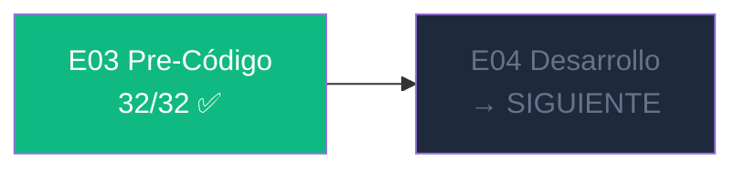
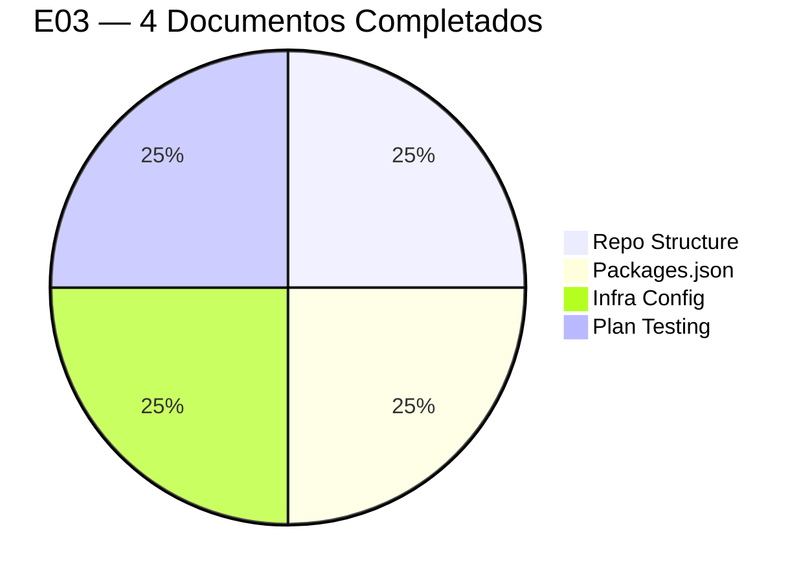
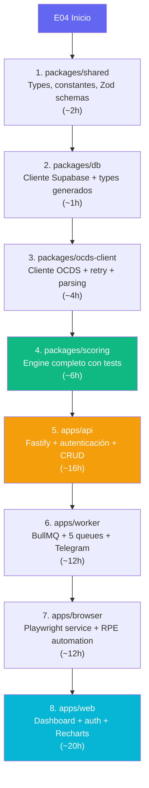

# CHK-03 — Gate E03 Pre-Código: VERIFICADO

> DGCP INTEL | Etapa 3 — Pre-Código | 2026-03-13
> **RESULTADO: 32/32 ✅ GATE ABIERTO**

---

---

## Sección A — Estructura del Repositorio (8/8)

| # | Verificación | Estado |
|---|-------------|--------|
| A1 | Monorepo definido con pnpm workspaces + Turborepo | ✅ |
| A2 | 4 apps identificadas: web, api, worker, browser | ✅ |
| A3 | 4 packages compartidos: scoring, ocds-client, db, shared | ✅ |
| A4 | Directorio infra/ con supabase/, docker/, scripts/ | ✅ |
| A5 | tsconfig.json raíz con path aliases `@dgcp/*` | ✅ |
| A6 | .gitignore cubre node_modules, .next, .env, dist | ✅ |
| A7 | pnpm-workspace.yaml enlaza apps/* + packages/* | ✅ |
| A8 | turbo.json con pipeline build→test→lint completo | ✅ |

---

## Sección B — Packages.json por Servicio (8/8)

| # | Verificación | Estado |
|---|-------------|--------|
| B1 | `@dgcp/web`: Next.js 15, Supabase SSR, Recharts, Radix UI | ✅ |
| B2 | `@dgcp/api`: Fastify 4, JWT, rate-limit, Swagger, Zod | ✅ |
| B3 | `@dgcp/worker`: BullMQ, Telegraf, Anthropic SDK, ioredis | ✅ |
| B4 | `@dgcp/browser`: Playwright 1.45, Fastify HTTP server | ✅ |
| B5 | `@dgcp/scoring`: sin deps externas pesadas, solo date-fns | ✅ |
| B6 | `@dgcp/ocds-client`: Zod para validación de respuesta OCDS | ✅ |
| B7 | `@dgcp/db`: supabase CLI para gen types, seed script | ✅ |
| B8 | `@dgcp/shared`: Zod + date-fns, zero side effects | ✅ |

---

## Sección C — Infra & Docker (8/8)

| # | Verificación | Estado |
|---|-------------|--------|
| C1 | Dockerfile multi-stage para api (alpine, sin dev deps) | ✅ |
| C2 | Dockerfile multi-stage para worker (alpine) | ✅ |
| C3 | Dockerfile para browser con `playwright:v1.45.2-jammy` base | ✅ |
| C4 | railway.toml define 3 servicios: api, worker, browser | ✅ |
| C5 | vercel.json en apps/web con buildCommand monorepo | ✅ |
| C6 | GitHub Actions CI: lint → unit tests → E2E → deploy | ✅ |
| C7 | supabase/config.toml para dev local | ✅ |
| C8 | Estimación de costos: $100-190/mes con margen >70% para 10+ tenants | ✅ |

---

## Sección D — Plan de Testing (8/8)

| # | Verificación | Estado |
|---|-------------|--------|
| D1 | Pirámide definida: 200 unit / 60 integration / 20 E2E | ✅ |
| D2 | Tests unitarios scoring: 100% coverage goal, 9 casos definidos | ✅ |
| D3 | Tests unitarios ocds-client con MSW para mock HTTP | ✅ |
| D4 | Tests integración API: auth, RLS, rate limits con Fastify inject | ✅ |
| D5 | Tests E2E browser: login RPE, scraping público, screenshot | ✅ |
| D6 | Tests BullMQ workers: procesamiento + retry en error | ✅ |
| D7 | Coverage targets definidos por paquete (scoring: 100%, api: 80%) | ✅ |
| D8 | Script de testing local documentado paso a paso | ✅ |

---

## Resumen de la Etapa E03

### Stack consolidado en E03:

| Capa | Tecnología | Versión |
|------|-----------|---------|
| Frontend | Next.js | 15.0.4 |
| Backend | Fastify | 4.28.1 |
| Jobs | BullMQ | 5.8.3 |
| Browser | Playwright | 1.45.2 |
| Cache | Redis (Upstash) | — |
| DB | Supabase PostgreSQL | 15 |
| Auth | JWT + RLS | — |
| Bot | Telegraf | 4.16.3 |
| AI | Anthropic SDK | 0.24.3 |
| Monorepo | Turborepo + pnpm | 2.1.3 + 9.4.0 |
| Containers | Docker (Railway) | — |
| Deploy web | Vercel | — |
| Testing | Vitest + Playwright Test | 2.0.2 + 1.45.2 |

---

## GATE E03 — ABIERTO ✅

**E04 Desarrollo puede comenzar.**

### Orden de implementación recomendado para E04:

**Estimación E04 total: ~73h de desarrollo**

---

*Anterior: [04_PLAN_TESTING.md](04_PLAN_TESTING.md)*
*Inicio E04: [../E04/00_INDEX.md](../E04/00_INDEX.md)*
*JANUS — 2026-03-13*
