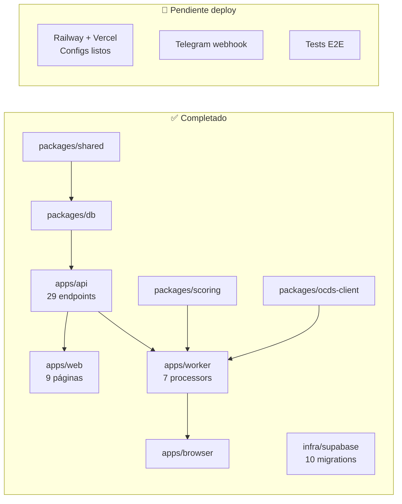

# E04 — Desarrollo: Estado Real del Código

> DGCP INTEL | Auditoría completa | 2026-03-15
> Fuente: codebase actual en `soulcore-dev/dgcp-intel` (commit 84fab87)

---

## Estado General



---

## Métricas del Código

| Componente | Líneas | Archivos |
|-----------|--------|----------|
| apps/api | ~1,100 | 8 |
| apps/worker | ~1,800 | 8 |
| apps/web | ~2,500 | 20+ |
| apps/browser | ~500 | 5 |
| packages/* | ~3,000 | 15+ |
| infra/migrations | ~800 SQL | 10 |
| **Total** | **~9,700** | **65+** |

---

## Dashboard — 9 Páginas

| Página | Ruta | Líneas | Función |
|--------|------|--------|---------|
| Login | /login | ~80 | Supabase Auth |
| Register | /register | ~80 | Crear tenant + perfil |
| Dashboard | /dashboard | ~200 | KPIs + Pipeline Kanban + Recientes |
| Oportunidades | /oportunidades | ~350 | Dual mode: "Mi Pipeline" + "Explorar Portal" |
| Detalle | /oportunidades/[id] | ~400 | Score breakdown + checklist + propuesta + histórico |
| Propuestas | /propuestas | ~200 | 3 secciones: En Prep → Listas → Aplicadas |
| Propuesta detalle | /propuestas/[id] | ~150 | Docs generados + download + tokens Gemini |
| Analytics | /analytics | ~250 | Charts: por_estado, score, top entidades |
| Perfil | /perfil | ~300 | Datos empresa + RPE + Telegram link |
| Asistente IA | /asistente | ~670 | Chat full-page SSE + function calling |

### Componentes reutilizables

- `Sidebar.tsx` — Navegación lateral con plan badge
- `Header.tsx` — Top bar con usuario
- `GuardianChat.tsx` — Widget flotante SSE
- `OportunidadCard.tsx` — Tarjeta de oportunidad
- `PipelineKanban.tsx` — Columnas drag-and-drop
- `ScoreGauge.tsx` — Score radial visual
- `EstadoBadge.tsx` — Pills de estado coloreados

---

## API — 29 Endpoints (7 grupos)

### Auth (4)
```
POST /auth/register    → crear usuario + tenant + perfil
POST /auth/login       → Supabase auth → JWT 7 días
POST /auth/refresh     → renovar JWT
GET  /auth/me          → info tenant actual
```

### Perfil (4)
```
GET  /perfil                    → empresa + plan
PUT  /perfil                    → actualizar datos
PUT  /perfil/rpe                → credenciales RPE (AES-256-GCM)
GET  /perfil/telegram-link-code → código 6 chars, TTL 10min
POST /perfil/vincular-telegram  → validar código + guardar chat_id
```

### Oportunidades (7)
```
GET   /oportunidades              → lista paginada + filtros
GET   /oportunidades/:id          → detalle + licitación + propuestas
PATCH /oportunidades/:id/estado   → cambiar estado (13 estados)
PATCH /oportunidades/:id/checklist → marcar paso completado
GET   /oportunidades/:id/historico → contratos entidad + similares
POST  /oportunidades/:id/propuesta → encolar job propose (5/hr)
POST  /oportunidades/:id/analizar-pliego → upload PDF Gemini (10/hr)
GET   /oportunidades/stats         → pipeline_stats RPC
```

### Licitaciones (2)
```
GET /licitaciones       → todas, sin filtro tenant (cache OCDS)
GET /licitaciones/:ocid → detalle de una licitación
```

### Pipeline (4)
```
GET /pipeline           → oportunidades agrupadas por estado
GET /pipeline/stats     → KPIs: total, win_rate, monto_pipeline
GET /pipeline/deadlines → próximos vencimientos
GET /pipeline/analytics → datos para charts
```

### Asistente IA (5)
```
POST   /asistente/chat              → SSE streaming + function calling (3 rounds)
GET    /asistente/sessions          → historial de sesiones
GET    /asistente/sessions/:id      → recuperar chat
GET    /asistente/tools             → herramientas disponibles
DELETE /asistente/sessions/:id      → borrar sesión
```

### 10 Function Calling Tools del Asistente

| Tool | Función |
|------|---------|
| buscar_procesos | Buscar licitaciones por keyword/modalidad/monto/MIPYME |
| mis_oportunidades | Pipeline del tenant con filtros |
| calcular_precio | 5 escenarios (0%, -5%, -10%, -15%, -20%) con ITBIS |
| estadisticas | Pipeline stats vía RPC |
| buscar_proveedor | API DGCP por RNC |
| explicar_proceso | Explicar tipos Ley 47-25 |
| analizar_pliego | Redirigir a upload UI |
| generar_propuesta | Encolar job propose |
| marcar_checklist | Completar paso del checklist |
| historial_entidad | Contratos pasados de una entidad |

---

## Worker — 7 Processors

| Queue | Procesador | Líneas | Concurrencia | Función |
|-------|-----------|--------|-------------|---------|
| scan | processScan | 99 | 1 | Fetch API DGCP cada 6h |
| score | processScore | 120 | 5 | Scoring 6 componentes |
| alert | processAlert | 127 | 3 | Alerta Telegram con keyboard |
| intelligence | processIntelligence | 277 | 3 | Red flags + pricing + competidores (F2) |
| propose | processPropose | 816 | 2 | Generar 5 docs con Gemini |
| analyze | processAnalyze | 131 | 2 | Extraer PDF pliego con Gemini |
| submit | processSubmit | 235 | 1 | Playwright fill + submit (2 fases) |

### Cron Jobs
- Boot scan: fullScan=true, 5s delay al iniciar
- Scan recurrente: cada 6 horas (`0 */6 * * *`)

---

## Base de Datos — 10 Migrations, 8 Tablas

| Migration | Contenido |
|-----------|-----------|
| 001 | Schema inicial: tenants, empresa_perfil, licitaciones, oportunidades_tenant, propuestas, submissions, ia_sessions |
| 002 | RLS policies (20+) |
| 003 | Funciones SQL: pipeline_stats, pliego_scorer |
| 004 | Triggers: auto updated_at (5 tablas) |
| 005 | Storage buckets: propuestas/ |
| 006 | Campos submission: rpe_session_state, expires |
| 007 | Inteligencia: red_flags, competidores, pricing_scenarios |
| 008 | Checklist pipeline: checklist JSONB, pipeline_stats actualizado |
| 009 | Pliego analysis: pliego_analysis JSONB, pliego_file_path |
| 010 | IA tools: ia_tools, ia_tenant_tools (overrides por tenant) |

### Checklist Pipeline (7 pasos)

```
1. interes_mostrado      → "Mostré interés en el portal"
2. pliego_revisado       → "Revisé el pliego y analicé requisitos"
3. propuesta_generada    → "IA generó los documentos"
4. propuesta_revisada    → "Revisé y aprobé los documentos"
5. certificaciones_listas → "Tengo DGII, TSS, MIPYME al día"
6. precio_decidido       → "Elegí el precio final"
7. oferta_subida         → "Subí la oferta al portal DGCP"
```

Auto-validación: no puedes marcar paso N sin completar N-1.
Auto-advance: el estado de la oportunidad cambia según el paso completado.

---

## Stack Tecnológico (real, no diseñado)

| Componente | Tecnología | Versión |
|-----------|-----------|---------|
| Frontend | Next.js | 14.2.35 |
| API | Fastify | 4.28.1 |
| Worker | BullMQ | 5.8.3 |
| Browser | Playwright | 1.58.2 |
| BD | Supabase (PostgreSQL) | cloud |
| Cache/Queue | Redis (Railway) | — |
| IA | Google Gemini 2.5 Flash | @google/generative-ai 0.24.0 |
| Bot | Telegraf | 4.16.3 |
| Auth | Supabase Auth + JWT custom | 7 días |
| Monorepo | Turborepo + pnpm | — |
| Deploy web | Vercel | — |
| Deploy API/Worker | Railway (Docker) | — |

**Nota**: Las specs originales decían Claude/Anthropic. ATLAS usó **Gemini** por el tier gratuito
(15 RPM, 1M tokens/día, 1500 req/día). Funciona para MVP.

---

## Fases — Estado Real

| Fase | Estado | Evidencia |
|------|--------|-----------|
| **F1 Detección** | ✅ 95% | Scan + Score + Alert + Dashboard + Analytics |
| **F2 Inteligencia** | 🔄 60% | processIntelligence implementado (red flags, pricing, competidores) |
| **F3 Preparación** | 🔄 50% | Checklist 7 pasos + processPropose (5 docs) + processAnalyze (pliego) |
| **F3B Revisión** | 🔄 30% | Checklist auto-validación, falta UI de revisión detallada |
| **F4 Entrega** | ⏳ 20% | processSubmit diseñado, Playwright form.ts parcial |

### Lo que falta para producción

| # | Tarea | Prioridad |
|---|-------|-----------|
| 1 | Fix scan OCDS (bugs 1-6 del diagnóstico) | 🔴 P0 |
| 2 | Deploy Railway (API + Worker + Browser) | 🔴 P0 |
| 3 | Deploy Vercel (Web) | 🔴 P0 |
| 4 | Telegram webhook con dominio real | 🔴 P0 |
| 5 | Primer scan real con datos DGCP | 🔴 P0 |
| 6 | E2E tests básicos (login, oportunidades, perfil) | 🟠 P1 |
| 7 | Mapeo completo formularios DGCP (form.ts) | 🟠 P1 |
| 8 | Verificación UNSPSC con BD Hefesto | 🟡 P2 |
| 9 | Índices financieros auto-cálculo | 🟡 P2 |
| 10 | Score configurable por usuario (sliders) | 🟡 P2 |

---

*JANUS — 2026-03-15*
*Auditoría completa del codebase post-ATLAS*
