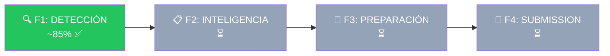

# E04 — Desarrollo: Índice y Estado

> DGCP INTEL | Etapa 4 — Desarrollo | 2026-03-14
> **Fase actual**: F1 Detección (~85% completado)

---

## Contexto: 4 Fases del Producto

Ver [ROADMAP_FASES.md](../ROADMAP_FASES.md) para visión completa.



**F1 = MVP** — El usuario recibe alertas y ve oportunidades. Todo lo demás es expansión.

---

## F1 Detección — Estado de Archivos

### ✅ Completado (en GitHub: soulcore-dev/dgcp-intel)

| Módulo | Archivos | Notas |
|--------|----------|-------|
| `packages/shared` | types.ts, constants.ts, schemas.ts, utils.ts | 9 interfaces, Zod, AppError |
| `packages/scoring` | engine.ts, index.ts | 6 componentes, win probability |
| `packages/ocds-client` | client.ts, mapper.ts, types.ts | HTTP retry, OCDS→Licitacion |
| `packages/db` | client.ts, queries/licitaciones.ts, queries/oportunidades.ts | Supabase singleton, upsert, pipeline |
| `apps/api` | index.ts, middleware/auth.ts | Fastify + JWT + CORS + rate-limit |
| `apps/api/routes` | auth.ts, perfil.ts, oportunidades.ts, asistente.ts | CRUD completo |
| `apps/api/services` | asistente.ts | GUARDIAN: system prompt + SSE |
| `apps/worker` | index.ts, processors/scan.ts, score.ts, alert.ts, propose.ts | 5 queues BullMQ |
| `apps/web` | layout.tsx, login/page.tsx, register/page.tsx, GuardianChat.tsx | Auth + provider + proxy SSE |
| `infra/supabase` | 001-005 migrations | Schema + RLS + functions + triggers + storage |
| Root | tsconfig.base.json, turbo.json, pnpm-workspace.yaml, .env.example | Monorepo config |

### 🔴 Falta para cerrar F1

| # | Tarea | Tipo | Prioridad |
|---|-------|------|-----------|
| 1 | **Dashboard — Lista de oportunidades** | Web | P1 |
|   | `apps/web/src/app/(dashboard)/oportunidades/page.tsx` | | |
|   | Tabla con: título, entidad, monto, score, días restantes, estado | | |
|   | Filtros: score mínimo, modalidad, monto, estado | | |
| 2 | **Dashboard — Detalle de oportunidad** | Web | P1 |
|   | `apps/web/src/app/(dashboard)/oportunidades/[id]/page.tsx` | | |
|   | Score breakdown (6 componentes visual), datos licitación, acciones | | |
| 3 | **Dashboard — Home/Pipeline** | Web | P2 |
|   | `apps/web/src/app/(dashboard)/page.tsx` | | |
|   | Pipeline funnel: detectadas → scored → alertadas → propuestas | | |
|   | KPIs: total oportunidades, score promedio, win rate | | |
| 4 | **Dashboard — Analytics** | Web | P3 |
|   | `apps/web/src/app/(dashboard)/analytics/page.tsx` | | |
|   | Recharts: oportunidades/día, distribución scores, top entidades | | |
| 5 | **Dashboard — Perfil empresa** | Web | P2 |
|   | `apps/web/src/app/(dashboard)/perfil/page.tsx` | | |
|   | UNSPSC codes, datos empresa, credenciales RPE (masked) | | |
| 6 | **Dashboard — Layout + Sidebar** | Web | P1 |
|   | `apps/web/src/app/(dashboard)/layout.tsx` | | |
|   | Sidebar: Pipeline, Oportunidades, Analytics, Perfil, GUARDIAN | | |
| 7 | **Deploy** | Infra | P1 |
|   | Supabase proyecto → Railway (API + Worker + Redis) → Vercel (Web) | | |
| 8 | **Primer scan real** | QA | P1 |
|   | Ejecutar worker contra api.dgcp.gob.do, verificar mapper con datos reales | | |

### Documentación E04

| Doc | Contenido | Estado |
|-----|-----------|--------|
| [ROADMAP_FASES.md](../ROADMAP_FASES.md) | Visión 4 fases completa | ✅ |
| [01_BROWSER_SERVICE.md](01_BROWSER_SERVICE.md) | Apps/browser Playwright (F4) | ✅ |
| [02_WEB_DASHBOARD.md](02_WEB_DASHBOARD.md) | Apps/web Next.js (F1) | ✅ |
| [03_SUBMIT_PROCESSOR.md](03_SUBMIT_PROCESSOR.md) | Worker submit queue (F4) | ✅ |
| F2_INTELIGENCIA_SPEC.md | Análisis + red flags + BD precios | ⏳ |
| F3_PREPARACION_SPEC.md | Sobre A/B + APU + docs | ⏳ |
| F4_SUBMISSION_SPEC.md | Portal automation completa | ⏳ |

---

## Orden de implementación para ATLAS

### Sprint F1-final (cerrar detección)

```
1. apps/web — Dashboard layout + sidebar + oportunidades list
2. apps/web — Detalle oportunidad + score breakdown visual
3. apps/web — Home pipeline + analytics básico
4. apps/web — Perfil empresa
5. Deploy: Supabase + Railway + Vercel
6. QA: Primer scan real contra API DGCP
```

### Sprint F2 (siguiente fase)

```
1. Importar BD precios Hefesto → Supabase ref tables
2. Red flags detection en scoring engine
3. Verificación UNSPSC automática
4. 5 escenarios pricing
5. Índices financieros auto-cálculo
6. UI: badges de red flags + escenarios en detalle
```

---

*JANUS — 2026-03-14*
*Auditoría cruzada: HEFESTO_CORE (experiencia real) + DGCP_INTEL (codebase actual)*
