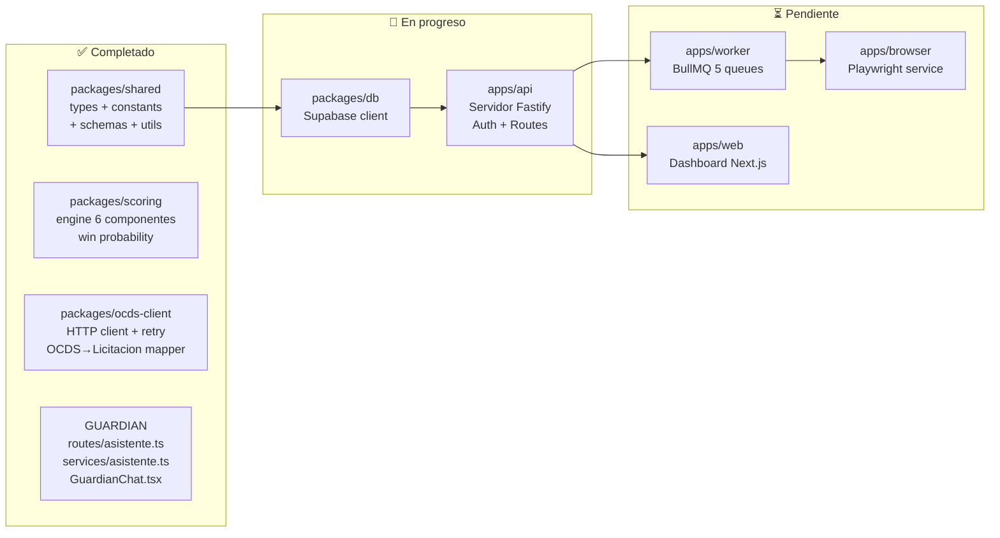

# E04 — Desarrollo: Índice y Estado

> DGCP INTEL | Etapa 4 — Desarrollo | 2026-03-13

---

## Estado General



---

## Mapa de Archivos — Completo

```
dgcp-intel/
├── packages/
│   ├── shared/src/
│   │   ├── types.ts          ✅ 9 interfaces completas
│   │   ├── constants.ts      ✅ umbrales, planes, queues, UNSPSC
│   │   ├── schemas.ts        ✅ Zod schemas con validación
│   │   └── utils.ts          ✅ scoring utils, format, AppError
│   │
│   ├── scoring/src/
│   │   └── engine.ts         ✅ 6 componentes implementados
│   │
│   ├── ocds-client/src/
│   │   ├── client.ts         ✅ HTTP + retry + paginación
│   │   ├── mapper.ts         ✅ OCDS Release → Licitacion
│   │   └── types.ts          ✅ Zod schemas OCDS
│   │
│   └── db/src/
│       ├── client.ts         🔄 Supabase client singleton
│       ├── queries/
│       │   ├── licitaciones.ts  🔄 CRUD + búsquedas
│       │   ├── oportunidades.ts 🔄 pipeline queries
│       │   ├── propuestas.ts    ⏳ propuestas queries
│       │   └── tenants.ts       ⏳ tenant + perfil queries
│       └── index.ts          🔄 exports
│
├── apps/
│   ├── api/src/
│   │   ├── index.ts          🔄 Fastify server principal
│   │   ├── middleware/
│   │   │   ├── auth.ts       🔄 JWT + tenant context
│   │   │   └── rateLimit.ts  ⏳ rate limit por plan
│   │   ├── routes/
│   │   │   ├── asistente.ts  ✅ GUARDIAN streaming
│   │   │   ├── oportunidades.ts ⏳ GET/POST oportunidades
│   │   │   ├── perfil.ts     ⏳ GET/PUT empresa perfil
│   │   │   ├── propuestas.ts ⏳ POST generar propuesta
│   │   │   ├── pipeline.ts   ⏳ GET pipeline stats
│   │   │   └── auth.ts       ⏳ login/register
│   │   └── services/
│   │       ├── asistente.ts  ✅ system prompt + context
│   │       ├── proposalGen.ts ⏳ Claude 5 documentos
│   │       └── telegram.ts   ⏳ enviar alertas/mensajes
│   │
│   ├── worker/src/
│   │   ├── index.ts          ⏳ BullMQ workers init
│   │   └── processors/
│   │       ├── scan.ts       🔄 OCDS scan + upsert
│   │       ├── score.ts      ⏳ score batch por tenant
│   │       ├── alert.ts      ⏳ Telegram alert sender
│   │       ├── propose.ts    ⏳ Claude doc generation
│   │       └── submit.ts     ⏳ HTTP → browser service
│   │
│   ├── browser/src/
│   │   ├── index.ts          ⏳ Fastify HTTP server
│   │   └── service/
│   │       ├── session.ts    ⏳ storageState RPE login
│   │       ├── form.ts       ⏳ fill + submit DGCP form
│   │       └── screenshot.ts ⏳ captura pre-submit
│   │
│   └── web/src/
│       ├── app/              ⏳ Next.js 15 App Router
│       ├── components/
│       │   ├── guardian/
│       │   │   └── GuardianChat.tsx ✅ widget chat
│       │   ├── pipeline/     ⏳ Kanban board
│       │   ├── oportunidades/ ⏳ lista + detalle
│       │   └── analytics/    ⏳ charts Recharts
│       └── lib/              ⏳ supabase client, hooks
│
└── infra/
    └── supabase/migrations/  ⏳ copiar desde E02
```

---

## Prioridad de Implementación

| Prioridad | Módulo | Por qué es crítico |
|-----------|--------|-------------------|
| 🔴 P1 | `packages/db` | Todo depende del cliente Supabase |
| 🔴 P1 | `apps/api/index.ts` + auth | Sin servidor no hay nada |
| 🔴 P1 | `apps/worker/processors/scan.ts` | Core business: detectar licitaciones |
| 🟠 P2 | `apps/worker/processors/score.ts` | Sin score no hay alertas |
| 🟠 P2 | `apps/worker/processors/alert.ts` | Sin alertas el usuario no sabe nada |
| 🟡 P3 | `apps/api/routes/oportunidades.ts` | API que consume el dashboard |
| 🟡 P3 | `apps/browser` | Solo necesario para auto-submit |
| 🟢 P4 | `apps/web` completo | Frontend, desarrollar después de API |

---

## Lo que se DOCUMENTA (no se codifica ahora)

Los siguientes módulos son complejos pero repetitivos — se documentan con
el código de referencia y se implementan en sprint 2:

| Módulo | Documento de referencia |
|--------|------------------------|
| `apps/api/routes/oportunidades.ts` | [01_API_REST_SPEC.md](../E02/01_API_REST_SPEC.md) |
| `apps/api/routes/propuestas.ts` | [01_API_REST_SPEC.md](../E02/01_API_REST_SPEC.md) |
| `apps/browser/service/form.ts` | [05_SEGURIDAD_RPE.md](../E02/05_SEGURIDAD_RPE.md) |
| `apps/web` completo | [04_DASHBOARD_WIREFRAMES.md](../E02/04_DASHBOARD_WIREFRAMES.md) |
| `apps/worker/processors/propose.ts` | [05_FLUJOS_PRINCIPALES.md](../E01/05_FLUJOS_PRINCIPALES.md) |

---

*JANUS — 2026-03-13*
