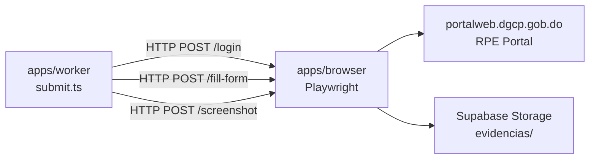
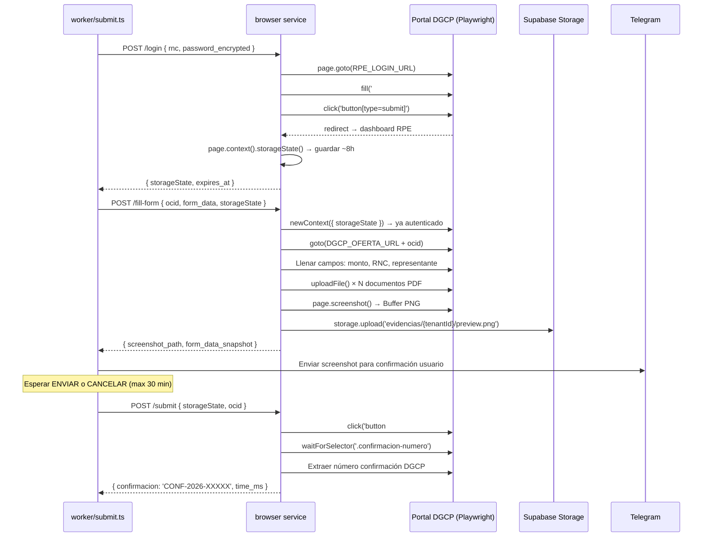

# E04 — Browser Service (Playwright)

> DGCP INTEL | Etapa 4 — Desarrollo | Sprint 3 | 2026-03-13

---

## Responsabilidad

`apps/browser` es un microservicio HTTP interno (no expuesto a internet) que Railway
ejecuta con Docker. Solo `apps/worker` lo llama. Tiene 3 funciones:



---

## Estructura de archivos

```
apps/browser/src/
├── index.ts              — Fastify HTTP server :3002
├── service/
│   ├── browser.ts        — Playwright browser singleton (Chromium headed=false)
│   ├── session.ts        — Login RPE + storageState reutilizable ~8h
│   ├── form.ts           — Navegación + llenado formulario DGCP
│   └── screenshot.ts     — Captura pantalla + upload a Storage
└── routes/
    ├── login.ts          — POST /login → { storageState, expires_at }
    ├── fill.ts           — POST /fill-form → { screenshot_path, form_data }
    └── health.ts         — GET /health
```

---

## Flujo de submit (8 pasos)



---

## Código de referencia — `session.ts`

```typescript
import { chromium, BrowserContext } from 'playwright'
import { getSupabaseService } from '@dgcp/db'

const DGCP_RPE_URL = 'https://portalweb.dgcp.gob.do/rpe/login'
const SESSION_TTL_HOURS = 8

export async function getRPESession(
  tenantId: string,
  rncDecrypted: string,
  passwordDecrypted: string,
): Promise<string> {  // retorna storageState serializado
  const db = getSupabaseService()

  // Intentar reusar sesión guardada
  const { data: perfil } = await db
    .from('empresa_perfil')
    .select('rpe_session_state, rpe_session_expires')
    .eq('tenant_id', tenantId)
    .single()

  if (perfil?.rpe_session_state && perfil.rpe_session_expires) {
    const expires = new Date(perfil.rpe_session_expires)
    if (expires > new Date()) {
      return perfil.rpe_session_state  // Reusar sesión válida
    }
  }

  // Login fresco con Playwright
  const browser = await chromium.launch({ headless: true })
  const context = await browser.newContext()
  const page = await context.newPage()

  await page.goto(DGCP_RPE_URL, { waitUntil: 'networkidle' })
  await page.fill('#rnc', rncDecrypted)
  await page.fill('#password', passwordDecrypted)
  await page.click('button[type="submit"]')
  await page.waitForURL('**/dashboard**', { timeout: 30_000 })

  const storageState = JSON.stringify(await context.storageState())
  await browser.close()

  // Guardar sesión en DB
  const expires = new Date()
  expires.setHours(expires.getHours() + SESSION_TTL_HOURS)

  await db.from('empresa_perfil').update({
    rpe_session_state: storageState,
    rpe_session_expires: expires.toISOString(),
  }).eq('tenant_id', tenantId)

  return storageState
}
```

---

## Variables de entorno requeridas

```env
PORT=3002
SUPABASE_URL=
SUPABASE_SERVICE_KEY=
VAULT_KEY=          # Misma clave que apps/api para descifrar RPE
PLAYWRIGHT_BROWSERS_PATH=/ms-playwright
```

---

## Dockerfile (referencia E03)

Usa imagen base `mcr.microsoft.com/playwright:v1.45.2-jammy` que ya tiene
Chromium pre-instalado. Ver [03_INFRA_CONFIG.md](../E03/03_INFRA_CONFIG.md).

---

*Sprint 3 — pendiente de implementación*
*JANUS — 2026-03-13*
