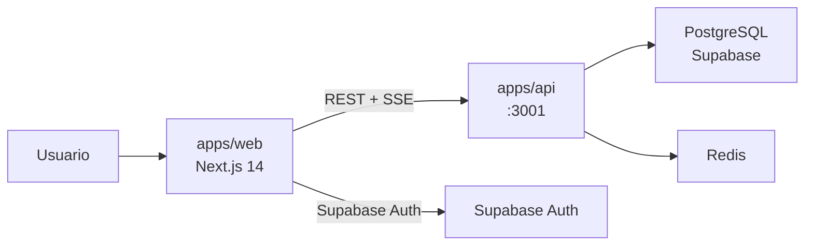
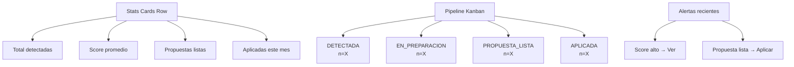

# E04 — Web Dashboard (Next.js)

> DGCP INTEL | Etapa 4 — Desarrollo | Sprint 3 | 2026-03-13

---

## Responsabilidad

`apps/web` es el frontend Next.js 14 (App Router) que los usuarios de cada tenant usan para:

- Ver y gestionar oportunidades (pipeline kanban)
- Consultar propuestas generadas por IA
- Ver analytics del pipeline de licitaciones
- Interactuar con GUARDIAN (chat IA flotante)
- Configurar perfil y credenciales RPE



---

## Estructura de archivos

```
apps/web/src/
├── app/
│   ├── layout.tsx              — Root layout: providers, fonts, metadata
│   ├── page.tsx                — Redirect → /dashboard
│   ├── (auth)/
│   │   ├── login/page.tsx      — Login form con Supabase Auth
│   │   └── register/page.tsx   — Registro + plan selector
│   └── (dashboard)/
│       ├── layout.tsx          — Sidebar + header + GUARDIAN widget
│       ├── dashboard/page.tsx  — Pipeline overview + stats cards
│       ├── oportunidades/
│       │   ├── page.tsx        — Lista paginada con filtros
│       │   └── [id]/page.tsx   — Detalle + propuestas + submit flow
│       ├── propuestas/
│       │   └── [id]/page.tsx   — Visor de documentos generados
│       ├── analytics/page.tsx  — Recharts: win rate, scores, timeline
│       └── perfil/page.tsx     — Perfil empresa + RPE credentials + Telegram
├── components/
│   ├── layout/
│   │   ├── Sidebar.tsx         — Nav lateral con routes + plan badge
│   │   └── Header.tsx          — Breadcrumb + tenant name + user menu
│   ├── oportunidades/
│   │   ├── PipelineKanban.tsx  — Drag-drop kanban por estado
│   │   ├── OportunidadCard.tsx — Card con score gauge + monto + fecha
│   │   ├── OportunidadList.tsx — Table view alternativa
│   │   └── ScoreBadge.tsx      — Color-coded: verde/amarillo/naranja/rojo
│   ├── propuestas/
│   │   ├── DocViewer.tsx       — Render texto propuesta con tabs por doc
│   │   └── SubmitFlow.tsx      — Step-by-step: Preview → Confirm → Status
│   ├── analytics/
│   │   ├── PipelineChart.tsx   — Recharts BarChart: estados pipeline
│   │   ├── ScoreDistribution.tsx — Recharts AreaChart: distribución scores
│   │   └── WinRateCard.tsx     — Tasa adjudicación histórica
│   ├── guardian/
│   │   └── GuardianChat.tsx    — Chat flotante SSE (ya documentado E02)
│   └── ui/
│       ├── ScoreGauge.tsx      — SVG gauge 0-100 con color dinámico
│       ├── MontoDisplay.tsx    — Formateo RD$ con abreviaciones
│       └── EstadoBadge.tsx     — Chip coloreado por estado workflow
├── hooks/
│   ├── useOportunidades.ts     — SWR fetch + pagination + filters
│   ├── useOportunidad.ts       — SWR single + optimistic update estado
│   └── useAnalytics.ts         — SWR pipeline_stats RPC
├── lib/
│   ├── api.ts                  — fetch wrapper con JWT header auto-inject
│   ├── auth.ts                 — Supabase client + session helpers
│   └── supabase.ts             — createBrowserClient singleton
└── types/
    └── index.ts                — Re-export from @dgcp/shared + web-only types
```

---

## Páginas principales

### `/dashboard` — Pipeline Overview



**Comportamiento:**
- Stats cards consumen `GET /oportunidades/stats` (RPC `pipeline_stats`)
- Kanban muestra top 5 por columna, link "Ver todas" → `/oportunidades?estado=X`
- Alertas recientes: últimas 5 oportunidades actualizadas hoy
- Auto-refresh cada 30s via SWR `refreshInterval`

### `/oportunidades` — Lista con Filtros

```
Filtros: [ Estado ▾ ] [ Score mín: ___ ] [ Fecha cierre desde: ___ ] [ Buscar... ]
Sort: Score ▾ | Fecha cierre | Monto

┌─────────────────────────────────────────────────────┐
│ 🏆 87pts │ MINISTERIO EDUCACIÓN                     │
│ Suministro de materiales escolares                   │
│ RD$ 45.2M  │  📅 18 días  │  Licitación Pública     │
│ [Ver detalle]  [Generar propuesta]  [Descartar]      │
└─────────────────────────────────────────────────────┘
```

**OportunidadCard props:**
```typescript
interface OportunidadCardProps {
  oportunidad: OportunidadTenant & { licitacion: Licitacion }
  onEstadoChange: (id: string, estado: string) => void
  onGenerarPropuesta: (id: string) => void
}
```

### `/oportunidades/[id]` — Detalle + Submit Flow

**Tabs:**
1. **Resumen** — Score breakdown visual (6 barras de componentes), info licitación
2. **Propuesta** — Documentos generados, descarga PDF, botón APLICAR
3. **Historial** — Timeline de estados + submissions previos

**Submit Flow (cuando usuario presiona APLICAR):**
```
Step 1: Preview screenshot del formulario DGCP
Step 2: Confirmar datos (monto, RNC, representante)
Step 3: "Esperando confirmación..." (bot envía a Telegram)
Step 4: Status en tiempo real via polling submission.estado
```

### `/analytics` — Panel BI

```typescript
// Datos que consume analytics/page.tsx
const { stats } = useAnalytics()
// stats = {
//   por_estado: [{ estado: 'DETECTADA', count: 45 }]
//   score_distribution: [{ rango: '80-100', count: 12 }]
//   win_rate: 0.23
//   monto_pipeline: 450_000_000
//   top_entidades: [{ entidad: 'MINED', count: 8 }]
// }
```

**Charts:**
- `PipelineChart` — BarChart horizontal: estados vs count
- `ScoreDistribution` — AreaChart: distribución scores en rangos 20pt
- `WinRateCard` — Big number + trend vs mes anterior
- `TopEntidades` — Lista rankeada con barra proporcional

### `/perfil` — Configuración Empresa

**Secciones:**
1. **Datos empresa** — RNC, razón social, representante, dirección
2. **Keywords** — Tags de especialidades (input chip multi-select)
3. **Plan** — Plan actual + botón upgrade
4. **RPE Credentials** — `PUT /perfil/rpe` — inputs password (nunca mostrar), solo update
5. **Telegram** — QR/code de vinculación `GET /perfil/telegram-link-code`

---

## Componentes clave

### `PipelineKanban.tsx`

```typescript
// Usa @hello-pangea/dnd para drag-drop
import { DragDropContext, Droppable, Draggable } from '@hello-pangea/dnd'

const ESTADOS_PIPELINE = [
  'DETECTADA', 'EN_PREPARACION', 'PROPUESTA_LISTA',
  'APLICADA', 'EN_EVALUACION', 'ADJUDICADA', 'PERDIDA',
] as const

// onDragEnd llama PATCH /oportunidades/:id/estado
async function onDragEnd(result: DropResult) {
  if (!result.destination) return
  const nuevoEstado = ESTADOS_PIPELINE[result.destination.droppableId]
  await api.patch(`/oportunidades/${result.draggableId}/estado`, {
    estado: nuevoEstado
  })
  mutate() // SWR revalidation
}
```

### `ScoreGauge.tsx`

```typescript
// SVG gauge semicircular
// 0-59: rojo (#ef4444)
// 60-74: naranja (#f97316)
// 75-84: amarillo (#eab308)
// 85-100: verde (#22c55e)

function ScoreGauge({ score }: { score: number }) {
  const angle = (score / 100) * 180  // 0° → 180°
  const color = score >= 85 ? '#22c55e'
              : score >= 75 ? '#eab308'
              : score >= 60 ? '#f97316'
              : '#ef4444'
  // SVG arc path calculado con trigonometría
}
```

### `lib/api.ts`

```typescript
const API_BASE = process.env.NEXT_PUBLIC_API_URL

async function apiFetch<T>(
  path: string,
  options: RequestInit = {}
): Promise<T> {
  const session = await supabase.auth.getSession()
  const jwt = session.data.session?.access_token

  const res = await fetch(`${API_BASE}${path}`, {
    ...options,
    headers: {
      'Content-Type': 'application/json',
      ...(jwt ? { Authorization: `Bearer ${jwt}` } : {}),
      ...options.headers,
    },
  })

  if (!res.ok) {
    const error = await res.json()
    throw new Error(error.message ?? 'API error')
  }

  return res.json()
}

export const api = {
  get: <T>(path: string) => apiFetch<T>(path),
  post: <T>(path: string, body: unknown) =>
    apiFetch<T>(path, { method: 'POST', body: JSON.stringify(body) }),
  patch: <T>(path: string, body: unknown) =>
    apiFetch<T>(path, { method: 'PATCH', body: JSON.stringify(body) }),
  put: <T>(path: string, body: unknown) =>
    apiFetch<T>(path, { method: 'PUT', body: JSON.stringify(body) }),
}
```

---

## Stack de dependencias

```json
{
  "next": "14.2.x",
  "react": "18.x",
  "tailwindcss": "3.x",
  "@supabase/supabase-js": "2.x",
  "@supabase/ssr": "0.x",
  "swr": "2.x",
  "recharts": "2.x",
  "@hello-pangea/dnd": "16.x",
  "lucide-react": "0.x",
  "clsx": "2.x"
}
```

---

## Variables de entorno

```env
NEXT_PUBLIC_SUPABASE_URL=https://xxxx.supabase.co
NEXT_PUBLIC_SUPABASE_ANON_KEY=eyJ...
NEXT_PUBLIC_API_URL=https://api.dgcp-intel.railway.app
```

---

## Despliegue

- **Vercel** con auto-deploy desde `main` branch
- Framework preset: Next.js
- Build command: `pnpm turbo build --filter=web`
- Output directory: `apps/web/.next`
- URL producción: `https://dgcp-intel.vercel.app`

---

*Sprint 3 — pendiente de implementación*
*JANUS — 2026-03-13*
