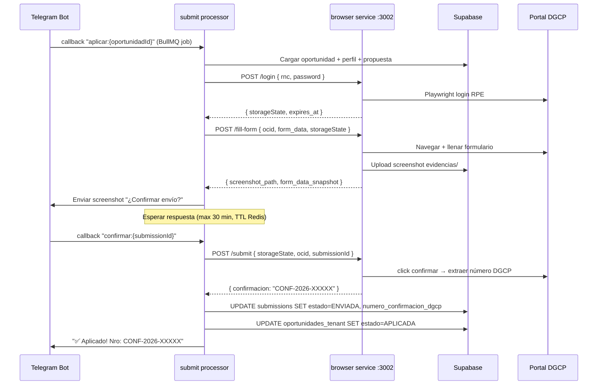

# E04 — Submit Processor (Worker → Browser Service)

> DGCP INTEL | Etapa 4 — Desarrollo | Sprint 3 | 2026-03-13

---

## Responsabilidad

`apps/worker/src/processors/submit.ts` orquesta el auto-submit de una propuesta al portal DGCP RPE. Es el único procesador que llama a `apps/browser` via HTTP.



---

## Código de referencia — `submit.ts`

```typescript
import { Job } from 'bullmq'
import { Telegraf } from 'telegraf'
import { getSupabaseService } from '@dgcp/db'
import pino from 'pino'

const log = pino({ name: 'submit-processor' })
const bot = new Telegraf(process.env.TELEGRAM_BOT_TOKEN!)
const BROWSER_URL = process.env.BROWSER_SERVICE_URL ?? 'http://browser:3002'
const CONFIRM_TTL_SECONDS = 1800  // 30 minutos

export interface SubmitJobData {
  oportunidadId: string
  tenantId: string
  submissionId?: string  // Si ya existe (retry)
  phase: 'FILL' | 'CONFIRM' | 'SUBMIT'
}

export async function processSubmit(job: Job<SubmitJobData>): Promise<void> {
  const { oportunidadId, tenantId, phase } = job.data
  const db = getSupabaseService()

  // ── Cargar contexto ──────────────────────────────────────
  const [oportunidadRes, perfilRes] = await Promise.all([
    db.from('oportunidades_tenant')
      .select('*, licitacion:licitaciones(ocid, titulo, entidad_nombre)')
      .eq('id', oportunidadId)
      .single(),
    db.from('empresa_perfil')
      .select('*')
      .eq('tenant_id', tenantId)
      .single(),
  ])

  const oportunidad = oportunidadRes.data
  const perfil = perfilRes.data

  if (!oportunidad || !perfil) {
    throw new Error('Oportunidad o perfil no encontrado')
  }

  const ocid = oportunidad.licitacion.ocid

  // ── Phase: FILL ───────────────────────────────────────────
  if (phase === 'FILL') {
    // Crear registro submission
    const { data: submission } = await db.from('submissions').insert({
      tenant_id: tenantId,
      oportunidad_id: oportunidadId,
      estado: 'INICIANDO',
    }).select().single()

    await job.updateProgress(10)

    // Login RPE (browser service maneja caché de sesión ~8h)
    const { storageState } = await browserPost<{ storageState: string; expires_at: string }>(
      '/login',
      {
        rnc: perfil.rnc,
        password_encrypted: perfil.rpe_password_encrypted,
        tenant_id: tenantId,
      }
    )

    await job.updateProgress(25)

    // Llenar formulario + capturar screenshot
    const { screenshot_path, form_data_snapshot } = await browserPost<{
      screenshot_path: string
      form_data_snapshot: Record<string, string>
    }>(
      '/fill-form',
      {
        ocid,
        tenant_id: tenantId,
        submission_id: submission!.id,
        storageState,
        form_data: {
          monto_oferta: oportunidad.margen_calculado
            ? Math.round(oportunidad.licitacion.monto_estimado * oportunidad.margen_calculado)
            : oportunidad.licitacion.monto_estimado,
          rnc: perfil.rnc,
          razon_social: perfil.razon_social,
          representante: perfil.representante,
        },
      }
    )

    await job.updateProgress(60)

    // Guardar estado intermedio
    await db.from('submissions').update({
      estado: 'ESPERANDO_CONFIRMACION',
      screenshot_path,
      form_data_snapshot,
      storage_state_temp: storageState,
    }).eq('id', submission!.id)

    // Enviar screenshot a Telegram para confirmación
    if (perfil.telegram_chat_id) {
      const appUrl = process.env.APP_URL ?? 'https://dgcp-intel.vercel.app'

      await bot.telegram.sendPhoto(
        perfil.telegram_chat_id,
        { url: screenshot_path },
        {
          caption:
            `📋 <b>Preview formulario DGCP</b>\n\n` +
            `Licitación: ${oportunidad.licitacion.titulo}\n` +
            `Entidad: ${oportunidad.licitacion.entidad_nombre}\n` +
            `Monto: RD$ ${form_data_snapshot.monto_oferta?.toLocaleString('es-DO')}\n\n` +
            `¿Confirmas el envío?`,
          parse_mode: 'HTML',
          reply_markup: {
            inline_keyboard: [[
              { text: '✅ ENVIAR', callback_data: `confirmar:${submission!.id}` },
              { text: '❌ CANCELAR', callback_data: `cancelar:${submission!.id}` },
            ]],
          },
        }
      )
    }

    log.info({ submissionId: submission!.id }, 'Screenshot enviado, esperando confirmación')
    await job.updateProgress(100)
  }

  // ── Phase: SUBMIT ─────────────────────────────────────────
  if (phase === 'SUBMIT') {
    const { submissionId } = job.data
    if (!submissionId) throw new Error('submissionId requerido para phase SUBMIT')

    const { data: submission } = await db.from('submissions')
      .select('*')
      .eq('id', submissionId)
      .single()

    if (!submission || submission.estado !== 'CONFIRMADO') {
      throw new Error(`Submission ${submissionId} no está en estado CONFIRMADO`)
    }

    await job.updateProgress(10)

    // Submit final via browser
    const { confirmacion, time_ms } = await browserPost<{
      confirmacion: string
      time_ms: number
    }>(
      '/submit',
      {
        ocid,
        submission_id: submissionId,
        storageState: submission.storage_state_temp,
      }
    )

    await job.updateProgress(80)

    // Actualizar DB
    await Promise.all([
      db.from('submissions').update({
        estado: 'ENVIADA',
        numero_confirmacion_dgcp: confirmacion,
        storage_state_temp: null,  // Limpiar sesión temporal
        submitted_at: new Date().toISOString(),
      }).eq('id', submissionId),

      db.from('oportunidades_tenant').update({
        estado: 'APLICADA',
      }).eq('id', oportunidadId),
    ])

    // Notificar éxito por Telegram
    if (perfil.telegram_chat_id) {
      const appUrl = process.env.APP_URL ?? 'https://dgcp-intel.vercel.app'
      await bot.telegram.sendMessage(
        perfil.telegram_chat_id,
        `✅ <b>Propuesta enviada al DGCP</b>\n\n` +
        `Confirmación: <code>${confirmacion}</code>\n` +
        `Licitación: ${oportunidad.licitacion.titulo}\n` +
        `Tiempo de envío: ${(time_ms / 1000).toFixed(1)}s\n\n` +
        `<a href="${appUrl}/oportunidades/${oportunidadId}">Ver en dashboard</a>`,
        {
          parse_mode: 'HTML',
          reply_markup: {
            inline_keyboard: [[
              { text: '📁 Ver detalles', url: `${appUrl}/oportunidades/${oportunidadId}` },
            ]],
          },
        }
      )
    }

    await job.updateProgress(100)
    log.info({ submissionId, confirmacion }, 'Submit completado')
  }
}

// ── Helper ────────────────────────────────────────────────────

async function browserPost<T>(path: string, body: unknown): Promise<T> {
  const res = await fetch(`${BROWSER_URL}${path}`, {
    method: 'POST',
    headers: { 'Content-Type': 'application/json' },
    body: JSON.stringify(body),
    signal: AbortSignal.timeout(120_000),  // 2 min timeout
  })

  if (!res.ok) {
    const err = await res.json().catch(() => ({}))
    throw new Error(`browser service error ${res.status}: ${err.message ?? path}`)
  }

  return res.json()
}
```

---

## Telegram Bot — Manejo de Callbacks

En `apps/worker/src/index.ts`, el bot escucha callbacks para confirmar/cancelar:

```typescript
// Callback "confirmar:{submissionId}"
bot.action(/^confirmar:(.+)$/, async (ctx) => {
  const submissionId = ctx.match[1]
  await db.from('submissions')
    .update({ estado: 'CONFIRMADO' })
    .eq('id', submissionId)

  // Encolar phase SUBMIT
  await submitQueue.add('submit', {
    oportunidadId: '...', // leer de submission
    tenantId: '...',
    submissionId,
    phase: 'SUBMIT',
  }, { attempts: 2, backoff: { type: 'fixed', delay: 5_000 } })

  await ctx.answerCbQuery('✅ Enviando propuesta...')
  await ctx.editMessageReplyMarkup(undefined)  // Quitar botones
})

// Callback "cancelar:{submissionId}"
bot.action(/^cancelar:(.+)$/, async (ctx) => {
  const submissionId = ctx.match[1]
  await db.from('submissions')
    .update({ estado: 'CANCELADA' })
    .eq('id', submissionId)

  await ctx.answerCbQuery('❌ Envío cancelado')
  await ctx.editMessageCaption('❌ Envío cancelado por el usuario')
})
```

---

## Estados de Submission

```
INICIANDO → ESPERANDO_CONFIRMACION → CONFIRMADO → ENVIADA
                                   ↘ CANCELADA
                                   ↘ TIMEOUT (30 min sin respuesta)
                                   ↘ ERROR_BROWSER
```

---

## Variables requeridas

```env
BROWSER_SERVICE_URL=http://browser:3002
TELEGRAM_BOT_TOKEN=
APP_URL=https://dgcp-intel.vercel.app
```

---

*Sprint 3 — pendiente de implementación*
*JANUS — 2026-03-13*
