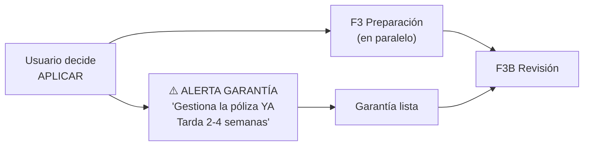

# Correcciones Hefesto — 7 Gaps Resueltos

> Evaluación de Hefesto (experiencia real con KOSMIMA en licitaciones DGCP)
> aplicada a las specs F1-F4 de DGCP INTEL
> 2026-03-14

---

## GAP 1: SaaS Dual — Oferentes + Entidades Compradoras

Hefesto señala que el SaaS solo contempla oferentes. Pero las entidades
compradoras (hospitales, ministerios, ayuntamientos) también necesitan herramientas.

### Modelo actual (oferente)

```
Empresa → detectar oportunidades → preparar oferta → enviar → ganar
```

### Modelo expandido (dual)

```
OFERENTE (actual):
  Empresa → detectar → preparar → enviar → ganar

ENTIDAD COMPRADORA (nuevo):
  Entidad → publicar proceso → recibir ofertas → evaluar → adjudicar
  Incluye: generar actos administrativos, evaluaciones, adjudicaciones
```

### Impacto en el producto

| Módulo | Oferente | Entidad Compradora |
|--------|----------|-------------------|
| F1 Detección | Scan API para mí | N/A (ellos publican) |
| F2 Inteligencia | Score + red flags | Análisis de ofertas recibidas |
| F3 Preparación | Generar Sobre A/B | Generar pliegos, actas, evaluaciones |
| F3B Revisión | Verificar mi oferta | Verificar cumplimiento de oferentes |
| F4 Entrega | Subir al portal | Publicar resultados, notificar |

### Decisión

**Para V1: solo oferentes.** El módulo de entidades es una expansión V2.
Pero la arquitectura debe contemplarlo:

```sql
-- tenants.tipo ya existe, agregar:
-- 'oferente' (actual)
-- 'entidad' (futuro V2)

-- La tabla ref_entidades_historial ya sirve para ambos lados
```

### Plan de negocio expandido

| Plan | Oferente | Entidad |
|------|----------|---------|
| STARTER | Detectar (gratis) | N/A |
| GROWTH | Detectar + Preparar ($49/mes) | Evaluar ofertas ($99/mes) |
| SCALE | Full pipeline ($149/mes) | Full gestión + actas ($249/mes) |

---

## GAP 2: API Correcta — datosabiertos.dgcp.gob.do

### Lo que la spec dice

```
api.dgcp.gob.do/api/releases (formato OCDS)
```

### Lo que Hefesto usa en la práctica

```
datosabiertos.dgcp.gob.do/api-dgcp/v1/procesos
datosabiertos.dgcp.gob.do/api-dgcp/v1/articulos
datosabiertos.dgcp.gob.do/api-dgcp/v1/documentos
```

### Comparación

| Aspecto | api.dgcp.gob.do (OCDS) | datosabiertos.dgcp.gob.do |
|---------|----------------------|--------------------------|
| Formato | OCDS estándar internacional | API propietaria DGCP |
| Datos de proceso | Básicos (título, monto, fechas) | Completos (artículos, documentos, participantes) |
| Artículos/ítems | Dentro del release (limitado) | Endpoint dedicado `/articulos` con UNSPSC |
| Documentos | Links (a veces rotos) | Endpoint dedicado `/documentos` |
| Filtros | Limitados | Más granulares (por entidad, modalidad, monto) |
| Estabilidad | Estable | Estable |

### Corrección al código

```typescript
// packages/ocds-client/src/client.ts
// ANTES: solo OCDS
const OCDS_API = 'https://api.dgcp.gob.do/api/releases'

// DESPUÉS: OCDS + API nativa para datos completos
const OCDS_API = 'https://api.dgcp.gob.do/api/releases'
const DGCP_API = 'https://datosabiertos.dgcp.gob.do/api-dgcp/v1'

// Estrategia dual:
// 1. OCDS para scan masivo (releases paginados, detección rápida)
// 2. DGCP nativa para enriquecer datos (artículos, documentos, participantes)
```

```typescript
// packages/ocds-client/src/dgcp-native-client.ts (NUEVO)

interface DGCPNativeClient {
  getProcesos(filtros: FiltrosProceso): Promise<Proceso[]>
  getArticulos(procesoId: string): Promise<Articulo[]>
  getDocumentos(procesoId: string): Promise<Documento[]>
  getParticipantes(procesoId: string): Promise<Participante[]>
}

interface FiltrosProceso {
  modalidad?: string
  mipyme?: boolean
  monto_min?: number
  monto_max?: number
  entidad?: string
  estado?: string
  fecha_desde?: string
}
```

### Pipeline actualizado

```
Scan (OCDS) → Detectar nuevos procesos
  ↓
Enriquecer (DGCP nativa) → artículos, documentos, participantes
  ↓
Score → con datos completos (UNSPSC de artículos, no estimados)
```

---

## GAP 3: Formularios Faltantes

### SNCC.F.040 — Conflicto de Interés

```typescript
// Ya mencionado en checklist pero falta la generación

async function generarF040(empresa: DatosEmpresa, proceso: DatosProceso): Promise<Buffer> {
  // Declaración del oferente de que NO tiene:
  // - Relación familiar con funcionarios de la entidad
  // - Participación accionaria en empresas relacionadas
  // - Contratos vigentes que generen conflicto
  //
  // Campos auto-fill:
  // - Nombre empresa, RNC, representante legal
  // - Código y nombre del proceso
  // - Fecha
  // - Espacio para firma
}
```

### SNCC.D.049 — Experiencia Específica

**EL MÁS DIFÍCIL DE AUTOMATIZAR** (Hefesto lo confirma)

```typescript
interface ExperienciaSimilar {
  proyecto_nombre: string
  entidad_contratante: string  // quién contrató
  monto_contrato: number       // valor del contrato
  fecha_inicio: string
  fecha_fin: string
  objeto: string               // descripción del trabajo realizado
  contacto_referencia: string  // nombre + teléfono para verificar
  porcentaje_ejecutado: number // % completado
}

// El problema: esto requiere DATOS REALES de la empresa
// No se puede inventar — la entidad VERIFICA las referencias
// La IA puede:
//   1. Formatear los datos que el usuario ingresa
//   2. Sugerir cuáles proyectos son más relevantes para este proceso
//   3. Generar el documento con formato DGCP
// La IA NO puede:
//   1. Inventar proyectos que no existen
//   2. Generar referencias verificables falsas

// Flujo:
// 1. Usuario ingresa sus proyectos anteriores en perfil (una vez)
// 2. Al aplicar, IA selecciona los 3-5 más relevantes
// 3. IA genera D.049 con formato DGCP
// 4. Usuario VERIFICA que los datos sean correctos
```

### UI para capturar experiencia

```
📋 TUS PROYECTOS ANTERIORES
(Estos datos se usan para el formulario D.049 — Experiencia)

Proyecto 1:
  Nombre: Pintura Hospital Robert Read Cabral
  Contratante: Ministerio de Salud Pública
  Monto: RD$ 850,000
  Período: Ene 2025 — Mar 2025
  Objeto: Pintura acrílica interior/exterior, 1,200 m²
  Referencia: Ing. Carlos Gómez, 809-555-1234
  Estado: 100% ejecutado ✅

[+ AGREGAR PROYECTO]

💡 Recomendación: Tener al menos 3 proyectos similares
   mejora significativamente las chances de habilitación.
```

### Formulario de Debida Diligencia (obligatorio desde 2025)

```typescript
// Nuevo formulario obligatorio — prevención lavado de activos
async function generarDebidaDiligencia(empresa: DatosEmpresa): Promise<Buffer> {
  // Datos de la empresa
  // Origen de los fondos
  // Beneficiarios finales (personas físicas con >25% participación)
  // Declaración de no estar en listas restrictivas
  // PEP (Personas Expuestas Políticamente) — ¿algún socio lo es?
  //
  // NOTA: Puede requerir notarización según la entidad
}
```

---

## GAP 4: Garantía — Alertar TEMPRANO

### Problema
Las pólizas de garantía tardan 2-4 semanas en gestionarse.
Si alertamos al final (en F3B revisión), ya es tarde.

### Corrección



### Implementación

```typescript
// En el momento que el usuario dice "APLICAR"
async function onAplicar(tenantId: string, oportunidadId: string): Promise<void> {
  const oportunidad = await getOportunidad(oportunidadId)
  const empresa = await getEmpresaPerfil(tenantId)
  const modalidad = oportunidad.licitacion.modalidad

  // Verificar si necesita garantía
  const necesitaGarantia = modalidad === 'LICITACION_PUBLICA' ||
    (modalidad === 'COMPARACION_PRECIOS' && !empresa.es_mipyme)

  if (necesitaGarantia) {
    const montoGarantia = oportunidad.licitacion.monto_estimado *
      (empresa.es_mipyme ? 0.01 : 0.04)

    // Alertar INMEDIATAMENTE
    await enviarAlertaTelegram(tenantId, {
      tipo: 'GARANTIA_URGENTE',
      mensaje: `⚠️ GESTIONA LA GARANTÍA AHORA

Proceso: ${oportunidad.licitacion.titulo}
Garantía requerida: RD$ ${formatRD(montoGarantia)}
Tipo: Póliza de seguro incondicional
Plazo gestión: 2-4 semanas

Cierre del proceso: ${oportunidad.licitacion.fecha_cierre}
Días restantes: ${diasRestantes(oportunidad.licitacion.fecha_cierre)}

👉 Contacta tu aseguradora HOY.
Sin garantía = no puedes enviar la oferta.`,
    })
  }
}
```

### Futuro: integración aseguradoras digitales

```typescript
// Killer feature para V2
interface AseguradoraDigital {
  nombre: string              // "Seguros Banreservas", "Mapfre BHD"
  api_disponible: boolean
  tiempo_emision: string      // "24-48 horas" vs "2-4 semanas"
  monto_max: number
  comision_pct: number
}

// Si hay convenio digital → emitir póliza desde la plataforma
// Si no → instrucciones paso a paso + alerta temprana
```

---

## GAP 5: Subsanación como Flujo Separado

La subsanación es un momento CRÍTICO post-envío. No es parte de F3B (revisión pre-envío),
es un flujo aparte que ocurre cuando la entidad pide correcciones después de abrir el Sobre A.

### Regla fundamental

```
SUBSANABLE (se puede corregir en 4 días):
  ✅ Certificación DGII
  ✅ Certificación TSS
  ✅ Registro mercantil
  ✅ Estatutos
  ✅ Acta de designación
  ✅ Cédula
  ✅ F.034, F.042, F.040

NO SUBSANABLE (error = descalificación inmediata):
  ❌ Oferta técnica
  ❌ D.049 Experiencia
  ❌ Compromiso ético
  ❌ Certificado MIPYME (si proceso exclusivo)
  ❌ Plan de trabajo
  ❌ Cronograma
```

### UI de subsanación

```
┌─────────────────────────────────────────────────────┐
│ 🔧 SUBSANACIÓN REQUERIDA                            │
│ CESAC-DAF-CM-2026-0015                               │
├─────────────────────────────────────────────────────┤
│                                                      │
│ ⏰ COUNTDOWN: 3 días 14 horas 22 min                │
│ ████████████░░░░░░░░ 2 de 4 días usados              │
│ Plazo límite: 2026-04-08 16:00                       │
│                                                      │
│ Documentos a corregir:                               │
│                                                      │
│ 1. 🔲 Certificación TSS                             │
│    Razón: "Certificación presentada está vencida"    │
│    Acción: Descargar nueva en tss.gob.do             │
│    [SUBIR NUEVA TSS]                                 │
│                                                      │
│ 2. 🔲 Acta de designación                           │
│    Razón: "Falta firma del secretario de la junta"   │
│    Acción: Obtener acta con firma completa           │
│    [SUBIR ACTA CORREGIDA]                            │
│                                                      │
│ Estado: 0/2 corregidos                               │
│                                                      │
│ ⚠️ Si no subsanas antes del plazo:                  │
│    Tu oferta será RECHAZADA                          │
│                                                      │
│ [SUBIR AL PORTAL] [NECESITO AYUDA → GUARDIAN]        │
└─────────────────────────────────────────────────────┘
```

### Alertas de subsanación (escalamiento)

```
Día 1: "🔧 Subsanación requerida — 4 días restantes — [VER DETALLE]"
Día 2: "⚠️ Subsanación pendiente — 3 días restantes"
Día 3: "🔴 URGENTE: 2 días para subsanar — sin corrección = rechazo"
Día 4: "🚨 ÚLTIMO DÍA: Subsanar ANTES de las 16:00"
```

---

## GAP 6: BD de Precios — 3 Mejoras

### 6A. Actualización periódica

```sql
-- Agregar tracking de actualización
ALTER TABLE ref_precios_materiales
  ADD COLUMN region TEXT DEFAULT 'nacional',
  ADD COLUMN fecha_cotizacion DATE,
  ADD COLUMN vigente BOOLEAN DEFAULT true;

-- Vista para alertar precios desactualizados
CREATE VIEW precios_desactualizados AS
SELECT nombre, precio_rd, updated_at,
  EXTRACT(DAYS FROM now() - updated_at) as dias_sin_actualizar
FROM ref_precios_materiales
WHERE EXTRACT(DAYS FROM now() - updated_at) > 180  -- >6 meses
ORDER BY dias_sin_actualizar DESC;
```

### 6B. Precios por región

```sql
-- Factores de ajuste regional
CREATE TABLE ref_factores_region (
  id UUID DEFAULT gen_random_uuid() PRIMARY KEY,
  region TEXT NOT NULL,           -- 'santo_domingo', 'santiago', 'este', 'sur', 'norte'
  factor NUMERIC NOT NULL,        -- 1.0 = base, 1.15 = 15% más caro
  aplica_a TEXT NOT NULL,          -- 'materiales', 'mano_obra', 'transporte'
  notas TEXT
);

-- Ejemplo:
-- Santo Domingo: factor 1.0 (base)
-- Interior (Este): factor 1.08 (transporte +8%)
-- Interior (Sur): factor 1.12 (transporte +12%)
-- Santiago: factor 0.95 (más ferreterías, competencia)
```

### 6C. Rendimientos (CRÍTICO para APU)

```sql
CREATE TABLE ref_rendimientos (
  id UUID DEFAULT gen_random_uuid() PRIMARY KEY,
  actividad TEXT NOT NULL,           -- "Pintura acrílica 2 manos"
  unidad TEXT NOT NULL,              -- "m²/día"
  rendimiento_min NUMERIC NOT NULL,  -- 20
  rendimiento_max NUMERIC NOT NULL,  -- 30
  rendimiento_promedio NUMERIC NOT NULL, -- 25
  cuadrilla TEXT,                     -- "1 pintor + 1 ayudante"
  condiciones TEXT,                   -- "Superficie lisa, interior"
  fuente TEXT                         -- "CNS 2022" o "Experiencia KOSMIMA"
);

-- Sin rendimientos:
--   "Necesito pintar 500 m²" → ¿cuántos días? → ¿cuánta mano de obra? → ???
--
-- Con rendimientos:
--   500 m² ÷ 25 m²/día = 20 días-pintor
--   20 días × RD$ 1,933/día = RD$ 38,660
--   Eso es un APU correcto.
```

---

## GAP 7: Honestidad sobre Límites — Actualizar UI

La plataforma debe ser TRANSPARENTE sobre qué puede y qué no puede hacer.

### Pantalla de "Qué hace DGCP INTEL"

```
╔═══════════════════════════════════════════════════╗
║ DGCP INTEL — Lo que hacemos por ti                ║
╠═══════════════════════════════════════════════════╣
║                                                    ║
║ 🤖 LO QUE LA IA HACE (70%)                       ║
║  ✅ Detectar licitaciones que te convienen         ║
║  ✅ Calcular si vale la pena (score + rentabilidad)║
║  ✅ Generar 4 documentos profesionales             ║
║  ✅ Verificar coherencia y errores                 ║
║  ✅ Organizar todo para que subas al portal        ║
║  ✅ Rastrear estado hasta adjudicación             ║
║  ✅ Alertarte en cada paso por Telegram            ║
║                                                    ║
║ 👤 LO QUE TÚ HACES (30%)                         ║
║  📋 Decidir a cuál proceso aplicar                 ║
║  💰 Decidir el precio final                        ║
║  🖊️ Firmar los documentos                         ║
║  📄 Obtener certificaciones (DGII, TSS, MIPYME)   ║
║  🏦 Gestionar garantía bancaria (si aplica)        ║
║  💻 Subir los docs al portal DGCP                  ║
║  ✅ Confirmar el envío                              ║
║                                                    ║
║ ⚠️ La IA genera, TÚ decides y ejecutas.           ║
║    Las 3 decisiones clave son TUYAS.               ║
╚═══════════════════════════════════════════════════╝
```

---

## Resumen de cambios a aplicar

| Gap | Spec afectada | Cambio |
|-----|--------------|--------|
| 1. SaaS dual | ROADMAP_FASES.md | Agregar nota V2: módulo entidades compradoras |
| 2. API correcta | F1 + ocds-client | Dual: OCDS scan + DGCP nativa para enriquecer |
| 3. Formularios | F3_PREPARACION | Agregar F.040, D.049 (con UI de experiencia), debida diligencia |
| 4. Garantía temprana | F3B + pipeline | Alertar al momento de APLICAR, no al final |
| 5. Subsanación | F4 + nuevo flujo | UI separada con countdown, escalamiento de alertas |
| 6. BD precios | F2 + schema | Región + actualización periódica + rendimientos |
| 7. Transparencia | UI general | Pantalla "qué hacemos / qué haces tú" |

---

*JANUS — 2026-03-14*
*"Hefesto corrigió lo que yo idealicé. La experiencia real siempre gana."*
