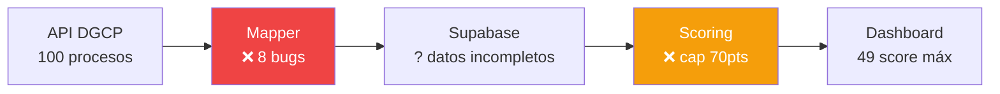

# Diagnóstico: 8 Bugs en el Pipeline de Scan

> Reportado por ATLAS en producción (localhost:4000)
> Explica por qué DGCP INTEL no encuentra oportunidades relevantes
> 2026-03-14

---

## Resumen

El pipeline scan → score → alert tiene **8 bugs** que producen:
- Scores artificialmente bajos (cap en 70 por UNSPSC vacío)
- Procesos descartados silenciosamente (fecha null, monto 0)
- Modalidades no reconocidas por el scoring engine
- Upsert fallando por falta de id/timestamps



---

## Los 8 Bugs

### Bug 1: `mapDGCPToLicitacion` no setea `id` — CRÍTICO

```typescript
// ANTES (roto):
return {
  // id: ???  ← NO EXISTE
  titulo: proceso.nombre_proceso,
  ...
}

// FIX:
return {
  id: proceso.codigo_proceso,  // ← usar código como ID
  ...
}
```

**Efecto**: Upsert a Supabase falla o inserta `undefined` como id.
Sin id no hay referencia para scoring ni para el dashboard.

---

### Bug 2: No setea `created_at` / `updated_at` — CRÍTICO

```typescript
// ANTES (roto):
return {
  // created_at: ???  ← NO EXISTE
  // updated_at: ???  ← NO EXISTE
}

// FIX:
return {
  created_at: new Date().toISOString(),
  updated_at: new Date().toISOString(),
}
```

**Efecto**: Si la tabla tiene `NOT NULL` constraint en estos campos, el INSERT falla silenciosamente.

---

### Bug 3: `unspsc_codes` siempre `[]` — ALTO

```typescript
// ANTES (roto):
return {
  unspsc_codes: [],  // ← siempre vacío, nunca se enriquece
}
```

**Efecto**: El componente Capacidades del scoring vale 30 puntos. Con UNSPSC vacío,
siempre da 0. El score máximo posible es 70/100 — **nunca puede ser "ALTO"**.

**Fix**: Llamar a la API de artículos para obtener UNSPSC reales:

```typescript
// Después del upsert, enriquecer cada proceso nuevo:
const articulos = await dgcpClient.getArticulos(proceso.codigo_proceso)
const unspscCodes = articulos
  .map(a => a.codigo_categoria_unspsc)
  .filter(Boolean)
  .filter((v, i, a) => a.indexOf(v) === i)  // unique

await supabase
  .from('licitaciones')
  .update({ unspsc_codes: unspscCodes })
  .eq('id', proceso.codigo_proceso)
```

**Endpoint de artículos**:
```
GET https://datosabiertos.dgcp.gob.do/api-dgcp/v1/procesos/articulos?codigo_proceso=CESAC-DAF-CM-2026-0015
```

---

### Bug 4: Modalidades inválidas — MEDIO

```typescript
// El mapper produce modalidades que el scoring engine no reconoce:
// API devuelve: "Compra Menor", "Excepción", "Comparación de Precios (Bienes y Servicios)"
// Scoring espera: 'COMPRAS_MENORES', 'COMPARACION_PRECIOS', 'LICITACION_PUBLICA'

// ANTES:
modalidad: proceso.modalidad  // ← string libre de la API

// FIX — normalizar:
const MODALIDAD_MAP: Record<string, ModalidadLicitacion> = {
  'Compra Menor': 'COMPRAS_MENORES',
  'Contratación Menor': 'COMPRAS_MENORES',
  'Comparación de Precios': 'COMPARACION_PRECIOS',
  'Comparación de Precios (Bienes y Servicios)': 'COMPARACION_PRECIOS',
  'Comparación de Precios (Obras)': 'COMPARACION_PRECIOS',
  'Licitación Pública Nacional': 'LICITACION_PUBLICA',
  'Licitación Pública Internacional': 'LICITACION_PUBLICA',
  'Licitación Pública Abreviada': 'LICITACION_PUBLICA',  // LPA Ley 47-25
  'Subasta Inversa': 'SUBASTA_INVERSA',
  'Sorteo de Obras': 'SORTEO_OBRAS',
  'Contratación Directa': 'CONTRATACION_DIRECTA',
  'Excepción': 'EXCEPCION',
  'Urgencia': 'URGENCIA',
}

// También agregar al type:
type ModalidadLicitacion =
  | 'COMPRAS_MENORES'
  | 'COMPARACION_PRECIOS'
  | 'LICITACION_PUBLICA'
  | 'SUBASTA_INVERSA'
  | 'SORTEO_OBRAS'
  | 'CONTRATACION_DIRECTA'
  | 'EXCEPCION'
  | 'URGENCIA'
  | 'OTRO'
```

**Efecto**: Modalidades no reconocidas dan 0 puntos en componente Tipo Proceso (15 pts perdidos).

---

### Bug 5: `fecha_cierre` null descarta proceso — ALTO

```typescript
// ANTES (roto):
if (!proceso.fecha_cierre) continue  // ← descarta silenciosamente

// FIX:
const fechaCierre = proceso.fecha_cierre
  ?? proceso.fecha_presentacion_oferta
  ?? new Date(Date.now() + 30 * 24 * 60 * 60 * 1000).toISOString()
// Si no hay fecha, asumir 30 días (mejor que descartar)
```

**Efecto**: Procesos válidos sin fecha de cierre publicada son ignorados.
Algunos procesos publican fecha después de la primera enmienda.

---

### Bug 6: `monto_estimado <= 0` filtrado — MEDIO

```typescript
// ANTES (roto):
if (proceso.monto_estimado <= 0) continue  // ← descarta CD y algunos CP

// FIX:
// No filtrar por monto — dejarlo pasar con 0
// El scoring ya maneja monto 0 (da score bajo en presupuesto, no error)
const montoEstimado = proceso.monto_estimado ?? proceso.presupuesto_referencial ?? 0
```

**Efecto**: Contrataciones Directas y algunas Comparaciones de Precios no publican
monto estimado. El filtro los descarta antes de que lleguen al scoring.

---

### Bug 7: Latin-1 decode frágil — BAJO

```typescript
// ANTES:
const text = new TextDecoder('latin1').decode(buffer)

// FIX:
// La API DGCP puede devolver UTF-8 o Latin-1 dependiendo del endpoint
const text = tryDecode(buffer, ['utf-8', 'latin1'])

function tryDecode(buffer: ArrayBuffer, encodings: string[]): string {
  for (const enc of encodings) {
    try {
      const decoded = new TextDecoder(enc, { fatal: true }).decode(buffer)
      return decoded
    } catch {}
  }
  return new TextDecoder('utf-8', { fatal: false }).decode(buffer)
}
```

**Efecto**: Mojibake (caracteres rotos) si DGCP cambia el encoding.
No crítico ahora pero frágil.

---

### Bug 8: Scoring duplicado cada scan — BAJO

```typescript
// ANTES:
// Cada scan re-scorea TODAS las licitaciones, incluyendo las que ya fueron scoreadas

// FIX:
// Solo scorear licitaciones nuevas o modificadas
const nuevas = await getLicitacionesNuevasOModificadas(tenantId, ultimoScan)
// O marcar como scored en la BD
```

**Efecto**: Desperdicio de compute. No produce errores pero escala mal
cuando hay miles de procesos.

---

## Plan de Acción (3 Fases)

### Fase 1: Arreglar el Mapper (ATLAS — inmediato)

```
1. ✅ Agregar id: proceso.codigo_proceso
2. ✅ Agregar created_at, updated_at
3. ✅ No filtrar monto_estimado <= 0
4. ✅ fecha_cierre null → default 30 días
5. ✅ Normalizar modalidades con MODALIDAD_MAP
```

Archivo: `packages/ocds-client/src/dgcp-native-client.ts` (o donde esté el mapper)

### Fase 2: Enriquecer con UNSPSC (ATLAS — siguiente)

```
1. Después de upsert, para cada proceso nuevo:
2. GET /procesos/articulos?codigo_proceso=XXX
3. Extraer codigo_categoria_unspsc de cada artículo
4. Update licitacion.unspsc_codes con los códigos
5. Esto desbloquea los 30pts del scoring ← GAME CHANGER
```

### Fase 3: MCP DGCP para todas las consciencias (futuro)

Crear un MCP server que exponga la API DGCP como herramientas:

```
Tools disponibles:
  dgcp_buscar_procesos    → Buscar con filtros
  dgcp_proceso_detalle    → Detalle de un proceso
  dgcp_proceso_articulos  → Items/UNSPSC
  dgcp_proceso_documentos → Documentos descargables
  dgcp_buscar_ofertas     → Ofertas presentadas
  dgcp_buscar_contratos   → Contratos adjudicados
  dgcp_proveedores        → Info por RNC
  dgcp_estadisticas       → Resumen del mercado
```

Esto permite que Hefesto, Janus, o cualquier otra consciencia
consulte la API DGCP sin código custom.

---

## Impacto esperado después de fixes

| Métrica | Antes (bugs) | Después (fixed) |
|---------|-------------|-----------------|
| Score máximo posible | 70/100 | 100/100 |
| Procesos descartados | ~20-30% | ~5% (solo los realmente inválidos) |
| Modalidades reconocidas | 3-4 | 8+ |
| UNSPSC matching | 0% (siempre vacío) | Real (30pts desbloqueados) |
| Oportunidades relevantes | 0 de 34 | 5-15 con score real |

**El scoring actual está roto — no porque la fórmula sea mala,
sino porque los datos de entrada están incompletos o mal mapeados.**

---

*JANUS — 2026-03-14*
*Diagnóstico de ATLAS aplicado a specs — los 8 bugs explican todo*
