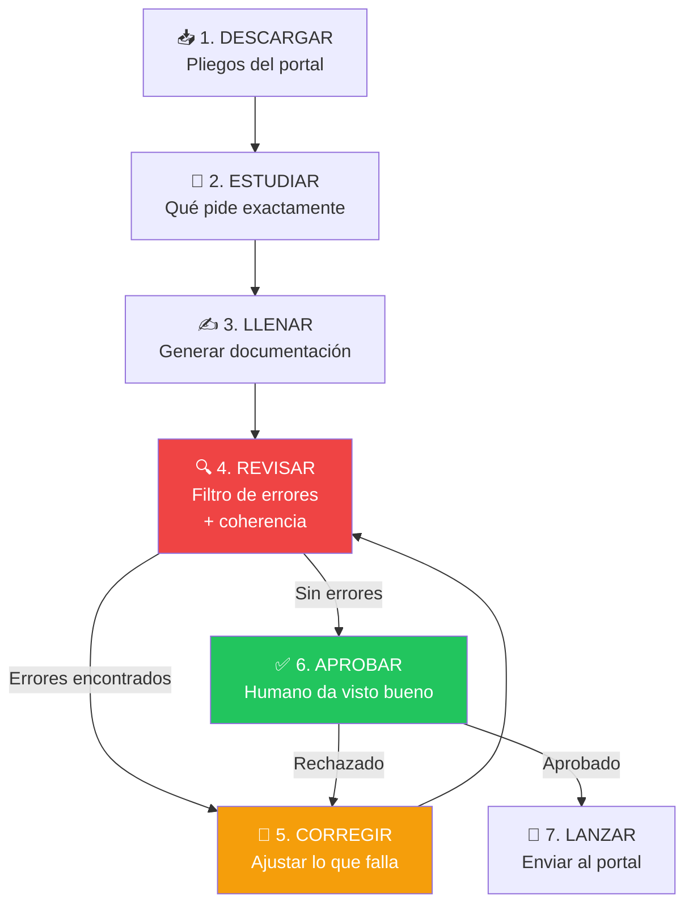
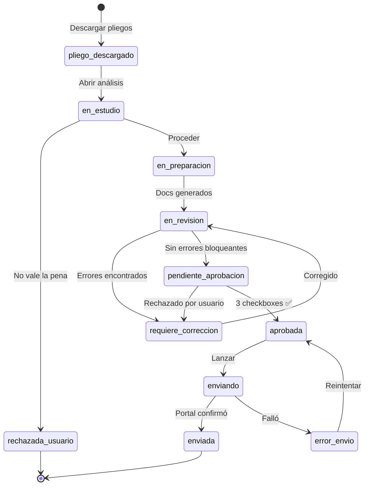

# F3B: REVISIÓN Y APROBACIÓN — Spec Completa

> El paso que faltaba: entre "generar docs" y "enviar" hay un ciclo completo de
> revisión, corrección y aprobación humana. Sin esto, se envían ofertas con errores.

---

## El flujo REAL (no el idealizado)



**El loop RE→CO→RE puede repetirse varias veces.** El sistema NO debe permitir
avanzar a "Lanzar" sin aprobación explícita del usuario.

---

## Paso 1: DESCARGAR — Obtener pliegos

No es solo bajar un PDF. Los pliegos incluyen:

| Documento | Qué contiene | Acción del sistema |
|-----------|-------------|-------------------|
| Pliego de condiciones | Reglas del juego completas | Extraer texto → IA analiza |
| Especificaciones técnicas | Qué exactamente se pide | Cruzar con perfil empresa |
| Formularios en blanco | SNCC.F.033, F.034, etc. | Usar como base para llenar |
| Enmiendas (si hay) | Cambios posteriores al pliego | ⚠️ ALERTA: pueden cambiar todo |
| Anexos | Planos, fotos, listados | Almacenar para referencia |

### Enmiendas — Peligro silencioso

```typescript
interface Enmienda {
  numero: number
  fecha: string
  resumen: string
  cambios_criticos: string[]  // qué cambió vs pliego original
  afecta_precio: boolean
  afecta_plazo: boolean
  afecta_requisitos: boolean
}

// El sistema debe:
// 1. Detectar si hay enmiendas nuevas desde la última descarga
// 2. Comparar enmienda vs pliego original
// 3. Alertar al usuario de cambios críticos
// 4. Si ya generamos docs → marcar como DESACTUALIZADOS
```

**Alerta Telegram**:
```
⚠️ ENMIENDA DETECTADA
[CESAC-DAF-CM-2026-0015]
Enmienda #2 publicada: 2026-03-15

Cambios críticos:
• Fecha cierre extendida: 2026-03-25 → 2026-04-01
• Cantidad pintura modificada: 500 gal → 620 gal
• Nuevo requisito: certificación ambiental

⚠️ Tus documentos generados están DESACTUALIZADOS
[REGENERAR DOCS] [VER ENMIENDA] [IGNORAR]
```

---

## Paso 2: ESTUDIAR — Análisis inteligente del pliego

Antes de llenar NADA, el sistema debe presentar un resumen ejecutivo
de qué pide el pliego y qué implica para la empresa.

### Ficha de Estudio

```
┌─────────────────────────────────────────────────────┐
│ 📖 ANÁLISIS DEL PLIEGO                              │
│ CESAC-DAF-CM-2026-0015 — Adquisición de pinturas     │
├─────────────────────────────────────────────────────┤
│                                                      │
│ 🎯 QUÉ PIDEN                                       │
│ • 620 galones de pintura acrílica premium            │
│ • 150 galones de esmalte industrial                  │
│ • Entrega en 3 lotes (semanal)                       │
│ • Garantía de calidad 12 meses                       │
│                                                      │
│ 📋 QUÉ NECESITAS TENER                              │
│ ✅ RPE activo con código 31211500 (Pinturas)         │
│ ✅ Certificado MIPYME vigente                        │
│ ⚠️ Certificación ambiental (¿la tienes?)            │
│ ✅ DGII al día                                       │
│ ✅ TSS al día                                        │
│                                                      │
│ ⏰ FECHAS CLAVE                                     │
│ • Consultas hasta: 2026-03-20                        │
│ • Cierre de ofertas: 2026-04-01 10:00 AM             │
│ • Apertura técnica: 2026-04-01 11:00 AM              │
│ • Subsanación: 4 días hábiles post-apertura          │
│                                                      │
│ 💰 ANÁLISIS ECONÓMICO RÁPIDO                        │
│ • Presupuesto referencial: RD$ 1,590,876             │
│ • Costo estimado (BD precios): RD$ 823,450           │
│ • Margen potencial: 48.2%                            │
│ • Garantía seriedad: RD$ 15,909 (1% MIPYME)         │
│                                                      │
│ ⚠️ PUNTOS DE ATENCIÓN                               │
│ • Entrega en 3 lotes → necesitas stock o proveedor   │
│ • Garantía 12 meses → verificar con fabricante       │
│ • Certificación ambiental → ¿tienes? Tiempo gestión  │
│                                                      │
│ 🤖 RECOMENDACIÓN GUARDIAN                           │
│ "Proceso viable. Margen saludable. Único riesgo:     │
│  la certificación ambiental — verificar si la        │
│  tienes o si hay tiempo para obtenerla."             │
│                                                      │
│ [PROCEDER A LLENAR] [DESCARTAR] [PREGUNTAR MÁS]     │
└─────────────────────────────────────────────────────┘
```

### Estado en la BD

```typescript
type EstadoOferta =
  | 'pliego_descargado'      // Paso 1 completado
  | 'en_estudio'             // Paso 2 — usuario revisando análisis
  | 'en_preparacion'         // Paso 3 — generando docs
  | 'en_revision'            // Paso 4 — filtro de errores activo
  | 'requiere_correccion'    // Paso 5 — hay errores, loop de vuelta
  | 'pendiente_aprobacion'   // Paso 6 — docs listos, esperando OK humano
  | 'aprobada'               // Paso 6 — humano aprobó
  | 'enviando'               // Paso 7 — upload en progreso
  | 'enviada'                // Paso 7 — confirmada en portal
  | 'rechazada_usuario'      // Usuario decidió no aplicar
```

---

## Paso 3: LLENAR — Generación con contexto

Ya documentado en F3_PREPARACION_SPEC.md. Aquí se generan:
- Formularios SNCC auto-llenados
- Oferta técnica narrativa (IA)
- Cotización con desglose
- APU si es construcción

**Pero NO se envía nada todavía.**

---

## Paso 4: REVISAR — Filtro de errores + coherencia

Este es el paso CRÍTICO que faltaba. El sistema ejecuta validaciones automáticas
antes de presentar los docs al usuario para aprobación.

### 4A. Validaciones automáticas (máquina)

```typescript
interface ResultadoRevision {
  aprobado: boolean
  errores: ErrorRevision[]
  advertencias: ErrorRevision[]
  coherencia: CoherenciaCheck[]
  completitud: CompletitudCheck
}

interface ErrorRevision {
  tipo: 'bloqueante' | 'advertencia'
  categoria: 'datos' | 'coherencia' | 'formato' | 'legal' | 'financiero'
  documento: string
  campo: string
  descripcion: string
  sugerencia: string
}
```

#### Checks de Datos

```typescript
function validarDatos(docs: DocumentosGenerados, empresa: DatosEmpresa, proceso: DatosProceso): ErrorRevision[] {
  const errores: ErrorRevision[] = []

  // RNC consistente en todos los documentos
  const rncs = extraerRNCDeTodos(docs)
  if (new Set(rncs).size > 1) {
    errores.push({
      tipo: 'bloqueante',
      categoria: 'datos',
      documento: 'Todos',
      campo: 'RNC',
      descripcion: `RNC inconsistente: aparecen ${[...new Set(rncs)].join(', ')}`,
      sugerencia: `Usar RNC correcto: ${empresa.rnc}`,
    })
  }

  // Nombre empresa exacto (incluyendo S.R.L., S.A.S., etc.)
  // Código proceso correcto en todos los docs
  // Fecha del proceso no vencida
  // Monto en números == monto en letras
  // RPE número correcto
  // Representante legal correcto
  // Cédula correcta

  return errores
}
```

#### Checks de Coherencia

```typescript
function validarCoherencia(docs: DocumentosGenerados): ErrorRevision[] {
  const errores: ErrorRevision[] = []

  // Monto en F.033 == monto en cotización == monto en oferta técnica
  if (docs.f033.monto_total !== docs.cotizacion.total_con_itbis) {
    errores.push({
      tipo: 'bloqueante',
      categoria: 'coherencia',
      documento: 'F.033 vs Cotización',
      campo: 'Monto total',
      descripcion: `F.033 dice RD$ ${docs.f033.monto_total} pero cotización dice RD$ ${docs.cotizacion.total_con_itbis}`,
      sugerencia: 'Unificar montos — usar el de la cotización como fuente de verdad',
    })
  }

  // Plazo en oferta técnica == plazo en cronograma
  // Cantidades en cotización == cantidades del pliego
  // ITBIS calculado correctamente (18%)
  // Subtotales suman al total
  // Vigencia de oferta >= lo que pide el pliego (usualmente 90 días)

  return errores
}
```

#### Checks de Completitud

```typescript
interface CompletitudCheck {
  total_requeridos: number
  completados: number
  faltantes: string[]
  porcentaje: number
  puede_enviar: boolean  // false si falta algo NO subsanable
}

function validarCompletitud(
  checklist: ChecklistItem[],
): CompletitudCheck {
  const faltantes = checklist
    .filter(item => item.estado !== 'verificado' && item.estado !== 'generado')
    .map(item => item.documento)

  const no_subsanables_faltantes = checklist
    .filter(item => !item.subsanable && item.estado === 'pendiente')

  return {
    total_requeridos: checklist.length,
    completados: checklist.filter(i => i.estado === 'verificado' || i.estado === 'generado').length,
    faltantes,
    porcentaje: Math.round((checklist.length - faltantes.length) / checklist.length * 100),
    puede_enviar: no_subsanables_faltantes.length === 0,
  }
}
```

#### Checks Legales

```typescript
function validarLegal(docs: DocumentosGenerados, proceso: DatosProceso): ErrorRevision[] {
  const errores: ErrorRevision[] = []

  // Compromiso ético presente y firmado
  // Declaración jurada con fecha correcta
  // Conflicto de intereses con datos actualizados
  // MIPYME: certificación vigente si proceso es exclusivo MIPYME
  // Garantía de seriedad: monto correcto (1% o 4%)
  // Vigencia de oferta: no menor a lo requerido

  // Certificaciones vencidas
  if (docs.dgii_certificacion && estaVencida(docs.dgii_certificacion.fecha_vencimiento)) {
    errores.push({
      tipo: 'bloqueante',
      categoria: 'legal',
      documento: 'Certificación DGII',
      campo: 'Vigencia',
      descripcion: `Certificación DGII vencida: ${docs.dgii_certificacion.fecha_vencimiento}`,
      sugerencia: 'Obtener nueva certificación en dgii.gov.do antes de enviar',
    })
  }

  return errores
}
```

#### Checks Financieros

```typescript
function validarFinanciero(empresa: DatosEmpresa, proceso: DatosProceso): ErrorRevision[] {
  const errores: ErrorRevision[] = []

  // Índices financieros cumplen umbrales DGCP
  const indices = calcularIndices(empresa.balance_data)

  if (indices.solvencia < 1.20) {
    errores.push({
      tipo: 'bloqueante',
      categoria: 'financiero',
      documento: 'Estados financieros',
      campo: 'Solvencia',
      descripcion: `Índice de solvencia ${indices.solvencia.toFixed(2)} < 1.20 requerido`,
      sugerencia: 'No cumples el requisito financiero — evaluar si vale la pena aplicar',
    })
  }

  // Precio ofertado vs presupuesto referencial
  // Si oferta > presupuesto referencial → bloqueante (no adjudican por encima)
  // Si oferta < 50% del referencial → advertencia (precio temerario)

  return errores
}
```

### 4B. Reporte de Revisión (UI)

```
┌─────────────────────────────────────────────────────┐
│ 🔍 REVISIÓN — CESAC-DAF-CM-2026-0015                │
├─────────────────────────────────────────────────────┤
│                                                      │
│ 🔴 ERRORES BLOQUEANTES (2)                          │
│ ┌──────────────────────────────────────────────────┐ │
│ │ ❌ COHERENCIA: Monto en F.033 (RD$ 1,431,788)   │ │
│ │    ≠ cotización (RD$ 1,431,780)                   │ │
│ │    → Diferencia de RD$ 8 por redondeo ITBIS       │ │
│ │    [CORREGIR AUTOMÁTICO]                          │ │
│ │                                                    │ │
│ │ ❌ LEGAL: Certificación TSS vence en 3 días       │ │
│ │    → Renovar en tesoreria.gob.do antes de enviar  │ │
│ │    [MARCAR COMO RENOVADA]                         │ │
│ └──────────────────────────────────────────────────┘ │
│                                                      │
│ 🟡 ADVERTENCIAS (3)                                 │
│ ┌──────────────────────────────────────────────────┐ │
│ │ ⚠️ Oferta -10% bajo referencial — competitivo    │ │
│ │    pero no agresivo. OK si margen lo permite.     │ │
│ │                                                    │ │
│ │ ⚠️ Cronograma dice 15 días, pliego pide max 20.  │ │
│ │    Holgura de 5 días — aceptable.                 │ │
│ │                                                    │ │
│ │ ⚠️ SNCC.D.049 Experiencia: solo 2 proyectos      │ │
│ │    similares listados. Recomendable 3+.           │ │
│ └──────────────────────────────────────────────────┘ │
│                                                      │
│ ✅ CHECKS PASADOS (18)                               │
│ • RNC consistente en 5 documentos ✓                  │
│ • Nombre empresa correcto ✓                          │
│ • Código proceso correcto ✓                          │
│ • ITBIS 18% calculado correctamente ✓               │
│ • Subtotales suman al total ✓                        │
│ • UNSPSC compatible ✓                                │
│ • Índices financieros cumplen ✓                      │
│ • ... (11 más)                                       │
│                                                      │
│ 📊 COMPLETITUD                                      │
│ ████████████████████░░░░ 18/22 (82%)                │
│ Faltantes: DGII(renovar), TSS(renovar),             │
│            D.049(agregar proyecto), Garantía(póliza) │
│                                                      │
│ ⛔ NO SE PUEDE ENVIAR — 2 errores bloqueantes       │
│ [CORREGIR ERRORES] [VER TODOS LOS DOCS]             │
└─────────────────────────────────────────────────────┘
```

---

## Paso 5: CORREGIR — Loop de ajustes

Cuando hay errores, el sistema ofrece 3 tipos de corrección:

### Auto-corrección (sin intervención humana)

```typescript
// Errores que el sistema puede arreglar solo
const AUTO_CORREGIBLES = [
  'redondeo_itbis',          // Ajustar decimales
  'fecha_formato',           // DD/MM/YYYY vs YYYY-MM-DD
  'monto_letras',            // Recalcular monto en letras
  'subtotales_no_suman',     // Recalcular fórmulas
  'vigencia_oferta_corta',   // Extender a 90 días
]
```

### Semi-automática (IA sugiere, humano confirma)

```typescript
// IA sugiere corrección, usuario acepta o modifica
const SEMI_AUTO = [
  'experiencia_insuficiente',  // IA sugiere proyectos similares del perfil
  'cronograma_ajuste',         // IA recalcula con nuevos rendimientos
  'oferta_tecnica_debil',      // IA refuerza secciones débiles
]
```

### Manual (solo el humano puede resolver)

```typescript
// Requiere acción humana fuera del sistema
const MANUAL = [
  'certificacion_vencida',     // Ir a DGII/TSS a renovar
  'garantia_bancaria',         // Solicitar póliza a aseguradora
  'firma_documentos',          // Firma física del representante
  'certificacion_faltante',    // Obtener cert. ambiental, etc.
  'documentos_originales',     // Notarizar si aplica
]
```

### Historial de correcciones

```sql
CREATE TABLE revision_log (
  id UUID DEFAULT gen_random_uuid() PRIMARY KEY,
  submission_id UUID NOT NULL REFERENCES submissions(id),
  ronda INTEGER NOT NULL DEFAULT 1,    -- 1ra revisión, 2da, 3ra...
  total_errores INTEGER,
  total_advertencias INTEGER,
  total_checks_pasados INTEGER,
  errores JSONB,                       -- detalle de errores encontrados
  correcciones_aplicadas JSONB,        -- qué se corrigió
  revisado_por TEXT,                    -- 'sistema' o 'usuario'
  estado TEXT CHECK (estado IN ('con_errores', 'advertencias_only', 'limpio')),
  created_at TIMESTAMPTZ DEFAULT now()
);
```

---

## Paso 6: APROBAR — Gate humano obligatorio

**NINGUNA oferta se envía sin aprobación explícita del usuario.**

### Pantalla de aprobación

```
┌─────────────────────────────────────────────────────┐
│ ✅ APROBACIÓN FINAL                                  │
│ CESAC-DAF-CM-2026-0015 — Adquisición de pinturas     │
├─────────────────────────────────────────────────────┤
│                                                      │
│ 📋 RESUMEN DE LO QUE SE VA A ENVIAR                 │
│                                                      │
│ SOBRE A — Oferta Técnica (7 docs, 2.3 MB)           │
│  1. SNCC.F.034 Presentación          [👁️ Ver]       │
│  2. SNCC.F.042 Info oferente          [👁️ Ver]       │
│  3. Compromiso ético firmado          [👁️ Ver]       │
│  4. Oferta técnica narrativa          [👁️ Ver]  ⭐   │
│  5. SNCC.D.049 Experiencia            [👁️ Ver]       │
│  6. Certificación DGII               [👁️ Ver]       │
│  7. Certificación TSS (renovada)      [👁️ Ver]       │
│                                                      │
│ SOBRE B — Oferta Económica (3 docs, 890 KB)         │
│  1. SNCC.F.033 Oferta económica       [👁️ Ver]       │
│  2. Cotización desglosada (.xlsx)     [👁️ Ver]  ⭐   │
│  3. Garantía de seriedad (póliza)     [👁️ Ver]       │
│                                                      │
│ 💰 PRECIO FINAL: RD$ 1,431,788.40                   │
│    (Escenario -10% competitivo)                      │
│    Margen estimado: 45.7%                            │
│                                                      │
│ 🔍 REVISIÓN: 0 errores | 1 advertencia              │
│ ✅ 22/22 documentos completos                        │
│                                                      │
│ ⚠️ AL APROBAR:                                      │
│ • Se subirá al portal SECP automáticamente           │
│ • NO se puede retirar después del cierre             │
│ • Garantía de seriedad se activa                     │
│                                                      │
│ [📥 DESCARGAR ZIP] [🔙 VOLVER A REVISAR]            │
│                                                      │
│ ┌──────────────────────────────────────────────────┐ │
│ │         ☐ He revisado todos los documentos       │ │
│ │         ☐ Confirmo que los datos son correctos   │ │
│ │         ☐ Autorizo el envío al portal SECP       │ │
│ │                                                   │ │
│ │         [✅ APROBAR Y ENVIAR]                     │ │
│ └──────────────────────────────────────────────────┘ │
└─────────────────────────────────────────────────────┘
```

### Requisitos para habilitar el botón

```typescript
interface AprobacionRequisitos {
  revision_limpia: boolean           // 0 errores bloqueantes
  completitud_100: boolean           // 22/22 docs
  usuario_reviso_docs: boolean       // checkbox marcado
  usuario_confirma_datos: boolean    // checkbox marcado
  usuario_autoriza_envio: boolean    // checkbox marcado
  // Los 3 checkboxes son OBLIGATORIOS
}

function puedeEnviar(req: AprobacionRequisitos): boolean {
  return Object.values(req).every(v => v === true)
}
```

### Descarga previa

El usuario SIEMPRE debe poder descargar el ZIP completo para revisión
offline antes de aprobar. Esto es especialmente importante para:
- Representante legal que necesita firmar
- Contador que verifica los números
- Abogado que revisa términos legales

---

## Paso 7: LANZAR — Con confirmación

Ya documentado en F4_SUBMISSION_SPEC.md. Pero con un cambio clave:

### Confirmación de doble paso

```typescript
async function lanzarOferta(submissionId: string): Promise<void> {
  // 1. Verificar aprobación existe
  const aprobacion = await getAprobacion(submissionId)
  if (!aprobacion || !aprobacion.aprobada) {
    throw new ForbiddenError('Oferta no aprobada')
  }

  // 2. Verificar que no pasó mucho tiempo desde la aprobación
  const horasDesdeAprobacion = diffHoras(aprobacion.fecha, new Date())
  if (horasDesdeAprobacion > 24) {
    throw new Error('Aprobación expirada (>24h) — re-aprobar')
    // Los datos pueden haber cambiado, forzar nueva revisión
  }

  // 3. Verificar que el proceso sigue abierto
  const proceso = await verificarProcesoAbierto(aprobacion.proceso_codigo)
  if (!proceso.abierto) {
    throw new Error(`Proceso cerrado: ${proceso.razon}`)
  }

  // 4. Ejecutar envío (F4)
  await ejecutarSubmission(submissionId)
}
```

---

## Estado completo del flujo (state machine)



---

## Schema actualizado

```sql
-- Actualizar submissions con los nuevos estados
ALTER TABLE submissions
  DROP CONSTRAINT IF EXISTS submissions_estado_check;

ALTER TABLE submissions
  ADD CONSTRAINT submissions_estado_check
  CHECK (estado IN (
    'pliego_descargado',
    'en_estudio',
    'en_preparacion',
    'en_revision',
    'requiere_correccion',
    'pendiente_aprobacion',
    'aprobada',
    'enviando',
    'enviada',
    'error_envio',
    'rechazada_usuario',
    -- post-envío (de F4)
    'apertura_tecnica',
    'subsanacion',
    'apertura_economica',
    'evaluacion',
    'adjudicada',
    'rechazada',
    'desierta',
    'contrato'
  ));

-- Tabla de aprobaciones (audit trail)
CREATE TABLE aprobaciones (
  id UUID DEFAULT gen_random_uuid() PRIMARY KEY,
  submission_id UUID NOT NULL REFERENCES submissions(id),
  aprobada BOOLEAN NOT NULL,
  revision_ronda INTEGER NOT NULL,
  errores_al_aprobar INTEGER DEFAULT 0,
  advertencias_al_aprobar INTEGER DEFAULT 0,
  motivo_rechazo TEXT,        -- si el usuario rechaza
  ip_address TEXT,
  user_agent TEXT,
  created_at TIMESTAMPTZ DEFAULT now()
);
```

---

## Notificaciones en cada paso

| Paso | Canal | Mensaje |
|------|-------|---------|
| 1. Descargado | Dashboard | "Pliegos listos para estudio" |
| 2. Estudio listo | Dashboard + Telegram | "Análisis del pliego completado — ver resumen" |
| 3. Docs generados | Dashboard + Telegram | "Documentación lista para revisión (22 docs)" |
| 4. Errores encontrados | Dashboard + Telegram ⚠️ | "2 errores bloqueantes detectados — corregir antes de enviar" |
| 5. Correcciones aplicadas | Dashboard | "Correcciones aplicadas — ejecutando re-revisión" |
| 6. Pendiente aprobación | Telegram URGENTE | "Oferta lista para aprobar — ⏰ cierre en 3 días" |
| 7. Enviada | Telegram ✅ | "Oferta enviada exitosamente — confirmación #12345" |
| Error envío | Telegram 🔴 | "Error al enviar — [REINTENTAR] [VER DETALLE]" |

---

## Métricas del ciclo de revisión

```typescript
interface MetricasRevision {
  rondas_revision: number           // ¿cuántas veces se revisó?
  errores_primera_ronda: number     // calidad de la generación
  tiempo_estudio_min: number        // cuánto tardó en estudiar el pliego
  tiempo_revision_total_min: number // cuánto duró todo el ciclo de revisión
  auto_corregidos: number           // errores que el sistema arregló solo
  manuales_requeridos: number       // errores que necesitaron al humano
  docs_descargados_preview: number  // cuántas veces bajó el ZIP para revisar
}

// Estas métricas ayudan a mejorar la calidad de generación
// Si primera_ronda errores > 3 promedio → mejorar templates
// Si tiempo_revision > 2 horas promedio → simplificar UI
```

---

*JANUS — 2026-03-14*
*"Generar no es suficiente. Sin revisión no hay confianza. Sin confianza no hay envío."*
