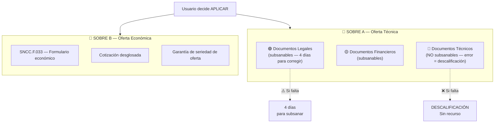

# F3: PREPARACIÓN — Spec Completa

> "Arma mi oferta" — Generación automática de Sobre A + Sobre B
> Fuente: HEFESTO_CORE (documentos reales generados para licitaciones RD)

---

## 1. Sistema de Dos Sobres

Toda licitación DGCP se presenta en **dos sobres separados**:



---

## 2. Sobre A — Documentos Legales (Subsanables)

Estos documentos se pueden corregir en un plazo de 4 días hábiles si faltan o tienen errores.
El sistema los genera automáticamente desde los datos del tenant.

### Formularios DGCP

| Formulario | Nombre | Generación |
|-----------|--------|-----------|
| SNCC.F.034 | Presentación de oferta | ✅ Auto — datos empresa + proceso |
| SNCC.F.042 | Información del oferente | ✅ Auto — RNC, RPE, representante legal |
| SNCCP-PROV-F-040 | Conflicto de interés | ✅ Auto — declaración estándar |
| — | Compromiso ético | ✅ Auto — texto fijo, firma del representante |
| — | Declaración jurada simple | ✅ Auto — texto estándar (NO requiere notario) |

### Documentos del tenant (ya existentes)

| Documento | Fuente | Notas |
|-----------|--------|-------|
| Certificación DGII | Tenant sube PDF | Vigencia: verificar fecha |
| Certificación TSS | Tenant sube PDF | Vigencia: verificar fecha |
| Registro mercantil | Tenant sube PDF | Una vez |
| Estatutos sociales | Tenant sube PDF | Una vez |
| Acta de asamblea (designación) | Tenant sube PDF | Una vez |
| Cédula representante legal | Tenant sube PDF | Una vez |
| Certificado MIPYME | Tenant sube PDF | Obligatorio para procesos exclusivos MIPYME |
| RPE activo | Sistema verifica | Verificar que códigos UNSPSC matcheen |

### Template Engine

```typescript
// apps/api/services/document-generator.ts

import { Document, Packer, Paragraph, TextRun } from 'docx'

interface DatosEmpresa {
  nombre_comercial: string
  rnc: string
  rpe: string
  representante_legal: string
  cedula_representante: string
  direccion: string
  telefono: string
  email: string
  clasificacion_mipyme: 'micro' | 'pequena' | 'mediana' | null
}

interface DatosProceso {
  codigo: string           // CEA-CCC-CP-2026-0009
  titulo: string
  entidad: string
  monto_referencial: number
  fecha_cierre: string
  modalidad: string
}

async function generarSNCC_F034(
  empresa: DatosEmpresa,
  proceso: DatosProceso,
): Promise<Buffer> {
  // Genera SNCC.F.034 — Presentación de Oferta
  // Campos: fecha, código proceso, nombre empresa, RNC, RPE
  // Declaración estándar de cumplimiento
  // Espacio para firma + sello
}

async function generarSNCC_F042(empresa: DatosEmpresa): Promise<Buffer> {
  // Genera SNCC.F.042 — Información del Oferente
  // Datos completos de la empresa
  // Socios/accionistas
  // Experiencia general
}

async function generarCompromisoEtico(
  empresa: DatosEmpresa,
  proceso: DatosProceso,
): Promise<Buffer> {
  // Texto fijo del compromiso ético DGCP
  // Firma representante legal
}
```

### Storage en Supabase

```sql
-- Documentos del tenant (subidos una vez, reutilizados)
-- Bucket: documentos-empresa/{tenant_id}/
--   dgii_certificacion.pdf
--   tss_certificacion.pdf
--   registro_mercantil.pdf
--   estatutos.pdf
--   acta_designacion.pdf
--   cedula_representante.pdf
--   mipyme_certificacion.pdf
--   firma_digital.jpg
--   sello_empresa.jpg

-- Documentos generados por proceso
-- Bucket: propuestas/{tenant_id}/{proceso_codigo}/
--   sobre_a/
--     SNCC_F034_presentacion.docx
--     SNCC_F042_informacion.docx
--     compromiso_etico.docx
--     declaracion_jurada.docx
--     conflicto_intereses.docx
--   sobre_b/
--     SNCC_F033_oferta_economica.docx
--     cotizacion_desglosada.xlsx
```

---

## 3. Sobre A — Documentos Financieros (Subsanables)

| Documento | Cálculo | Umbral DGCP |
|-----------|---------|-------------|
| Estados financieros auditados (2 años) | Tenant sube PDF | CPA certificado ICPARD |
| Declaración anual DGII (IR-1 o IR-2) | Tenant sube PDF | 2 años recientes |
| Ratio de solvencia | `Activo Total / Pasivo Total` | ≥ 1.20 |
| Ratio de liquidez | `(Activo Corriente - Inventarios) / Pasivo Corriente` | ≥ 0.90 |
| Ratio de endeudamiento | `Pasivo Total / Patrimonio Neto` | ≤ 1.50 |

El sistema pre-calcula los ratios (ver F2) y alerta si no cumple ANTES de generar docs.

---

## 4. Sobre A — Documentos Técnicos (NO Subsanables)

**CRÍTICO**: Si falta alguno de estos, es descalificación inmediata. Sin recurso.

| Documento | Generación | Notas |
|-----------|-----------|-------|
| Oferta técnica narrativa | IA + revisión humana | Metodología, plan trabajo, equipo, cronograma |
| SNCC.D.049 — Experiencia | Semi-auto | Requiere datos reales de proyectos ejecutados |
| Plan de trabajo | IA genera + template | Actividades, responsables, hitos |
| Cronograma de ejecución | Auto desde APU | Gantt con CPM, duración según rendimientos |
| Especificaciones técnicas | IA analiza pliego | Punto por punto vs requerimientos |
| Garantía de servicio | Auto | Período de garantía ofrecido |

### Generación de Oferta Técnica con IA

```typescript
// apps/api/services/oferta-tecnica.ts

async function generarOfertaTecnica(
  proceso: DatosProceso,
  empresa: DatosEmpresa,
  pliego: string,           // texto extraído del PDF del pliego
  experiencia: Proyecto[],   // proyectos similares ejecutados
): Promise<Buffer> {
  // 1. Analizar pliego → extraer requerimientos técnicos
  // 2. Generar narrativa: metodología propuesta
  // 3. Detallar equipo de trabajo (del tenant)
  // 4. Plan de trabajo fase por fase
  // 5. Cronograma referenciado
  // 6. Garantía de calidad

  // Claude genera el contenido, python-docx formatea
  // El humano DEBE revisar antes de enviar
}
```

---

## 5. Sobre B — Oferta Económica

### SNCC.F.033

```typescript
async function generarSNCC_F033(
  empresa: DatosEmpresa,
  proceso: DatosProceso,
  escenario: EscenarioPricing, // del F2, el que el usuario eligió
): Promise<Buffer> {
  // Formulario oficial DGCP
  // Precio total en letras y números
  // Vigencia de oferta (90 días estándar)
  // Declaración de precio firme
}
```

### Cotización desglosada (Excel)

```typescript
async function generarCotizacion(
  articulos: ArticuloProceso[],
  precios: PrecioCalculado[],
  escenario: EscenarioPricing,
): Promise<Buffer> {
  // Excel con:
  // - Columna A: Ítem
  // - Columna B: Descripción
  // - Columna C: Unidad
  // - Columna D: Cantidad
  // - Columna E: Precio unitario
  // - Columna F: Subtotal (fórmula)
  // - Total sin ITBIS
  // - ITBIS 18%
  // - TOTAL con ITBIS
}
```

### Garantía de Seriedad de Oferta

| Tipo empresa | Porcentaje | Forma |
|-------------|-----------|-------|
| MIPYME | 1% del monto ofertado | Póliza de seguro incondicional |
| Regular | 4% del monto ofertado | Póliza de seguro o cheque certificado |

```typescript
function calcularGarantia(
  monto_oferta: number,
  es_mipyme: boolean,
): { monto: number; tipo: string; plazo_gestion: string } {
  const pct = es_mipyme ? 0.01 : 0.04
  return {
    monto: monto_oferta * pct,
    tipo: 'Póliza de seguro incondicional e irrevocable',
    plazo_gestion: '2-4 semanas (solicitar con anticipación)',
  }
}
```

**Alerta importante**: La póliza tarda 2-4 semanas en conseguirse.
El sistema debe alertar al usuario TEMPRANO si necesita gestionar la garantía.

---

## 6. Checklist Dinámico por Modalidad

Hefesto genera checklists de 27-68 items según el tipo de proceso.
El sistema debe generar uno automáticamente.

```typescript
interface ChecklistItem {
  id: string
  categoria: 'legal' | 'financiero' | 'tecnico' | 'economico'
  sobre: 'A' | 'B'
  documento: string
  formulario?: string       // SNCC.F.034, etc.
  subsanable: boolean
  generado_auto: boolean    // true si el sistema lo genera
  requiere_original: boolean // true si necesita copia física
  estado: 'pendiente' | 'generado' | 'subido' | 'verificado'
}

function generarChecklist(
  modalidad: ModalidadLicitacion,
  es_mipyme: boolean,
  es_construccion: boolean,
): ChecklistItem[] {
  const items: ChecklistItem[] = []

  // Base: siempre requeridos
  items.push(
    { documento: 'Formulario presentación', formulario: 'SNCC.F.034', sobre: 'A', categoria: 'legal', subsanable: true, generado_auto: true, requiere_original: false },
    { documento: 'Info oferente', formulario: 'SNCC.F.042', sobre: 'A', categoria: 'legal', subsanable: true, generado_auto: true, requiere_original: false },
    { documento: 'Compromiso ético', sobre: 'A', categoria: 'legal', subsanable: false, generado_auto: true, requiere_original: false },
    { documento: 'Certificación DGII', sobre: 'A', categoria: 'legal', subsanable: true, generado_auto: false, requiere_original: false },
    { documento: 'Certificación TSS', sobre: 'A', categoria: 'legal', subsanable: true, generado_auto: false, requiere_original: false },
    // ... etc
  )

  // Condicionales
  if (es_mipyme) {
    items.push({ documento: 'Certificado MIPYME vigente', sobre: 'A', categoria: 'legal', subsanable: false, generado_auto: false, requiere_original: false })
  }

  if (es_construccion) {
    items.push(
      { documento: 'APU — Análisis de precios unitarios', sobre: 'B', categoria: 'economico', subsanable: false, generado_auto: true, requiere_original: false },
      { documento: 'Cronograma Gantt', sobre: 'A', categoria: 'tecnico', subsanable: false, generado_auto: true, requiere_original: false },
    )
  }

  return items
}
```

### UI del Checklist

```
📋 CHECKLIST — CESAC-DAF-CM-2026-0015 (22 items)

SOBRE A — Legal (8 items)
  ✅ SNCC.F.034 Presentación          [Auto-generado]
  ✅ SNCC.F.042 Info oferente          [Auto-generado]
  ✅ Compromiso ético                  [Auto-generado] ⚠️ NO SUBSANABLE
  🔲 Certificación DGII               [Subir PDF]
  🔲 Certificación TSS                [Subir PDF]
  ✅ Registro mercantil                [Ya subido]
  ✅ Cédula representante              [Ya subido]
  🔲 Certificado MIPYME               [Subir PDF] ⚠️ NO SUBSANABLE

SOBRE A — Financiero (3 items)
  🔲 Estados financieros auditados     [Subir PDF]
  🔲 Declaración DGII IR-2            [Subir PDF]
  ✅ Índices financieros               [Calculados: ✅ todos cumplen]

SOBRE A — Técnico (5 items)
  ✅ Oferta técnica narrativa          [IA generó — REVISAR] ⚠️ NO SUBSANABLE
  🔲 SNCC.D.049 Experiencia           [Llenar manual] ⚠️ NO SUBSANABLE
  ✅ Cronograma ejecución              [Auto-generado]
  ✅ Plan de trabajo                   [IA generó — REVISAR]
  ✅ Garantía de servicio              [Auto-generado]

SOBRE B — Económico (3 items)
  ✅ SNCC.F.033 Oferta económica       [Auto — Escenario -10%]
  ✅ Cotización desglosada             [Auto — Excel con ITBIS]
  🔲 Garantía de seriedad             [Solicitar póliza 1%: RD$ 15,908]

Progreso: 14/22 (64%) — Faltan 8 documentos
⚠️ ALERTA: Garantía de seriedad tarda 2-4 semanas
```

---

## 7. APU Generator (Análisis de Precios Unitarios)

Para procesos de construcción/mantenimiento, el APU es obligatorio.
Utiliza la BD de precios de F2 (importada de Hefesto).

```typescript
interface LineaAPU {
  partida: string           // "1.1 Pintura de paredes"
  materiales: {
    nombre: string
    unidad: string
    cantidad: number
    precio_unitario: number  // de ref_precios_materiales
    subtotal: number
  }[]
  mano_obra: {
    cargo: string
    cantidad_personas: number
    dias: number
    tarifa_diaria: number    // de ref_mano_obra
    subtotal: number
  }[]
  equipos: {
    nombre: string
    horas: number
    tarifa_hora: number
    subtotal: number
  }[]
  costo_directo: number
  gastos_generales_pct: number  // 10-15%
  utilidad_pct: number          // 10-20%
  precio_unitario: number
}
```

### Generación desde pliego

```
Pliego dice: "Pintura acrílica en paredes interiores, 500 m²"

→ Sistema calcula:
  Materiales: pintura (2 manos × 500m² ÷ 12m²/gal = 84 gal × RD$1,250) = RD$ 105,000
  Mano obra: pintor (500m² ÷ 25m²/día = 20 días × RD$1,933) = RD$ 38,660
  Equipos: andamios, brochas, rodillos = RD$ 8,000

  Costo directo: RD$ 151,660
  Gastos generales 12%: RD$ 18,199
  Utilidad 15%: RD$ 22,749
  Precio unitario: RD$ 192,608
  Precio/m²: RD$ 385.22
```

---

## Entregable F3

El usuario clickea "APLICAR" en una oportunidad y recibe:

1. **Checklist personalizado** con progreso visual
2. **Formularios auto-generados** (F.034, F.042, ético, conflicto)
3. **Oferta técnica** generada por IA (requiere revisión humana)
4. **Cotización Excel** con desglose y ITBIS
5. **Alerta de garantía** si necesita gestionar póliza bancaria
6. **ZIP descargable** con Sobre A y Sobre B listos

El humano solo necesita:
- Firmar documentos generados
- Subir certificaciones vigentes (DGII, TSS)
- Revisar oferta técnica generada por IA
- Gestionar garantía bancaria

---

*JANUS — 2026-03-14*
*Conocimiento: HEFESTO_CORE/LICITACIONES/KOSMIMA/ + HEFESTO_CORE/LICITACIONES/FORMULARIOS_DGCP/*
