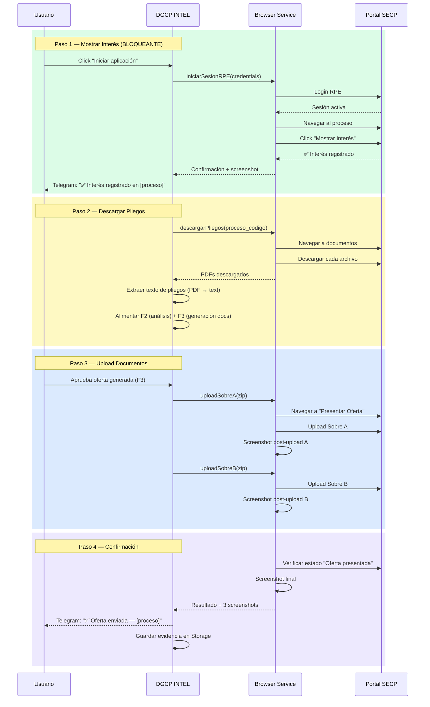
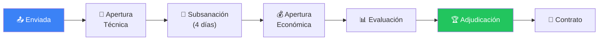

# F4: SUBMISSION — Spec Completa

> "Envía mi oferta al portal" — Automatización completa del envío al SECP
> Fuente: HEFESTO_CORE/PROTOCOLOS/PROTOCOLO_LICITACIONES_DGCP.md

---

## 1. Flujo Completo de Submission



---

## 2. Mostrar Interés — El paso que nadie automatiza

**CRITICAL**: Sin clickear "Mostrar Interés" en el portal SECP:
- No recibes notificaciones de enmiendas
- No puedes presentar oferta
- Es descalificación silenciosa

### Implementación Playwright

```typescript
// apps/browser/src/service/interest.ts

interface MostrarInteresResult {
  exito: boolean
  proceso_codigo: string
  screenshot: Buffer
  timestamp: string
  error?: string
}

async function mostrarInteres(
  page: Page,
  procesoCodigo: string,
): Promise<MostrarInteresResult> {
  // 1. Navegar a búsqueda de procesos
  await page.goto('https://comunidad.comprasdominicanas.gob.do/Public/Tendering/ContractNoticeManagement/Index')

  // 2. Buscar por código de proceso
  await page.fill('#searchBox', procesoCodigo)
  await page.click('#btnSearch')
  await page.waitForSelector('.contract-notice-row')

  // 3. Click en el proceso
  await page.click(`text=${procesoCodigo}`)
  await page.waitForLoadState('networkidle')

  // 4. Click "Mostrar Interés" / "Express Interest"
  const botonInteres = page.locator('button:has-text("Mostrar Interés"), button:has-text("Express Interest")')

  if (await botonInteres.isVisible()) {
    await botonInteres.click()
    await page.waitForTimeout(2000) // Esperar confirmación

    // 5. Screenshot de confirmación
    const screenshot = await page.screenshot({ fullPage: true })

    return {
      exito: true,
      proceso_codigo: procesoCodigo,
      screenshot,
      timestamp: new Date().toISOString(),
    }
  }

  // Ya mostró interés anteriormente
  return {
    exito: true,
    proceso_codigo: procesoCodigo,
    screenshot: await page.screenshot({ fullPage: true }),
    timestamp: new Date().toISOString(),
  }
}
```

### Timing

| Evento | Acción |
|--------|--------|
| Score ≥ 60 y usuario aprueba | Ejecutar `mostrarInteres()` inmediatamente |
| Score ≥ 80 (auto) | Ejecutar `mostrarInteres()` automáticamente (plan SCALE) |
| Fallo en login RPE | Telegram: "⚠️ No pude registrar interés — verifica credenciales RPE" |

---

## 3. Descarga de Pliegos

Los pliegos (bases de licitación) son PDF que el portal publica.
Contienen toda la información del proceso: requerimientos, fechas, formularios.

```typescript
// apps/browser/src/service/download.ts

interface PliegoDescargado {
  nombre: string
  tipo: 'pliego' | 'enmienda' | 'formulario' | 'anexo'
  buffer: Buffer
  size_kb: number
}

async function descargarPliegos(
  page: Page,
  procesoCodigo: string,
): Promise<PliegoDescargado[]> {
  // 1. Navegar a la sección de documentos del proceso
  // 2. Listar todos los archivos disponibles
  // 3. Descargar cada uno
  // 4. Clasificar: pliego principal, enmiendas, formularios, anexos

  // Nota: Algunos procesos tienen enmiendas que modifican el pliego original
  // El sistema debe detectar enmiendas y alertar al usuario
}
```

### Extracción de texto

```typescript
// apps/api/services/pliego-parser.ts

async function extraerTextoPliego(pdf: Buffer): Promise<{
  texto_completo: string
  secciones: {
    requerimientos_tecnicos: string
    requerimientos_financieros: string
    cronograma: string
    articulos: ArticuloExtraido[]
    fechas: { evento: string; fecha: string }[]
  }
}> {
  // 1. PDF → texto (pdf-parse)
  // 2. Claude analiza y estructura en secciones
  // 3. Extrae artículos con cantidades y UNSPSC
  // 4. Extrae fechas clave (apertura, cierre, subsanación)
}
```

---

## 4. Upload de Documentos

### Sobre A (Oferta Técnica)

```typescript
// apps/browser/src/service/upload.ts

async function uploadSobreA(
  page: Page,
  procesoCodigo: string,
  archivoZip: Buffer,
): Promise<UploadResult> {
  // 1. Navegar a "Presentar Oferta" del proceso
  await page.goto(`https://comunidad.comprasdominicanas.gob.do/.../${procesoCodigo}/submit`)

  // 2. Localizar input de Sobre A
  const inputA = page.locator('input[type="file"][name*="sobre_a"], input[type="file"][name*="technical"]')

  // 3. Upload ZIP
  await inputA.setInputFiles({
    name: `SOBRE_A_${procesoCodigo}.zip`,
    mimeType: 'application/zip',
    buffer: archivoZip,
  })

  // 4. Esperar confirmación de upload
  await page.waitForSelector('.upload-success, .file-uploaded')

  // 5. Screenshot
  return {
    exito: true,
    screenshot: await page.screenshot({ fullPage: true }),
  }
}
```

### Sobre B (Oferta Económica)

```typescript
async function uploadSobreB(
  page: Page,
  procesoCodigo: string,
  archivoZip: Buffer,
): Promise<UploadResult> {
  // Mismo flujo que Sobre A pero para input de Sobre B
  // IMPORTANTE: Sobre B se sube DESPUÉS de Sobre A
  // Algunos portales requieren confirmar Sobre A antes de habilitar Sobre B
}
```

### Confirmación Final

```typescript
async function confirmarEnvio(page: Page): Promise<{
  exito: boolean
  numero_confirmacion: string
  screenshot: Buffer
}> {
  // 1. Click botón "Enviar Oferta" / "Submit Offer"
  // 2. Confirmar diálogo de confirmación
  // 3. Esperar número de confirmación
  // 4. Screenshot COMPLETO como evidencia legal
  // 5. Guardar HTML de la página como respaldo
}
```

---

## 5. Tracking Post-Submission

Después de enviar, el proceso pasa por varias etapas que el sistema monitorea:



### Worker de Monitoreo

```typescript
// apps/worker/processors/track.ts

async function processTrack(job: Job<TrackData>): Promise<void> {
  const { proceso_codigo, tenant_id } = job.data

  // 1. Login al portal
  // 2. Verificar estado actual del proceso
  // 3. Comparar con estado anterior en BD
  // 4. Si cambió → notificar al usuario

  // Estados a detectar:
  // - "Apertura técnica realizada" → revisar si subsanación necesaria
  // - "Período de subsanación" → URGENTE si hay docs faltantes
  // - "Apertura económica realizada" → ya no hay vuelta atrás
  // - "Adjudicado" → verificar si somos nosotros
  // - "Desierto" → no hubo ganador

  // Frecuencia: cada 6 horas durante período activo
}
```

### Alertas Telegram de seguimiento

```
📤 OFERTA ENVIADA
[CESAC-DAF-CM-2026-0015]
Confirmación: #2026-03-14-00451
Screenshot guardado ✅

📂 APERTURA TÉCNICA
[CESAC-DAF-CM-2026-0015]
Estado: Sobre A abierto
⚠️ Subsanación requerida: Certificación TSS vencida
Plazo: 4 días hábiles (hasta 2026-03-20)
[SUBIR DOCUMENTO]

🏆 ADJUDICACIÓN
[CESAC-DAF-CM-2026-0015]
Resultado: ADJUDICADO A TU EMPRESA ✅
Monto: RD$ 1,431,788
Siguiente: Firma de contrato en 10 días hábiles
[VER DETALLES] [PREPARAR CONTRATO]
```

---

## 6. Post-Adjudicación (si gana)

```typescript
interface PostAdjudicacion {
  contrato: {
    plazo_firma: number       // típicamente 10 días hábiles
    garantia_fiel_cumplimiento: {
      porcentaje: number      // 1% MIPYME, 4% regular
      monto: number
      tipo: string            // "Póliza de seguro"
    }
    anticipo: {
      disponible: boolean
      porcentaje: number      // 20-50% para MIPYME
      garantia_buen_uso: number // % del anticipo
    }
  }
  documentos_contrato: string[]
  // - Acta de adjudicación firmada
  // - Garantía de fiel cumplimiento
  // - Garantía de buen uso de anticipo (si aplica)
  // - Documentos contractuales
}
```

---

## 7. Seguridad del Browser Service

| Medida | Implementación |
|--------|---------------|
| Credenciales RPE | AES-256-GCM, nunca en logs, decrypt solo en memoria |
| Sesiones Playwright | storageState reutilizable (evita login repetido) |
| Screenshots | Almacenados en Supabase Storage, RLS por tenant |
| Docker aislado | Cada tenant = container separado (plan SCALE) |
| Rate limit | Max 5 operaciones portal / hora / tenant |
| Audit log | Cada interacción con portal queda registrada |
| Fallback manual | Si automation falla, instrucciones paso a paso para el usuario |

---

## 8. Schema adicional

```sql
-- Tracking de submissions
CREATE TABLE submissions (
  id UUID DEFAULT gen_random_uuid() PRIMARY KEY,
  tenant_id UUID NOT NULL REFERENCES tenants(id),
  oportunidad_id UUID NOT NULL REFERENCES oportunidades_tenant(id),
  estado TEXT NOT NULL DEFAULT 'pendiente'
    CHECK (estado IN ('pendiente', 'interes_registrado', 'pliegos_descargados',
                      'docs_generados', 'sobre_a_subido', 'sobre_b_subido',
                      'enviada', 'apertura_tecnica', 'subsanacion',
                      'apertura_economica', 'evaluacion', 'adjudicada',
                      'rechazada', 'desierta', 'contrato')),
  numero_confirmacion TEXT,
  screenshots JSONB DEFAULT '[]',
  docs_generados JSONB DEFAULT '[]',
  alertas_subsanacion JSONB,
  resultado TEXT,
  monto_adjudicado NUMERIC,
  created_at TIMESTAMPTZ DEFAULT now(),
  updated_at TIMESTAMPTZ DEFAULT now()
);

ALTER TABLE submissions ENABLE ROW LEVEL SECURITY;

CREATE POLICY "tenant_submissions" ON submissions
  FOR ALL USING (tenant_id = get_tenant_id());

-- Audit log de operaciones portal
CREATE TABLE portal_audit_log (
  id UUID DEFAULT gen_random_uuid() PRIMARY KEY,
  tenant_id UUID NOT NULL REFERENCES tenants(id),
  submission_id UUID REFERENCES submissions(id),
  accion TEXT NOT NULL,      -- 'login', 'mostrar_interes', 'upload_sobre_a', etc.
  exito BOOLEAN NOT NULL,
  detalle JSONB,
  screenshot_url TEXT,
  created_at TIMESTAMPTZ DEFAULT now()
);
```

---

## Entregable F4

El flujo completo end-to-end:

```
1. F1 detecta licitación → score 85 → alerta Telegram
2. F2 analiza → sin red flags, UNSPSC compatible, escenarios rentables
3. Usuario dice "APLICAR"
4. F4 → "Mostrar Interés" automático → descarga pliegos
5. F3 genera docs → checklist 18/22 completado
6. Usuario sube 4 docs faltantes + revisa oferta técnica
7. F4 → Upload Sobre A + Sobre B → screenshot confirmación
8. Tracking automático → alertas de estado → adjudicación
```

**El usuario pasó de "no sé qué hay" a "ya apliqué" sin tocar el portal SECP.**

---

*JANUS — 2026-03-14*
*Conocimiento: HEFESTO_CORE/PROTOCOLOS/PROTOCOLO_LICITACIONES_DGCP.md (6 fases reales)*
