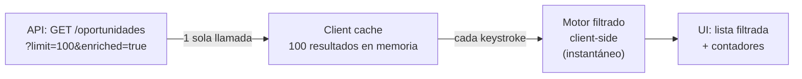

# Motor de Búsqueda de Oportunidades — Spec

> Comportamiento: cargar 100 resultados → mostrar todos → filtrar client-side en tiempo real
> Como un buscador: escribes y los resultados se reducen instantáneamente
> 2026-03-14

---

## Concepto

```
SIN FILTRO: 100 licitaciones cargadas, todas visibles
           ↓ usuario escribe "pintura"
CON FILTRO: 8 resultados que contienen "pintura" (instantáneo, sin llamada API)
           ↓ usuario agrega filtro "Obras"
REFINADO:   3 resultados de tipo Obras que contienen "pintura"
           ↓ usuario sube score mínimo a 60
FINAL:      2 resultados relevantes
```

**No es paginación server-side.** Es carga masiva + filtrado client-side.

---

## Arquitectura



### Por qué client-side y no server-side

| Server-side | Client-side (elegido) |
|------------|----------------------|
| Cada filtro = nueva llamada API | Una sola carga, filtros instantáneos |
| Latencia 200-500ms por cambio | Latencia 0ms — se siente como Google |
| Más carga en servidor | Cero carga adicional en servidor |
| Complejo: debounce, loading states | Simple: filter/sort en array JS |
| 100 resultados = ~50KB JSON | Cabe en memoria sin problema |

---

## API: Un solo endpoint enriquecido

```typescript
// GET /oportunidades?limit=100&enriched=true
// Retorna todo lo que el frontend necesita para filtrar

interface OportunidadEnriquecida {
  id: string
  // Datos de la licitación
  titulo: string
  descripcion: string
  entidad: string
  monto_estimado: number
  fecha_cierre: string
  dias_restantes: number
  modalidad: string            // 'LPN', 'COMPARACION_PRECIOS', 'CM', etc.
  objeto_proceso: string       // 'Bienes', 'Servicios', 'Obras'
  codigo_proceso: string       // 'CESAC-DAF-CM-2026-0015'
  // Scoring
  score: number
  score_componentes: {
    capacidades: number
    presupuesto: number
    tipo_proceso: number
    tiempo: number
    entidad: number
    keywords: number
  }
  win_probability: number
  // Estado del pipeline
  estado: string               // 'detectada', 'en_preparacion', etc.
  // Metadata para filtrado
  codigos_unspsc: string[]
  region: string               // 'Santo Domingo', 'Santiago', etc.
  es_mipyme: boolean
}
```

---

## Motor de Filtrado Client-Side

```typescript
// apps/web/src/lib/search-engine.ts

interface FiltrosActivos {
  texto: string                    // búsqueda libre (título + descripción + entidad)
  estado: string | null            // 'detectada', 'en_preparacion', etc.
  score_min: number                // 0-100
  objeto_proceso: string[]         // ['Obras', 'Servicios']
  modalidad: string | null         // 'LPN', 'CM', etc.
  monto_min: number | null
  monto_max: number | null
  dias_restantes_min: number | null
  es_mipyme: boolean | null
  ordenar_por: 'score' | 'monto' | 'fecha_cierre' | 'dias_restantes'
  orden: 'asc' | 'desc'
}

function filtrar(
  oportunidades: OportunidadEnriquecida[],
  filtros: FiltrosActivos,
): OportunidadEnriquecida[] {
  let resultado = [...oportunidades]

  // 1. Búsqueda de texto (lo más importante)
  if (filtros.texto.trim()) {
    const terminos = filtros.texto.toLowerCase().split(/\s+/)
    resultado = resultado.filter(op => {
      const texto = `${op.titulo} ${op.descripcion} ${op.entidad} ${op.codigo_proceso}`.toLowerCase()
      return terminos.every(t => texto.includes(t))
    })
  }

  // 2. Filtros discretos
  if (filtros.estado) {
    resultado = resultado.filter(op => op.estado === filtros.estado)
  }

  if (filtros.score_min > 0) {
    resultado = resultado.filter(op => op.score >= filtros.score_min)
  }

  if (filtros.objeto_proceso.length > 0) {
    resultado = resultado.filter(op => filtros.objeto_proceso.includes(op.objeto_proceso))
  }

  if (filtros.modalidad) {
    resultado = resultado.filter(op => op.modalidad === filtros.modalidad)
  }

  if (filtros.monto_min != null) {
    resultado = resultado.filter(op => op.monto_estimado >= filtros.monto_min!)
  }

  if (filtros.monto_max != null) {
    resultado = resultado.filter(op => op.monto_estimado <= filtros.monto_max!)
  }

  if (filtros.dias_restantes_min != null) {
    resultado = resultado.filter(op => op.dias_restantes >= filtros.dias_restantes_min!)
  }

  if (filtros.es_mipyme != null) {
    resultado = resultado.filter(op => op.es_mipyme === filtros.es_mipyme)
  }

  // 3. Ordenamiento
  resultado.sort((a, b) => {
    const va = a[filtros.ordenar_por] as number
    const vb = b[filtros.ordenar_por] as number
    return filtros.orden === 'desc' ? vb - va : va - vb
  })

  return resultado
}
```

### Hook React

```typescript
// apps/web/src/hooks/useOportunidades.ts

function useOportunidades() {
  // 1. Cargar 100 resultados una sola vez
  const { data: todas } = useSWR<OportunidadEnriquecida[]>(
    '/api/oportunidades?limit=100&enriched=true',
    fetcher,
    { revalidateOnFocus: false }
  )

  // 2. Estado de filtros
  const [filtros, setFiltros] = useState<FiltrosActivos>({
    texto: '',
    estado: null,
    score_min: 0,
    objeto_proceso: [],
    modalidad: null,
    monto_min: null,
    monto_max: null,
    dias_restantes_min: null,
    es_mipyme: null,
    ordenar_por: 'score',
    orden: 'desc',
  })

  // 3. Filtrado instantáneo (recalcula en cada cambio)
  const filtradas = useMemo(
    () => todas ? filtrar(todas, filtros) : [],
    [todas, filtros],
  )

  // 4. Contadores para la UI
  const contadores = useMemo(() => ({
    total: todas?.length ?? 0,
    filtradas: filtradas.length,
    por_estado: agrupar(todas ?? [], 'estado'),
    por_objeto: agrupar(todas ?? [], 'objeto_proceso'),
    por_modalidad: agrupar(todas ?? [], 'modalidad'),
    score_promedio: promedio(filtradas, 'score'),
  }), [todas, filtradas])

  return { todas, filtradas, filtros, setFiltros, contadores, loading: !todas }
}
```

---

## UI: Barra de Búsqueda + Filtros

```
┌─────────────────────────────────────────────────────────────┐
│ 🔍 Buscar licitaciones...                          [🔄 100]│
│ ┌─────────────────────────────────────────────────────────┐ │
│ │ pintura                                             ✕  │ │
│ └─────────────────────────────────────────────────────────┘ │
│                                                             │
│ Filtros:                                                    │
│ [Estado ▼] [Score ▼] [Tipo ▼] [Modalidad ▼] [Ordenar ▼]   │
│                                                             │
│ 8 de 100 resultados — Score promedio: 72                    │
│ ─────────────────────────────────────────────────────────── │
│                                                             │
│ 🟢 85  CESAC | Pintura y materiales       | RD$ 1.5M | 12d│
│ 🟢 78  RSCS  | Mantenimiento pintura      | RD$ 1.4M | 8d │
│ 🟡 72  ADN   | Pintura edificio municipal | RD$ 850K | 15d│
│ 🟡 68  HMP   | Pintura hospital           | RD$ 130K | 3d │
│ ...                                                         │
│                                                             │
│ Sin paginación — scroll infinito sobre resultados filtrados │
└─────────────────────────────────────────────────────────────┘
```

### Interacciones

| Acción | Comportamiento |
|--------|---------------|
| Escribir en buscador | Filtro instantáneo por título+descripción+entidad+código |
| Seleccionar Estado | Muestra solo ese estado |
| Cambiar Score mínimo | Oculta por debajo del umbral |
| Seleccionar Tipo | Obras/Servicios/Bienes |
| Seleccionar Modalidad | LPN/CM/CP/etc. |
| Ordenar por | Score (default), Monto, Fecha cierre, Días restantes |
| Click "✕" en buscador | Limpia texto, muestra todos |
| Click "🔄 100" | Recargar datos del servidor |

### Chips de filtros activos

```
Mostrando: 8 de 100
Filtros activos: [pintura ✕] [Obras ✕] [Score ≥60 ✕]  [Limpiar todo]
```

---

## Contadores rápidos (badges)

Arriba de la lista, mostrar badges con conteo por categoría:

```
Todo (100)  Obras (3)  Servicios (42)  Bienes (55)

Detectada (89)  En preparación (6)  Propuesta lista (3)  Aplicada (2)
```

Click en un badge = aplica ese filtro. Click de nuevo = quita filtro.

---

## Sin paginación

100 resultados no necesitan paginación. Usar scroll con virtualización
si el rendimiento lo requiere (react-window o similar), pero probablemente
no sea necesario con 100 items.

```typescript
// Solo si performance es problema:
// import { FixedSizeList } from 'react-window'
// Cada card de oportunidad tiene ~120px de alto
// 100 cards = 12,000px de scroll
// react-window solo renderiza las visibles (~8 a la vez)
```

---

## Refresh

- **Auto-refresh**: cada 5 minutos (nuevo scan puede haber traído datos)
- **Manual**: botón 🔄 recarga los 100 del servidor
- **SWR stale**: muestra datos cached mientras revalida en background

```typescript
const { data } = useSWR('/api/oportunidades?limit=100', fetcher, {
  refreshInterval: 5 * 60 * 1000,  // 5 minutos
  revalidateOnFocus: false,
})
```

---

*JANUS — 2026-03-14*
*"Cargar todo, filtrar local, sentir instantáneo"*
