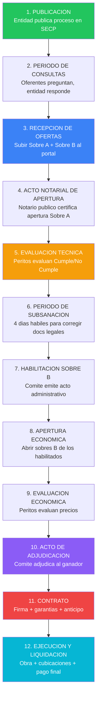
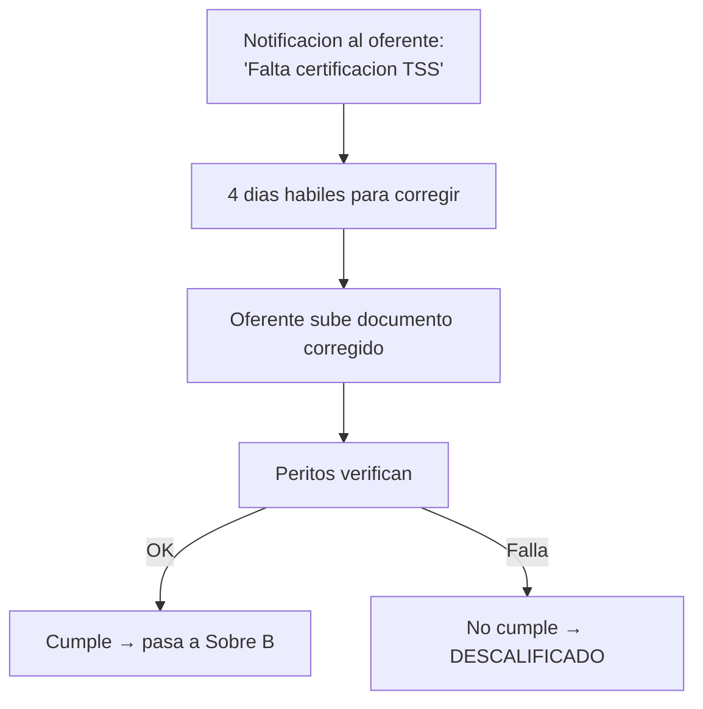

# Ciclo Completo Real de una Licitacion — De Publicacion a Liquidacion

> Fuente: HEFESTO — Experiencia real con KOSMIMA Investment SRL
> Procesos ejecutados: JDMB-CCC-CP-2025-0001 (Boya), RSCS-DAF-CM-2026-0002, CESAC-DAF-CM-2026-0015
> Fecha: 2026-03-14

---

## Por que este documento

Las specs de JANUS cubren F1 a F4 (Deteccion → Submission). Pero el ciclo de una licitacion no termina cuando se envia la oferta. Hay **12 etapas** en total, y las ultimas 6 son donde se gana o se pierde dinero real.

Este documento cubre el ciclo completo que ningun competidor documenta.

---

## Las 12 Etapas del Ciclo Real



---

## Etapa 1: PUBLICACION

**Quien**: Entidad compradora
**Donde**: Portal SECP (comunidad.comprasdominicanas.gob.do)

La entidad publica:
- Pliego de condiciones especificas
- Especificaciones tecnicas / ficha tecnica
- Formularios en blanco (F.033, F.034, etc.)
- Cronograma del proceso
- Presupuesto referencial (a veces visible, a veces no)

**Datos criticos para el SaaS**:

| Dato | Donde encontrarlo | Uso en DGCP INTEL |
|------|-------------------|-------------------|
| Codigo del proceso | Titulo del release OCDS | Identificador unico |
| Modalidad | procurementMethodDetails | Determina documentos requeridos |
| Monto estimado | tender.value.amount | Scoring + escenarios pricing |
| UNSPSC codes | items[].classification | Match con perfil del tenant |
| Fecha cierre | tenderPeriod.endDate | Urgencia + tiempo disponible |
| Entidad | buyer.name | Historial + confiabilidad |
| Dirigido MIPYME | Campo custom DGCP | Filtro critico |

### Lo que la API NO te dice (hay que sacarlo del pliego PDF)

- Requisitos tecnicos especificos (experiencia minima, equipo, certificaciones)
- Si los materiales los provee la entidad o el contratista
- Ubicacion exacta de la obra
- Cuantos lotes tiene
- Si requiere visita de sitio obligatoria
- Criterios de evaluacion y sus pesos

---

## Etapa 2: PERIODO DE CONSULTAS

**Duracion**: Tipicamente 5-10 dias habiles
**Quien participa**: Cualquier interesado (no solo los que mostraron interes)

Los oferentes pueden enviar preguntas escritas sobre el pliego. La entidad responde a TODOS los participantes, no solo al que pregunto.

**Relevancia para el SaaS**:
- Las respuestas pueden cambiar las reglas del juego
- A veces revelan informacion que no estaba en el pliego
- Se publican como ENMIENDAS al pliego
- El sistema debe monitorear enmiendas y alertar

### Enmiendas — El peligro silencioso

Una enmienda puede:
- Cambiar fechas de cierre
- Modificar cantidades de items
- Agregar o eliminar requisitos
- Cambiar criterios de evaluacion
- Anular el proceso completo

**Accion del SaaS**: Worker que verifica cada 6h si hay documentos nuevos en el proceso. Si detecta enmienda → alerta Telegram urgente + marcar documentos generados como DESACTUALIZADOS.

---

## Etapa 3: RECEPCION DE OFERTAS

**Cubierto por**: F4 de JANUS (Submission)

Puntos adicionales de experiencia real:

### Timing es todo

| Situacion | Riesgo | Recomendacion |
|-----------|--------|---------------|
| Subir 5+ min antes del cierre | Bajo | Ideal |
| Subir 30 min antes | Muy bajo | Recomendado |
| Subir en la ultima hora | Medio | El portal se satura |
| Subir en los ultimos 15 min | Alto | El portal puede caerse |
| Subir despues del cierre | Critico | RECHAZADO automaticamente |

### Formato de entrega

En procesos electronicos (SECP), los documentos se suben como archivos individuales o ZIP. En procesos fisicos (todavia existen), se entregan en sobres sellados con acta notarial.

**IMPORTANTE**: Algunos procesos de municipios pequenos NO usan el portal SECP. Requieren entrega fisica. El SaaS debe detectar esto del pliego y alertar.

---

## Etapa 4: ACTO NOTARIAL DE APERTURA

**Quien**: Notario publico + Comite de Compras + oferentes presentes
**Donde**: Sede de la entidad compradora
**Documento generado**: Acta notarial

El notario publico certifica:
1. Cuantos oferentes presentaron ofertas
2. Que los sobres estaban sellados/integros
3. Se abren los Sobres A (tecnicos) en presencia de todos
4. Se leen los nombres de los oferentes
5. Los Sobres B quedan bajo custodia del notario

### Datos del acta notarial (caso real Boya)

```
Fecha: 25 de septiembre de 2025
Notario: Notario Publico del Municipio de Monte Plata
Oferentes que presentaron:
  1. Kosmima Investment, SRL - Fisica
  2. Proviax Group, SRL - Fisica
  3. Grucaind, SRL - Fisica
Estado sobres: Integros, debidamente sellados
```

**Relevancia para el SaaS (tracking)**:
- El SaaS puede detectar cuando la apertura fue realizada via OCDS (tag: tender → award)
- Alertar al usuario: "Tu oferta fue abierta hoy"
- A partir de aqui empieza el conteo de subsanacion

---

## Etapa 5: EVALUACION TECNICA

**Quien**: Peritos designados (ingenieros, abogados, contadores)
**Duracion**: 5-15 dias habiles
**Resultado**: Informe de evaluacion tecnica

Los peritos evaluan CADA oferente en dos categorias:

### Documentacion Legal (subsanable)

| Documento | Peso | Subsanable |
|-----------|------|------------|
| Registro Mercantil vigente | Obligatorio | Si |
| Certificacion DGII | Obligatorio | Si |
| Certificacion TSS | Obligatorio | Si |
| Poder de representacion | Obligatorio | Si |
| Certificado MIPYME | Segun proceso | Si |
| RPE activo con codigos UNSPSC | Obligatorio | Si |

### Documentacion Tecnica (NO subsanable)

| Documento | Peso | Subsanable |
|-----------|------|------------|
| Oferta tecnica narrativa | Obligatorio | NO |
| Experiencia en obras similares | Obligatorio | NO |
| Equipo tecnico propuesto | Obligatorio | NO |
| Programa de trabajo | Obligatorio | NO |
| Cronograma de ejecucion | Obligatorio | NO |
| Especificaciones tecnicas | Obligatorio | NO |

### Resultado: Tabla de evaluacion

| Oferente | Doc. Legal | Doc. Tecnica | Recomendacion |
|----------|-----------|-------------|---------------|
| Kosmima Investment, SRL | Cumple | Cumple | Habilitar |
| Proviax Group, SRL | Cumple | Cumple | Habilitar |
| Grucaind, SRL | No Cumple | No Cumple | No Habilitar |

**Caso real**: Grucaind no presento documentacion legal completa (societarios, certificaciones, poderes) ni tecnica (experiencia, equipo, programa de trabajo). Fue excluida.

---

## Etapa 6: PERIODO DE SUBSANACION

**Duracion**: 4 dias habiles a partir de notificacion
**Solo aplica a**: Documentos legales (subsanables)
**NO aplica a**: Documentos tecnicos

### Flujo de subsanacion



**Relevancia para el SaaS**:
- Alerta URGENTE al usuario si hay subsanacion requerida
- Countdown visible en dashboard (4 dias)
- El sistema podria auto-generar el documento corregido si es un formulario
- Subir automaticamente via Playwright si tiene credenciales RPE

---

## Etapa 7: HABILITACION SOBRE B

**Quien**: Comite de Compras y Contrataciones
**Documento generado**: Acto administrativo de habilitacion

El Comite emite un acto administrativo que:
1. Aprueba el informe de evaluacion tecnica
2. Lista los oferentes HABILITADOS
3. Lista los oferentes NO HABILITADOS con razones
4. Ordena la apertura de los Sobres B

### Estructura del acto (caso real Boya)

```
ACTO ADMINISTRATIVO NUM. CCC-2025-0001
COMITE DE COMPRAS Y CONTRATACIONES
JUNTA DE DISTRITO MUNICIPAL DE BOYA

HABILITA apertura de Sobres B a:
- Kosmima Investment, SRL
- Proviax Group, SRL

NO HABILITA a:
- Grucaind, SRL (no cumplio documentacion legal y tecnica)
```

---

## Etapa 8: APERTURA ECONOMICA

**Quien**: Comite + Notario + oferentes habilitados
**Documento generado**: Acta de apertura de sobres B

Se abren los Sobres B SOLO de los oferentes habilitados tecnicamente.
Se lee en voz alta el monto de cada oferta.

### Datos registrados

| Oferente | Lote 1 (RD$) | Lote 2 (RD$) | Total (RD$) |
|----------|-------------|-------------|-------------|
| Kosmima Investment, SRL | 1,664,349.20 | 2,173,813.63 | 3,838,162.83 |
| Proviax Group, SRL | 1,825,779.89 | 2,380,575.28 | 4,206,355.17 |

---

## Etapa 9: EVALUACION ECONOMICA

**Quien**: Peritos designados
**Criterio tipico**: Menor precio entre los que cumplen tecnicamente

Los peritos evaluan:
1. Que el monto ofertado no exceda el presupuesto referencial
2. Que los precios no sean "temerarios" (demasiado bajos)
3. Que el desglose sea coherente (subtotales suman al total)
4. Que el ITBIS este correctamente calculado
5. Comparan precios entre oferentes

### Senales de precio temerario

| Senal | Umbral tipico | Consecuencia |
|-------|--------------|--------------|
| Oferta < 50% del referencial | Sospechoso | Puede ser rechazada |
| Oferta < 70% del referencial | Advertencia | Piden justificacion |
| Items con precio $0 | Rechazado | Error de formulario |
| ITBIS mal calculado | Subsanable | Se corrige |

---

## Etapa 10: ACTO DE ADJUDICACION

**Quien**: Comite de Compras y Contrataciones
**Documento generado**: Acto administrativo de adjudicacion

Este es el documento que generamos para Boya (JDMB-CCC-CP-2025-0001). Su estructura completa:

### Estructura del acto de adjudicacion

```
1. ENCABEZADO INSTITUCIONAL
   - Nombre de la entidad
   - Numero del acto
   - Titulo del proceso

2. PREAMBULO
   - Lugar, fecha, hora
   - Miembros del Comite presentes (nombre + cargo)
   - Quorum verificado

3. VISTAS (13 puntos tipicos)
   - Constitucion
   - Ley 340-06 / Ley 47-25
   - Decreto 416-23
   - Solicitud de compras
   - Certificacion presupuestaria
   - Convocatoria publica
   - Especificaciones tecnicas
   - Pliego de condiciones
   - Acto de aprobacion de modalidad y peritos
   - Acto notarial de apertura
   - Informe evaluacion tecnica
   - Acto de habilitacion sobres B
   - Informe evaluacion economica

4. CONSIDERANDOS (15 puntos tipicos)
   - Solicitud de compras realizada
   - Certificacion presupuestaria emitida
   - Objeto del proceso
   - Acto notarial con oferentes
   - Evaluacion en dos fases
   - Informe tecnico con resultados
   - Oferentes no habilitados y razones
   - Habilitacion de sobres B
   - Evaluacion economica y cuadros
   - Criterio de adjudicacion (menor precio)
   - Motivacion referencial (in aliunde)
   - Principios de transparencia
   - Art. 119 Decreto 416-23 (peritos)
   - Art. 132 Decreto 416-23 (aprobacion)
   - Art. 15 numeral 5 Ley 340-06

5. RESUELVE
   - PRIMERO: Aprobar informe economico
   - SEGUNDO: Adjudicar a [empresa] por [monto]
   - TERCERO: Ordenar notificacion
   - CUARTO: Ordenar publicacion en SECP
   - QUINTO: Recurso de reconsideracion (10 dias habiles)

6. CIERRE
   - Hora de cierre
   - Firmas de todos los miembros del Comite
```

### Comite de Compras y Contrataciones — Composicion tipica

| Cargo | Rol en el Comite |
|-------|-----------------|
| Director/Alcalde/MAE | Presidente |
| Director Financiero/Tesorero | Miembro |
| Director Juridico | Miembro |
| Enc. Compras y Contrataciones | Miembro |
| Director Administrativo / RRHH | Miembro |

**Nota**: El SaaS podria generar el acto de adjudicacion para entidades compradoras que sean clientes. Esto abre un segundo mercado.

---

## Etapa 11: CONTRATO

**Quien**: Entidad + Adjudicatario
**Plazo para firma**: 10-15 dias habiles despues de adjudicacion
**Documento generado**: Contrato de ejecucion de obra

### Contenido del contrato (caso real Boya)

```
CONTRATO DE EJECUCION DE OBRA NUM. 1-2025
Referencia: COMPARACION DE PRECIO JDMB-CCC-CP-2025-0001

ENTRE:
  LA INSTITUCION CONTRATANTE:
    - Junta de Distrito Municipal de Boya
    - Representada por Gabriel Marte De La Cruz, Director
    - Calle Principal Boya, Monte Plata

  EL CONTRATISTA:
    - Kosmima Investment, SRL
    - RPE: 118338
    - Representada por Genauris Ramirez Dipre
    - Cedula: 402-1005801-8
    - Av. Los Proceres #38, Local 10C, Santo Domingo

CLAUSULAS:
  Art. 1:  Objeto del contrato
  Art. 2:  Monto y forma de pago
  Art. 3:  Plazo de ejecucion
  Art. 4:  Garantias (fiel cumplimiento, anticipo)
  Art. 5:  Obligaciones del contratista
  Art. 6:  Obligaciones de la entidad
  Art. 7:  Supervision
  Art. 8:  Modificaciones al contrato
  Art. 9:  Penalidades por incumplimiento
  Art. 10: Resolucion del contrato
  Art. 11: Fuerza mayor
  Art. 12: Solucion de controversias
  Art. 13: Clausula ambiental (Ley 64-00)
  Art. 14: Seguridad e higiene industrial
```

### Garantias post-adjudicacion

| Garantia | Monto | Tipo | Quien la gestiona |
|----------|-------|------|-------------------|
| Fiel cumplimiento | 4% regular / 1% MIPYME del monto adjudicado | Poliza de seguro | Contratista → aseguradora |
| Buen uso de anticipo | 100% del anticipo recibido | Poliza de seguro | Contratista → aseguradora |
| Vicios ocultos | Segun pliego | Retencion o poliza | Se descuenta de cubicaciones |

### Anticipo

- MIPYMEs: Derecho a anticipo de 20-50% del monto contratado
- Requiere garantia de buen uso por el 100% del anticipo
- Se descuenta proporcionalmente de cada cubicacion
- Gestion de anticipo tarda 5-15 dias habiles

---

## Etapa 12: EJECUCION Y LIQUIDACION

**Duracion**: Segun contrato (30 dias a 12+ meses)
**Quien supervisa**: Supervisor designado por la entidad

### Cubicaciones (pagos parciales)

La obra se paga por avance, mediante "cubicaciones":

```
Cubicacion #1 (Mes 1):
  - Trabajos completados: 30%
  - Monto cubicado: RD$ 1,151,448.85
  - Descuento anticipo: RD$ 345,434.65 (30% del anticipo)
  - Retencion garantia: RD$ 57,572.44 (5%)
  - Monto a pagar: RD$ 748,441.76

Cubicacion #2 (Mes 2):
  - Trabajos completados: 35%
  - Monto cubicado: RD$ 1,343,357.00
  ...
```

### Liquidacion final

Al terminar la obra:
1. Acta de recepcion provisional (con observaciones)
2. Periodo de correccion de observaciones (15-30 dias)
3. Acta de recepcion definitiva
4. Liberacion de garantia de fiel cumplimiento
5. Pago retencion final
6. Cierre en sistema SECP

### Tiempos de pago reales (experiencia)

| Tipo de entidad | Tiempo de pago tipico | Comentario |
|----------------|----------------------|------------|
| Ayuntamientos/Juntas | 30-90 dias | Variable, depende de flujo de caja |
| Ministerios | 45-120 dias | Burocracia de aprobaciones |
| MOPC | 60-180 dias | Los mas lentos |
| Organismos autonomos | 30-60 dias | Generalmente cumplen |

---

## Timeline Real Completo

```
Dia 0:    Publicacion del proceso
Dia 5:    Fin periodo de consultas
Dia 10:   Enmiendas publicadas (si hay)
Dia 15:   Cierre de recepcion de ofertas
Dia 16:   Acto notarial de apertura
Dia 25:   Informe evaluacion tecnica
Dia 26:   Inicio subsanacion (4 dias habiles)
Dia 30:   Fin subsanacion
Dia 32:   Acto habilitacion Sobre B
Dia 33:   Apertura economica
Dia 38:   Informe evaluacion economica
Dia 40:   Acto de adjudicacion
Dia 41:   Notificacion a oferentes
Dia 51:   Fin periodo de recurso (10 dias habiles)
Dia 55:   Firma de contrato
Dia 60:   Entrega anticipo (si aplica)
Dia 65:   Inicio de obra
Dia 65+N: Ejecucion (N segun contrato)
Dia final: Recepcion definitiva + liquidacion
```

**Total desde publicacion hasta inicio de obra: ~65 dias habiles (3 meses)**
**Total desde publicacion hasta ultimo pago: 6-18 meses**

---

## Implicaciones para DGCP INTEL

### Features que faltan en el roadmap actual

1. **Tracking post-adjudicacion**: El SaaS para en "adjudicada". Falta cubrir contrato → ejecucion → pago
2. **Generacion de actos administrativos**: Para entidades compradoras que sean clientes
3. **Gestion de garantias**: Alertar sobre polizas, tiempos de gestion, vencimientos
4. **Cubicaciones**: Calcular avance de obra y montos a cobrar
5. **Historial de pagos por entidad**: Base de datos de cuanto tarda cada entidad en pagar

### Segundo mercado: Entidades compradoras

El SaaS no solo sirve a oferentes. Las entidades compradoras (ayuntamientos, juntas, ministerios) necesitan:
- Generar pliegos de condiciones
- Generar actos administrativos (aprobacion, habilitacion, adjudicacion)
- Generar contratos
- Gestionar evaluaciones
- Cumplir con transparencia DGCP

Esto duplicaria el mercado objetivo.

---

*HEFESTO — Conocimiento de campo real*
*2026-03-14*
