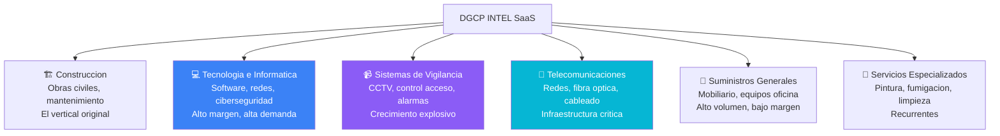

# Sectores y Verticales — No Solo Construccion

> Fuente: HEFESTO + analisis de procesos DGCP reales
> Fecha: 2026-03-14

---

## Por que este documento

Las specs actuales de DGCP INTEL asumen mayormente construccion (APUs, cronogramas Gantt, materiales de obra). Pero el mercado de contrataciones publicas RD cubre TODOS los sectores. Este documento expande el conocimiento a los verticales clave que el SaaS debe cubrir.

---

## Verticales Prioritarios para DGCP INTEL



---

## V2: TECNOLOGIA E INFORMATICA

### Codigos UNSPSC principales

| Codigo | Descripcion | Ejemplo de proceso |
|--------|-------------|-------------------|
| 43230000 | Software | Desarrollo sistema de gestion |
| 43210000 | Hardware (computadoras) | Adquisicion de laptops y servidores |
| 43220000 | Equipos de red | Switches, routers, access points |
| 43232000 | Software de seguridad | Licencias antivirus, firewall |
| 81110000 | Servicios informaticos | Consultoria TI, soporte tecnico |
| 81112000 | Desarrollo de software | Apps web/movil para el gobierno |
| 43233500 | Bases de datos | Licencias Oracle, SQL Server |
| 43231500 | Software de gestion empresarial | ERP, contabilidad, RRHH |
| 81111800 | Alojamiento web y nube | Hosting, cloud, VPS |

### Diferencias vs Construccion

| Aspecto | Construccion | Tecnologia |
|---------|-------------|-----------|
| Documento tecnico | APU + Cronograma Gantt | Propuesta metodologica + arquitectura |
| Experiencia requerida | Proyectos similares ejecutados | Portafolio + certificaciones tecnicas |
| Equipo propuesto | Ing. Civil, Maestro Obra | Ing. Sistemas, DBA, DevOps |
| Garantia | Vicios ocultos (1 ano) | Soporte post-implementacion (6-12 meses) |
| Entregable | Obra fisica | Software funcional + documentacion |
| ITBIS | 18% (servicios) | Exento (software) o 18% (servicios) |
| Plazo ejecucion | Semanas a meses | Semanas a meses |
| Supervision | Ing. Residente en sitio | Comite tecnico + milestones |

### Documentos especificos para TI

| Documento | Contenido | Generacion IA |
|-----------|----------|:---:|
| Propuesta metodologica | Metodologia (Agile/Scrum/Waterfall), fases, entregables | Si |
| Arquitectura de solucion | Diagrama de componentes, tecnologias, integraciones | Si |
| Plan de migracion | Si reemplaza sistema existente, pasos de migracion | Si |
| SLA propuesto | Tiempos de respuesta, uptime, penalidades | Si |
| CVs equipo tecnico | Certificaciones: AWS, Azure, Cisco, ITIL, PMP | Parcial (template) |
| Plan de capacitacion | Entrenamiento al personal de la entidad | Si |
| Licenciamiento | Detalle de licencias requeridas y costos recurrentes | Si |

### BD de Precios — Tecnologia

```
NUEVA TABLA: ref_precios_tecnologia

Categoria: Software
  - Licencia Windows Server 2022 Standard: USD 1,069 (~RD$ 64,000)
  - Licencia Office 365 Business/usuario/ano: USD 150 (~RD$ 9,000)
  - Licencia SQL Server Standard/core: USD 3,945 (~RD$ 237,000)
  - Antivirus empresarial/endpoint/ano: USD 30-80 (~RD$ 1,800-4,800)

Categoria: Hardware
  - Laptop empresarial (i5, 16GB, 512SSD): RD$ 45,000-65,000
  - Desktop empresarial: RD$ 35,000-50,000
  - Servidor rack 2U (Xeon, 64GB, RAID): RD$ 180,000-350,000
  - UPS 3KVA online: RD$ 35,000-55,000
  - Switch 48 puertos PoE: RD$ 45,000-120,000

Categoria: Servicios
  - Hora consultor TI Junior: RD$ 1,500-2,500
  - Hora consultor TI Senior: RD$ 3,500-6,000
  - Hora desarrollador Junior: RD$ 1,200-2,000
  - Hora desarrollador Senior: RD$ 2,500-5,000
  - Hora DBA/DevOps: RD$ 3,000-6,000
```

### Certificaciones requeridas frecuentemente

| Certificacion | Para que proceso |
|--------------|-----------------|
| Cisco Certified (CCNA/CCNP) | Redes, telecomunicaciones |
| Microsoft Partner | Software, licenciamiento |
| AWS/Azure Partner | Cloud, hosting |
| ITIL | Servicios gestionados |
| ISO 27001 | Seguridad de la informacion |
| PMP/PMI | Gestion de proyectos TI |
| CompTIA Security+ | Ciberseguridad |

---

## V3: SISTEMAS DE VIGILANCIA Y SEGURIDAD

### Codigos UNSPSC

| Codigo | Descripcion |
|--------|-------------|
| 46170000 | Equipo de vigilancia y deteccion |
| 46171500 | Camaras de vigilancia |
| 46171600 | Grabadores de video digital (DVR/NVR) |
| 46171700 | Monitores de vigilancia |
| 46172000 | Sistemas de control de acceso |
| 46181500 | Sistemas de alarma |
| 43222600 | Equipo de networking para CCTV IP |

### Componentes tipicos de un proyecto CCTV

| Componente | Cantidad tipica | Precio unitario RD$ |
|-----------|----------------|-------------------|
| Camara IP 4MP domo interior | 8-32 | 8,500-15,000 |
| Camara IP 8MP bullet exterior | 4-16 | 15,000-35,000 |
| Camara PTZ 4MP (motorizada) | 1-4 | 45,000-120,000 |
| NVR 16 canales + HDD 4TB | 1-2 | 35,000-65,000 |
| NVR 32 canales + HDD 8TB | 1 | 65,000-120,000 |
| Monitor 55" vigilancia | 1-4 | 25,000-45,000 |
| Switch PoE 16 puertos | 1-4 | 15,000-35,000 |
| Cable UTP Cat6 (caja 305m) | 2-10 | 4,500-8,000 |
| Rack 12U o 20U | 1 | 8,000-18,000 |
| UPS 1500VA | 1-2 | 12,000-25,000 |
| Licencia VMS (por camara) | 8-32 | 3,000-8,000 |

### Documentos especificos para vigilancia

| Documento | Contenido |
|-----------|----------|
| Diseno del sistema | Plano con ubicacion de camaras, angulos de cobertura, zonas ciegas |
| Diagrama de red | Topologia IP, VLANs, ancho de banda requerido |
| Calculo de almacenamiento | Dias de grabacion × camaras × resolucion × fps |
| Especificaciones de camaras | Resolucion, IR, WDR, IP67, IK10 |
| Plan de instalacion | Fases, cableado, montaje, configuracion |
| Plan de mantenimiento | Preventivo trimestral, correctivo |
| Garantia y soporte | 1-3 anos, SLA de respuesta |

---

## V4: TELECOMUNICACIONES Y REDES

### Codigos UNSPSC

| Codigo | Descripcion |
|--------|-------------|
| 43220000 | Equipos de red |
| 43222600 | Switches y routers |
| 43222500 | Equipos de fibra optica |
| 81110000 | Servicios de telecomunicaciones |
| 43221700 | Equipos de radio comunicacion |
| 43223300 | Equipo de telefonia VoIP |

### Proyectos tipicos

| Tipo de proyecto | Descripcion | Monto tipico RD$ |
|-----------------|-------------|-------------------|
| Cableado estructurado | Cat6/6A, fibra, certificacion | 500K - 5M |
| Red WiFi empresarial | Access points, controladora, portal cautivo | 300K - 3M |
| Enlace de fibra optica | Tendido, empalmes, OTDR | 1M - 20M |
| Telefonia IP | Central PBX, telefonos, configuracion | 500K - 5M |
| Data center | Rack, climatizacion, energia, red | 2M - 50M |
| Radio enlaces | Torres, antenas, configuracion | 500K - 10M |

### BD de Precios — Telecomunicaciones

```
NUEVA TABLA: ref_precios_telecomunicaciones

Cable UTP Cat6 certificado (caja 305m): RD$ 4,500-8,000
Cable UTP Cat6A blindado (caja 305m): RD$ 8,000-14,000
Cable fibra optica monomodo 12 hilos/km: RD$ 25,000-45,000
Cable fibra optica multimodo 6 hilos/km: RD$ 18,000-30,000
Patch panel 24 puertos Cat6: RD$ 3,500-6,000
Jack RJ45 Cat6: RD$ 250-600
Patch cord Cat6 3ft: RD$ 150-350
Access Point WiFi 6: RD$ 8,000-25,000
Controladora WiFi (50 APs): RD$ 45,000-120,000
Switch L3 48 puertos 10G: RD$ 120,000-350,000
Router empresarial: RD$ 25,000-150,000
Telefono IP basico: RD$ 3,500-6,000
Telefono IP con pantalla: RD$ 8,000-15,000
Central PBX IP (50 extensiones): RD$ 45,000-120,000
```

---

## V5: SUMINISTROS GENERALES

### Lo que mas licita el Estado dominicano (por volumen)

| Tipo | Codigos UNSPSC | Frecuencia |
|------|---------------|-----------|
| Mobiliario de oficina | 56100000 | Muy alta |
| Material gastable | 44120000 | Muy alta |
| Equipos de oficina | 44100000 | Alta |
| Uniformes | 53100000 | Alta |
| Vehiculos | 25100000 | Media |
| Alimentos/catering | 50000000 | Media |

### Diferencias clave vs otros verticales

- **Evaluacion**: Generalmente por menor precio (no tecnica)
- **Documentacion**: Mas simple — cotizacion + certificaciones
- **Competencia**: MUY alta (muchos proveedores)
- **Margen**: Bajo (10-20%)
- **Volumen**: Alto (procesos constantes)

---

## V6: SERVICIOS ESPECIALIZADOS

### Pintura y mantenimiento (experiencia real KOSMIMA)

| Servicio | UNSPSC | Tarifa referencial |
|----------|--------|-------------------|
| Pintura interior (m²) | 72140000 | RD$ 350-550 |
| Pintura exterior (m²) | 72140000 | RD$ 400-650 |
| Pintura epoxica (m²) | 72140000 | RD$ 800-1,200 |
| Impermeabilizacion (m²) | 72140000 | RD$ 450-750 |
| Limpieza profunda (m²) | 76110000 | RD$ 80-150 |
| Fumigacion (m²) | 77111500 | RD$ 25-60 |
| Jardineria y poda (m²) | 70150000 | RD$ 40-100 |

---

## Adaptacion del SaaS por Vertical

### Scoring Engine — Ajustes por sector

```typescript
// El scoring debe considerar el sector del tenant

function scoreTipoProceso(modalidad: string, sector: string): number {
  // Para TI: Comparacion de Precios es MAS favorable
  //   (menos competidores especializados)
  // Para Suministros: Compra Menor es MAS favorable
  //   (volumen alto, decision rapida)
  // Para Construccion: Sorteo de Obras es EXCLUSIVO del sector

  if (sector === 'tecnologia') {
    // Ponderar mas las licitaciones que piden desarrollo custom
    // vs las que son solo compra de licencias/hardware
  }
}
```

### Generacion de documentos — Por sector

| Sector | Oferta tecnica contiene | APU/Desglose |
|--------|------------------------|:---:|
| Construccion | Metodologia, cronograma Gantt, equipo, APU | Si |
| Tecnologia | Arquitectura, metodologia Agile, SLA, plan migracion | No (pero si desglose por hora) |
| Vigilancia | Diseno CCTV, planos, calculo almacenamiento | No (desglose por componente) |
| Telecom | Diseno de red, topologia, certificacion Fluke | No (desglose por componente) |
| Suministros | Ficha tecnica productos, marcas, garantia | No (solo cotizacion) |
| Servicios | Plan de trabajo, rendimientos, personal | Si (por actividad) |

### Checklist — Variaciones por sector

```
CONSTRUCCION (27-68 items):
  - Todo lo estandar
  + APU por partida
  + Cronograma Gantt/CPM
  + Certificaciones CODIA
  + Seguro de responsabilidad civil
  + Plan de seguridad e higiene

TECNOLOGIA (20-45 items):
  - Todo lo estandar
  + Certificaciones fabricante (Microsoft, Cisco, etc.)
  + Portafolio de proyectos similares
  + Licencias de software incluidas
  + Plan de soporte post-implementacion
  + SLA con metricas

VIGILANCIA (22-40 items):
  - Todo lo estandar
  + Licencia DIGESETT (si requiere camaras viales)
  + Certificacion del fabricante de camaras
  + Calculo de almacenamiento
  + Plano de ubicacion de camaras
  + Plan de mantenimiento preventivo

TELECOM (25-50 items):
  - Todo lo estandar
  + Certificacion INDOTEL (si aplica)
  + Certificacion Fluke para cableado
  + Diagrama de red
  + Pruebas de certificacion
  + Garantia de enlace
```

---

## Implicaciones para DGCP INTEL

### Cambios requeridos en el SaaS

1. **Onboarding**: Agregar seleccion de sector/vertical al wizard
2. **BD de Precios**: Expandir de solo materiales de construccion a multisectorial
3. **Templates de oferta tecnica**: Un template por sector (no uno generico)
4. **Checklist dinamico**: Ya contemplado pero necesita items por sector
5. **IA de generacion**: Prompts especializados por sector para Claude
6. **Scoring**: Ajustar pesos por sector
7. **APU Generator**: Solo para construccion. Para TI = desglose por hora. Para vigilancia/telecom = desglose por componente
8. **Experiencia**: El D.049 cambia por sector (proyectos de software vs proyectos de obra)

### Nuevos codigos UNSPSC para el onboarding

El wizard de onboarding debe ofrecer seleccion por vertical con los codigos UNSPSC agrupados:

```
🏗️ Construccion y Obras Civiles
   72100000 - 72199999

💻 Desarrollo de Software y Sistemas
   43230000 - 43239999, 81112000

📹 Sistemas de Vigilancia y Seguridad
   46170000 - 46189999

🔌 Redes y Telecomunicaciones
   43220000 - 43229999

🖥️ Hardware y Equipos TI
   43210000 - 43219999

🛒 Suministros y Mobiliario
   44000000 - 56999999

🎨 Servicios de Mantenimiento
   72140000, 76110000, 77111500
```

---

*HEFESTO — "Cada sector tiene su yunque y su martillo"*
*2026-03-14*
