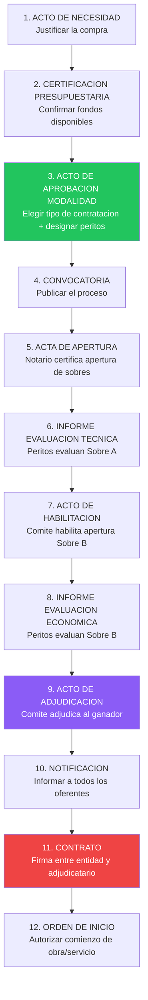
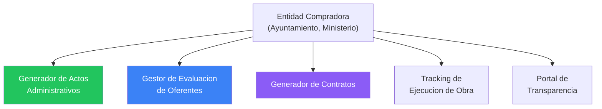

# Actos Administrativos — El Lado de la Entidad Compradora

> Fuente: HEFESTO — Generacion real de actos para Junta Distrito Municipal de Boya
> Proceso: JDMB-CCC-CP-2025-0001
> Fecha: 2026-03-14

---

## Por que este documento

DGCP INTEL esta disenado para oferentes. Pero hay un segundo mercado igual de grande: las **entidades compradoras** (ayuntamientos, juntas de distrito, ministerios, organismos autonomos). Estas entidades necesitan generar multiples actos administrativos para cada proceso de compra. La mayoria lo hace manualmente en Word, con errores frecuentes.

Este documento especifica TODOS los actos administrativos que genera una entidad compradora durante un proceso de licitacion, con su estructura, datos requeridos y oportunidad de automatizacion.

---

## Actos Administrativos en Orden Cronologico



---

## 1. Acto de Necesidad (Solicitud de Compras)

### Quien lo genera
Departamento requirente (el area que necesita la compra)

### Contenido
| Campo | Ejemplo |
|-------|---------|
| Departamento solicitante | Departamento de Obras Publicas |
| Descripcion de la necesidad | Reconstruccion de aceras deterioradas en El Cacique |
| Justificacion | Las aceras actuales presentan danos que afectan la seguridad peatonal |
| Monto estimado | RD$ 3,900,000.00 |
| Partida presupuestaria | 2.3.7.2.01 - Obras de infraestructura |
| Fecha requerida | Antes de temporada de lluvias (mayo 2025) |
| Firmas | Director del departamento + visto bueno MAE |

### Generacion automatica
Si — template simple. Datos del proceso + justificacion (IA puede sugerir texto).

---

## 2. Certificacion Presupuestaria

### Quien lo genera
Departamento Administrativo y Financiero

### Contenido
| Campo | Ejemplo |
|-------|---------|
| Numero certificacion | JDMB-CCC-CP-2025-0001 |
| Proceso de referencia | Comparacion de Precios JDMB-CCC-CP-2025-0001 |
| Monto certificado | RD$ 3,900,000.00 |
| Partida presupuestaria | 2.3.7.2.01 |
| Disponibilidad | "Se certifica disponibilidad presupuestaria" |
| Ano fiscal | 2025 |
| Firma | Director Financiero |

### Generacion automatica
Si — datos puramente numericos del presupuesto.

---

## 3. Acto de Aprobacion de Modalidad y Designacion de Peritos

### Quien lo genera
Comite de Compras y Contrataciones

### Estructura completa (caso real Boya)

```
ENCABEZADO:
  - Nombre entidad
  - Gestion (periodo del gobierno)

TITULO:
  "ACTO DE APROBACION DE LA MODALIDAD DE CONTRATACION Y
   SELECCION DE PERITOS DEL PROCESO NUM. [CODIGO]"

OBJETO:
  Aprobacion de modalidad + designacion de peritos

CONSIDERANDOS (7 tipicos):
  I.   Art. 16, numeral 4, Ley 340-06 (definicion de la modalidad)
  II.  Art. 17, parrafo I (umbrales)
  III. Art. 20 (pliego de condiciones)
  IV.  Art. 35 Reglamento (responsabilidad del Comite)
  V.   Art. 36 Reglamento (aprobacion modalidad + peritos)
  VI.  Manual de Procedimientos numeral 02.06
  VII. Art. 71 Reglamento (competencia de peritos)

VISTAS:
  - Ley 340-06 y modificaciones
  - Reglamento Decreto 543-12 / 416-23
  - Resolucion PNP-01-2025 (umbrales)

RESUELVE:
  PRIMERO:  Aprobar modalidad [Comparacion de Precios / LPN / etc.]
  SEGUNDO:  Designar peritos:
            - [Nombre], como perito tecnico
            - [Nombre], como perito tecnico
  TERCERO:  Ordenar continuacion del procedimiento
  CUARTO:   Remision a compras y contabilidad
  QUINTO:   Registrar y archivar

FIRMAS:
  Todos los miembros del Comite
```

### Datos requeridos

```typescript
interface DatosAprobacionModalidad {
  entidad: {
    nombre: string
    gestion: string  // "2024-2028"
    direccion: string
    municipio: string
    provincia: string
  }
  proceso: {
    codigo: string
    objeto: string
    modalidad: string  // "Comparacion de Precios"
    base_legal_modalidad: string  // Art. 16 numeral 4
  }
  peritos: {
    nombre: string
    titulo: string  // "Ing." / "Lic." / "Arq."
    cargo: string   // "Perito Tecnico"
  }[]
  comite: {
    nombre: string
    cargo: string
    rol: string  // "Presidente" / "Miembro"
  }[]
  fecha: string
  lugar: string
}
```

---

## 6. Informe de Evaluacion Tecnica

### Quien lo genera
Peritos designados

### Estructura

```
ENCABEZADO:
  "INFORME FINAL DE EVALUACION DE OFERTA TECNICA"
  Proceso: [CODIGO]
  Peritos evaluadores: [nombres]

1. ANTECEDENTES
   - Fecha de designacion
   - Objeto del proceso
   - Oferentes que presentaron oferta

2. METODOLOGIA DE EVALUACION
   - Cumple / No Cumple
   - Documentacion legal vs documentacion tecnica

3. EVALUACION POR OFERENTE
   Para cada oferente:
   a) Documentacion Legal:
      - Registro Mercantil: Cumple/No Cumple
      - Certificacion DGII: Cumple/No Cumple
      - Certificacion TSS: Cumple/No Cumple
      - ...
   b) Documentacion Tecnica:
      - Oferta tecnica: Cumple/No Cumple
      - Experiencia: Cumple/No Cumple
      - Equipo tecnico: Cumple/No Cumple
      - Programa de trabajo: Cumple/No Cumple

4. TABLA RESUMEN
   | Oferente | Legal | Tecnica | Recomendacion |
   |----------|-------|---------|---------------|

5. OBSERVACIONES
   Detalle de incumplimientos por oferente

6. RECOMENDACION
   Habilitar a [oferentes] / No habilitar a [oferentes]

FIRMAS:
  Peritos designados
```

---

## 9. Acto de Adjudicacion (el mas complejo)

### Ya documentado en detalle en 01_CICLO_COMPLETO_REAL.md

Resumen de la estructura:
- Encabezado institucional
- Preambulo (reunion del comite)
- 13 VISTAS
- 15 CONSIDERANDOS
- RESUELVE (5 puntos)
- Cierre y firmas

### Datos especificos del acto de adjudicacion

```typescript
interface DatosAdjudicacion {
  // Del proceso
  numero_acto: string          // "CCC-2025-0001"
  codigo_proceso: string       // "JDMB-CCC-CP-2025-0001"
  objeto: string
  modalidad: string

  // Del comite (fecha/hora de la reunion)
  fecha_reunion: string
  hora_inicio: string
  hora_fin: string
  lugar: string

  // Oferentes y evaluacion
  oferentes: {
    nombre: string
    forma_presentacion: string  // "Fisica" / "Electronica"
    legal_cumple: boolean
    tecnica_cumple: boolean
    habilitado: boolean
    motivo_no_cumple?: string   // Si no cumple, por que
    montos_por_lote: {
      lote: string
      descripcion: string
      monto: number
    }[]
  }[]

  // Resultado
  adjudicatario: string
  lotes_adjudicados: {
    lote: string
    descripcion: string
    monto: number
  }[]
  monto_total: number
  monto_en_letras: string

  // Peritos
  peritos: { nombre: string, titulo: string }[]

  // Fechas del proceso
  fecha_aprobacion_modalidad: string
  fecha_acto_notarial: string
  fecha_habilitacion: string
  fecha_evaluacion_economica: string
}
```

---

## 11. Contrato de Ejecucion

### Estructura completa (caso real Boya)

El contrato tiene 18 articulos tipicos:

| Articulo | Contenido | Datos requeridos |
|----------|----------|-----------------|
| 1 | Objeto del contrato | Descripcion del trabajo |
| 2 | Documentos que forman parte | Pliego, oferta, acto adjudicacion |
| 3 | Monto y forma de pago | Monto adjudicado, cubicaciones, anticipo |
| 4 | Plazo de ejecucion | Dias/meses + fecha inicio |
| 5 | Garantia de fiel cumplimiento | 1% MIPYME / 4% regular |
| 6 | Anticipo | % y condiciones |
| 7 | Obligaciones del contratista | Lista estandar |
| 8 | Obligaciones de la entidad | Pago, supervision, acceso |
| 9 | Supervision | Nombre del supervisor |
| 10 | Penalidades | 0.5% diario por atraso (tipico) |
| 11 | Modificaciones | Hasta 25% adicional |
| 12 | Recepcion provisional y definitiva | Plazos |
| 13 | Resolucion del contrato | Causales |
| 14 | Fuerza mayor | Definicion y procedimiento |
| 15 | Solucion de controversias | Arbitraje o TSA |
| 16 | Seguridad e higiene | Obligaciones de seguridad |
| 17 | Proteccion ambiental | Ley 64-00 |
| 18 | Disposiciones finales | Jurisdiccion, domicilios |

---

## Oportunidad de Negocio para DGCP INTEL

### Plan "ENTIDAD" — Para compradores del Estado



### Features para entidades compradoras

| Feature | Descripcion | Automatizable |
|---------|-------------|:---:|
| Generar acto de necesidad | Template + datos | Si |
| Certificacion presupuestaria | Conectar con SIGEF | Parcial |
| Acto aprobacion modalidad | Template completo con base legal | Si |
| Convocatoria | Texto + publicacion SECP | Si |
| Informe evaluacion tecnica | Tabla Cumple/No Cumple | Si |
| Acto de habilitacion | Template con resultados | Si |
| Informe evaluacion economica | Tabla comparativa de precios | Si |
| Acto de adjudicacion | El documento mas complejo — 100% automatizable | Si |
| Notificacion a oferentes | Emails/cartas automaticas | Si |
| Contrato | Template 18 articulos | Si |
| Orden de inicio | Template simple | Si |

### Pricing sugerido

| Plan | Precio/mes | Incluye |
|------|-----------|---------|
| ENTIDAD STARTER | RD$ 5,000 | 5 procesos/mes, actos basicos |
| ENTIDAD PRO | RD$ 15,000 | 20 procesos/mes, todos los actos + contratos |
| ENTIDAD ENTERPRISE | RD$ 35,000 | Ilimitado + integracion SIGEF + capacitacion |

### Tamano del mercado

- 158 municipios en RD
- 235 distritos municipales
- ~50 ministerios y organismos autonomos
- ~100 empresas publicas (Ley 47-25)
- **Total: ~543 entidades potenciales**

---

*HEFESTO — "Forjo tanto para quien construye como para quien contrata"*
*2026-03-14*
