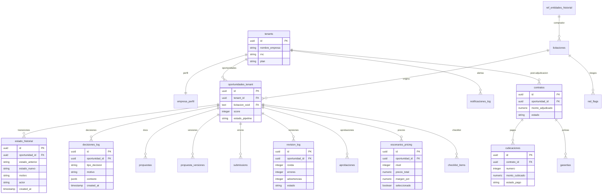

# Schema Historico Completo — Auditoría, Tracking y Analytics

> Fuente: HEFESTO — Lo que falta en el schema actual para llevar control real
> Fecha: 2026-03-14

---

## Lo que falta en el schema actual

El schema actual (E02/02_SQL_MIGRATIONS.md) tiene 7 tablas. Cubren lo basico:
- `tenants` + `empresa_perfil` → quien es la empresa
- `licitaciones` → cache global OCDS
- `oportunidades_tenant` → el pipeline por empresa
- `propuestas` → documentos generados
- `submissions` → envios al portal
- `jobs_log` → logs de BullMQ

**Lo que falta**:

| Categoria | ¿Existe? | Problema |
|-----------|:---:|---------|
| Historial de cambios de estado | No | Solo se guarda estado actual, no las transiciones |
| Log de decisiones (descartar, aplicar) | No | No se sabe quien decidio ni por que |
| Historial de red flags | No | Mencionado en F2 spec pero no en schema principal |
| Log de revisiones (F3B) | No | Mencionado en F3B spec pero aislado |
| Aprobaciones | No | Mencionado en F3B spec pero no integrado |
| Escenarios de pricing guardados | No | Se calculan pero no se persisten |
| Estado del checklist por oportunidad | No | No hay tracking de completitud |
| Historial de notificaciones | No | No se sabe que se envio ni cuando |
| Versiones de documentos | No | Solo ultima version |
| Post-adjudicacion (contrato, cubicaciones) | No | Pipeline termina en "GANADA" |
| Historial de entidades compradoras | No | Mencionado en F2 pero no en schema |
| Metricas y analytics | No | No hay tablas de agregacion |

---

## Diagrama ER Completo (lo que existe + lo que falta)



---

## MIGRATION 006 — Historial de Estados (Audit Trail)

Cada vez que una oportunidad cambia de estado, se registra la transicion.

```sql
-- supabase/migrations/006_estado_historial.sql

CREATE TABLE public.estado_historial (
  id              UUID PRIMARY KEY DEFAULT gen_random_uuid(),
  oportunidad_id  UUID NOT NULL REFERENCES public.oportunidades_tenant(id) ON DELETE CASCADE,
  tenant_id       UUID NOT NULL REFERENCES public.tenants(id),
  estado_anterior TEXT NOT NULL,
  estado_nuevo    TEXT NOT NULL,
  motivo          TEXT,              -- "Score 85 - alerta enviada", "Usuario descarto", etc.
  actor           TEXT NOT NULL,     -- 'sistema', 'usuario', 'worker', 'guardian_ia'
  actor_user_id   UUID REFERENCES auth.users(id),  -- null si es sistema
  metadata        JSONB DEFAULT '{}', -- datos extra (score, precio seleccionado, etc.)
  duracion_estado_anterior_min INTEGER,  -- cuanto tiempo estuvo en el estado anterior
  created_at      TIMESTAMPTZ NOT NULL DEFAULT now()
);

CREATE INDEX idx_estado_hist_oportunidad ON public.estado_historial(oportunidad_id);
CREATE INDEX idx_estado_hist_tenant ON public.estado_historial(tenant_id, created_at DESC);
CREATE INDEX idx_estado_hist_estados ON public.estado_historial(estado_anterior, estado_nuevo);

-- RLS
ALTER TABLE public.estado_historial ENABLE ROW LEVEL SECURITY;
CREATE POLICY "estado_hist_tenant" ON public.estado_historial
  FOR SELECT USING (tenant_id = public.get_tenant_id());

-- Trigger: registrar automaticamente cada cambio de estado
CREATE OR REPLACE FUNCTION public.registrar_cambio_estado()
RETURNS TRIGGER AS $$
DECLARE
  v_duracion INTEGER;
BEGIN
  IF OLD.estado_pipeline IS DISTINCT FROM NEW.estado_pipeline THEN
    -- Calcular duracion en el estado anterior
    SELECT EXTRACT(EPOCH FROM (now() - COALESCE(
      (SELECT created_at FROM public.estado_historial
       WHERE oportunidad_id = NEW.id
       ORDER BY created_at DESC LIMIT 1),
      OLD.created_at
    ))) / 60 INTO v_duracion;

    INSERT INTO public.estado_historial (
      oportunidad_id, tenant_id, estado_anterior, estado_nuevo,
      actor, duracion_estado_anterior_min
    ) VALUES (
      NEW.id, NEW.tenant_id, OLD.estado_pipeline, NEW.estado_pipeline,
      'sistema', v_duracion::INTEGER
    );
  END IF;
  RETURN NEW;
END;
$$ LANGUAGE plpgsql;

CREATE TRIGGER oportunidad_cambio_estado
  AFTER UPDATE OF estado_pipeline ON public.oportunidades_tenant
  FOR EACH ROW EXECUTE FUNCTION public.registrar_cambio_estado();
```

### Consultas utiles

```sql
-- Timeline completa de una oportunidad
SELECT estado_anterior, estado_nuevo, motivo, actor,
       duracion_estado_anterior_min, created_at
FROM estado_historial
WHERE oportunidad_id = $1
ORDER BY created_at;

-- Cuanto tarda en promedio cada etapa (por tenant)
SELECT estado_anterior,
       AVG(duracion_estado_anterior_min) as promedio_min,
       COUNT(*) as transiciones
FROM estado_historial
WHERE tenant_id = $1
GROUP BY estado_anterior
ORDER BY promedio_min DESC;

-- Flujo de conversion (funnel)
SELECT estado_nuevo, COUNT(*) as total
FROM estado_historial
WHERE tenant_id = $1
  AND created_at >= now() - interval '30 days'
GROUP BY estado_nuevo
ORDER BY total DESC;
```

---

## MIGRATION 007 — Log de Decisiones

Cada vez que un usuario o el sistema toma una decision sobre una oportunidad.

```sql
-- supabase/migrations/007_decisiones_log.sql

CREATE TABLE public.decisiones_log (
  id              UUID PRIMARY KEY DEFAULT gen_random_uuid(),
  oportunidad_id  UUID NOT NULL REFERENCES public.oportunidades_tenant(id) ON DELETE CASCADE,
  tenant_id       UUID NOT NULL REFERENCES public.tenants(id),
  tipo_decision   TEXT NOT NULL CHECK (tipo_decision IN (
    'DESCARTAR',        -- usuario decide no participar
    'INVESTIGAR',       -- usuario quiere mas info
    'APLICAR',          -- usuario decide aplicar
    'PAUSAR',           -- poner en espera
    'REACTIVAR',        -- retomar una pausada
    'SELECCIONAR_PRECIO', -- usuario elige escenario de pricing
    'APROBAR_DOCS',     -- usuario aprueba documentos generados
    'RECHAZAR_DOCS',    -- usuario rechaza documentos
    'AUTORIZAR_ENVIO',  -- usuario autoriza envio al portal
    'CANCELAR_ENVIO',   -- usuario cancela envio
    'RECURRIR',         -- usuario recurre adjudicacion
    'ACEPTAR_RESULTADO' -- usuario acepta resultado
  )),
  motivo          TEXT,              -- razon libre del usuario
  canal           TEXT DEFAULT 'dashboard',  -- 'dashboard', 'telegram', 'api'
  user_id         UUID REFERENCES auth.users(id),
  contexto        JSONB DEFAULT '{}',  -- datos del momento (score, precio, etc.)
  created_at      TIMESTAMPTZ NOT NULL DEFAULT now()
);

CREATE INDEX idx_decisiones_oportunidad ON public.decisiones_log(oportunidad_id);
CREATE INDEX idx_decisiones_tenant ON public.decisiones_log(tenant_id, created_at DESC);
CREATE INDEX idx_decisiones_tipo ON public.decisiones_log(tipo_decision);

ALTER TABLE public.decisiones_log ENABLE ROW LEVEL SECURITY;
CREATE POLICY "decisiones_tenant" ON public.decisiones_log
  FOR ALL USING (tenant_id = public.get_tenant_id());
```

### Consultas utiles

```sql
-- Razones mas comunes de descarte
SELECT motivo, COUNT(*) as veces
FROM decisiones_log
WHERE tenant_id = $1 AND tipo_decision = 'DESCARTAR'
GROUP BY motivo
ORDER BY veces DESC;

-- Tasa de conversion por tipo de decision
SELECT tipo_decision, COUNT(*) as total,
       COUNT(*) * 100.0 / SUM(COUNT(*)) OVER () as porcentaje
FROM decisiones_log
WHERE tenant_id = $1
GROUP BY tipo_decision;
```

---

## MIGRATION 008 — Red Flags

```sql
-- supabase/migrations/008_red_flags.sql

CREATE TABLE public.red_flags (
  id              UUID PRIMARY KEY DEFAULT gen_random_uuid(),
  licitacion_ocid TEXT NOT NULL REFERENCES public.licitaciones(ocid),
  tipo            TEXT NOT NULL CHECK (tipo IN (
    'ESPECIFICACIONES_DIRIGIDAS',
    'TIEMPO_INSUFICIENTE',
    'INVITADOS_PRESELECCIONADOS',
    'FALTA_INFORMACION',
    'PRESUPUESTO_IRREAL',
    'ADJUDICACION_REPETIDA',
    'ENMIENDA_SOSPECHOSA',
    'PROCESO_FANTASMA'
  )),
  severidad       TEXT NOT NULL CHECK (severidad IN ('alta', 'media', 'baja')),
  detalle         TEXT NOT NULL,
  evidencia       TEXT,
  detectado_por   TEXT DEFAULT 'sistema',  -- 'sistema', 'usuario', 'guardian_ia'
  confirmado      BOOLEAN DEFAULT false,   -- usuario confirma que es real
  falso_positivo  BOOLEAN DEFAULT false,   -- usuario marca como falso positivo
  created_at      TIMESTAMPTZ NOT NULL DEFAULT now()
);

CREATE INDEX idx_red_flags_licitacion ON public.red_flags(licitacion_ocid);
CREATE INDEX idx_red_flags_tipo ON public.red_flags(tipo);

-- Red flags son publicos (no tienen tenant) — cualquier usuario puede ver
ALTER TABLE public.red_flags ENABLE ROW LEVEL SECURITY;
CREATE POLICY "red_flags_read" ON public.red_flags
  FOR SELECT USING (auth.uid() IS NOT NULL);
CREATE POLICY "red_flags_insert" ON public.red_flags
  FOR INSERT WITH CHECK (auth.uid() IS NOT NULL);
```

---

## MIGRATION 009 — Escenarios de Pricing

```sql
-- supabase/migrations/009_escenarios_pricing.sql

CREATE TABLE public.escenarios_pricing (
  id              UUID PRIMARY KEY DEFAULT gen_random_uuid(),
  oportunidad_id  UUID NOT NULL REFERENCES public.oportunidades_tenant(id) ON DELETE CASCADE,
  tenant_id       UUID NOT NULL REFERENCES public.tenants(id),
  nivel           INTEGER NOT NULL CHECK (nivel BETWEEN 1 AND 5),
  nombre          TEXT NOT NULL,     -- 'conservador', 'moderado', 'competitivo', 'agresivo', 'muy_agresivo'
  descuento_pct   NUMERIC NOT NULL,
  precio_total    NUMERIC NOT NULL,
  costo_estimado  NUMERIC NOT NULL,
  margen_bruto    NUMERIC NOT NULL,
  margen_pct      NUMERIC NOT NULL,
  viable          BOOLEAN NOT NULL,  -- margen >= 5%
  seleccionado    BOOLEAN NOT NULL DEFAULT false,
  desglose_items  JSONB,             -- precio por cada item/lote
  created_at      TIMESTAMPTZ NOT NULL DEFAULT now(),
  UNIQUE (oportunidad_id, nivel)
);

ALTER TABLE public.escenarios_pricing ENABLE ROW LEVEL SECURITY;
CREATE POLICY "pricing_tenant" ON public.escenarios_pricing
  FOR ALL USING (tenant_id = public.get_tenant_id());
```

---

## MIGRATION 010 — Checklist por Oportunidad

```sql
-- supabase/migrations/010_checklist.sql

CREATE TABLE public.checklist_items (
  id              UUID PRIMARY KEY DEFAULT gen_random_uuid(),
  oportunidad_id  UUID NOT NULL REFERENCES public.oportunidades_tenant(id) ON DELETE CASCADE,
  tenant_id       UUID NOT NULL REFERENCES public.tenants(id),
  sobre           TEXT NOT NULL CHECK (sobre IN ('A', 'B')),
  categoria       TEXT NOT NULL CHECK (categoria IN ('legal', 'financiero', 'tecnico', 'economico')),
  documento       TEXT NOT NULL,
  formulario_dgcp TEXT,              -- 'SNCC.F.034', etc.
  subsanable      BOOLEAN NOT NULL DEFAULT true,
  generado_auto   BOOLEAN NOT NULL DEFAULT false,
  requiere_original BOOLEAN NOT NULL DEFAULT false,
  estado          TEXT NOT NULL DEFAULT 'pendiente' CHECK (estado IN (
    'pendiente',        -- aun no se ha hecho nada
    'generando',        -- IA esta generandolo
    'generado',         -- IA lo genero, pendiente de revision
    'subido',           -- usuario subio el documento
    'verificado',       -- verificado como correcto
    'error',            -- tiene un error detectado
    'subsanando',       -- en periodo de subsanacion
    'no_aplica'         -- no aplica a este proceso
  )),
  archivo_storage_path TEXT,         -- ruta en Supabase Storage
  fecha_vencimiento DATE,            -- para certificaciones
  notas           TEXT,
  updated_at      TIMESTAMPTZ NOT NULL DEFAULT now(),
  created_at      TIMESTAMPTZ NOT NULL DEFAULT now()
);

CREATE INDEX idx_checklist_oportunidad ON public.checklist_items(oportunidad_id);
CREATE INDEX idx_checklist_estado ON public.checklist_items(oportunidad_id, estado);

ALTER TABLE public.checklist_items ENABLE ROW LEVEL SECURITY;
CREATE POLICY "checklist_tenant" ON public.checklist_items
  FOR ALL USING (tenant_id = public.get_tenant_id());

-- Funcion: completitud del checklist
CREATE OR REPLACE FUNCTION public.checklist_completitud(p_oportunidad_id UUID)
RETURNS JSONB AS $$
  SELECT jsonb_build_object(
    'total', COUNT(*),
    'completados', COUNT(*) FILTER (WHERE estado IN ('generado', 'subido', 'verificado')),
    'pendientes', COUNT(*) FILTER (WHERE estado = 'pendiente'),
    'errores', COUNT(*) FILTER (WHERE estado = 'error'),
    'porcentaje', ROUND(
      COUNT(*) FILTER (WHERE estado IN ('generado', 'subido', 'verificado')) * 100.0 / NULLIF(COUNT(*), 0)
    ),
    'puede_enviar', NOT EXISTS (
      SELECT 1 FROM public.checklist_items
      WHERE oportunidad_id = p_oportunidad_id
        AND NOT subsanable
        AND estado NOT IN ('generado', 'subido', 'verificado', 'no_aplica')
    ),
    'por_sobre', jsonb_build_object(
      'A', COUNT(*) FILTER (WHERE sobre = 'A' AND estado IN ('generado', 'subido', 'verificado'))
           || '/' || COUNT(*) FILTER (WHERE sobre = 'A'),
      'B', COUNT(*) FILTER (WHERE sobre = 'B' AND estado IN ('generado', 'subido', 'verificado'))
           || '/' || COUNT(*) FILTER (WHERE sobre = 'B')
    )
  )
  FROM public.checklist_items
  WHERE oportunidad_id = p_oportunidad_id;
$$ LANGUAGE sql STABLE SECURITY DEFINER;
```

---

## MIGRATION 011 — Revisiones y Aprobaciones (F3B)

```sql
-- supabase/migrations/011_revisiones_aprobaciones.sql

CREATE TABLE public.revision_log (
  id                  UUID PRIMARY KEY DEFAULT gen_random_uuid(),
  oportunidad_id      UUID NOT NULL REFERENCES public.oportunidades_tenant(id) ON DELETE CASCADE,
  tenant_id           UUID NOT NULL REFERENCES public.tenants(id),
  ronda               INTEGER NOT NULL DEFAULT 1,
  total_errores       INTEGER NOT NULL DEFAULT 0,
  total_advertencias  INTEGER NOT NULL DEFAULT 0,
  total_checks_pasados INTEGER NOT NULL DEFAULT 0,
  errores             JSONB DEFAULT '[]',     -- [{tipo, categoria, documento, campo, descripcion, sugerencia}]
  advertencias        JSONB DEFAULT '[]',
  checks_pasados      JSONB DEFAULT '[]',
  correcciones_aplicadas JSONB DEFAULT '[]',  -- que se corrigio desde la ronda anterior
  completitud         JSONB,                  -- resultado de checklist_completitud()
  revisado_por        TEXT NOT NULL CHECK (revisado_por IN ('sistema', 'usuario', 'guardian_ia')),
  estado              TEXT NOT NULL CHECK (estado IN ('con_errores', 'advertencias_only', 'limpio')),
  created_at          TIMESTAMPTZ NOT NULL DEFAULT now()
);

CREATE INDEX idx_revision_oportunidad ON public.revision_log(oportunidad_id, ronda);

ALTER TABLE public.revision_log ENABLE ROW LEVEL SECURITY;
CREATE POLICY "revision_tenant" ON public.revision_log
  FOR ALL USING (tenant_id = public.get_tenant_id());

-- Aprobaciones (gate humano obligatorio)
CREATE TABLE public.aprobaciones (
  id                      UUID PRIMARY KEY DEFAULT gen_random_uuid(),
  oportunidad_id          UUID NOT NULL REFERENCES public.oportunidades_tenant(id) ON DELETE CASCADE,
  tenant_id               UUID NOT NULL REFERENCES public.tenants(id),
  aprobada                BOOLEAN NOT NULL,
  revision_ronda          INTEGER NOT NULL,       -- en que ronda de revision se aprobo
  errores_al_aprobar      INTEGER DEFAULT 0,
  advertencias_al_aprobar INTEGER DEFAULT 0,
  precio_seleccionado     NUMERIC,                -- monto de la oferta aprobada
  escenario_nivel         INTEGER,                -- 1-5
  motivo_rechazo          TEXT,                    -- si el usuario rechaza
  checkbox_reviso_docs    BOOLEAN DEFAULT false,
  checkbox_confirma_datos BOOLEAN DEFAULT false,
  checkbox_autoriza_envio BOOLEAN DEFAULT false,
  user_id                 UUID REFERENCES auth.users(id),
  ip_address              TEXT,
  user_agent              TEXT,
  expires_at              TIMESTAMPTZ,             -- aprobacion expira en 24h
  created_at              TIMESTAMPTZ NOT NULL DEFAULT now()
);

ALTER TABLE public.aprobaciones ENABLE ROW LEVEL SECURITY;
CREATE POLICY "aprobaciones_tenant" ON public.aprobaciones
  FOR ALL USING (tenant_id = public.get_tenant_id());
```

---

## MIGRATION 012 — Notificaciones

```sql
-- supabase/migrations/012_notificaciones.sql

CREATE TABLE public.notificaciones_log (
  id              UUID PRIMARY KEY DEFAULT gen_random_uuid(),
  tenant_id       UUID NOT NULL REFERENCES public.tenants(id),
  oportunidad_id  UUID REFERENCES public.oportunidades_tenant(id),
  canal           TEXT NOT NULL CHECK (canal IN ('telegram', 'whatsapp', 'email', 'dashboard', 'push')),
  tipo            TEXT NOT NULL CHECK (tipo IN (
    'nueva_oportunidad',     -- F1: nueva licitacion detectada
    'score_alto',            -- F1: score >= umbral
    'red_flag',              -- F2: red flag detectada
    'enmienda_detectada',    -- F2: pliego modificado
    'docs_generados',        -- F3: documentos listos
    'error_revision',        -- F3B: errores encontrados
    'pendiente_aprobacion',  -- F3B: esperando OK humano
    'oferta_enviada',        -- F4: submission exitosa
    'error_envio',           -- F4: submission fallo
    'subsanacion_requerida', -- post: periodo de subsanacion
    'apertura_tecnica',      -- post: abrieron sobre A
    'apertura_economica',    -- post: abrieron sobre B
    'adjudicacion',          -- post: resultado final
    'ganaste',               -- post: adjudicacion favorable
    'perdiste',              -- post: otro gano
    'vencimiento_cert',      -- admin: certificacion por vencer
    'garantia_alertar',      -- admin: gestionar poliza
    'pago_recibido',         -- post: cubicacion pagada
    'recordatorio',          -- general: deadline proximo
    'sistema'                -- general: mantenimiento, etc.
  )),
  titulo          TEXT NOT NULL,
  cuerpo          TEXT NOT NULL,
  urgencia        TEXT DEFAULT 'normal' CHECK (urgencia IN ('baja', 'normal', 'alta', 'critica')),
  leida           BOOLEAN DEFAULT false,
  leida_at        TIMESTAMPTZ,
  entregada       BOOLEAN DEFAULT false,   -- el canal externo confirmo entrega
  entregada_at    TIMESTAMPTZ,
  error_entrega   TEXT,                    -- si fallo el envio
  metadata        JSONB DEFAULT '{}',      -- datos extra (score, monto, etc.)
  created_at      TIMESTAMPTZ NOT NULL DEFAULT now()
);

CREATE INDEX idx_notif_tenant ON public.notificaciones_log(tenant_id, created_at DESC);
CREATE INDEX idx_notif_no_leidas ON public.notificaciones_log(tenant_id, leida) WHERE NOT leida;
CREATE INDEX idx_notif_tipo ON public.notificaciones_log(tipo);

ALTER TABLE public.notificaciones_log ENABLE ROW LEVEL SECURITY;
CREATE POLICY "notif_tenant" ON public.notificaciones_log
  FOR ALL USING (tenant_id = public.get_tenant_id());
```

---

## MIGRATION 013 — Post-Adjudicacion (Contratos, Cubicaciones, Garantias)

```sql
-- supabase/migrations/013_post_adjudicacion.sql

-- CONTRATOS
CREATE TABLE public.contratos (
  id                UUID PRIMARY KEY DEFAULT gen_random_uuid(),
  oportunidad_id    UUID NOT NULL REFERENCES public.oportunidades_tenant(id),
  tenant_id         UUID NOT NULL REFERENCES public.tenants(id),
  numero_contrato   TEXT,
  monto_adjudicado  NUMERIC NOT NULL,
  monto_anticipo    NUMERIC DEFAULT 0,
  anticipo_recibido BOOLEAN DEFAULT false,
  anticipo_fecha    DATE,
  plazo_ejecucion_dias INTEGER,
  fecha_firma       DATE,
  fecha_inicio      DATE,
  fecha_fin_prevista DATE,
  fecha_fin_real    DATE,
  estado            TEXT NOT NULL DEFAULT 'pendiente_firma' CHECK (estado IN (
    'pendiente_firma',
    'firmado',
    'en_ejecucion',
    'paralizado',
    'recepcion_provisional',
    'recepcion_definitiva',
    'liquidado',
    'resuelto'              -- terminacion anticipada
  )),
  supervisor_nombre TEXT,
  supervisor_contacto TEXT,
  notas             TEXT,
  storage_path      TEXT,    -- contrato firmado PDF
  created_at        TIMESTAMPTZ NOT NULL DEFAULT now(),
  updated_at        TIMESTAMPTZ NOT NULL DEFAULT now()
);

ALTER TABLE public.contratos ENABLE ROW LEVEL SECURITY;
CREATE POLICY "contratos_tenant" ON public.contratos
  FOR ALL USING (tenant_id = public.get_tenant_id());

-- GARANTIAS
CREATE TABLE public.garantias (
  id              UUID PRIMARY KEY DEFAULT gen_random_uuid(),
  contrato_id     UUID NOT NULL REFERENCES public.contratos(id) ON DELETE CASCADE,
  tenant_id       UUID NOT NULL REFERENCES public.tenants(id),
  tipo            TEXT NOT NULL CHECK (tipo IN (
    'seriedad_oferta',
    'fiel_cumplimiento',
    'buen_uso_anticipo',
    'vicios_ocultos'
  )),
  monto           NUMERIC NOT NULL,
  porcentaje      NUMERIC,           -- 1%, 4%, etc.
  aseguradora     TEXT,
  numero_poliza   TEXT,
  fecha_emision   DATE,
  fecha_vencimiento DATE,
  estado          TEXT NOT NULL DEFAULT 'pendiente' CHECK (estado IN (
    'pendiente',       -- hay que gestionarla
    'solicitada',      -- pedida a la aseguradora
    'emitida',         -- tenemos la poliza
    'entregada',       -- entregada a la entidad
    'ejecutada',       -- la entidad la ejecuto (malo)
    'liberada',        -- devuelta al final del contrato (bueno)
    'vencida'          -- vencio sin usar
  )),
  storage_path    TEXT,              -- poliza PDF
  alertar_dias_antes INTEGER DEFAULT 15,  -- alertar N dias antes de vencimiento
  created_at      TIMESTAMPTZ NOT NULL DEFAULT now()
);

ALTER TABLE public.garantias ENABLE ROW LEVEL SECURITY;
CREATE POLICY "garantias_tenant" ON public.garantias
  FOR ALL USING (tenant_id = public.get_tenant_id());

-- CUBICACIONES (pagos parciales)
CREATE TABLE public.cubicaciones (
  id              UUID PRIMARY KEY DEFAULT gen_random_uuid(),
  contrato_id     UUID NOT NULL REFERENCES public.contratos(id) ON DELETE CASCADE,
  tenant_id       UUID NOT NULL REFERENCES public.tenants(id),
  numero          INTEGER NOT NULL,
  periodo         TEXT,                -- "Marzo 2026", "Semana 1-2"
  porcentaje_avance NUMERIC NOT NULL,  -- % acumulado de avance
  monto_cubicado  NUMERIC NOT NULL,    -- monto de esta cubicacion
  descuento_anticipo NUMERIC DEFAULT 0, -- descuento proporcional del anticipo
  retencion       NUMERIC DEFAULT 0,    -- retencion de garantia (5% tipico)
  monto_a_pagar   NUMERIC NOT NULL,     -- monto_cubicado - descuento - retencion
  fecha_presentacion DATE NOT NULL,
  fecha_aprobacion DATE,
  fecha_pago      DATE,
  dias_para_pago  INTEGER,              -- calculado: fecha_pago - fecha_presentacion
  estado_pago     TEXT NOT NULL DEFAULT 'presentada' CHECK (estado_pago IN (
    'presentada',       -- entregada a la entidad
    'en_revision',      -- entidad revisando
    'aprobada',         -- aprobada, pendiente de pago
    'pagada',           -- dinero recibido
    'rechazada',        -- entidad la rechazo (observaciones)
    'corregida'         -- re-presentada despues de correccion
  )),
  observaciones   TEXT,
  storage_path    TEXT,               -- cubicacion PDF
  created_at      TIMESTAMPTZ NOT NULL DEFAULT now()
);

CREATE INDEX idx_cubicaciones_contrato ON public.cubicaciones(contrato_id, numero);

ALTER TABLE public.cubicaciones ENABLE ROW LEVEL SECURITY;
CREATE POLICY "cubicaciones_tenant" ON public.cubicaciones
  FOR ALL USING (tenant_id = public.get_tenant_id());
```

---

## MIGRATION 014 — Historial de Entidades Compradoras

```sql
-- supabase/migrations/014_entidades_historial.sql

-- Tracking de comportamiento de entidades (datos publicos, sin RLS)
CREATE TABLE public.ref_entidades_historial (
  id                       UUID PRIMARY KEY DEFAULT gen_random_uuid(),
  entidad_nombre           TEXT NOT NULL,
  entidad_id_ocds          TEXT UNIQUE,     -- ID en OCDS
  tipo_entidad             TEXT,            -- 'municipio', 'ministerio', 'autonomo', 'empresa_publica'
  provincia                TEXT,
  total_procesos_12m       INTEGER DEFAULT 0,
  total_adjudicados_12m    INTEGER DEFAULT 0,
  monto_total_12m          NUMERIC DEFAULT 0,
  tiempo_pago_promedio_dias INTEGER,         -- cuanto tardan en pagar
  red_flags_count          INTEGER DEFAULT 0,
  tasa_procesos_desiertos  NUMERIC DEFAULT 0, -- % de procesos sin adjudicar
  proveedores_frecuentes   JSONB DEFAULT '[]', -- [{nombre, rnc, veces, monto_total}]
  modalidades_frecuentes   JSONB DEFAULT '{}', -- {CP: 5, LPN: 2, CM: 10}
  confiabilidad_score      INTEGER DEFAULT 50 CHECK (confiabilidad_score BETWEEN 0 AND 100),
  ultima_actualizacion     TIMESTAMPTZ DEFAULT now(),
  created_at               TIMESTAMPTZ NOT NULL DEFAULT now()
);

CREATE INDEX idx_entidades_nombre ON public.ref_entidades_historial USING gin(
  to_tsvector('spanish', entidad_nombre)
);

-- No tiene RLS — es data publica
ALTER TABLE public.ref_entidades_historial ENABLE ROW LEVEL SECURITY;
CREATE POLICY "entidades_read" ON public.ref_entidades_historial
  FOR SELECT USING (auth.uid() IS NOT NULL);
```

---

## MIGRATION 015 — Versiones de Documentos

```sql
-- supabase/migrations/015_propuesta_versiones.sql

CREATE TABLE public.propuesta_versiones (
  id              UUID PRIMARY KEY DEFAULT gen_random_uuid(),
  propuesta_id    UUID NOT NULL REFERENCES public.propuestas(id) ON DELETE CASCADE,
  oportunidad_id  UUID NOT NULL REFERENCES public.oportunidades_tenant(id),
  tenant_id       UUID NOT NULL REFERENCES public.tenants(id),
  version         INTEGER NOT NULL DEFAULT 1,
  storage_path    TEXT NOT NULL,
  file_size_kb    INTEGER,
  cambios         TEXT,              -- descripcion de que cambio vs version anterior
  generado_por    TEXT NOT NULL,     -- 'ia', 'usuario', 'auto_correccion'
  es_version_final BOOLEAN DEFAULT false,
  created_at      TIMESTAMPTZ NOT NULL DEFAULT now(),
  UNIQUE (propuesta_id, version)
);

ALTER TABLE public.propuesta_versiones ENABLE ROW LEVEL SECURITY;
CREATE POLICY "versiones_tenant" ON public.propuesta_versiones
  FOR ALL USING (tenant_id = public.get_tenant_id());
```

---

## Funciones de Analytics

```sql
-- supabase/migrations/016_analytics_functions.sql

-- Dashboard principal — metricas del tenant
CREATE OR REPLACE FUNCTION public.dashboard_metrics(p_tenant_id UUID, p_dias INTEGER DEFAULT 30)
RETURNS JSONB AS $$
  WITH periodo AS (
    SELECT now() - (p_dias || ' days')::interval AS desde
  ),
  oportunidades AS (
    SELECT * FROM oportunidades_tenant
    WHERE tenant_id = p_tenant_id
  ),
  decisiones AS (
    SELECT * FROM decisiones_log
    WHERE tenant_id = p_tenant_id
      AND created_at >= (SELECT desde FROM periodo)
  )
  SELECT jsonb_build_object(
    -- Pipeline actual
    'pipeline', (SELECT pipeline_stats(p_tenant_id)),

    -- Actividad del periodo
    'periodo_dias', p_dias,
    'detectadas_periodo', (SELECT COUNT(*) FROM oportunidades WHERE created_at >= (SELECT desde FROM periodo)),
    'aplicadas_periodo', (SELECT COUNT(*) FROM oportunidades WHERE submitted_at IS NOT NULL AND submitted_at >= (SELECT desde FROM periodo)),
    'ganadas_periodo', (SELECT COUNT(*) FROM oportunidades WHERE estado_pipeline = 'GANADA' AND updated_at >= (SELECT desde FROM periodo)),

    -- Tasas
    'tasa_conversion', ROUND(
      (SELECT COUNT(*) FILTER (WHERE estado_pipeline IN ('APLICADA','GANADA','CONTRATO_FIRMADO','COMPLETADO'))::numeric
       / NULLIF(COUNT(*), 0) * 100
       FROM oportunidades WHERE created_at >= (SELECT desde FROM periodo))
    ),
    'tasa_adjudicacion', ROUND(
      (SELECT COUNT(*) FILTER (WHERE estado_pipeline IN ('GANADA','CONTRATO_FIRMADO','COMPLETADO'))::numeric
       / NULLIF(COUNT(*) FILTER (WHERE estado_pipeline IN ('APLICADA','GANADA','PERDIDA','CONTRATO_FIRMADO','COMPLETADO')), 0) * 100
       FROM oportunidades)
    ),

    -- Financiero
    'monto_en_pipeline', (SELECT COALESCE(SUM(l.amount_dop), 0)
      FROM oportunidades o JOIN licitaciones l ON l.ocid = o.licitacion_ocid
      WHERE o.estado_pipeline NOT IN ('DESCARTADA','PERDIDA','COMPLETADO')),
    'monto_ganado_periodo', (SELECT COALESCE(SUM(l.amount_dop), 0)
      FROM oportunidades o JOIN licitaciones l ON l.ocid = o.licitacion_ocid
      WHERE o.estado_pipeline IN ('GANADA','CONTRATO_FIRMADO','COMPLETADO')
        AND o.updated_at >= (SELECT desde FROM periodo)),

    -- Score promedio
    'score_promedio', (SELECT ROUND(AVG(score)) FROM oportunidades WHERE created_at >= (SELECT desde FROM periodo)),

    -- Top motivos de descarte
    'top_descartes', (SELECT jsonb_agg(r) FROM (
      SELECT motivo, COUNT(*) as veces FROM decisiones
      WHERE tipo_decision = 'DESCARTAR' AND motivo IS NOT NULL
      GROUP BY motivo ORDER BY veces DESC LIMIT 5
    ) r),

    -- Notificaciones no leidas
    'notif_no_leidas', (SELECT COUNT(*) FROM notificaciones_log
      WHERE tenant_id = p_tenant_id AND NOT leida)
  );
$$ LANGUAGE sql STABLE SECURITY DEFINER;

-- Historial de una oportunidad completo (timeline)
CREATE OR REPLACE FUNCTION public.oportunidad_timeline(p_oportunidad_id UUID)
RETURNS JSONB AS $$
  SELECT jsonb_build_object(
    'estados', (SELECT jsonb_agg(row_to_json(e) ORDER BY e.created_at)
      FROM estado_historial e WHERE e.oportunidad_id = p_oportunidad_id),
    'decisiones', (SELECT jsonb_agg(row_to_json(d) ORDER BY d.created_at)
      FROM decisiones_log d WHERE d.oportunidad_id = p_oportunidad_id),
    'revisiones', (SELECT jsonb_agg(row_to_json(r) ORDER BY r.ronda)
      FROM revision_log r WHERE r.oportunidad_id = p_oportunidad_id),
    'aprobaciones', (SELECT jsonb_agg(row_to_json(a) ORDER BY a.created_at)
      FROM aprobaciones a WHERE a.oportunidad_id = p_oportunidad_id),
    'notificaciones', (SELECT jsonb_agg(row_to_json(n) ORDER BY n.created_at)
      FROM notificaciones_log n WHERE n.oportunidad_id = p_oportunidad_id),
    'checklist', (SELECT checklist_completitud(p_oportunidad_id)),
    'pricing', (SELECT jsonb_agg(row_to_json(p) ORDER BY p.nivel)
      FROM escenarios_pricing p WHERE p.oportunidad_id = p_oportunidad_id)
  );
$$ LANGUAGE sql STABLE SECURITY DEFINER;

-- Reporte mensual
CREATE OR REPLACE FUNCTION public.reporte_mensual(p_tenant_id UUID, p_mes DATE)
RETURNS JSONB AS $$
DECLARE
  v_inicio DATE := date_trunc('month', p_mes)::date;
  v_fin DATE := (date_trunc('month', p_mes) + interval '1 month')::date;
BEGIN
  RETURN jsonb_build_object(
    'mes', to_char(p_mes, 'YYYY-MM'),
    'oportunidades_detectadas', (SELECT COUNT(*) FROM oportunidades_tenant
      WHERE tenant_id = p_tenant_id AND created_at >= v_inicio AND created_at < v_fin),
    'oportunidades_aplicadas', (SELECT COUNT(*) FROM oportunidades_tenant
      WHERE tenant_id = p_tenant_id AND submitted_at >= v_inicio AND submitted_at < v_fin),
    'oportunidades_ganadas', (SELECT COUNT(*) FROM oportunidades_tenant
      WHERE tenant_id = p_tenant_id AND estado_pipeline = 'GANADA'
        AND updated_at >= v_inicio AND updated_at < v_fin),
    'monto_ganado', (SELECT COALESCE(SUM(l.amount_dop), 0)
      FROM oportunidades_tenant o JOIN licitaciones l ON l.ocid = o.licitacion_ocid
      WHERE o.tenant_id = p_tenant_id AND o.estado_pipeline = 'GANADA'
        AND o.updated_at >= v_inicio AND o.updated_at < v_fin),
    'documentos_generados', (SELECT COUNT(*) FROM propuestas
      WHERE tenant_id = p_tenant_id AND generated_at >= v_inicio AND generated_at < v_fin),
    'score_promedio', (SELECT ROUND(AVG(score)) FROM oportunidades_tenant
      WHERE tenant_id = p_tenant_id AND created_at >= v_inicio AND created_at < v_fin),
    'cubicaciones_cobradas', (SELECT COALESCE(SUM(monto_a_pagar), 0)
      FROM cubicaciones c JOIN contratos ct ON ct.id = c.contrato_id
      WHERE c.tenant_id = p_tenant_id AND c.estado_pago = 'pagada'
        AND c.fecha_pago >= v_inicio AND c.fecha_pago < v_fin)
  );
END;
$$ LANGUAGE plpgsql STABLE SECURITY DEFINER;
```

---

## Resumen de Tablas Nuevas

| # | Tabla | Proposito | Registros esperados |
|---|-------|----------|-------------------|
| 006 | `estado_historial` | Cada cambio de estado con duracion y actor | ~10 por oportunidad |
| 007 | `decisiones_log` | Cada decision humana con motivo | ~3 por oportunidad |
| 008 | `red_flags` | Banderas rojas por licitacion | ~0.5 por licitacion |
| 009 | `escenarios_pricing` | 5 escenarios guardados | 5 por oportunidad aplicada |
| 010 | `checklist_items` | Items del checklist con estado | 20-68 por oportunidad |
| 011 | `revision_log` + `aprobaciones` | Ciclo de revision F3B | ~2-5 por oportunidad |
| 012 | `notificaciones_log` | Toda alerta enviada | ~8 por oportunidad |
| 013 | `contratos` + `garantias` + `cubicaciones` | Post-adjudicacion completo | 1 contrato + 2-4 garantias + 3-12 cubicaciones |
| 014 | `ref_entidades_historial` | Historial de entidades compradoras | ~500 entidades |
| 015 | `propuesta_versiones` | Versiones de cada documento | ~2-3 por documento |

**Total tablas nuevas: 10**
**Total tablas del sistema: 17** (7 existentes + 10 nuevas)

---

## Queries del Dashboard

### Vista "Mi Pipeline"

```sql
-- Todas las oportunidades activas con ultimo estado y score
SELECT
  o.id,
  l.title,
  l.entity_name,
  l.amount_dop,
  l.tender_end,
  o.score,
  o.estado_pipeline,
  o.created_at,
  -- Ultimo cambio de estado
  (SELECT created_at FROM estado_historial
   WHERE oportunidad_id = o.id ORDER BY created_at DESC LIMIT 1) as ultimo_cambio,
  -- Tiene red flags?
  (SELECT COUNT(*) FROM red_flags WHERE licitacion_ocid = l.ocid) as red_flags_count,
  -- Completitud checklist
  (SELECT (checklist_completitud(o.id))->>'porcentaje') as checklist_pct
FROM oportunidades_tenant o
JOIN licitaciones l ON l.ocid = o.licitacion_ocid
WHERE o.tenant_id = $1
  AND o.estado_pipeline NOT IN ('DESCARTADA', 'COMPLETADO')
ORDER BY o.score DESC;
```

### Vista "Historial Completo"

```sql
-- Todo lo que paso con una oportunidad (timeline)
SELECT * FROM oportunidad_timeline($1);
```

### Vista "Reporte Mensual"

```sql
-- Metricas del mes
SELECT * FROM reporte_mensual($1, '2026-03-01'::date);
```

---

*HEFESTO — "Sin historial no hay aprendizaje. Sin datos no hay mejora."*
*2026-03-14*
