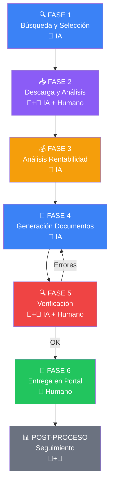
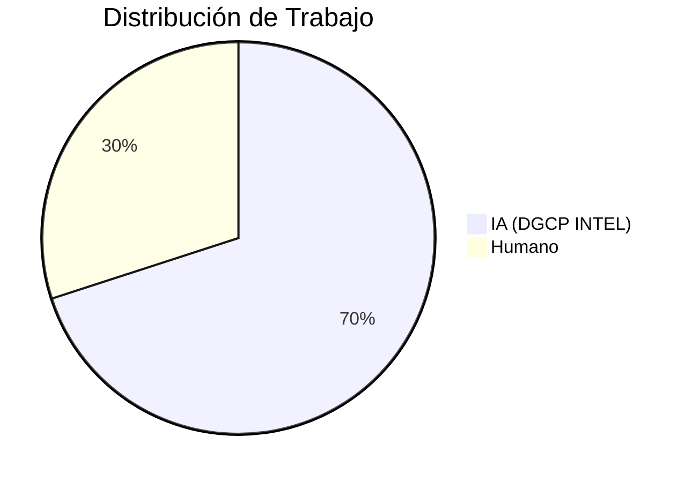
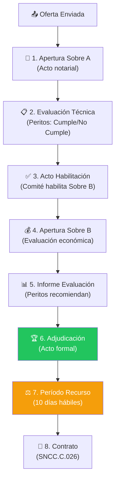

# Proceso REAL de Licitación DGCP

> Fuente: HEFESTO — experiencia real con licitaciones RD
> Este documento es la VERDAD del proceso. Las specs F2/F3/F4 deben alinearse a esto.

---

## Las 6 Fases + Post-Proceso



---

## Responsabilidades: 70% IA / 30% Humano



### 3 Puntos de Decisión Humana (NO negociables)

| # | Decisión | Por qué no se puede automatizar |
|---|----------|-------------------------------|
| 1 | **Selección del proceso** | Solo el empresario sabe si tiene capacidad real |
| 2 | **Precio final** | Decisión estratégica de negocio, no técnica |
| 3 | **Envío final** | Responsabilidad legal del representante |

---

## FASE 1: BÚSQUEDA Y SELECCIÓN (🤖 IA)

| Paso | Actor | Acción |
|------|-------|--------|
| 1.1 | IA | Scan API DGCP con filtros MIPYME |
| 1.2 | IA | Evaluar: modalidad, monto, objeto, ubicación, fecha cierre |
| 1.3 | IA | Filtrar que NO sea exclusivo MIPYME mujer |
| 1.4 | IA | Score 6 componentes (UNSPSC, presupuesto, modalidad, tiempo, entidad, keywords) |
| 1.5 | IA | Alerta Telegram con score breakdown |
| 1.6 | **👤 HUMANO** | **Confirma cuál proceso abordar** ← DECISIÓN #1 |

### Filtros automáticos

```typescript
// Lo que el sistema filtra automáticamente
const filtros = {
  mipyme: true,                    // Solo procesos MIPYME (salvo config)
  monto_max: empresa.monto_max,   // Según capacidad de la empresa
  exclusivo_mujer: false,          // Excluir procesos solo para MIPYME mujer
  unspsc_compatible: true,         // Códigos RPE deben matchear
  dias_restantes_min: 5,           // No mostrar procesos que cierran en <5 días
}
```

---

## FASE 2: DESCARGA Y ANÁLISIS (🤖 IA + 👤 Humano)

| Paso | Actor | Acción |
|------|-------|--------|
| 2.1 | IA | Descargar datos del proceso vía API → proceso_info.json + articulos.json |
| 2.2 | **👤 HUMANO** | **Entrar al portal DGCP → Mostrar Interés** ⚠️ CRÍTICO |
| 2.3 | **👤 HUMANO** | **Descargar pliego, ficha técnica, formularios** |
| 2.4 | 👤 → IA | Humano sube pliegos descargados al sistema |
| 2.5 | IA | Analizar: requisitos legales, especificaciones técnicas, criterios de evaluación |
| 2.6 | IA | Extraer: garantías requeridas, plazos, documentos obligatorios |
| 2.7 | IA | Generar Ficha de Estudio (resumen ejecutivo del pliego) |

### "Mostrar Interés" — POR QUÉ ES HUMANO

No es que no podamos automatizarlo. Es que:
1. El portal cambia su UI frecuentemente
2. Un error de Playwright puede registrar interés en el proceso equivocado
3. Es una acción legal — registra la empresa como interesada
4. Solo toma 2 minutos manualmente
5. El riesgo de automatizar > el beneficio

**El sistema SÍ puede**: recordar al usuario que lo haga, verificar que lo hizo, y alertar si se le olvidó.

```
⚠️ ACCIÓN REQUERIDA
[CESAC-DAF-CM-2026-0015]
Score: 85 — Has confirmado que quieres aplicar

👉 Entra al portal DGCP y haz "Mostrar Interés"
   URL: https://comunidad.comprasdominicanas.gob.do
   Proceso: CESAC-DAF-CM-2026-0015

⏰ Cierre: 2026-04-01 (18 días)
¿Ya lo hiciste? → [SÍ, YA MOSTRÉ INTERÉS] [AÚN NO]
```

---

## FASE 3: ANÁLISIS DE RENTABILIDAD (🤖 IA)

| Paso | Actor | Acción |
|------|-------|--------|
| 3.1 | IA | Calcular costos por ítem: mano de obra, materiales, transporte, viáticos |
| 3.2 | IA | Cruzar con BD de precios RD (155 materiales, 50+ tarifas CNS) |
| 3.3 | IA | Identificar ítems con pérdida vs rentables |
| 3.4 | IA | Generar 5 escenarios: 0% / -5% / -10% / -15% / -20% |
| 3.5 | IA | Análisis de rentabilidad por ubicación (si aplica) |
| 3.6 | IA | Presentar recomendación con margen estimado |
| 3.7 | **👤 HUMANO** | **Decide el precio final** ← DECISIÓN #2 |

### Ejemplo real (RSCS-DAF-CM-2026-0002 — Hefesto)

```
Presupuesto referencial: RD$ 1,410,000
Costo real calculado:    RD$ 689,350

Escenario │ Precio      │ Margen   │ Recomendación
──────────┼─────────────┼──────────┼──────────────
   0%     │ 1,410,000   │ 51.1%   │ Conservador
  -5%     │ 1,339,500   │ 48.5%   │ Moderado
 -10%     │ 1,269,000   │ 45.7%   │ ⭐ Competitivo
 -15%     │ 1,198,500   │ 42.5%   │ Agresivo
 -20%     │ 1,128,000   │ 38.9%   │ Muy agresivo

Desglose: 15 centros de salud
  → 13 rentables
  → 2 con pérdida (distancia + volumen bajo)

Recomendación IA: Escenario -10% (competitivo, margen saludable)
```

---

## FASE 4: GENERACIÓN DE DOCUMENTOS (🤖 IA)

**4 documentos se generan en paralelo:**

| # | Documento | Formato | Herramienta | Contenido |
|---|-----------|---------|-------------|-----------|
| 1 | Cotización | .xls | Template + datos | Desglose por ítem, subtotales, ITBIS, total |
| 2 | Oferta Técnica | .docx | Generación IA | 10 secciones: objetivo, metodología, equipo, cronograma, etc. |
| 3 | F.034 Presentación | .docx | Template auto-fill | Datos empresa + proceso + declaración |
| 4 | F.033 Oferta Económica | .docx | Template auto-fill | Monto en números y letras + vigencia |

### Firma y sello

Todos los documentos llevan firma digital (firma.jpg) y sello (sello.jpg) del representante legal.
Estos se almacenan una vez y se reutilizan.

### Las 10 secciones de la Oferta Técnica

```
1. Presentación de la empresa
2. Objeto de la oferta
3. Alcance del servicio/suministro
4. Metodología de trabajo
5. Plan de ejecución
6. Cronograma detallado
7. Equipo de trabajo
8. Control de calidad
9. Garantía ofrecida
10. Anexos (experiencia previa, certificaciones)
```

---

## FASE 5: VERIFICACIÓN Y ORGANIZACIÓN (🤖 IA + 👤 Humano)

| Paso | Actor | Acción |
|------|-------|--------|
| 5.1 | IA | Verificar coherencia de montos: Cotización = F.033 = Oferta Técnica |
| 5.2 | IA | Verificar datos consistentes: RNC, RPE, nombre empresa en todos los docs |
| 5.3 | IA | Verificar ITBIS calculado correctamente (18%) |
| 5.4 | IA | Verificar subtotales suman al total |
| 5.5 | IA | Crear carpeta DOCUMENTACION_LISTA/ con todos los archivos |
| 5.6 | IA | Generar CHECKLIST.txt con estado de cada documento |
| 5.7 | **👤 HUMANO** | **Agregar certificaciones originales** |
| 5.8 | 🤖+👤 | **Revisión final conjunta** |

### Documentos que SOLO el humano puede obtener

```
🔲 Certificación DGII vigente    → dgii.gov.do
🔲 Certificación TSS vigente     → tss.gob.do
🔲 Registro Mercantil            → camaras de comercio
🔲 Compromiso Ético firmado      → firma física
🔲 Debida Diligencia             → formulario + notario (si aplica)
🔲 Garantía de seriedad          → aseguradora (2-4 semanas)
🔲 Certificado MIPYME vigente    → micm.gob.do
```

### Formato del CHECKLIST

```
CHECKLIST — CESAC-DAF-CM-2026-0015
Fecha: 2026-03-14

GENERADOS POR IA:
  ✅ Cotización KOSMIMA_146.xls
  ✅ Oferta Técnica KOSMIMA.docx
  ✅ SNCC_F033_Oferta_Economica.docx
  ✅ SNCC_F034_Presentacion.docx

REQUIEREN HUMANO:
  🔲 Certificación DGII
  🔲 Certificación TSS
  🔲 Registro Mercantil
  🔲 Compromiso Ético (firmado)
  🔲 Certificado MIPYME
  🔲 Cédula representante legal

VERIFICACIONES:
  ✅ Montos coinciden en 3 documentos
  ✅ RNC correcto en todos
  ✅ ITBIS 18% calculado correctamente
  ✅ Subtotales suman al total
  ✅ Firma y sello en todos los docs

ESTADO: 4/10 documentos listos (40%)
⚠️ Faltan 6 documentos del humano
```

---

## FASE 6: ENTREGA EN PORTAL (👤 Humano)

**100% humano.** El sistema NO sube documentos al portal.

| Paso | Actor | Acción |
|------|-------|--------|
| 6.1 | **👤** | Entrar al portal DGCP con credenciales RPE |
| 6.2 | **👤** | Navegar al proceso |
| 6.3 | **👤** | Sobre A (Técnico): subir Oferta Técnica + documentación legal |
| 6.4 | **👤** | Sobre B (Económico): subir F.033 + Cotización |
| 6.5 | **👤** | Verificar montos en pantalla |
| 6.6 | **👤** | **Confirmar envío** ← DECISIÓN #3 |
| 6.7 | **👤** | Capturar comprobante/screenshot |
| 6.8 | 👤 → IA | Informar al sistema que se envió |

### Por qué el upload es HUMANO

1. **Responsabilidad legal** — el representante legal es responsable de lo que se sube
2. **Verificación visual** — el humano verifica en pantalla que los montos son correctos
3. **Portal inestable** — el SECP cambia frecuentemente, Playwright se rompe
4. **Solo toma 10 minutos** — el ROI de automatizar no justifica el riesgo
5. **Comprobante legal** — el humano necesita ver la confirmación con sus ojos

### Lo que el sistema SÍ hace en esta fase

```
📤 DOCUMENTOS LISTOS PARA SUBIR
[CESAC-DAF-CM-2026-0015]

Tu carpeta DOCUMENTACION_LISTA/ tiene 10 archivos.

SOBRE A (subir estos):
  📄 Oferta_Tecnica_KOSMIMA.docx (245 KB)
  📄 SNCC_F034_Presentacion.docx (89 KB)
  📄 Compromiso_Etico.docx (67 KB)
  📄 Certificacion_DGII.pdf (subida por ti)
  📄 Certificacion_TSS.pdf (subida por ti)
  📄 Certificado_MIPYME.pdf (subida por ti)

SOBRE B (subir estos):
  📄 SNCC_F033_Oferta_Economica.docx (78 KB)
  📄 Cotizacion_KOSMIMA_146.xls (156 KB)

💰 MONTO FINAL: RD$ 1,269,000.00 (verificar en portal)

[📥 DESCARGAR ZIP COMPLETO]

⚠️ Después de enviar, avísame → [YA ENVIÉ LA OFERTA]
```

---

## POST-PROCESO: Seguimiento (🤖 IA + 👤 Humano)

Después de enviar, hay 8 pasos hasta el contrato:



### Detalle de cada paso post-proceso

| # | Paso | Quién | Qué pasa | Alerta al usuario |
|---|------|-------|----------|-------------------|
| 1 | Apertura Sobre A | Entidad + notario | Se abren sobres técnicos de todos los oferentes | "Sobre A abierto — esperar evaluación" |
| 2 | Evaluación Técnica | Peritos de la entidad | Evalúan Cumple/No Cumple en legal + técnico | Si no cumple: "❌ No habilitado — razón: [X]" |
| 3 | Habilitación | Comité de licitación | Deciden quién pasa a Sobre B | "✅ Habilitado para apertura económica" |
| 4 | Apertura Sobre B | Entidad + notario | Se revelan las ofertas económicas | "Tu oferta: RD$ 1,269,000 — ver competidores" |
| 5 | Informe Evaluación | Peritos | Recomiendan adjudicación al menor precio | "Evaluación completada — esperar adjudicación" |
| 6 | Adjudicación | Entidad | Acto formal de adjudicación | "🏆 ADJUDICADO" o "No adjudicado a [empresa]" |
| 7 | Recurso | Cualquier oferente | 10 días hábiles para impugnar | "Período de recurso: 10 días — hasta [fecha]" |
| 8 | Contrato | Entidad + adjudicado | Firma del contrato SNCC.C.026 | "Contrato listo para firma — presentar garantías" |

### Subsanación (puede ocurrir entre paso 1 y 2)

```
⚠️ SUBSANACIÓN REQUERIDA
[CESAC-DAF-CM-2026-0015]

La entidad requiere correcciones en tu Sobre A:
• Certificación TSS vencida — subir nueva
• Falta acta de designación del representante

Plazo: 4 días hábiles (hasta 2026-04-08)

⚠️ Solo documentos SUBSANABLES se pueden corregir.
   Experiencia (D.049) y oferta técnica NO son subsanables.

[SUBIR CORRECCIONES] [VER DETALLE]
```

### Post-adjudicación (si gana)

```
🏆 ADJUDICADO — Siguiente pasos:

1. Presentar Garantía de Fiel Cumplimiento
   → 1% (MIPYME) o 4% (regular) del monto adjudicado
   → Póliza de seguro, plazo: 10 días hábiles

2. Firmar contrato SNCC.C.026
   → Presentarse en la entidad con:
     • Garantía de fiel cumplimiento
     • Garantía de buen uso de anticipo (si solicita)
     • Documentos contractuales

3. Solicitar anticipo (si aplica)
   → 20-50% para MIPYME
   → Requiere garantía de buen uso

4. Iniciar ejecución
   → Según cronograma presentado en oferta técnica
```

---

## Documentos por Modalidad

| Documento | Compras Menores | Comparación Precios | Licitación Pública |
|-----------|:-:|:-:|:-:|
| Cotización .xls | ✅ | ✅ | ✅ |
| Oferta Técnica .docx | ✅ | ✅ | ✅ |
| F.034 Presentación | ✅ | ✅ | ✅ |
| F.033 Oferta Económica | ✅ | ✅ | ✅ |
| Compromiso Ético | ✅ | ✅ | ✅ |
| Certificación DGII | ✅ | ✅ | ✅ |
| Certificación TSS | ✅ | ✅ | ✅ |
| MIPYME (si exclusivo) | ✅ | ✅ | ✅ |
| Garantía Seriedad | — | — | ✅ (4-5%) |
| Garantía Cumplimiento | — | Según pliego | ✅ |
| Estados Financieros Auditados | — | — | ✅ (2 años) |
| D.049 Experiencia Similar | — | Según pliego | ✅ |
| Registro Mercantil | ✅ | ✅ | ✅ |
| Debida Diligencia | — | Según pliego | ✅ |

### Umbrales por modalidad (2026)

| Modalidad | Monto máximo | Garantía seriedad | Plazo preparación |
|-----------|-------------|-------------------|-------------------|
| Compras Menores | RD$ 693,000 | No | 3-5 días |
| Comparación de Precios | RD$ 6,930,000 | 1% MIPYME | 5-10 días |
| Licitación Pública Nacional | Sin límite | 4-5% | 15-30 días |
| Licitación Pública Internacional | Sin límite | 5% | 30-45 días |

---

## Lo que DGCP INTEL REALMENTE hace vs lo que NO hace

### ✅ LO QUE HACE (automatizado)

```
FASE 1: 100% IA
  ✅ Scan API DGCP
  ✅ Scoring 6 componentes
  ✅ Alertas Telegram con score
  ✅ Filtros MIPYME + UNSPSC + monto

FASE 3: 100% IA
  ✅ Cálculo costos con BD precios
  ✅ 5 escenarios de pricing
  ✅ Análisis rentabilidad por ubicación/ítem

FASE 4: 100% IA
  ✅ Generar Cotización (.xls)
  ✅ Generar Oferta Técnica (.docx)
  ✅ Generar F.034 y F.033
  ✅ Insertar firma y sello

FASE 5 (parcial): IA
  ✅ Verificar coherencia de montos
  ✅ Verificar datos consistentes
  ✅ Generar checklist
```

### 👤 LO QUE NO HACE (requiere humano)

```
FASE 2 (parcial):
  👤 Mostrar Interés en portal
  👤 Descargar pliegos del portal
  👤 Subir pliegos al sistema

FASE 5 (parcial):
  👤 Obtener certificaciones (DGII, TSS, MIPYME)
  👤 Gestionar garantía bancaria (2-4 semanas)
  👤 Firmar documentos

FASE 6: 100% Humano
  👤 Entrar al portal DGCP
  👤 Subir Sobre A y Sobre B
  👤 Verificar y confirmar envío
  👤 Capturar comprobante

POST-PROCESO (parcial):
  👤 Presentarse a actos notariales
  👤 Subir subsanaciones al portal
  👤 Firmar contrato
  👤 Presentar garantías
```

---

*JANUS — 2026-03-14*
*Fuente: HEFESTO — proceso real verificado con licitaciones DGCP RD*
*"La IA hace el 70%, pero el humano toma las 3 decisiones que importan."*
