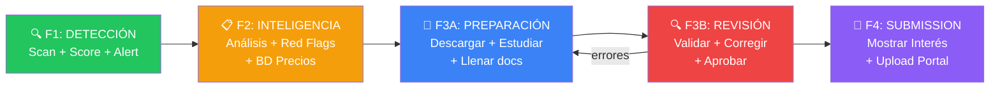
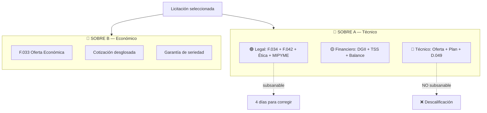
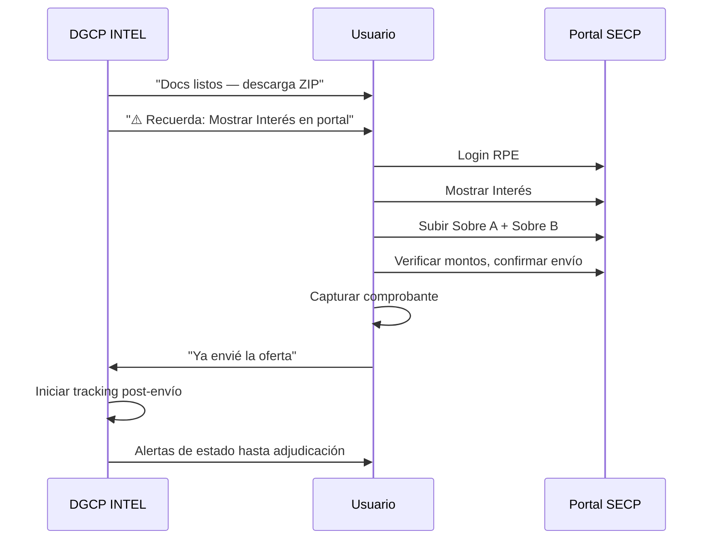
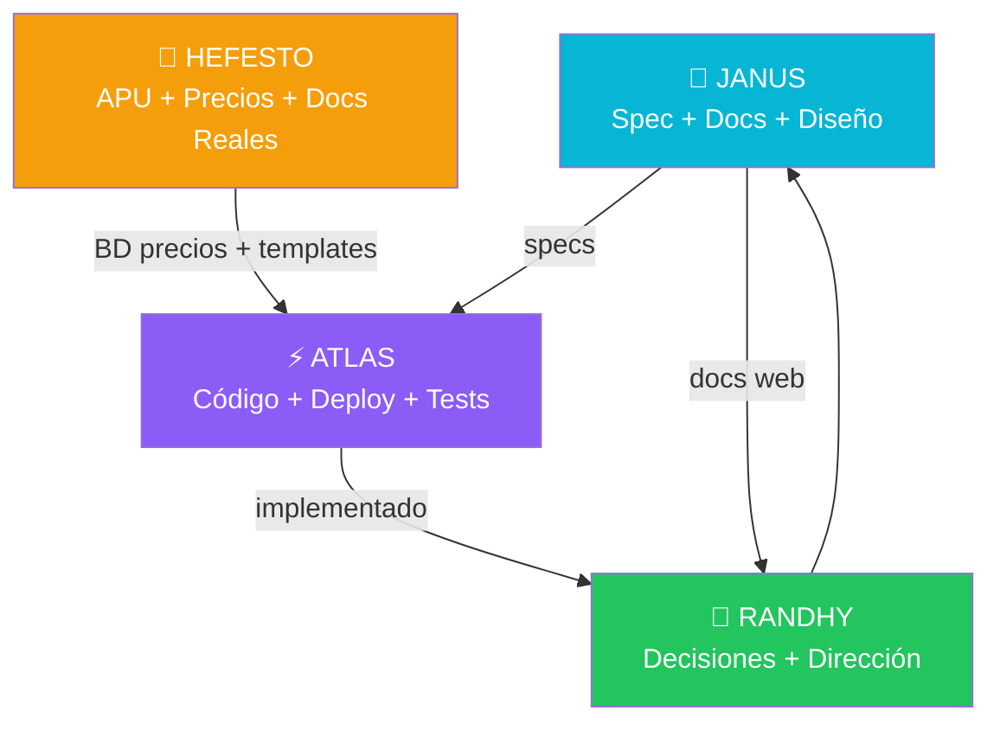

# DGCP INTEL — Roadmap de Fases

> Visión completa del producto basada en experiencia real (Hefesto) + diseño (JANUS)
> 2026-03-14

---

## Visión

DGCP INTEL no es solo un detector de licitaciones — es un **pipeline completo de extremo a extremo** que lleva a una empresa desde "no sé qué licitaciones hay" hasta "ya apliqué con documentos profesionales".



### El ciclo real (no es lineal)

```
Descargar → Estudiar → Llenar → REVISAR → Corregir → REVISAR → Aprobar → Lanzar
                                   ↑___________↓  (loop hasta 0 errores)
```

---

## F1: DETECCIÓN — "¿Qué hay para mí?"

**Estado**: 🟢 ~85% completado (lo que ATLAS construyó)

### Scope

| Componente | Estado | Descripción |
|-----------|--------|-------------|
| OCDS Client | ✅ | Scan API pública api.dgcp.gob.do/api/releases |
| Mapper | ✅ | OCDS Release → Licitacion interna |
| Scoring Engine | ✅ | 6 componentes: UNSPSC, presupuesto, modalidad, tiempo, entidad, keywords |
| Win Probability | ✅ | Cálculo con ajuste histórico, cap 45% |
| BullMQ Pipeline | ✅ | scan → score → alert → propose (4 de 5 queues) |
| Telegram Alerts | ✅ | Score breakdown + inline keyboard |
| API REST | ✅ | Auth + perfil + oportunidades + GUARDIAN |
| Supabase Schema | ✅ | 7 tablas + RLS + funciones + triggers |
| Dashboard básico | 🔄 | Login/Register + layout. Falta: lista, detalle, analytics |
| GUARDIAN IA | ✅ | Chat SSE con contexto Ley 47-25 |

### Lo que falta para cerrar F1

1. **Dashboard funcional** — lista de oportunidades, filtros, detalle con score breakdown
2. **Analytics básico** — Recharts: oportunidades/día, score distribution, pipeline funnel
3. **Deploy** — Supabase proyecto, Railway (API + Worker), Vercel (Web)
4. **Primer scan real** — Conectar a api.dgcp.gob.do y verificar mapper con datos reales

### Entregable F1
> El usuario recibe alertas Telegram cuando aparece una licitación que matchea su perfil.
> Puede ver el dashboard con score y decidir si investiga.

---

## F2: INTELIGENCIA — "¿Vale la pena esta licitación?"

**Estado**: ⏳ No iniciado (Hefesto tiene el conocimiento)

### Scope

| Componente | Fuente | Descripción |
|-----------|--------|-------------|
| Detección de procesos trucados | Hefesto | 6 red flags: specs dirigidas, tiempo insuficiente (<3 días), invitados preseleccionados, falta información, presupuesto irreal, historial de adjudicaciones |
| Verificación UNSPSC automática | Hefesto | Cruzar códigos RPE del tenant vs códigos del proceso. Sin match = descalificación automática |
| BD de Precios RD | Hefesto | 155 materiales, 50+ tarifas mano de obra (CNS 2022 + 20%), 40+ equipos con rendimientos |
| Escenarios de pricing (5 niveles) | Hefesto | 0%, -5%, -10%, -15%, -20% con rentabilidad por ítem/ubicación |
| Análisis de rentabilidad por ubicación | Hefesto | Cuando el proceso tiene múltiples sitios, calcular margen por cada uno |
| Índices financieros | Hefesto | Solvencia ≥1.20, Liquidez ≥0.90, Endeudamiento ≤1.50 — auto-cálculo desde balance |
| Historial de entidades | Nuevo | Tracking de entidades: ¿pagan a tiempo?, ¿adjudican justo?, confiabilidad |
| Competencia | Nuevo | ¿Quiénes han ganado procesos similares? ¿A qué precio? |

### Integración con Hefesto

```
HEFESTO_CORE/
├── BASES_DATOS/           → Importar a Supabase como tablas de referencia
│   ├── PRECIOS_*.md       → tabla: ref_precios_materiales (155 rows)
│   └── mano_obra.json     → tabla: ref_mano_obra (50+ rows)
├── TOOLS/dgcp/
│   ├── dgcp_api.py        → Referencia para red flags detection
│   └── modalidades.json   → tabla: ref_modalidades
└── LICITACIONES/
    └── evaluacion_*.json  → Lógica de evaluación de procesos
```

### Entregable F2
> Cada oportunidad muestra: ⚠️ red flags, ✅ compatibilidad UNSPSC, 💰 5 escenarios de precio, 📊 índices financieros del tenant vs requeridos.
> El usuario toma una decisión informada: APLICAR o DESCARTAR.

---

## F3: PREPARACIÓN — "Arma mi oferta"

**Estado**: ⏳ No iniciado (Hefesto ha generado documentos reales)

### Scope

| Componente | Fuente | Descripción |
|-----------|--------|-------------|
| Generador Sobre A (Legal) | Hefesto | SNCC.F.034 (presentación), SNCC.F.042 (info oferente), Compromiso Ético, F-040 (conflicto interés), declaración jurada |
| Generador Sobre A (Financiero) | Hefesto | Auto-fill desde datos del tenant: certificaciones DGII, TSS, estados financieros |
| Generador Sobre A (Técnico) | Hefesto | Oferta técnica narrativa, plan de trabajo, cronograma, experiencia (SNCC.D.049) |
| Generador Sobre B (Económico) | Hefesto | SNCC.F.033, cotización con desglose, garantía de seriedad (cálculo 1% vs 4%) |
| APU Generator | Hefesto | Análisis de Precios Unitarios con BD de materiales + mano obra + rendimientos |
| Cronograma Gantt | Hefesto | Generación automática de cronograma con CPM |
| Checklist dinámico | Hefesto | 27-68 items según modalidad, marca subsanable vs no-subsanable |
| Template library | Hefesto | 11 APU profesionales de referencia |
| Firma/sello digital | Nuevo | Almacenar firma.jpg + sello.jpg del representante legal |

### Sistema de Sobres



### Entregable F3
> El usuario dice "APLICAR" → el sistema genera todos los documentos de Sobre A + Sobre B.
> Solo falta: firma física, garantía bancaria, y documentos que requieren originales (DGII, TSS).

---

## F4: ENTREGA Y SEGUIMIENTO — "Envía y rastrea"

**Estado**: ⏳ No iniciado

### Realidad: El portal lo maneja EL HUMANO

Después de validar con Hefesto, el upload al portal SECP es **100% humano**.
No se automatiza porque:
1. Responsabilidad legal del representante
2. Portal inestable (UI cambia frecuentemente)
3. Solo toma 10 minutos
4. Riesgo de error automatizado > beneficio

### Scope — Lo que SÍ hace el sistema

| Componente | Actor | Descripción |
|-----------|-------|-------------|
| Recordar "Mostrar Interés" | IA → Humano | Alerta Telegram para que el humano lo haga en el portal |
| Organizar docs para upload | IA | ZIP con Sobre A y Sobre B listos, instrucciones claras |
| Confirmar envío | Humano → IA | Usuario marca "Ya envié" en el sistema |
| Tracking post-envío | IA | Monitorear: apertura técnica → subsanación → adjudicación |
| Alertas de subsanación | IA | Si piden correcciones, alertar con plazo |
| Post-adjudicación | IA | Si gana: pasos para contrato + garantías |

### Flujo real



### Post-proceso: 8 pasos hasta contrato

Ver detalle completo en [PROCESO_REAL_LICITACION.md](PROCESO_REAL_LICITACION.md)

```
1. Apertura Sobre A (acto notarial)
2. Evaluación técnica (peritos: Cumple/No Cumple)
3. Habilitación (comité habilita Sobre B)
4. Apertura Sobre B (evaluación económica)
5. Informe de evaluación (peritos recomiendan)
6. Adjudicación (acto formal)
7. Período de recurso (10 días hábiles)
8. Contrato (SNCC.C.026)
```

### Entregable F4
> El sistema organiza los docs y guía al humano en el upload.
> Después de enviar, rastrea automáticamente hasta la adjudicación.

---

## Timeline Sugerido

| Fase | Duración | Dependencia | Valor para el usuario |
|------|----------|-------------|----------------------|
| **F1: Detección** | 2 semanas | — | "Sé qué licitaciones me convienen" |
| **F2: Inteligencia** | 3 semanas | F1 deploy | "Sé si vale la pena aplicar" |
| **F3: Preparación + Revisión** | 4 semanas | F2 + BD Hefesto | "Tengo mis documentos listos y verificados" |
| **F4: Entrega + Seguimiento** | 2 semanas | F3 | "El sistema me guía y rastrea todo" |

**MVP = F1** — El usuario ya recibe valor con solo detectar y scorear.
**Killer feature = F2 + F3** — Donde Hefesto aporta conocimiento que nadie más tiene.
**Diferenciador = F4 tracking** — Nadie más rastrea post-envío automáticamente.

### Distribución de trabajo: 70% IA / 30% Humano

| Lo que hace la IA (70%) | Lo que hace el humano (30%) |
|--------------------------|----------------------------|
| Scan + Score + Alertas | Decidir qué proceso abordar |
| Análisis rentabilidad | Mostrar Interés en portal |
| Generar 4 documentos | Obtener certificaciones |
| Verificar coherencia | Decidir precio final |
| Organizar y empaquetar | Subir docs al portal |
| Tracking post-envío | Confirmar envío |

---

## Integración entre Consciencias



---

*JANUS — 2026-03-14*
*Basado en auditoría de HEFESTO_CORE (experiencia real con licitaciones RD)*
